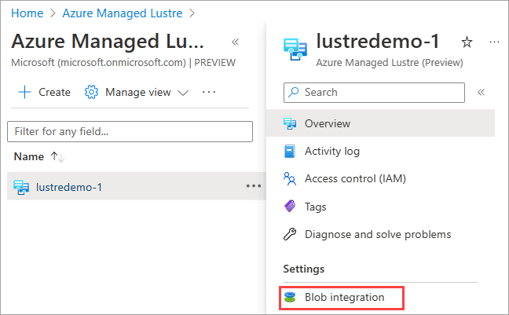
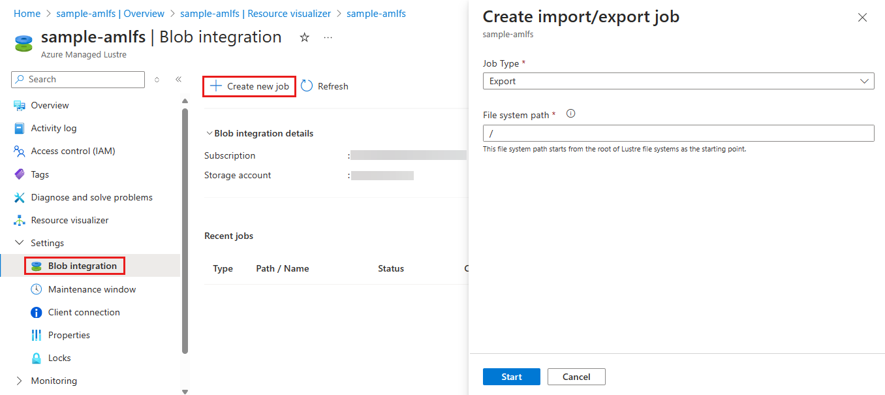
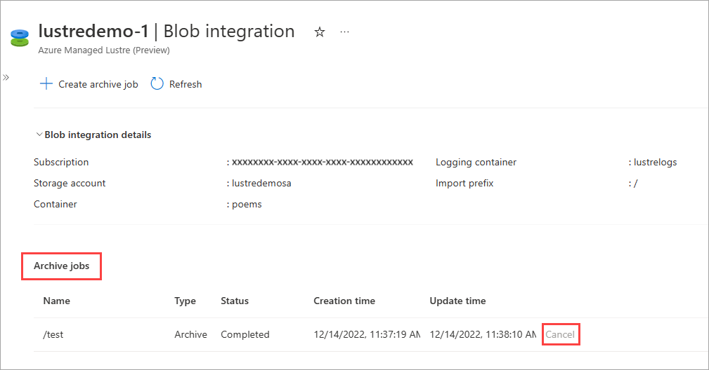

# Use archive jobs to export data from Azure Managed Lustre

This article describes how to copy data from your Azure Managed Lustre file system to long-term storage in Azure Blob Storage by creating an archive job, and explains what is exported from the file system.

This export method is only available when you integrate Azure Blob Storage with your Azure Managed Lustre file system during file system creation. For more information, see [Azure Blob Storage integration](amlfs-overview.md#azure-blob-storage-integration). If you didn't integrate a blob container when you created the file system, use client filesystem commands to copy the data without creating an archive job.

## Which files does an archive job export?

When you archive files from your Azure Managed Lustre system, not all of the files are copied into the blob container that you specified when you created the file system:

* Archive jobs only copy files that are new or whose contents have been modified. If the file that you imported from the blob container during file system creation is unchanged, the archive job doesn't export the file.
* Files with metadata changes only aren't exported. Metadata changes include: owner, permissions, extended attributes, and name changes (renamed).
* If you delete a file in the Azure Managed Lustre file system, the archive job doesn't delete the file from the original source.

Archiving data is a manual process that you can do in the Azure portal or by using commands in the native Lustre client CLI. With both methods, you can monitor the state of the archive job.

The following procedures tell how to:

* [Create an archive job in the Azure portal](#create-an-archive-job-in-the-azure-portal)
* [Monitor or cancel an archive job in the Azure portal](#monitor-or-cancel-an-archive-job-in-the-azure-portal)
* [Create an archive job using commands in the native Lustre CLI](#create-archive-job-using-the-native-lustre-client-cli)
* [Monitor archiving state for a file using native Luster CLI commands](#monitor-archive-state-using-the-native-lustre-client-cli)

## Create an archive job in the Azure portal

To create an archive job to export changed data from an Azure Managed Lustre file system in the Azure portal, do the following steps:

1. Sign in to [the Azure portal](https://portal.azure.com), and open your Azure Managed Lustre file system.

1. Under **Settings**,  open the **Blob integration** page to export changed files to the integrated blob container.

   

2. Select **+ Create archive job**.

   

3. To specify what to export in the archive job, enter a **File system path**. Then select **OK**.

   * All new or changed files whose filenames begin with this string in the Azure Managed Lustre file system are exported.

   * Files are written to the blob container with the same file path (or prefix) that they have in the Lustre system. If you want to avoid overwriting existing files in the blob container, make sure the files' path in your Lustre system doesn't overlap the existing files' path in the blob container.

   

## Monitor or cancel an archive job in the Azure portal

You can monitor or cancel archive jobs you created through blob integration with your Azure Managed Lustre file system in the Azure portal. The **Archive jobs** section of the **Blob integration** page shows the status of each job.

   

Only one archive job runs at a time. To cancel the job that's in progress, select the **Cancel** button at the top of the page. Or select the **Cancel** link for that job in the **Archive jobs** table. The **Cancel** link isn't available for a completed job.

## Create archive job using the native Lustre client CLI

To create an archive job to export changed data from an Azure Managed Lustre file system using native Lustre client CLI command, use one of the following commands:

* To archive a single file, run a command similar to this one:

  ```bash
  sudo lfs hsm_archive path/to/export/file
  ```

* To archive all files in a directory, run a command similar to this one:

  ```bash
  nohup find local/directory -type f -print0 | xargs -0 -n 1 sudo lfs hsm_archive &
  ```

## Monitor archive state using the native Lustre client CLI

To check on the status of an archive job using the native Lustre client CLI, run the following command:

```bash
find path/to/export/file -type f -print0 | xargs -0 -n 1 -P 8 sudo lfs hsm_action | grep "ARCHIVE" | wc -l
```

Each file has an associated state, which indicates the relationship between the file data in the Lustre file system and the file data in Azure Blob Storage. To check the state of a file, run this command:

```bash
sudo lfs hsm_state path/to/export/file
```

The state command reports the state of changes to the file. The following table shows the possible file states:

|State|Description|
|-----|-----------|
|`(0x0000000d) released exists archived`|The file's contents (the data) exist in Blob Storage only. Only the metadata exists in Lustre. An archive job doesn't update (overwrite) the file in Blob Storage.|
|`(0x00000009) exists archived`|An archive job doesn't export the file to Blob Storage because Blob Storage already has the latest copy.|
|`(0x0000000b) exists dirty archived`|The file has changes that aren't archived. To send the changes in Lustre back to Blob Storage, run an archive job. The archive job overwrites the file in Blob Storage.|
|`(0x00000000)`|The file is new and only exists in the Lustre file system. An archive job creates a new file in the blob container. If the file is updated again in Lustre, run another archive job to copy those changes to Blob Storage.|
|`(0x00000001) exists`|The file is new and only exists in the Lustre file system. An archive job has been started and hasn't completed for this file. |

## Next steps

* Learn more about [Azure Blob Storage integration with Lustre file systems](blob-integration.md)

