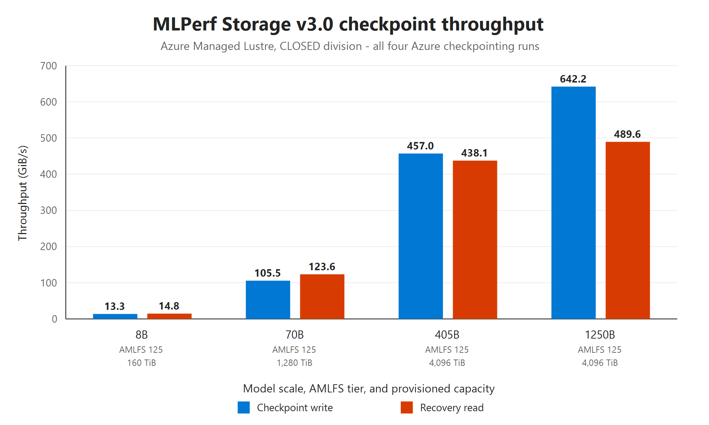

# Azure Managed Lustre MLPerf Storage v3.0 results

[MLPerf Storage](https://mlcommons.org/working-groups/benchmarks/storage/) is an MLCommons benchmark suite for storage systems used by artificial intelligence (AI) workloads. It generates representative storage I/O patterns and measures whether the storage path can supply data or save model state at the rate required by the workload.

MLPerf Storage v3.0 includes training, checkpointing, vector database, and key-value cache workloads. The Azure Managed Lustre submission includes results for the training and checkpointing categories.

## What the benchmark measures

MLPerf Storage uses client nodes to generate I/O for simulated accelerators. It tests the storage system and its data path; it doesn't benchmark GPU computation, model accuracy, or end-to-end training time.

The benchmark is designed to generate workload I/O from general-purpose commodity client nodes. The reported results are aggregate storage-system measurements, not per-client performance measurements. Client count describes the load-generator configuration and shouldn't be used to normalize or compare the benchmark numbers.

### Training

The training benchmark measures whether storage can continuously deliver training data fast enough to keep simulated accelerators active. The Azure submission used the UNET3D workload with simulated B200 accelerators.

The benchmark reports:

- The number and type of simulated accelerators.
- Sustained read bandwidth in GiB/s.
- Simulated accelerator utilization over the benchmark run.

The Azure runs maintained more than 90% simulated accelerator utilization for five consecutive hours. This result indicates that the tested storage configurations sustained the workload's required data rate for the duration of the run.

> [!NOTE]
> **Why it matters**
>
> Training accelerators can become idle when storage doesn't deliver samples at the required rate. Sustained simulated accelerator utilization indicates whether the storage path can support the training workload without becoming an I/O bottleneck. This measurement is more representative of extended training behavior than a short peak-bandwidth test.

### Checkpointing

The checkpointing benchmark models saving a distributed model state and reading it during recovery. Checkpoint writes happen at synchronization points in a training job, while recovery reads represent loading a saved checkpoint after an interruption.

The benchmark reports:

- Checkpoint write and recovery read throughput in GiB/s.
- Write and recovery duration in seconds.
- The number of data-parallel instances.
- The model scale represented by the checkpoint.

> [!NOTE]
> **Why it matters**
>
> Checkpoint writes can pause progress across a distributed training job. Higher write throughput reduces this shared pause and can allow checkpoints to be saved more frequently, reducing the amount of training work at risk after a failure. Higher recovery read throughput reduces the time required to reload model state and resume the job.

### Closed division

All Azure Managed Lustre results were submitted to the MLPerf Storage Closed division. In this division, the workload code and benchmark parameters are standardized. Submitters can configure and tune the storage system within the benchmark rules.

> [!WARNING]
> Don't use the number of client nodes to interpret, normalize, or compare MLPerf Storage results. The benchmark uses general-purpose commodity client nodes only to generate workload I/O. The reported values are aggregate storage-system measurements, not per-client performance measurements.

## Azure submission scope

All 17 Azure results use Azure Managed Lustre as a shared remote file system through the POSIX protocol.

| Measurement | Azure submission |
|---|---|
| Division | Closed |
| Training results | 13 |
| Checkpointing results | 4 |
| Azure Managed Lustre service tier labels | 20, 40, 125, 250, and 500 |
| Capacity increments by tier | 96, 48, 16, 8, and 4 TiB, respectively |
| File system capacity | 40 TiB to 25,632 TiB, approximately 25 PiB |
| Checkpoint model scale | 8B to 1250B parameters |

### Bandwidth units

The [MLPerf Storage Results Table](https://mlcommons.org/benchmarks/storage/) reports bandwidth in gibibytes per second (GiB/s), a binary unit. One GiB/s is equal to 1.073741824 gigabytes per second (GB/s), a decimal unit.

The training throughput, scalability, and checkpoint graphs use GiB/s as reported in the [MLPerf Storage Results Table](https://mlcommons.org/benchmarks/storage/). The bandwidth-density graph uses MB/s per TiB. The result tables provide both GiB/s and the converted GB/s value.

## Training results

### Comparison across service tiers

Across the configurations with three simulated accelerators, measured read bandwidth was between 17.3 and 17.4 GiB/s. At 16 simulated accelerators, measured read bandwidth was between 89.0 and 90.6 GiB/s across all five Azure Managed Lustre service tiers.

The dashed line in each panel shows nominal bandwidth for the tested file system configuration. Each capacity increment provides 2,000 MB/s. Nominal bandwidth is calculated from the number of capacity increments, then converted to GiB/s to match the measured values in the [MLPerf Storage Results Table](https://mlcommons.org/benchmarks/storage/):

`Nominal bandwidth (GiB/s) = capacity (TiB) / tier increment (TiB) * 2,000 / 1,073.741824`

Each three-accelerator configuration has 10 capacity increments and 18.6 GiB/s of nominal bandwidth. Each 16-accelerator configuration has 50 capacity increments and 93.1 GiB/s of nominal bandwidth.

*Figure 1. Measured and nominal training bandwidth by Azure Managed Lustre service tier and provisioned capacity for (a) 3 and (b) 16 simulated accelerators.*

### Bandwidth density efficiency

Azure Managed Lustre service tier names identify the performance class, but nominal bandwidth and nominal bandwidth density are calculated from the tier's capacity increment. Each capacity increment provides 2,000 MB/s.

`Nominal bandwidth (MB/s) = capacity (TiB) / tier increment (TiB) * 2,000`

`Nominal density (MB/s per TiB) = 2,000 / tier increment (TiB)`

To calculate demonstrated bandwidth density, the measured value from the [MLPerf Storage Results Table](https://mlcommons.org/benchmarks/storage/) is converted from GiB/s to decimal MB/s and divided by file system capacity:

`Demonstrated density (MB/s per TiB) = measured bandwidth (GiB/s) * 1,073.741824 / capacity (TiB)`

Efficiency is demonstrated density divided by calculated nominal density. Across the five tested tiers, demonstrated density was between 95.6% and 97.3% of nominal.

*Figure 2. Calculated nominal and demonstrated bandwidth density for the 16-accelerator configurations.*

| AMLFS tier | Increment (TiB) | Capacity (TiB) | Nominal bandwidth (MB/s) | Nominal density (MB/s per TiB) | Measured bandwidth (GiB/s) | Measured bandwidth (GB/s) | Demonstrated density (MB/s per TiB) | Efficiency |
|---:|---:|---:|---:|---:|---:|---:|---:|---:|
| 20 | 96 | 4,800 | 100,000 | 20.8 | 90.3 | 97.0 | 20.2 | 97.0% |
| 40 | 48 | 2,400 | 100,000 | 41.7 | 89.0 | 95.6 | 39.8 | 95.6% |
| 125 | 16 | 800 | 100,000 | 125.0 | 90.5 | 97.2 | 121.5 | 97.2% |
| 250 | 8 | 400 | 100,000 | 250.0 | 90.6 | 97.3 | 243.3 | 97.3% |
| 500 | 4 | 200 | 100,000 | 500.0 | 90.3 | 96.9 | 484.5 | 96.9% |

### AMLFS bandwidth scalability

AMLFS 125 was selected as the reference tier for training scalability because the submission includes results at 3, 16, 46, and 70 simulated accelerators. Similar scaling behavior is expected across all AMLFS tiers when the file system is sized to provide the required nominal bandwidth.

The AMLFS 125 configurations increased from 3 simulated accelerators and 17.4 GiB/s (18.6 GB/s) to 70 simulated accelerators and 379.1 GiB/s (407.1 GB/s). File system capacity increased with the workload scale, from 160 TiB at 3 simulated accelerators to 4,096 TiB at 70 simulated accelerators.

The dotted line represents ideal linear scaling from the three-accelerator result, where bandwidth increases in direct proportion to the number of simulated accelerators.

*Figure 3. Measured AMLFS 125 training bandwidth and ideal linear scaling from 3 to 70 simulated accelerators.*

The largest training configurations used 70 simulated accelerators. In addition to the AMLFS 125 result, the AMLFS 20 configuration measured 378.0 GiB/s.

### Complete training results

| Public ID | AMLFS tier | Capacity (TiB) | Nominal bandwidth (MB/s) | Nominal density (MB/s per TiB) | Simulated B200 accelerators | Read bandwidth (GiB/s) | Read bandwidth (GB/s) |
|---|---:|---:|---:|---:|---:|---:|---:|
| v3.0-0041 | 20 | 960 | 20,000 | 20.8 | 3 | 17.4 | 18.6 |
| v3.0-0045 | 40 | 480 | 20,000 | 41.7 | 3 | 17.3 | 18.6 |
| v3.0-0033 | 125 | 160 | 20,000 | 125.0 | 3 | 17.4 | 18.6 |
| v3.0-0043 | 250 | 80 | 20,000 | 250.0 | 3 | 17.4 | 18.7 |
| v3.0-0047 | 500 | 40 | 20,000 | 500.0 | 3 | 17.4 | 18.6 |
| v3.0-0040 | 20 | 4,800 | 100,000 | 20.8 | 16 | 90.3 | 97.0 |
| v3.0-0044 | 40 | 2,400 | 100,000 | 41.7 | 16 | 89.0 | 95.6 |
| v3.0-0038 | 125 | 800 | 100,000 | 125.0 | 16 | 90.5 | 97.2 |
| v3.0-0042 | 250 | 400 | 100,000 | 250.0 | 16 | 90.6 | 97.3 |
| v3.0-0046 | 500 | 200 | 100,000 | 500.0 | 16 | 90.3 | 96.9 |
| v3.0-0034 | 125 | 2,400 | 300,000 | 125.0 | 46 | 251.6 | 270.1 |
| v3.0-0039 | 20 | 25,632 | 534,000 | 20.8 | 70 | 378.0 | 405.9 |
| v3.0-0037 | 125 | 4,096 | 512,000 | 125.0 | 70 | 379.1 | 407.1 |

## Checkpointing results

The checkpointing results cover four Llama 3 model scales. All four configurations used AMLFS 125, with provisioned capacities from 160 TiB to 4,096 TiB. The largest result, representing the 1250B model, measured 642.2 GiB/s (689.6 GB/s) for checkpoint writes and 489.6 GiB/s (525.7 GB/s) for recovery reads.

*Figure 4. Checkpoint write and recovery read throughput by model scale, AMLFS tier, and provisioned capacity.*

| Public ID | Model scale | Capacity (TiB) | Data-parallel instances | Write bandwidth (GiB/s) | Write bandwidth (GB/s) | Write duration (seconds) | Recovery bandwidth (GiB/s) | Recovery bandwidth (GB/s) | Recovery duration (seconds) |
|---|---:|---:|---:|---:|---:|---:|---:|---:|---:|
| v3.0-0032 | 8B | 160 | 1 | 13.3 | 14.3 | 7.86 | 14.8 | 15.9 | 7.10 |
| v3.0-0031 | 70B | 1,280 | 8 | 105.5 | 113.3 | 8.65 | 123.6 | 132.7 | 7.38 |
| v3.0-0036 | 405B | 4,096 | 2 | 457.0 | 490.7 | 11.76 | 438.1 | 470.4 | 12.39 |
| v3.0-0035 | 1250B | 4,096 | 2 | 642.2 | 689.6 | 24.63 | 489.6 | 525.7 | 32.27 |

## How to use the data as a sizing reference

MLPerf Storage uses a standardized workload and it exercises a representative end-to-end I/O chain that includes the workload software, client I/O stack, network path, POSIX file system, and storage service.

Use these results as comparative reference points when estimating storage requirements for an AI infrastructure deployment. However they aren't direct capacity recommendations for a production workload. AI framework behavior, buffering, concurrency, and local staging can change the bandwidth required from the shared file system. Don't size a sustained training workload from a short checkpoint peak.

### Define the workload requirement

Identify whether the workload is primarily constrained by sustained training reads, checkpoint writes, or recovery reads:

- For training, estimate the sustained read bandwidth required to keep the planned accelerators active.
- For synchronous checkpoint writes that are on the training critical path, divide checkpoint size by the maximum acceptable checkpoint duration.
- For asynchronous checkpointing, estimate the rate required to flush buffered or locally staged checkpoints before the next checkpoint is created.
- For recovery, divide checkpoint size by the maximum acceptable recovery duration.

For example:

`Required checkpoint bandwidth (GiB/s) = checkpoint size (GiB) / target duration (seconds)`

Use this calculation as an initial reference, but consider that specific checkpoint strategies available in the AI framework, like asynchronous checkpointing or using local caching strategies, that can reduce the requirements. 

### Account for application I/O behavior

Real AI workloads can produce different I/O patterns from the benchmark, even when accelerator and model scales are similar. Consider:

- Whether checkpointing is synchronous or asynchronous.
- How the training framework prefetches, buffers, caches, and shuffles data.
- Whether local NVMe or other scratch storage is used for checkpoints, caches, or staged training data.
- Whether data is preprocessed before the job or transformed while training.
- Model and checkpoint size.
- Input file size, file format, sample size, and the number of records stored in each file.
- The balance of large sequential I/O, small random I/O, and file-system metadata operations.
- The number of concurrent jobs sharing the file system.

For example, deeper prefetching or effective local caching can reduce time-sensitive reads from the shared file system. Online preprocessing, small files, frequent metadata access, or multiple concurrent jobs can increase or change the storage requirement.

### Translate an initial bandwidth estimate to AMLFS capacity

If you have an initial shared-storage bandwidth target, you can translate it into an estimated AMLFS capacity. Each AMLFS capacity increment provides 2,000 MB/s of nominal bandwidth.

`Target bandwidth (MB/s) = target bandwidth (GiB/s) * 1,073.741824`

`Estimated increments = ceiling(target bandwidth (MB/s) / 2,000)`

`Estimated performance-driven capacity (TiB) = estimated increments * tier increment (TiB)`

| AMLFS tier | Capacity increment (TiB) | Nominal bandwidth per increment (MB/s) | Calculated nominal density (MB/s per TiB) |
|---:|---:|---:|---:|
| 20 | 96 | 2,000 | 20.8 |
| 40 | 48 | 2,000 | 41.7 |
| 125 | 16 | 2,000 | 125.0 |
| 250 | 8 | 2,000 | 250.0 |
| 500 | 4 | 2,000 | 500.0 |

This calculation provides an initial configuration for testing. A final deployment must satisfy the data-capacity requirement and the application-validated performance requirement, rounded up to a supported capacity increment.

As an arithmetic example, the 16-accelerator training configurations use 50 capacity increments:

`50 increments * 2,000 MB/s = 100,000 MB/s = 93.1 GiB/s nominal bandwidth`

The corresponding tested capacities are 4,800 TiB for AMLFS 20, 2,400 TiB for AMLFS 40, 800 TiB for AMLFS 125, 400 TiB for AMLFS 250, and 200 TiB for AMLFS 500. These values illustrate how nominal bandwidth maps to capacity; they aren't recommended sizes for every 16-accelerator workload.

> [!NOTE]
> Benchmark configurations reflect the tested systems and can differ from current default or supported deployment limits. For current capacity limits, incremental sizing requirements, and support-request guidance, see [Throughput configurations](create-file-system-portal.md#throughput-configurations).

### Account for clients and networking

Although benchmark client count isn't used to normalize the result, customer client infrastructure must supply enough aggregate network bandwidth to reach the storage target. When planning the client pool:

- Use VM sizes with sufficient network bandwidth and accelerated networking.
- Place clients in the same availability zone as the Azure Managed Lustre file system when the region supports availability zones.
- Keep network routing between clients and the file system direct.
- Plan file and directory layouts for the workload's file sizes and access pattern.

For more information, see [Optimize Azure Managed Lustre performance](optimize-performance.md) and [Optimize file and directory layouts](optimize-file-layouts.md).

### Validate with the application

Run a representative pilot before finalizing production capacity. Use the planned model and framework, client VM type, network topology, data format, file size distribution, records per file, file layout, preprocessing, prefetching, local scratch strategy, concurrency, and checkpoint method. Compare measured throughput and job-level behavior with the initial estimate, then adjust capacity or service tier if needed.

> [!NOTE]
> The training throughput, scalability, and checkpoint graphs use GiB/s. The bandwidth-density graph uses MB/s per TiB. The tables round bandwidth and density to one decimal place and durations to two decimal places. Benchmark results describe the tested configurations and aren't a performance guarantee. Workload characteristics, client configuration, network topology, file system size, and service tier can affect performance.

## Related content

- [Optimize Azure Managed Lustre performance](optimize-performance.md)
- [Tiered checkpoints for AI training](tiered-checkpoints.md)
- [MLPerf Storage GitHub repository](https://github.com/mlcommons/storage)
