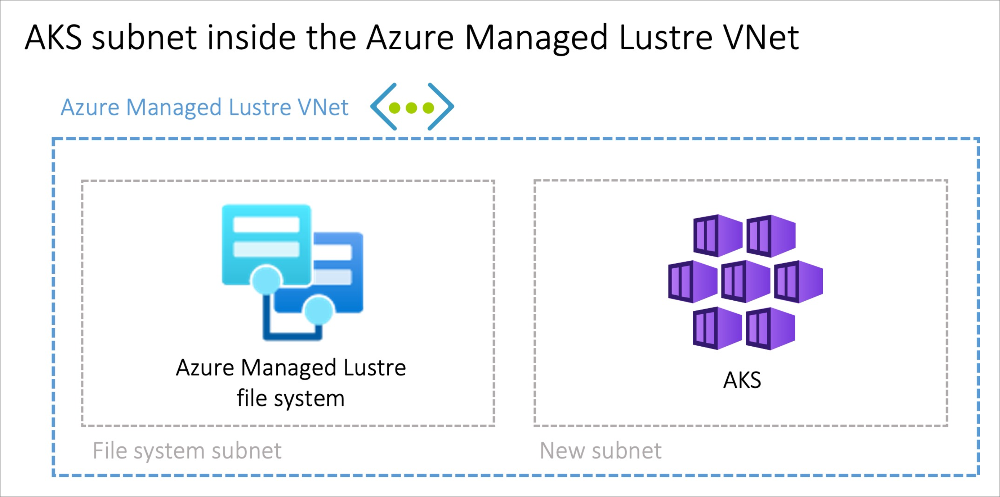
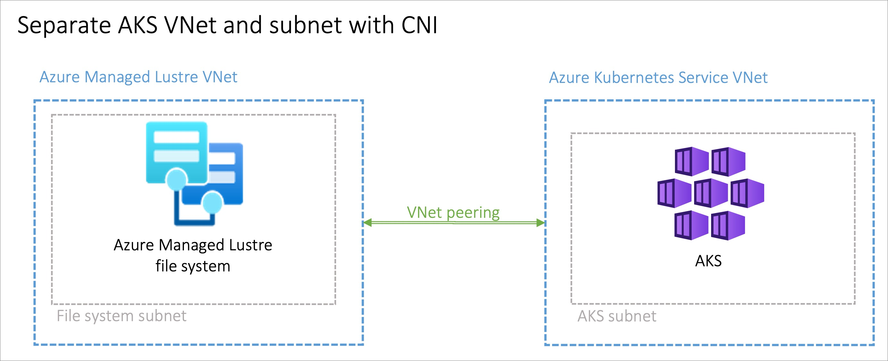
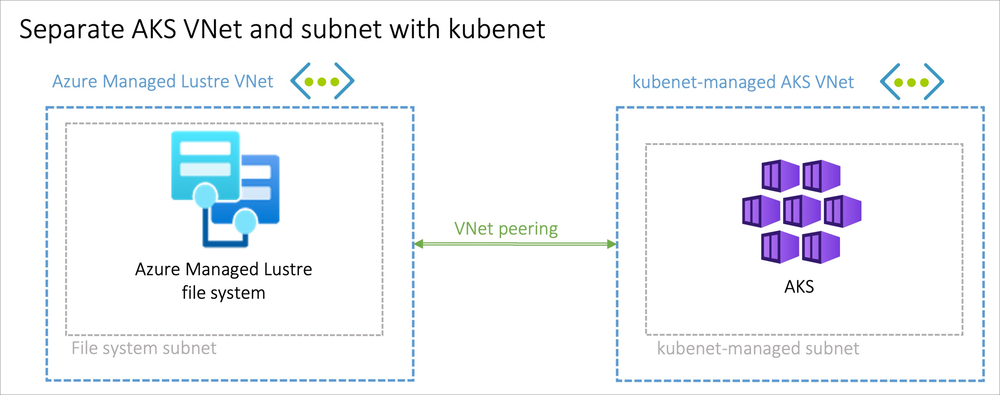
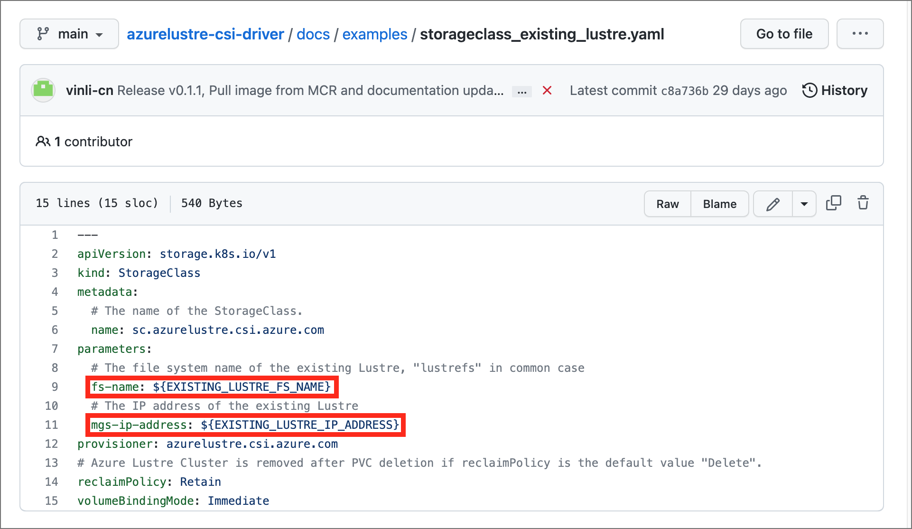
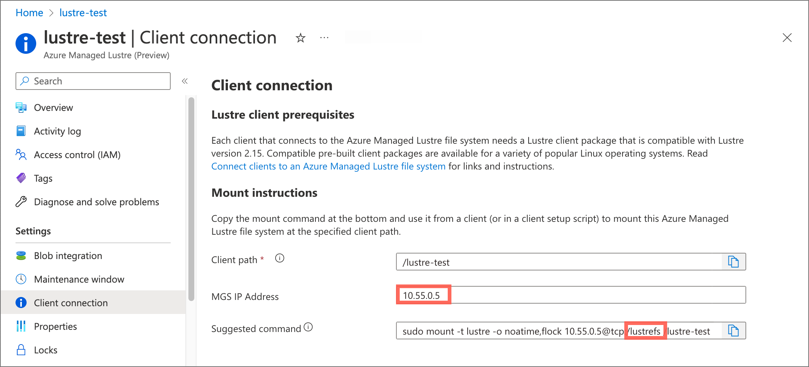

# Use the Azure Managed Lustre CSI Driver for Kubernetes

The article describes how to install and mount the Azure Managed Lustre container support interface (CSI) driver for Kubernetes to enable you to use an Azure Managed Lustre storage system with your Kubernetes containers in an Azure Kubernetes Service (AKS) deployment.

## About the Azure Managed Lustre CSI driver for Kubernetes

The Azure Managed Lustre container support interface (CSI) driver for Kubernetes enables you to use an Azure Managed Lustre storage system with Kubernetes containers. The driver is compatible with [Azure Kubernetes Service (AKS)](/azure/aks/).

Kubernetes can simplify the process to configure and deploy virtual client endpoints for your Azure Managed Lustre workload. It can automate setup tasks like these:

- Create Virtual Machine Scale Sets used by AKS to run the pods.
- Load the correct Lustre client software onto the VM instances.
- Specify the Azure Managed Lustre mount point, and propagate that information to the client pods.

The Azure Managed Lustre CSI driver can automate the client software and mount tasks. The driver provides a CSI controller plugin as a deployment with two replicas, by default, and a CSI node plugin as a DaemonSet. You can change the number of replicas.

## Compatible Kubernetes versions

The Azure Managed Lustre CSI Driver is compatible with [Azure Kubernetes Service](/azure/aks/). Other Kubernetes installations aren't currently supported.

The following container images are compatible with Azure Managed Lustre file systems.

| CSI driver version | Container image                                                | Supported Kubernetes version | Lustre client version |
|--------------------|----------------------------------------------------------------|------------------------------|-----------------------|
| main branch        | `mcr.microsoft.com/oss/kubernetes-csi/azurelustre-csi:latest`  | 1.21 or later | 2.15.1 |
| v0.1.12            | `mcr.microsoft.com/oss/kubernetes-csi/azurelustre-csi:v0.1.12` | 1.21 or later | 2.15.1 |

## Prerequisites

Before you deploy the Azure Managed Lustre CSI Driver for Kubernetes, complete the following prerequisite:

- Create the AKS cluster, if you haven't already. For instructions, see [Deploy an Azure Kubernetes Service (AKS) cluster](/azure/aks/learn/quick-kubernetes-deploy-portal).

## Setup overview

To enable  the Azure Managed Lustre CSI Driver for Kubernetes, perform these steps:

1. [Provide subnet access between AKS and your Azure Managed Lustre file system](#provide-subnet-access-between-aks-and-azure-managed-lustre).

1. [Install the Azure Managed Lustre CSI Driver for Kubernetes](#install-the-csi-driver).

1. [Create and configure a persistent volume](#create-and-configure-a-persistent-volume).

1. [Check the installation](#check-the-installation) by optionally using an echo pod to confirm the driver is working.

The following sections describe each task in greater detail.

## Provide subnet access between AKS and Azure Managed Lustre

Because the Azure Managed Lustre file system operates within a private virtual network, your Kubernetes containers must have a subnet in common with the Lustre cluster. There are three ways to configure subnet access

- [Option 1](#option-1-create-an-aks-subnet-inside-the-azure-managed-lustre-virtual-network): Create an AKS subnet inside the Azure Managed Lustre virtual network
- [Option 2](#option-2-use-azure-cni-in-aks-and-peer-the-virtual-networks): Use Azure CNI in AKS, and peer the VNets
- [Option 3](#option-3-use-aks-kubenet-and-peer-its-virtual-network-with-the-azure-managed-lustre-virtual-network): Use AKS `kubenet`, and peer its virtual network with the Azure Managed Lustre virtual network

### Option 1: Create an AKS subnet inside the Azure Managed Lustre virtual network

You can create a new subnet within your Azure Managed Lustre virtual network, and use that subnet with the Azure Container Network Interface (Azure CNI) for AKS. Or you can host the AKS cluster within your Azure Managed Lustre subnet.



- This option doesn't require virtual network peering.

- If you create a new subnet, the subnet must have enough IP addresses to support your AKS cluster. For example, a 50-node AKS cluster probably needs at least 2,048 IP addresses (CIDR notation /21).

  For sizing details, including a formula for calculating IP requirements, see [Configure Azure CNI networking in Azure Kubernetes Service](/azure/aks/configure-azure-cni).

- If you host the AKS cluster within your Azure Managed Lustre subnet, make sure your Lustre file system subnet has enough IP addresses to support both the Azure Managed Lustre system and the AKS cluster.

### Option 2: Use Azure CNI in AKS, and peer the virtual networks

A second option is to create a new virtual network and subnet, configure the subnet with Azure CNI networking in AKS, and then peer the new AKS virtual network with the virtual network that contains your Lustre file system.



- Size the subnet to support your AKS cluster, as described in [Configure Azure CNI networking in Azure Kubernetes Service](/azure/aks/configure-azure-cni).

- To learn how to connect the two networks, see [Virtual network peering](/azure/virtual-network/virtual-network-peering-overview).

### Option 3: Use AKS `kubenet`, and peer its virtual network with the Azure Managed Lustre virtual network

A third option is to use the AKS default `kubenet`-style network for your AKS cluster. A new AKS-managed virtual network and subnet are created automatically. You can then peer the AKS virtual network with the Azure Managed Lustre virtual network.



- With this option, you don't have to create or size the virtual network and subnet. `kubenet` automatically creates an appropriately sized subnet for your AKS cluster.

- The AKS virtual network is created in a separate resource group from the AKS cluster's resource group. Look for a resource group with a name that starts with **MC_** and includes the name of your AKS cluster. This resource group contains the AKS virtual network and related components.

  For more information, see [Kubenet (basic) networking](/azure/aks/concepts-network#kubenet-basic-networking) in [Network concepts for applications in Azure Kubernetes Service (AKS)](/azure/aks/concepts-network).

- To learn how to connect the two networks, see [Virtual network peering](/azure/virtual-network/virtual-network-peering-overview).

## Create an Azure Managed Lustre file system

If you haven't already created your Azure Managed Lustre File System cluster, create the cluster now. For instructions, see [Create an Azure Managed Lustre file system in the Azure portal](create-file-system-portal.md). Currently, the driver can only be used with a pre-existing Azure Managed Lustre system.

## Connect a client to your Azure Managed Lustre file system

Do the following steps to install a Lustre client, and mount the file system:

1. Review the steps for installing the client software and mounting the system in [Connect to clients](connect-clients.md).

1. Link to specific steps for the client software version you're installing. See [Install client software](connect-clients.md#install-client-software) for links to supported software versions. Follow the steps in the individual article for your preferred client software version to install the client software.

## Connect to the AKS cluster

Connect to the Azure Kubernetes Service cluster by doing these steps:

1. Sign in to [the Azure portal](https://portal.azure.com).

1. On the **Overview** page for your AKS cluster, select the **Get started** tab.

   To see CLI commands populated with your AKS cluster values, select **Connect**.

1. Open a PowerShell session on the system where you install and administer the CSI driver.

1. To connect, run the following basic connect command in Azure CLI, substituting the settings for your AKS cluster:

   ```azurecli
   az aks get-credentials --subscription <AKS_subscription_id> --resource_group <AKS_resource_group_name> --name <name_of_AKS>
   ```

## Install the CSI driver

To install the CSI driver, run the following command:

```bash
curl -skSL https://raw.githubusercontent.com/kubernetes-sigs/azurelustre-csi-driver/main/deploy/install-driver.sh | bash
```

For local installation command samples, see [Install Azure Lustre CSI Driver on a Kubernetes cluster](https://github.com/kubernetes-sigs/azurelustre-csi-driver/blob/main/docs/install-csi-driver.md).

> [!NOTE]
> The installation script uses `kubectl` to apply several configuration files to your environment. If you haven't installed `kubectl`, follow the instructions in [Connect to the cluster](/azure/aks/learn/quick-kubernetes-deploy-cli#connect-to-the-cluster) to connect to the cluster and access `kubectl`.

> [!IMPORTANT]
> Upgrades of the CSI driver are not currently supported. To use a newer version of the CSI driver, install the driver to a newly-created AKS cluster.

## Create and configure a persistent volume

To create a persistent volume for an existing Azure Managed Lustre file system, do these steps:

1. Copy the following configuration files from the **/docs/examples/** folder in the [azurelustre-csi-driver](https://github.com/kubernetes-sigs/azurelustre-csi-driver/tree/main/docs/examples) repository. If you cloned the repository when you [installed the CSI driver](#install-the-csi-driver), you have local copies available already.

   - storageclass_existing_lustre.yaml
   - pvc_storageclass.yaml

   If you don't want to clone the entire repository, you can download each file individually. Open each of the following links, copy the file's contents, and then paste the contents into a local file with the same filename.

   - [storageclass_existing_lustre.yaml](https://github.com/kubernetes-sigs/azurelustre-csi-driver/blob/main/docs/examples/storageclass_existing_lustre.yaml)
   - [pvc_storageclass.yaml](https://github.com/kubernetes-sigs/azurelustre-csi-driver/blob/main/docs/examples/pvc_storageclass.yaml)

1. In the **storageclass_existing_lustre.yaml** file, update the internal name of the Lustre cluster and the MSG IP address.

   

   Both settings are displayed in the Azure portal, on the **Client connection** page for your Azure Lustre file system.

   

   Make these updates:

   - Replace `EXISTING_LUSTRE_FS_NAME` with the system-assigned internal name of the Lustre cluster in your Azure Managed Lustre file system. The internal name is usually `lustrefs`. The internal name isn't the name that you gave the file system when you created it.

     The suggested `mount` command includes the name highlighted in the following address string.

     

   - Replace `EXISTING_LUSTRE_IP_ADDRESS` with the **MSG IP Address**.

1. To create the storage class and the persistent volume claim, run the following `kubectl` command:

   ```bash
   kubectl create -f storageclass_existing_lustre.yaml
   kubectl create -f pvc_storageclass.yaml
   ```

## Check the installation

If you want to check your installation, you can optionally use an echo pod to confirm the driver is working.

To view timestamps in the console during writes, run the following commands:

1. Add the following code to the echo pod:

   ```bash
   while true; do echo $(date) >> /mnt/lustre/outfile; tail -1 /mnt/lustre/outfile; sleep 1; done
   ```

1. To view timestamps in the console during writes, run the following `kubectl` command:

   ```bash
   `kubectl logs -f lustre-echo-date`
   ```

## Next steps

- Learn how to [export files from your file system with an archive job](export-with-archive-jobs.md).
