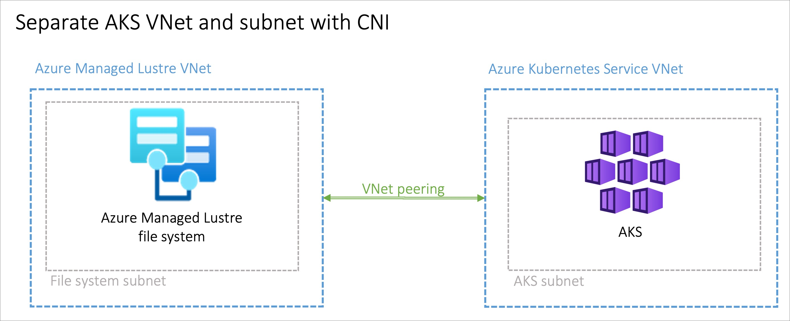
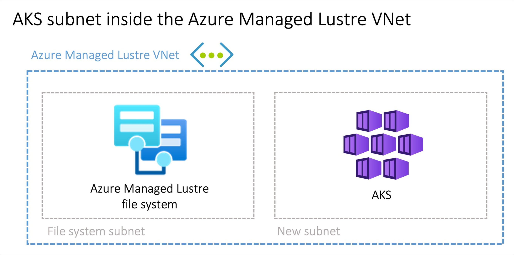
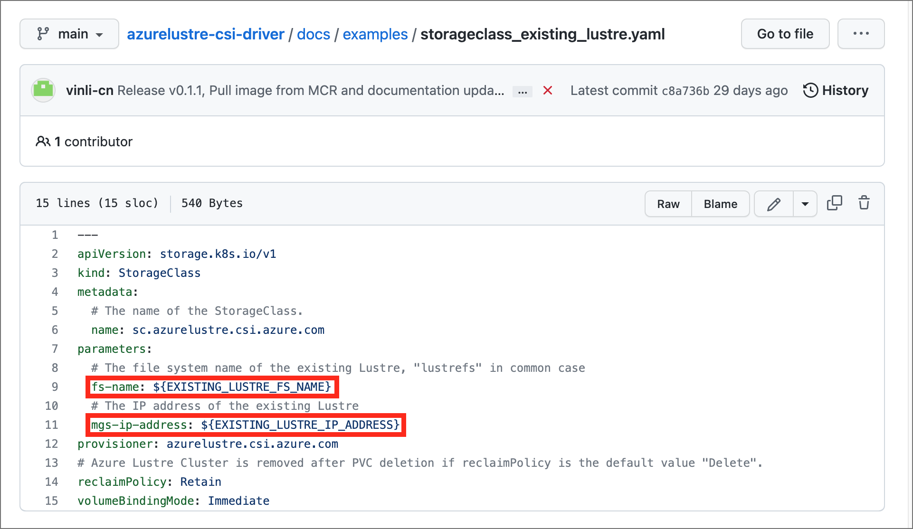
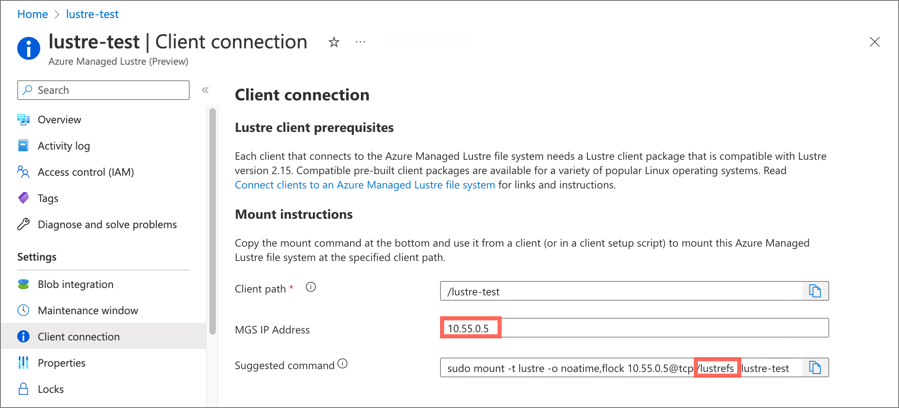

# Use the Azure Managed Lustre CSI driver with Azure Kubernetes Service

In this article, you learn how to plan, install, and use [Azure Managed Lustre](/azure/azure-managed-lustre) in [Azure Kubernetes Service (AKS)](/azure/aks/) with the [Azure Lustre CSI Driver for Kubernetes](https://github.com/kubernetes-sigs/azurelustre-csi-driver). This driver is based on the Container Support Interface (CSI) specification.

You can use the Azure Lustre CSI Driver for Kubernetes to access Azure Managed Lustre storage as persistent storage volumes from Kubernetes containers deployed in AKS.

## Compatible Kubernetes versions

The Azure Lustre CSI Driver for Kubernetes is compatible with [AKS](/azure/aks/). Other Kubernetes installations are not currently supported.

AKS Kubernetes versions 1.21 and later are supported. This support includes all versions currently available when you're creating a new AKS cluster.

> [!IMPORTANT]
> Version 0.4.0 provides images for Ubuntu 22.04 (`Ubuntu2204`) and Ubuntu 24.04 (`Ubuntu2404`) node pools. The Jammy DaemonSet also targets Ubuntu 20.04 (`Ubuntu2004`) Confidential VM node pools. Azure Linux and Windows node pools aren't supported.

## Compatible Lustre versions

The Azure Lustre CSI Driver for Kubernetes is compatible with [Azure Managed Lustre](/azure/azure-managed-lustre). Other Lustre installations are not currently supported.  

### Azure Lustre CSI Driver Versions

This article documents v0.4.0, the latest generally available (GA) release. Use a versioned release instead of the `main` branch for production deployments.

Starting with v0.4.0, the driver uses separate node images for Ubuntu 22.04 (Jammy) and Ubuntu 24.04 (Noble). The installer deploys both node DaemonSets. Kubernetes schedules the appropriate driver pod by using the `kubernetes.azure.com/os-sku-effective` node label.

| Driver version | Image | AKS node OS SKU | Supported k8s version | Lustre client version | Dynamic Provisioning |
|----------------|-------|-----------------|-----------------------|-----------------------|----------------------|
| v0.4.0 (Jammy) | mcr.microsoft.com/oss/v2/kubernetes-csi/azurelustre-csi:v0.4.0-jammy | `Ubuntu2204`; `Ubuntu2004` Confidential VM node pools | 1.21+ | 2.15.7 | ✅ |
| v0.4.0 (Noble) | mcr.microsoft.com/oss/v2/kubernetes-csi/azurelustre-csi:v0.4.0-noble | `Ubuntu2404` | 1.21+ | 2.16.1 | ✅ |
| v0.3.1 | mcr.microsoft.com/oss/v2/kubernetes-csi/azurelustre-csi:v0.3.1 | Ubuntu Linux | 1.21+ | 2.15.7 | ✅ |
| v0.3.0 | mcr.microsoft.com/oss/v2/kubernetes-csi/azurelustre-csi:v0.3.0 | Ubuntu Linux | 1.21+ | 2.15.5 | ✅ |
| v0.2.0 | mcr.microsoft.com/oss/v2/kubernetes-csi/azurelustre-csi:v0.2.0 | Ubuntu Linux | 1.21+ | 2.15.5 | ❌ |
| v0.1.18 | mcr.microsoft.com/oss/kubernetes-csi/azurelustre-csi:v0.1.18 | Ubuntu Linux | 1.21+ | 2.15.5 | ❌ |
| v0.1.17 | mcr.microsoft.com/oss/kubernetes-csi/azurelustre-csi:v0.1.17 | Ubuntu Linux | 1.21+ | 2.15.5 | ❌ |
| v0.1.15 | mcr.microsoft.com/oss/kubernetes-csi/azurelustre-csi:v0.1.15 | Ubuntu Linux | 1.21+ | 2.15.4 | ❌ |
| v0.1.14 | mcr.microsoft.com/oss/kubernetes-csi/azurelustre-csi:v0.1.14 | Ubuntu Linux | 1.21+ | 2.15.3 | ❌ |
| v0.1.13 | mcr.microsoft.com/oss/kubernetes-csi/azurelustre-csi:v0.1.13 | Ubuntu Linux | 1.21+ | 2.15.4 | ❌ |
| v0.1.12 | mcr.microsoft.com/oss/kubernetes-csi/azurelustre-csi:v0.1.12 | Ubuntu Linux | 1.21+ | 2.15.3 | ❌ |
| v0.1.11 | mcr.microsoft.com/oss/kubernetes-csi/azurelustre-csi:v0.1.11 | Ubuntu Linux | 1.21+ | 2.15.1 | ❌ |
| v0.1.10 | mcr.microsoft.com/oss/kubernetes-csi/azurelustre-csi:v0.1.10 | Ubuntu Linux | 1.21+ | 2.15.2 | ❌ |

For a complete list of all driver releases and their changelog, see the [Azure Lustre CSI driver releases page](https://github.com/kubernetes-sigs/azurelustre-csi-driver/releases).

> [!NOTE]
> Version 0.4.0 requires AKS node pools that report the `kubernetes.azure.com/os-sku-effective` label, in addition to the Kubernetes version requirement shown in the table.

## Prerequisites

- An Azure account with an active subscription. [Create an account for free](https://azure.microsoft.com/pricing/purchase-options/azure-account?cid=msft_learn).
- A terminal environment with the Azure CLI tools installed. See [Get started with the Azure CLI](/cli/azure/get-started-with-azure-cli).
- [kubectl](https://kubernetes.io/docs/reference/kubectl), the Kubernetes management tool, installed in your terminal environment. See [Quickstart: Deploy an Azure Kubernetes Service (AKS) cluster by using the Azure CLI](/azure/aks/learn/quick-kubernetes-deploy-cli#connect-to-the-cluster).
- An Azure Managed Lustre deployment. See the [Azure Managed Lustre documentation](/azure/azure-managed-lustre).
- **Network connectivity** between your AKS cluster and Azure Managed Lustre virtual network. See [network architecture planning](#determine-the-network-architecture-for-interconnectivity-of-aks-and-azure-managed-lustre) below for configuration options.

## Plan your AKS deployment

When you're deploying Azure Kubernetes Service, several options affect the operation between AKS and Azure Managed Lustre.

### Determine the network type to use with AKS

AKS supports multiple networking models, each with different capabilities and use cases. All networking models work with the Azure Lustre CSI Driver for Kubernetes, but they have different requirements for virtual networking and cluster setup.

For comprehensive information about choosing the right networking model for your specific requirements, see [Azure Kubernetes Service CNI networking overview](/azure/aks/concepts-network-cni-overview).

When creating an AKS cluster in the Azure portal, you'll see the following networking options:

#### Recommended Options:

**Azure CNI Overlay (Recommended)**
- Conserves VNet IP address space by using logically separate CIDR ranges for pods
- Supports maximum cluster scale (5000 nodes and 250 pods per node)
- Simple IP address management
- Best choice for most scenarios

**Azure CNI Pod Subnet**
- Pods get full VNet connectivity and can be directly reached via their private IP address
- Requires larger, non-fragmented VNet IP address space
- Choose this if you need direct external access to pod IPs

#### Legacy Options (Not Recommended for New Deployments):

**Azure CNI Node Subnet (Legacy)**
- Limited scale and inefficient use of VNet IPs
- Only recommended if you specifically need a managed VNet for your cluster, see [AKS Legacy Container Networking Interfaces (CNI)](/azure/aks/concepts-network-legacy-cni)

**Kubenet (Retiring)**
- Being retired March 31, 2028. For more information, see [AKS use Kubenet](/azure/aks/configure-kubenet).
- Limited scale and requires manual route management
- Plan to migrate to Azure CNI Overlay before the retirement date

For detailed information on networking models, see [Azure Kubernetes Service CNI networking overview](/azure/aks/concepts-network-cni-overview).

### Determine the network architecture for interconnectivity of AKS and Azure Managed Lustre

Azure Managed Lustre operates within a private virtual network. Your AKS instance must have network connectivity to the Azure Managed Lustre virtual network. There are two common ways to configure the networking between Azure Managed Lustre and AKS:

- Install AKS in its own virtual network and create a virtual network peering with the Azure Managed Lustre virtual network.
- Use the **Bring your own Azure virtual network** option in AKS to install AKS in a new subnet on the Azure Managed Lustre virtual network.

> [!NOTE]
> We don't recommend that you install AKS in the same subnet as Azure Managed Lustre.

#### Peering AKS and Azure Managed Lustre virtual networks

The option to peer two virtual networks has the advantage of separating the management of the networks into different privileged roles. Peering can also provide additional flexibility, because you can implement it across Azure subscriptions or regions. Virtual network peering requires coordination between the two networks to avoid choosing conflicting IP network spaces.



#### Installing AKS in a subnet on the Azure Managed Lustre virtual network

The option to install the AKS cluster in the Azure Managed Lustre virtual network with the **Bring your own Azure virtual network** feature in AKS can be advantageous in scenarios where the network is managed singularly. You'll need to create an additional subnet, sized to meet your AKS networking requirements, in the Azure Managed Lustre virtual network.

There is no privilege separation for network management when you're provisioning AKS on the Azure Managed Lustre virtual network. The AKS service principal needs privileges on the Azure Managed Lustre virtual network.



## Provisioning Methods

The Azure Lustre CSI Driver supports two provisioning methods:

### Dynamic Provisioning (Available in v0.3.0+)
Dynamic provisioning allows the CSI driver to automatically create Azure Managed Lustre file systems on-demand when persistent volume claims are created.

> [!NOTE]
> Dynamic provisioning is available starting with Azure Lustre CSI Driver version 0.3.0. For more information, see the [v0.3.0 release notes](https://github.com/kubernetes-sigs/azurelustre-csi-driver/releases/tag/v0.3.0).

### Static Provisioning
Static provisioning uses an existing Azure Managed Lustre file system. This method involves:
- Creating storage classes that reference existing Lustre clusters
- Manually specifying the Lustre file system name and MGS IP address
- Suitable for scenarios where you have preexisting Lustre infrastructure

Choose the method that best fits your use case. Dynamic provisioning is documented first below, followed by static provisioning instructions.

## Dynamic Provisioning

Dynamic provisioning automatically creates Azure Managed Lustre file systems on-demand when persistent volume claims are created. This feature became available in CSI driver version 0.3.0.

### Prerequisites for dynamic provisioning

#### Permissions

> [!IMPORTANT]
> Before using this CSI driver to dynamically create Azure Managed Lustre clusters, the kubelet identity must have the correct permissions granted to it.

The kubelet identity requires the following permissions:
- Read and write access to the resource group where clusters will be created
- Network permissions to create and manage subnets if needed
- Azure Managed Lustre service permissions

For detailed permission requirements, see the [v0.4.0 Driver Parameters documentation](https://github.com/kubernetes-sigs/azurelustre-csi-driver/blob/v0.4.0/docs/driver-parameters.md#Permissions%20For%20Kubelet%20Identity).

#### Network requirements

- An existing virtual network and subnet for the Azure Managed Lustre cluster
- Sufficient IP addresses available in the subnet for the cluster
- Proper network security group rules to allow Lustre traffic

### Create an AKS cluster for dynamic provisioning

If you haven't already created your AKS cluster, create a cluster deployment. See [Deploy an Azure Kubernetes Service (AKS) cluster by using the Azure portal](/azure/aks/learn/quick-kubernetes-deploy-portal).

### Create a virtual network peering for dynamic provisioning

> [!NOTE]
> Skip this network peering step if you installed AKS in a subnet on the Azure Managed Lustre virtual network.

The AKS virtual network is created in a separate resource group from the AKS cluster's resource group. You can find the name of this resource group by going to your AKS cluster in the Azure portal, going to **Properties**, and finding the **Infrastructure** resource group. This resource group contains the virtual network that needs to be paired with the Azure Managed Lustre virtual network. It matches the pattern **MC\_\<aks-rg-name\>\_\<aks-cluster-name\>\_\<region\>**.

To peer the AKS virtual network with your Azure Managed Lustre virtual network, consult [Virtual network peering](/azure/virtual-network/virtual-network-peering-overview).

> [!TIP]
> Due to the naming of the MC_ resource groups and virtual networks, names of networks can be similar or the same across multiple AKS deployments. When you're setting up peering, be careful to choose the AKS networks that you intend to choose.

### Connect to the AKS cluster for dynamic provisioning

1. Open a terminal session with access to the Azure CLI tools and sign in to your Azure account:

   ```azurecli
   az login
   ```

1. Sign in to [the Azure portal](https://portal.azure.com).

1. Find your AKS cluster. On the **Overview** pane, select the **Connect** button, and then copy the command for **Download cluster credentials**.

1. In your terminal session, paste in the command to download the credentials. The command is similar to:

   ```azurecli
   az aks get-credentials --subscription <AKS_subscription_id> --resource_group <AKS_resource_group_name> --name <name_of_AKS>
   ```

1. Install kubectl if it's not present in your environment:

   ```azurecli
   az aks install-cli
   ```

1. Verify that the current context is the AKS cluster where you just installed the credentials and that you can connect to it:

   ```bash
   kubectl config current-context
   kubectl get deployments --all-namespaces=true
   ```

### Install the driver for dynamic provisioning

To install the Azure Lustre CSI Driver for Kubernetes, run the following command:

```bash
curl -sSL --fail https://raw.githubusercontent.com/kubernetes-sigs/azurelustre-csi-driver/v0.4.0/deploy/install-driver.sh | bash -s v0.4.0
```

> [!IMPORTANT]
> Specify `v0.4.0` in both the script URL and the script argument so the command installs the release described in this article. Without the argument, the installer can install a different release from the `main` branch.

For the corresponding source and deployment manifests, see the [v0.4.0 release](https://github.com/kubernetes-sigs/azurelustre-csi-driver/releases/tag/v0.4.0).

### Create a Storage Class for dynamic provisioning

Create a file called `storageclass_dynprov_lustre.yaml` and copy in the following YAML. Edit the parameters as needed for your environment:

```yaml
apiVersion: storage.k8s.io/v1
kind: StorageClass
metadata:
  name: azurelustre-dynprov
provisioner: azurelustre.csi.azure.com
parameters:
  sku-name: "AMLFS-Durable-Premium-125"  # Choose appropriate SKU
  zone: "1"  # Specify zone if required for your SKU/location
  maintenance-day-of-week: "Sunday"
  maintenance-time-of-day-utc: "22:00"
  location: "eastus"  # Optional: defaults to AKS cluster location
  resource-group: "my-resource-group"  # Optional: defaults to AKS cluster RG
  vnet-name: "my-vnet"  # Optional: defaults to AKS cluster VNET
  subnet-name: "my-subnet"  # Optional: defaults to AKS cluster subnet
reclaimPolicy: Delete  # Change to "Retain" to keep clusters after PVC deletion
volumeBindingMode: Immediate
---
# Optional: Resource quota to limit number of clusters
apiVersion: v1
kind: ResourceQuota
metadata:
  name: pvc-lustre-dynprov-quota
spec:
  hard:
    azurelustre-dynprov.storageclass.storage.k8s.io/persistentvolumeclaims: "1"
```

Apply the Storage Class to your AKS cluster:

```bash
kubectl apply -f storageclass_dynprov_lustre.yaml
```

### Create a Persistent Volume Claim for dynamic provisioning

Create a file called `pvc_storageclass_dynprov.yaml` and copy in the following YAML:

```yaml
apiVersion: v1
kind: PersistentVolumeClaim
metadata:
  name: pvc-lustre-dynprov
spec:
  accessModes:
    - ReadWriteMany
  storageClassName: azurelustre-dynprov
  resources:
    requests:
      storage: 48Ti  # Minimum size for AMLFS-Durable-Premium-125
```

Apply the PVC to your AKS cluster:

```bash
kubectl apply -f pvc_storageclass_dynprov.yaml
```

### Monitor cluster creation

The Azure Managed Lustre cluster creation may take 10 minutes or more. You can monitor the progress:

```bash
kubectl describe pvc pvc-lustre-dynprov
```

While creating, the status will be `Pending` with a message like:
`Waiting for a volume to be created either by the external provisioner 'azurelustre.csi.azure.com'...`

Once ready, it will have a `Bound` status with a success message.

### Create a pod for dynamic provisioning

Create a file called `pod_echo_date_dynprov.yaml` and copy in the following YAML:

```yaml
apiVersion: v1
kind: Pod
metadata:
  name: lustre-echo-date-dynprov
spec:
  containers:
  - image: mcr.microsoft.com/oss/nginx/nginx:1.15.5-alpine
    name: lustre-echo-date-dynprov
    command:
      - "/bin/sh"
      - "-c"
      - "while true; do echo $(date) >> /mnt/lustre/outfile; sleep 1; done"
    volumeMounts:
    - name: lustre-storage
      mountPath: /mnt/lustre
  volumes:
  - name: lustre-storage
    persistentVolumeClaim:
      claimName: pvc-lustre-dynprov
```

Apply the pod to your AKS cluster:

```bash
kubectl apply -f pod_echo_date_dynprov.yaml
```

### Verify dynamic provisioning

After the pod is running, you can verify that the dynamically created Azure Managed Lustre file system is mounted correctly:

```bash
kubectl exec -it lustre-echo-date-dynprov -- df -h
```

You should see the Azure Managed Lustre file system mounted at `/mnt/lustre`.

### Clean up dynamic resources

To delete the dynamically created resources:

```bash
kubectl delete pvc pvc-lustre-dynprov
```

If the storage class has `reclaimPolicy: Delete`, this will also delete the Azure Managed Lustre cluster. If set to `Retain`, you must delete the cluster manually when no longer needed.

## Static Provisioning

Static provisioning allows you to use an existing Azure Managed Lustre file system with your AKS cluster by manually creating the necessary Kubernetes resources.

### Prerequisites for static provisioning

- An existing Azure Managed Lustre file system. For more information on creating an Azure Managed Lustre file system, see [Create an Azure Managed Lustre file system](create-file-system-portal.md).
- The MGS IP address and internal file system name from your Azure Managed Lustre cluster

### Create an Azure Managed Lustre file system cluster for static provisioning

If you haven't already created your Azure Managed Lustre file system cluster, create the cluster now. For instructions, see [Create an Azure Managed Lustre file system by using the Azure portal](create-file-system-portal.md). Static provisioning requires an existing Azure Managed Lustre file system.

### Create an AKS cluster for static provisioning

If you haven't already created your AKS cluster, create a cluster deployment. See [Deploy an Azure Kubernetes Service (AKS) cluster by using the Azure portal](/azure/aks/learn/quick-kubernetes-deploy-portal).

### Create a virtual network peering for static provisioning

> [!NOTE]
> Skip this network peering step if you installed AKS in a subnet on the Azure Managed Lustre virtual network.

The AKS virtual network is created in a separate resource group from the AKS cluster's resource group. You can find the name of this resource group by going to your AKS cluster in the Azure portal, going to **Properties**, and finding the **Infrastructure** resource group. This resource group contains the virtual network that needs to be paired with the Azure Managed Lustre virtual network. It matches the pattern **MC\_\<aks-rg-name\>\_\<aks-cluster-name\>\_\<region\>**.

To peer the AKS virtual network with your Azure Managed Lustre virtual network, consult [Virtual network peering](/azure/virtual-network/virtual-network-peering-overview).

> [!TIP]
> Due to the naming of the MC_ resource groups and virtual networks, names of networks can be similar or the same across multiple AKS deployments. When you're setting up peering, be careful to choose the AKS networks that you intend to choose.

### Connect to the AKS cluster for static provisioning

1. Open a terminal session with access to the Azure CLI tools and sign in to your Azure account:

   ```azurecli
   az login
   ```

1. Sign in to [the Azure portal](https://portal.azure.com).

1. Find your AKS cluster. On the **Overview** pane, select the **Connect** button, and then copy the command for **Download cluster credentials**.

1. In your terminal session, paste in the command to download the credentials. The command is similar to:

   ```azurecli
   az aks get-credentials --subscription <AKS_subscription_id> --resource_group <AKS_resource_group_name> --name <name_of_AKS>
   ```

1. Install kubectl if it's not present in your environment:

   ```azurecli
   az aks install-cli
   ```

1. Verify that the current context is the AKS cluster where you just installed the credentials and that you can connect to it:

   ```bash
   kubectl config current-context
   kubectl get deployments --all-namespaces=true
   ```

### Install the driver for static provisioning

To install the Azure Lustre CSI Driver for Kubernetes, run the following command:

```bash
curl -sSL --fail https://raw.githubusercontent.com/kubernetes-sigs/azurelustre-csi-driver/v0.4.0/deploy/install-driver.sh | bash -s v0.4.0
```

> [!IMPORTANT]
> Specify `v0.4.0` in both the script URL and the script argument so the command installs the release described in this article. Without the argument, the installer can install a different release from the `main` branch.

For the corresponding source and deployment manifests, see the [v0.4.0 release](https://github.com/kubernetes-sigs/azurelustre-csi-driver/releases/tag/v0.4.0).

### Create and configure a persistent volume for static provisioning

To create a persistent volume for an existing Azure Managed Lustre file system:

1. Copy the following configuration files from the **/docs/examples/** folder in the [v0.4.0 azurelustre-csi-driver source](https://github.com/kubernetes-sigs/azurelustre-csi-driver/tree/v0.4.0/docs/examples).

   - **storageclass_existing_lustre.yaml**
   - **pvc_storageclass.yaml**

   If you don't want to clone the entire repository, you can download each file individually. Open each of the following links, copy the file's contents, and then paste the contents into a local file with the same file name.

   - [storageclass_existing_lustre.yaml](https://github.com/kubernetes-sigs/azurelustre-csi-driver/blob/v0.4.0/docs/examples/storageclass_existing_lustre.yaml)
   - [pvc_storageclass.yaml](https://github.com/kubernetes-sigs/azurelustre-csi-driver/blob/v0.4.0/docs/examples/pvc_storageclass.yaml)

1. In the **storageclass_existing_lustre.yaml** file, update the internal name of the Lustre cluster and the Lustre Management Service (MGS) IP address.

   

   Both settings are displayed in the Azure portal, on the **Client connection** pane for your Azure Managed Lustre file system.

   

   Make these updates:

   - Replace `EXISTING_LUSTRE_FS_NAME` with the system-assigned internal name of the Lustre cluster in your Azure Managed Lustre file system. The internal name is usually `lustrefs`. The internal name isn't the name that you gave the file system when you created it.

     The suggested `mount` command includes the name highlighted in the following address string.

     

   - Replace `EXISTING_LUSTRE_IP_ADDRESS` with the MGS IP address.

1. To create the storage class and the persistent volume claim, run the following `kubectl` command:

   ```bash
   kubectl create -f storageclass_existing_lustre.yaml
   kubectl create -f pvc_storageclass.yaml
   ```

### Create a pod for static provisioning

Create a pod that uses the PVC to mount the Azure Managed Lustre file system.

Create a file called `pod_echo_date.yaml` and copy in the following YAML:

```yaml
apiVersion: v1
kind: Pod
metadata:
  name: lustre-echo-date
spec:
  containers:
  - image: mcr.microsoft.com/oss/nginx/nginx:1.15.5-alpine
    name: lustre-echo-date
    command:
      - "/bin/sh"
      - "-c"
      - "while true; do echo $(date) >> /mnt/lustre/outfile; sleep 1; done"
    volumeMounts:
    - name: lustre-storage
      mountPath: /mnt/lustre
  volumes:
  - name: lustre-storage
    persistentVolumeClaim:
      claimName: pvc-lustre
```

Apply the pod to your AKS cluster:

```bash
kubectl apply -f pod_echo_date.yaml
```

### Verify static provisioning

After the pod is running, you can verify that the Azure Managed Lustre file system is mounted correctly:

```bash
kubectl exec -it lustre-echo-date -- df -h
```

You should see the Azure Managed Lustre file system mounted at `/mnt/lustre`.

To view timestamps in the console during writes, run the following command:

```bash
kubectl logs -f lustre-echo-date
```

### Clean up static resources

To clean up resources when you're done:

```bash
kubectl delete pod lustre-echo-date
kubectl delete pvc pvc-lustre
kubectl delete storageclass azurelustre-static
```

> [!Important]
> This only deletes the Kubernetes resources. The Azure Managed Lustre file system itself will continue to exist and can be reused.

## Upgrade the CSI driver

Use this procedure to upgrade the Azure Lustre CSI driver from v0.2.0 or later to v0.4.0. If your cluster runs a release earlier than v0.2.0, contact Microsoft Support before you upgrade.

> [!IMPORTANT]
> Plan a maintenance window and stop every workload that mounts Azure Managed Lustre before the upgrade. You can't replace the Lustre client kernel modules while a Lustre mount is active. Don't continue until no running workload uses an Azure Managed Lustre PersistentVolumeClaim.
>
> Stopping workloads doesn't delete PersistentVolumes, PersistentVolumeClaims, or dynamically provisioned Azure Managed Lustre file systems. Don't delete these storage resources as part of the driver upgrade.

### Prepare for the upgrade

1. Check the effective OS SKU for every node:

   ```bash
   kubectl get nodes -L kubernetes.azure.com/os-sku-effective
   ```

   All nodes in the node pools where you intend to run Azure Managed Lustre workloads must report `Ubuntu2204`, `Ubuntu2404`, or, for Confidential VM node pools, `Ubuntu2004`. Don't continue if a required node has a missing or unsupported value. AKS manages this label. Don't change it manually.

1. Confirm the following prerequisites:

   - You have `cluster-admin` permissions.
   - The machine running `kubectl` can reach `raw.githubusercontent.com`.
   - Every node pool can reach `mcr.microsoft.com` and `packages.microsoft.com`.
   - Any network allow list includes the `amlfs-jammy` and `amlfs-noble` package repositories on `packages.microsoft.com`. The `amlfs-noble` repository is new in v0.4.0.

1. List the storage classes that use the Azure Lustre CSI driver:

   ```bash
   kubectl get storageclass -o jsonpath='{range .items[?(@.provisioner=="azurelustre.csi.azure.com")]}{.metadata.name}{"\n"}{end}'
   ```

1. List all PersistentVolumeClaims and identify the claims that use those storage classes:

   ```bash
   kubectl get pvc --all-namespaces -o custom-columns='NAMESPACE:.metadata.namespace,NAME:.metadata.name,STORAGECLASS:.spec.storageClassName,STATUS:.status.phase,VOLUME:.spec.volumeName'
   ```

   Account for every Azure Lustre claim, including claims with `Pending` status. Don't continue while an Azure Lustre volume creation or deletion is in progress.

1. List pods and the PersistentVolumeClaims that they reference:

   ```bash
   kubectl get pods --all-namespaces -o jsonpath='{range .items[*]}{.metadata.namespace}{"\t"}{.metadata.name}{"\t"}{range .spec.volumes[?(@.persistentVolumeClaim)]}{.persistentVolumeClaim.claimName}{" "}{end}{"\n"}{end}'
   ```

1. Stop every workload that uses an Azure Managed Lustre claim. Scale controllers to zero replicas, suspend scheduled workloads, and pause any deployment or GitOps process that recreates the pods.

1. Repeat the preceding pod query. Don't continue while it lists a pod that references an Azure Managed Lustre claim, including a pod in `Terminating` state.

1. Check every CSI node pod for remaining Lustre mounts:

   ```bash
   kubectl get pods -n kube-system -l app=csi-azurelustre-node -o name |
     while read -r pod; do
       echo "$pod"
       kubectl exec -n kube-system "$pod" -c azurelustre -- \
         sh -c 'grep " - lustre " /proc/self/mountinfo || true'
     done
   ```

   The command displays each CSI node pod. Don't continue if it also displays a Lustre mount entry beneath any pod.

### Install v0.4.0

After you stop all Azure Managed Lustre workloads, run the version-pinned v0.4.0 installer:

```bash
curl -sSL --fail https://raw.githubusercontent.com/kubernetes-sigs/azurelustre-csi-driver/v0.4.0/deploy/install-driver.sh | bash -s v0.4.0
```

Specify `v0.4.0` in both the script URL and the script argument so the command installs the expected release instead of a different release from `main`.

If the installer reports a rollout timeout, run the checks in [Verify the upgrade](#verify-the-upgrade) before you retry the installer.

### Verify the upgrade

1. Wait for the controller and node DaemonSets to be ready:

   ```bash
   kubectl rollout status deployment/csi-azurelustre-controller -n kube-system --timeout=300s
   kubectl rollout status daemonset/csi-azurelustre-node-jammy -n kube-system --timeout=1800s
   kubectl rollout status daemonset/csi-azurelustre-node-noble -n kube-system --timeout=1800s
   ```

1. Confirm that each node DaemonSet has the expected number of ready pods:

   ```bash
   kubectl get daemonset -n kube-system csi-azurelustre-node-jammy csi-azurelustre-node-noble
   ```

   A DaemonSet can have zero desired pods when the cluster doesn't contain node pools for that Ubuntu version. For every DaemonSet with desired pods, `READY` must equal `DESIRED`.

1. Compare the node and pod lists to confirm that every intended node has a CSI node pod:

   ```bash
   kubectl get nodes -L kubernetes.azure.com/os-sku-effective
   kubectl get pods -n kube-system -l app=csi-azurelustre-node -o wide
   ```

   Every node where you intend to run Azure Managed Lustre workloads must appear in the `NODE` column of the pod list. A node without a CSI node pod can't mount Azure Managed Lustre, even when both DaemonSets report ready.

1. Confirm that every CSI node pod is ready and uses the expected v0.4.0 image:

   ```bash
   kubectl get pods -n kube-system -l app=csi-azurelustre-node -o wide
   kubectl get pods -n kube-system -l app=csi-azurelustre-node -o jsonpath='{range .items[*]}{.metadata.name}{"\t"}{.spec.nodeName}{"\t"}{.spec.containers[?(@.name=="azurelustre")].image}{"\n"}{end}'
   ```

   Every node pod must show `3/3` in the `READY` column and `Running` in the `STATUS` column. A pod that is running with fewer than three ready containers isn't ready to serve mounts. The Azure Lustre container image must end in `v0.4.0-jammy` or `v0.4.0-noble`.

### Restart workloads

Keep Azure Managed Lustre workloads stopped until every required CSI node pod is ready. Then restart the workloads and verify that a representative workload can access its Azure Managed Lustre mount:

```bash
kubectl exec -n <namespace> <pod-name> -- df -h <mount-path>
```

### Recover from an unsuccessful upgrade

> [!IMPORTANT]
> Keep Azure Managed Lustre workloads stopped while recovering from an unsuccessful upgrade. Don't install an arbitrary older driver release, because it might not support the node operating system, kernel, or Lustre client version in the cluster.

Use the [v0.4.0 troubleshooting guide](https://github.com/kubernetes-sigs/azurelustre-csi-driver/blob/v0.4.0/docs/csi-debug.md) and [v0.4.0 error reference](https://github.com/kubernetes-sigs/azurelustre-csi-driver/blob/v0.4.0/docs/errors.md) to correct the installation failure. Then rerun the pinned installer from [Install v0.4.0](#install-v040). If you can't complete the installation, contact Microsoft Support. Support might direct you to reinstall the previously working release as a cluster-specific recovery step.

## Uninstall the driver

Stop every workload that mounts Azure Managed Lustre before you uninstall the driver.

Run the uninstall script from a local clone of the release that's installed on the cluster. The machine running the command must have `git` installed and access to `github.com`. The following example uninstalls v0.4.0:

```bash
git clone --branch v0.4.0 --depth 1 https://github.com/kubernetes-sigs/azurelustre-csi-driver.git
cd azurelustre-csi-driver
./deploy/uninstall-driver.sh
```

The script removes the CSI controller, node DaemonSets, `CSIDriver` object, and RBAC resources. It doesn't delete PersistentVolumes, PersistentVolumeClaims, or Azure Managed Lustre file systems.

## Validate Container Image Signatures

Azure Lustre CSI Driver signs its container images to allow users to verify the integrity and origin of the images they use. Signing utilizes a public/private key pair to prove that Microsoft built a container image by creating a digital signature and adding it to the image. This section provides the steps to verify that an image was signed by Microsoft.

### Understanding Image Security in Kubernetes System Components

Container images used by the Azure Lustre CSI Driver are deployed in the `kube-system` namespace, which is considered a trusted system namespace in Kubernetes. For security and operational reasons, image integrity policies are typically not enforced on system namespaces because:

- **Bootstrap Requirements**: System components like CSI drivers must start before policy enforcement systems (like Gatekeeper and Ratify) are available
- **Trusted Components**: Images in `kube-system` are core Kubernetes infrastructure components managed by trusted providers
- **Operational Stability**: Enforcing policies on policy enforcement components themselves could prevent cluster functionality

However, you can still verify the integrity of CSI driver images before deployment.

### Pre-Deployment Image Verification

Before deploying the Azure Lustre CSI Driver, you can verify the digital signatures and authenticity of the container images using Microsoft's public signing certificates:

#### Verify Image Signatures with Notation CLI

1. **Download Notation CLI**:

    ```bash
    export NOTATION_VERSION=1.3.2
    curl -LO https://github.com/notaryproject/notation/releases/download/v$NOTATION_VERSION/notation_$NOTATION_VERSION\_linux_amd64.tar.gz
    sudo tar xvzf notation_$NOTATION_VERSION\_linux_amd64.tar.gz -C /usr/bin/ notation
    ```

2. **Download the Microsoft signing public certificate**: 

    ```bash
    curl -sSL "https://www.microsoft.com/pkiops/certs/Microsoft%20Supply%20Chain%20RSA%20Root%20CA%202022.crt" -o msft_signing_cert.crt
    ```

3. **Add the certificate to notation CLI**:

    ```bash
    notation cert add --type ca --store supplychain msft_signing_cert.crt
    ```

4. **Check the certificate in notation**:

    ```bash
    notation cert ls
    ```

    The output of the command looks like the following example:

    ```output
    STORE TYPE  STORE NAME  CERTIFICATE 
    ca          supplychain msft_signing_cert.crt
    ```

5. **Create a trustpolicy file for Azure Lustre CSI Driver images**:

    Create a file called `trustpolicy.json`:

    ```json
    {
        "version": "1.0",
        "trustPolicies": [
            {
                "name": "supplychain",
                "registryScopes": [ "*" ],
                "signatureVerification": {
                    "level" : "strict" 
                },
                "trustStores": [ "ca:supplychain" ],
                "trustedIdentities": [
                    "x509.subject: CN=Microsoft SCD Products RSA Signing,O=Microsoft Corporation,L=Redmond,ST=Washington,C=US"
                ]
            }
        ]
    }
    ```

6. **Use notation to verify Azure Lustre CSI Driver images**:

    ```bash
    notation policy import trustpolicy.json
    export NOTATION_EXPERIMENTAL=1
    
    # Verify the Jammy image used by the controller and Jammy node pods
    notation verify --allow-referrers-api mcr.microsoft.com/oss/v2/kubernetes-csi/azurelustre-csi:v0.4.0-jammy

    # Verify the Noble image used by Noble node pods
    notation verify --allow-referrers-api mcr.microsoft.com/oss/v2/kubernetes-csi/azurelustre-csi:v0.4.0-noble
    ```

    The output of a successful verification looks like the following example:

    ```output
    Successfully verified signature for mcr.microsoft.com/oss/v2/kubernetes-csi/azurelustre-csi@sha256:a1b2c3d4e5f6789012345678901234567890abcdef1234567890abcdef123456
    ```

### Application Workload Image Integrity

For enhanced security in production environments, consider enabling AKS Image Integrity to automatically validate container image signatures for your application workloads. While CSI driver images in the `kube-system` namespace are typically excluded from policy enforcement, you can configure image integrity policies for your application namespaces.

To learn more about implementing image integrity policies for your application workloads, see [Image Integrity in Azure Kubernetes Service (AKS)](/azure/aks/image-integrity).


## Troubleshooting

For troubleshooting issues with the Azure Lustre CSI Driver, see the [v0.4.0 CSI driver troubleshooting guide](https://github.com/kubernetes-sigs/azurelustre-csi-driver/blob/v0.4.0/docs/csi-debug.md) in the GitHub repository.

Common issues include:
- **Network connectivity problems** - verify virtual network peering or subnet configuration between AKS and Azure Managed Lustre.
- **Incorrect configuration** - verify the MGS IP address and file system name in your storage class.
- **Pod scheduling issues** - verify that the node's effective OS SKU is `Ubuntu2204`, `Ubuntu2404`, or `Ubuntu2004` for a Confidential VM node pool.
- **No v0.4.0 node pod on an AKS node** - verify that the `kubernetes.azure.com/os-sku-effective` label is present and matched by the Jammy or Noble DaemonSet.
- **A DaemonSet has zero desired pods** - this condition is expected if the cluster has no node pools for that Ubuntu version.
- **Upgrade rollout timeout** - inspect the DaemonSet status, affected pod events, and Azure Lustre container logs before retrying.
- **Image pull or Lustre client installation failures** - verify node egress to `mcr.microsoft.com` and `packages.microsoft.com`.
- **Permission issues** - verify that the AKS identity has the required permissions.

For dynamic provisioning specific issues:
- **Authentication/authorization errors** - verify kubelet identity permissions for creating Azure Managed Lustre clusters
- **SKU and zone validation errors** - ensure the specified SKU is supported in your region and zone configuration is correct
- **Network IP address availability** - confirm sufficient IP addresses are available in the target subnet
- **Quota limitations** - check both Kubernetes resource quotas and Azure subscription quotas for Azure Managed Lustre clusters

For additional troubleshooting resources, see:
- [Troubleshoot Azure Managed Lustre CSI driver extension errors](/troubleshoot/azure/azure-kubernetes/extensions/troubleshoot-azurelustre-csi-extension-errors)
- [Azure Managed Lustre troubleshooting](troubleshoot-deployment.md)
- [Azure Lustre CSI Driver GitHub repository](https://github.com/kubernetes-sigs/azurelustre-csi-driver)

## Related content

- [Create an export job to export data from Azure Managed Lustre](export-with-archive-jobs.md)
