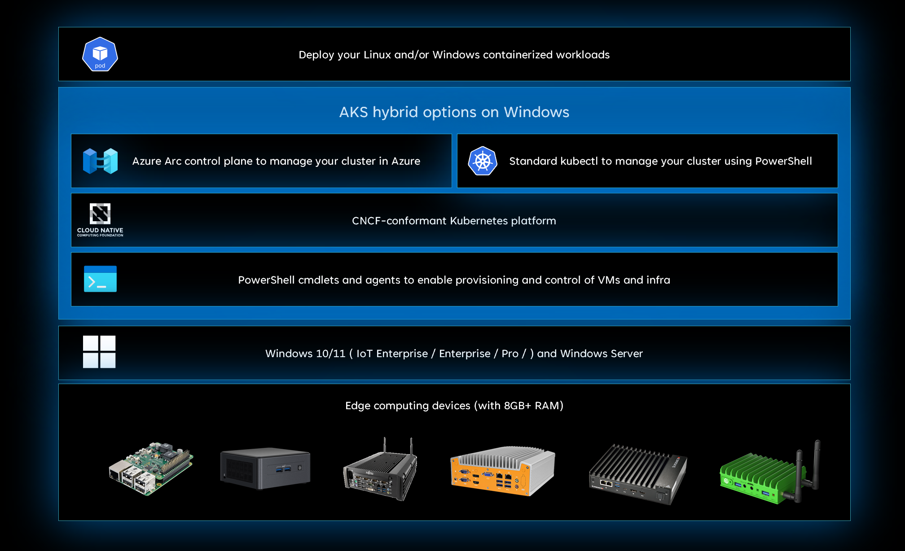
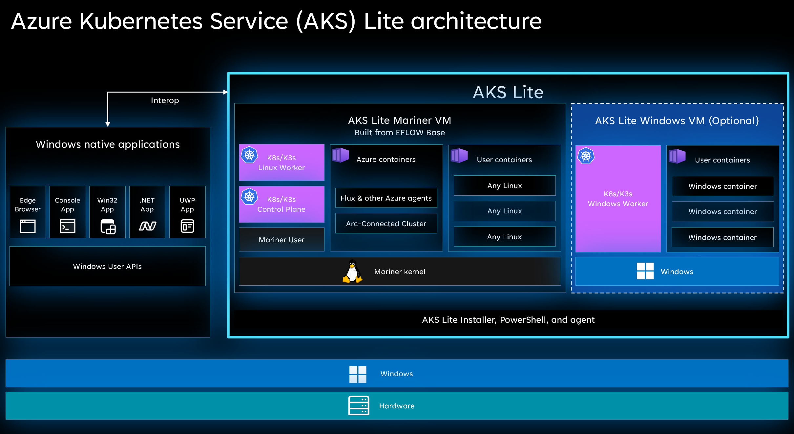

<!--
Remove all the comments in this template before you sign-off or merge to the 
main branch.
-->

<!--
This template provides the basic structure of a service/product overview article.
See the [overview guidance](contribute-how-write-overview.md) in the contributor guide.

To provide feedback on this template contact 
[the templates workgroup](mailto:templateswg@microsoft.com).
-->

<!-- 1. H1
Required. Set expectations for what the content covers, so customers know the 
content meets their needs. H1 format is # What is <product/service>?
-->
# Coming soon: Public Preview in November 2022 

# What is AKS Lite hybrid option?

<!-- 2. Introductory paragraph 
Required. Lead with a light intro that describes what the article covers. Answer the 
fundamental “why would I want to know this?” question. Keep it short.
-->

Azure Kubernetes Service Lite hybrid option is an on-premises Kubernetes implementation of Azure Kubernetes Service (AKS), which automates running containerized applications at scale. AKS Lite makes it easier to get started with your containerized application bringing cloud native best practices to your edge application.

AKS Lite is a Microsoft-supported Kubernetes platform, and includes a lightweight Kubernetes distribution with a small footprint and simple installation experience making it easy for user to deploy Kubernetes on PC-class or "light" edge hardware. It is intended for static, pre-defined configurations and does not enable dynamic VM creation/deletion or cluster lifecycle management.

Unlike other Microsoft-supported platforms such as an Azure-hosted service (AKS) and on server-class hardware (AKS-HCI), each machine with AKS Lite has a VM with restricted RAM, Storage, and physical CPU cores according to a static allocation assigned at install time. This enables traditional Windows apps to run side-by-side (i.e. interoperable) alongside the AKS Lite VMs.
<!-- 3. H2s
Required. Give each H2 a heading that sets expectations for the content that follows. 
Follow the H2 headings with a sentence about how the section contributes to the whole.
-->

## Key features of AKS hybrid options for Windows

While Kubernetes is an open-source orchestrator for automating container management at scale, AKS simplifies on-premises Kubernetes deployment by making it easy to install, configure clusters and manage application deployment across all clusters using a cloud-based management plane.

### Microsoft supported Kubernetes platform  

- This includes a lightweight, CNCF conformant K8S and K3S distribution that is supported and managed by Microsoft. The key difference between AKS on HCI and AKS on Windows is that AKS on Windows has minimal compute and memory requirements of 4 GB of RAM and 2 vCPUs.
- Each Kubernetes cluster runs in its own Hyper-V isolated virtual machines and includes many features to help secure your container infrastructure.
- Microsoft-maintained Linux and Windows worker nodes virtual machine images adhere to security best practices. Microsoft also refreshes these images monthly with the latest security updates.
- Simplified installation experience with PowerShell cmdlets and agents to enable provisioning and control of VMs and infrastructure. Microsoft provides automatic updates for your Kubernetes deployment, so you stay up-to-date with the latest available Kubernetes versions.

### Locally install nodes on single or multiple machines

AKS Lite simplifies the process of setting up Kubernetes by providing you with PowerShell scripts and cmdlets for setting up Kubernetes and creating single or multi node Kubernetes clusters

### Run Linux and windows containers

AKS Lite fully supports both Linux-based and Windows-based containers. When you create a Kubernetes cluster on AKS you can choose to run Linux containers, Windows containers, or both.

### Azure Arc for management

Once you have set up on-premises Kubernetes using AKS Lite and created a Kubernetes cluster, you can manage your Kubernetes infrastructure using the Azure portal providing you a centralized management console for Kubernetes clusters running anywhere. In addition to this, various Azure Arc-enabled services like Azure policy, Azure monitor and Azure ML services enable you to ensure compliance, monitor your clusters and run cloud-services on your edge clusters. It helps to ensure that applications and clusters are consistently deployed and configured at scale from source control.

<!-- add your content here -->

## Why use AKS Lite hybrid option?

### Interoperable with native Windows application

Windows provides a rich app eco system, user experience and robust security, and powers much of the infrastructure for industrial solutions today from HMIs, robots, PLCs, medical devices etc. That said, a lot of the cloud-native workloads are built on Linux and customers are faced with the challenge of having to introduce Linux systems to take advantage of cloud-native solutions which requires additional infrastructure management tools and skills to manage Linux systems in their environment. With AKS Lite hybrid options, customers get the best of both worlds. Customers can continue to use their Windows application investments and use existing hardware. In addition to this, they can also run cloud-native Linux workloads on Windows without the need to have new skills or new control plane to manage the Linux devices. This enables customers to use a broad set of AI capabilities to innovate quickly and drive their edge innovation forward with the least disruption. In addition to that, AKS on Windows IoT offers interoperability between native Windows applications and containerized Linux workloads.

### Kernel to cloud support  

With AKS Lite, customers get the benefit of having a fully supported stack from kernel to cloud. Microsoft provides 10 year LTSC for the host OS. The Linux VM is fully managed and is based on a curated CBL-Mariner image, which is a lightweight image that helps reduce attack surface, ensures better performance, and provides less-overhead for patching vulnerabilities. Added to that Microsoft has a robust testing matrix for individual Mariner packages and extensive regression tests prior to an image release, reducing the likelihood of downtime for the service. VM policies ensure A/B updates of the VM image and the Kubernetes distribution ensures your Kubernetes stack is the latest and greatest. Customers can manage all your containers and Kubernetes configs across cloud and on-prem with Arc-enabled Kubernetes. This multi-layered approach ensures that the entire software stack is secure and updated so that your business applications can run reliably.  

### Cloud-services enabled at the edge

Once your AKS hybrid is connected to Azure Arc, it extends the Azure platform to the edge with core services like governance, monitoring, application, ML and data services. It also helps bring DevOps practices anywhere and build iteratively using GitOps and Flux to seamlessly manage application deployments.

AKS Lite is currently in private preview and will be available for **public preview** in **November 2022**

## Next steps
- Enroll for private preview by emailing projecthaven@microsoft.com
- Check out our Ignite blog [here](https://aka.ms/aks-lite-ignite-blog)