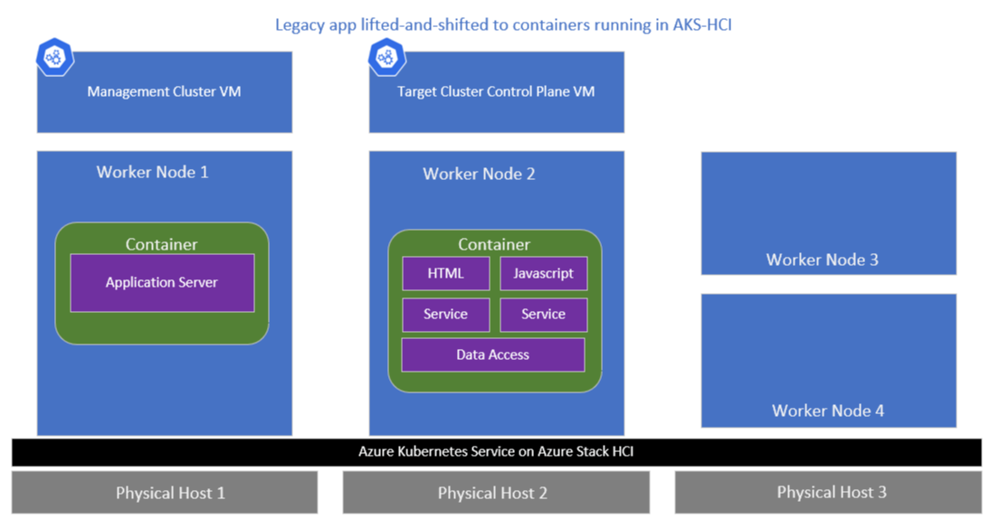

# Application availability on AKS on Azure Stack HCI and Windows Server

AKS on Azure Stack HCI and Windows Server is a fully supported container platform that can run cloud-native applications on the [Kubernetes container orchestration platform](https://kubernetes.io/). The architecture supports running virtualized Windows and Linux workloads on top of Azure Stack HCI and Windows Server 2019 Datacenter. 

The AKS on Azure Stack HCI and Windows Server architecture is built with failover clustering and live migration that is automatically enabled for target (workload) clusters. During various disruption events, virtual machines that host customer workloads are freely moved around without perceived application downtime. This means that a traditional enterprise customer, who's managing a legacy application as a singleton to AKS on Azure Stack HCI and Windows Server, will get similar (or better) uptime than what's currently experienced on a legacy VM application. 

This topic describes some fundamental concepts for users who want to run containerized applications on AKS on Azure Stack HCI and Windows Server with live migration enabled in order to ensure applications are available during a disruption. Kubernetes terminology, such as *voluntary disruption* and *involuntary disruption*, is used to refer to downtime of an application running in a pod. 

## **What is live migration?**

[*Live migration*](/windows-server/virtualization/hyper-v/manage/live-migration-overview) is a Hyper-V feature that allows you to transparently move running virtual machines from one Hyper-V host to another without perceived downtime. The primary benefit of live migration is flexibility; running virtual machines are not tied to a single host machine. This allows users to perform actions such as draining a specific host of virtual machines before decommissioning or upgrading the host. When paired with Windows Failover Clustering, live migration allows the creation of highly available and fault tolerant systems.

The current architecture of AKS on Azure Stack HCI and Windows Server assumes that customers have live migration enabled in their Azure Stack HCI or Windows Server clustered environment. Therefore, all Kubernetes worker node VMs will be created with live migration configured. These nodes can be moved around physical hosts in the event of a disruption to ensure the platform is highly available. 

​For a customer running a legacy application as a singleton on top of Kubernetes, this architecture will meet their high availability needs. Kubernetes will manage scheduling of pods on available worker nodes while Live migration will manage scheduling of worker node VMs on available physical hosts.

## Application disruption scenarios
A comparative study of the recovery times for applications running in VMs on AKS on Azure Stack HCI and Windows Server clearly shows that there is minimal impact on the application when common disruption events occur. Three example disruption scenarios include:

- Applying an update that results in a reboot of the physical machine. 
- Applying an update that involves recreating the worker node. 
- Unplanned hardware failure of a physical machine. 

> [!NOTE]
> These scenarios assume that the application owner still uses Kubernetes affinity and anti-affinity settings to ensure proper scheduling of pods across worker nodes.

| **Disruption event**  | **Running applications in VMs on Azure Stack HCI** |       **Running applications in VMs on AKS on Azure Stack HCI and Windows Server**            |
| ------------------------------------------------------------ | ---------------------------- | ----------------- |
| Applying an update that results in a reboot of the physical machine | No  impact                   | No  impact        |
| Applying an update that involves recreating the worker node (or rebooting the VM) | No impact                    | Varies            |
| Unplanned  hardware failure of a physical machine            | 6-8  minutes                 | 6 –8 minutes    |

### Applying an update that results in a reboot of the physical machine

During a physical host maintenance event, such as applying an update that results in the reboot of a host machine, no impact is expected for applications running in the cluster. The cluster administrator would drain the host and ensure that all VMs are live migrated before applying the update. 

### Applying an update that involves recreating the worker node

This scenario involves bringing down a worker node VM to perform routine maintenance. To prepare for the update, the cluster administrator would drain and isolate the node, so all pods are evicted to an available worker node before applying updates. Once the update is completed, the worker node would be rejoined and made available for scheduling. 

> [!NOTE]
> The availability of an application will vary as it would include the time it takes to download the base container image, especially for larger images stored in the public cloud. Therefore, it's recommended you use small base container images, and for Windows containers, using the `nano server` base image is recommended.

### Unplanned hardware failure of a physical machine

In this scenario, an involuntary disruption event occurs to a physical machine hosting a legacy application container/pod in one of the worker node VMs. Failover clustering will place the host in an Isolated state, and then after a period of 6 to 8 minutes, start the process of live migrating these VMs to surviving hosts. In this case, the application downtime is the equivalent of time it takes to restart the host and worker node VMs.

## Conclusion

AKS on Azure Stack HCI and Windows Server and failover clustering technologies are both designed to ensure that computing environments are highly available and fault tolerant. However, the application owner still has to configure deployments to use Kubernetes features, such as `Deployments`, `Affinity Mapping`, `RelicaSets`, to ensure that the pods are resilient in disruption scenarios.