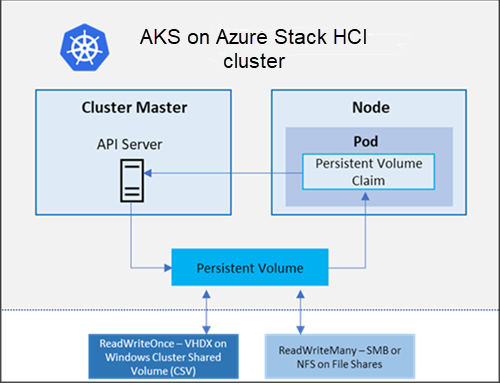

# Storage options for applications in AKS on Azure Stack HCI and Windows Server

Applications that run in AKS on Azure Stack HCI may need to store and retrieve data. For some application workloads, the data can use local, fast storage on an unneeded node when the pods are deleted (Kubernetes uses _pods_ to run an instance of an application). 

Other workloads may require storage that persists on more regular data volumes. Multiple pods may need to share the same data volumes, or reattach data volumes if the pod is rescheduled on a different node. Also, you may need a storage option if the pods contain sensitive data or application configuration information. 



This article introduces the core concepts that provide storage to your applications in AKS on Azure Stack HCI, including:
- Volumes 
- Persistent volumes 
- Storage classes 
- Persistent volume claims (PVC) 

## Volumes
Applications often need to be able to store and retrieve data. As Kubernetes typically treats individual pods as temporary, disposable resources, different approaches are available for applications to use and persist data. A volume represents a way to store, retrieve, and persist data across pods and through the application lifecycle. 

In Kubernetes, volumes can represent more than just a traditional disk where information is stored and retrieved. Kubernetes volumes can also be used as a way to insert data into a pod for containers to use. Some common Kubernetes volume types include: 

- `emptyDir` - This volume is commonly used as temporary space for a pod. All containers within a pod can access the data on the volume. Data written to this volume type persists only for the lifespan of the pod - when the pod is deleted, the volume is deleted. This volume typically uses the underlying local node disk storage, although it can also exist solely in the node's memory. 

- `secret` - This volume is used to include sensitive data, such as passwords, into pods. First, you create a secret using the Kubernetes API. When you define your pod or deployment, you can request a specific secret. Secrets are only provided to nodes with a scheduled pod that requires it, and the secret is stored in _tmpfs_, and not written to disk. When the last pod on a node that requires a secret is deleted, the secret is deleted from the node's tmpfs. Secrets are stored within a given namespace and can only be accessed by pods within the same namespace. 

- `configMap` - This volume type is used to inject key-value pair properties into pods, such as application configuration information. Instead of defining application configuration information within a container image, you can define it as a Kubernetes resource that can be easily updated and applied to new instances of pods as they are deployed. Similar to using a secret, you first create a ConfigMap using the Kubernetes API. This ConfigMap can then be requested when you define a pod or deployment. ConfigMaps are stored within a given namespace and can only be accessed by pods within the same namespace. 

## Persistent volumes
Volumes that are defined and created as part of the pod lifecycle only exist until the pod is deleted. Pods often expect their storage to remain if a pod is rescheduled on a different host during a maintenance event, especially in StatefulSets. A persistent volume is a storage resource created and managed by the Kubernetes API that can exist beyond the lifetime of an individual pod. 

You can use AKS on Azure Stack HCI Disk volumes backed by VHDX that are mounted as _ReadWriteOnce_ and are accessible to a single node at a time. Or, you can use AKS on Azure Stack HCI Files volumes backed by SMB or NFS file shares. These are mounted as _ReadWriteMany_ and are available to multiple nodes concurrently. 

A persistent volume can be statically created by a cluster administrator, or dynamically created by the Kubernetes API server. If a pod is scheduled and requests storage that is not currently available, Kubernetes can create the underlying VHDX file and then attach it to the pod. Dynamic provisioning uses a _StorageClass_ to identify what type of storage needs to be created. 

## Storage classes
To define different tiers (and location) of storage you can create a StorageClass. The StorageClass also defines the _reclaimPolicy_. This reclaimPolicy controls the behavior of the underlying storage resource when the pod is deleted and the persistent volume may no longer be required. The underlying storage resource can be deleted or retained for use with a future pod. 

In AKS on Azure Stack HCI, the _default_ storage class is automatically created and uses CSV to create VHDX-backed volumes. The reclaim policy ensures that the underlying VHDX is deleted when the persistent volume that used it is deleted. The storage class also configures the persistent volumes to be expandable, so you just need to edit the persistent volume claim with the new size. 

If no StorageClass is specified for a persistent volume, the default StorageClass is used. When requesting persistent volumes, make sure they use the appropriate storage you need. You can create a StorageClass for additional needs. 

## Persistent volume claims 
A PersistentVolumeClaim requests either ReadWriteOnce or ReadWriteMany storage of a particular StorageClass and size. The Kubernetes API server can dynamically provision the underlying storage resource in AKS on Azure Stack HCI if there is no existing resource to fulfill the claim based on the defined StorageClass. The pod definition includes the volume mount once the volume has been connected to the pod. 

A PersistentVolume is bound to a PersistentVolumeClaim once an available storage resource has been assigned to the pod requesting it. There is a 1:1 mapping of persistent volumes to claims. 

The following example YAML manifest shows a persistent volume claim that uses the _default_ StorageClass and requests a Disk 5Gi in size: 

```yaml
apiVersion: v1 
kind: PersistentVolumeClaim 
metadata: 
  name: aks-hci-vhdx 
spec: 
  accessModes: 
  - ReadWriteOnce 
  storageClassName: default 
  resources: 
    requests: 
      storage: 5Gi 
```

When you create a pod definition, the persistent volume claim is specified to request the desired storage. You also then specify the volumeMount for your applications to read and write data. The following example YAML manifest shows how the previous persistent volume claim can be used to mount a volume at `/mnt/aks-hci`: 

```yaml
kind: Pod 
apiVersion: v1 
metadata: 
  name: nginx 
spec: 
  containers: 
    - name: myfrontend 
      image: mcr.microsoft.com/oss/nginx/nginx:1.15.5-alpine 
      volumeMounts: 
      - mountPath: "/mnt/aks-hci" 
        name: volume 
  volumes: 
    - name: volume 
      persistentVolumeClaim: 
        claimName: aks-hci-vhdx 
```

The following example shows how to mount a volume in a Windows container and specify the drive letter and path. 

```yaml
volumeMounts: 
        - mountPath: "d:" 
          name: volume 
        - mountPath: "c:\k" 
          name: k-dir 
```

## Next steps

- [Use the AKS on Azure Stack HCI disk Container Storage Interface (CSI) drivers](./container-storage-interface-disks.md).