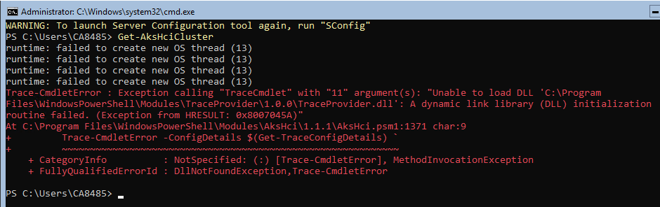

# Resolve general issues when using Azure Kubernetes Service on Azure Stack HCI
This article describes some common known issues with Azure Kubernetes Service on Azure Stack HCI. You can also review [known issues with Windows Admin Center](known-issues-windows-admin-center.md) and [installation issues and errors](known-issues-installation.md).

## When running AksHci PowerShell cmdlets, an `Unable to Load DLL` error appears

Antivirus software may be causing this error by blocking the execution of PowerShell binaries that are required to perform cluster operations. An example of a similar error is shown below:

To resolve this issue, verify the following processes and folders (which are required to perform AKS on Azure Stack HCI cluster operations) are excluded from the antivirus software:

Processes:
- kubectl.exe
- kvactl.exe
- mocctl.exe
- nodectl.exe
- wssdagent.exe
- wssdcloudagent.exe
- kubectl-adsso.exe
- AksHciHealth.exe

Folders:
- C:\Program Files\WindowsPowerShell\Modules\PowerShellGet\
- C:\Program Files\WindowsPowerShell\Modules\TraceProvider\
- C:\Program Files\WindowsPowerShell\Modules\AksHci\
- C:\Program Files\WindowsPowerShell\Modules\Az.Accounts\
- C:\Program Files\WindowsPowerShell\Modules\Az.Resources\
- C:\Program Files\WindowsPowerShell\Modules\AzureAD\
- C:\Program Files\WindowsPowerShell\Modules\DownloadSdk\
- C:\Program Files\WindowsPowerShell\Modules\Kva\
- C:\Program Files\WindowsPowerShell\Modules\Microsoft.SME.CredSspPolicy\
- C:\Program Files\WindowsPowerShell\Modules\Moc\
- C:\Program Files\WindowsPowerShell\Modules\PackageManagement\
- C:\Program Files\AksHci\
- C:\AksHci\

## Running Remove-AksHciCluster results in the error: _A workload cluster with the name 'my-workload-cluster' was not found_

If you encounter this error when running [Remove-AksHciCluster](./reference/ps/remove-akshcicluster.md), you should check to make sure you have used the correct information for removing the cluster.

## Running Remove-AksHciCluster results in the error: _Error: unable to delete group clustergroup-spdb:..._

When running [Remove-AksHciCluster](./reference/ps/remove-akshcicluster.md), the following error occurs because there may be a deadlock:

 _Error: unable to delete group clustergroup-spdb: failed to delete group clustergroup-spdb: rpc error: code = DeadlineExceeded desc = context deadline exceeded_

To resolve this issue, restart CloudAgent. 

## In a workload cluster with static IP, all pods in a node are stuck in a _ContainerCreating_ state
In a workload cluster with static IP and Windows nodes, all of the pods in a node (including the `daemonset` pods) are stuck in a _ContainerCreating_ state. When attempting to connect to that node using SSH, it fails with a _Connection timed out_ error.

To resolve this issue, use Hyper-V Manager or the Failover Cluster Manager to turn off the VM of that node. After five to ten minutes, the node should have been recreated and with all the pods running.

## Next steps
- [Windows Admin Center known issues](known-issues-windows-admin-center.md)
- [Installation issues and errors](known-issues-installation.md)
- [Connect with SSH to Windows or Linux worker nodes](./ssh-connection.md)

If you continue to run into problems when you're using Azure Kubernetes Service on Azure Stack HCI, you can file bugs through [GitHub](https://aka.ms/aks-hci-issues).
