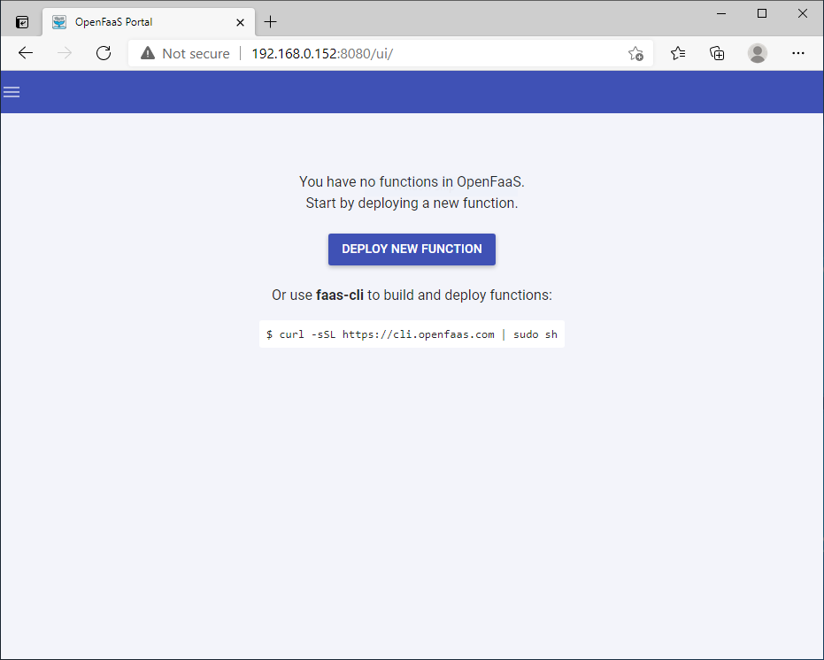

# Using OpenFaaS on AKS on Azure Stack HCI and Windows Server

[OpenFaaS][open-faas] is a framework for building serverless functions through the use of containers. As an open source project, it has gained large-scale adoption within the community. This document details installing and using OpenFaas on Kubernetes cluster running on AKS on Azure Stack HCI and Windows Server.

## Prerequisites

In order to complete the steps within this article, you need the following.

* Basic understanding of Kubernetes.
* An [AKS on Azure Stack HCI and Windows Server cluster](./setup.md) with at least one Linux worker node that's up and running.
* You have configured your local `kubectl` environment to point to your AKS on Azure Stack HCI and Windows Server cluster. You can use the [Get-AksHciCredential](./reference/ps/get-akshcicredential.md) PowerShell command to access your cluster using `kubectl`.
* [Helm v3](https://helm.sh/docs/intro/install/) command line and prerequisites installed.
* [Azure CLI](/cli/azure/install-azure-cli) can also be used to run commands, if you prefer this to PowerShell.
* Git command-line tools installed on your system
* Install the OpenFaaS CLI. See the [OpenFaaS CLI documentation][open-faas-cli] for installation options

> [!IMPORTANT]
> Helm is intended to run on Linux nodes. If you have Windows Server nodes in your cluster, you must ensure that Helm pods are only scheduled to run on Linux nodes. You also need to ensure that any Helm charts you install are also scheduled to run on the correct nodes. The commands in this article use [node-selectors](./adapt-apps-mixed-os-clusters.md#node-selector) to make sure pods are scheduled to the correct nodes, but not all Helm charts may expose a node selector. You can also consider using other options on your cluster, such as [taints](./adapt-apps-mixed-os-clusters.md#taints-and -tolerations).

## Add the OpenFaaS helm chart repo

With your kubeconfig file in hand, open your console to start the deployment process. If you're running on Windows, downloading and running Git Bash is the easiest way to follow along. From there, to begin, OpenFaaS maintains its own helm charts to keep up to date with all the latest changes:

```console
helm repo add openfaas https://openfaas.github.io/faas-netes/
helm repo update
```

## Deploy OpenFaaS

As a best practice, OpenFaaS and OpenFaaS functions should be stored in their own Kubernetes namespace.

Create a namespace for the OpenFaaS system and functions:

```console
kubectl apply -f https://raw.githubusercontent.com/openfaas/faas-netes/master/namespaces.yml
```

Generate a password for the OpenFaaS UI Portal and REST API:

```console
# generate a random password
PASSWORD=$(head -c 12 /dev/urandom | shasum| cut -d' ' -f1)

kubectl -n openfaas create secret generic basic-auth \
--from-literal=basic-auth-user=admin \
--from-literal=basic-auth-password="$PASSWORD"
```

You can get the value of the secret with `echo $PASSWORD`.

The password we create here will be used by the helm chart to enable basic authentication on the OpenFaaS Gateway, which is exposed externally through a LoadBalancer.

A Helm chart for OpenFaaS is included in the cloned repository. Use this chart to deploy OpenFaaS into your AKS cluster.

```console
helm upgrade openfaas --install openfaas/openfaas \
    --namespace openfaas  \
    --set basic_auth=true \
    --set functionNamespace=openfaas-fn \
    --set serviceType=LoadBalancer
```

Output:

```output
NAME:   openfaas
LAST DEPLOYED: Fri May 14 18:35:47 2021
NAMESPACE: openfaas
STATUS: deployed
REVISION: 1
TEST SUITE: None
```

To verify that OpenFaas has started, run the following command:

```console
kubectl --namespace=openfaas get deployments -l "release=openfaas, app=openfaas"
```

A public IP address is created for accessing the OpenFaaS gateway. To retrieve this IP address, use the [kubectl get service][kubectl-get] command. It may take a minute for the IP address to be assigned to the service.

```console
kubectl get service -l component=gateway --namespace openfaas
```

Output:

```output
NAME               TYPE           CLUSTER-IP     EXTERNAL-IP    PORT(S)          AGE
gateway            ClusterIP      10.110.205.41  <none>         8080/TCP         7m
gateway-external   LoadBalancer   10.107.51.110  192.168.0.152  8080:32029/TCP   7m
```

To test the OpenFaaS system, browse to the external IP address on port 8080, `http://192.168.0.152:8080` in this example. You will be prompted to log in. To fetch your password, enter `echo $PASSWORD`.



Set `$OPENFAAS_URL` to the External-IP found above.

Log in with your console. Note, if running in Git Bash on Windows, you may need to use faas-cli instead of ./faas-cli in the command below.

```console
export OPENFAAS_URL=http://192.168.0.152:8080
echo -n $PASSWORD | ./faas-cli login -g $OPENFAAS_URL -u admin --password-stdin
```

## Create first function

Now that OpenFaaS is operational, create a function using the OpenFaas portal.

Click on **Deploy New Function** and search for **Figlet**. Select the Figlet function, and click **Deploy**.


Use curl to invoke the function. Replace the IP address in the following example with that of your OpenFaas gateway.

```console
curl -X POST http://192.168.0.152:8080/function/figlet -d "Hello Azure"
```

Output:

```output
 _   _      _ _            _
| | | | ___| | | ___      / \    _____   _ _ __ ___
| |_| |/ _ \ | |/ _ \    / _ \  |_  / | | | '__/ _ \
|  _  |  __/ | | (_) |  / ___ \  / /| |_| | | |  __/
|_| |_|\___|_|_|\___/  /_/   \_\/___|\__,_|_|  \___|

```

### Clean up resources

When you deploy a Helm chart, a number of Kubernetes resources are created. These resources include pods, deployments, and services. To clean up these resources, use the [helm uninstall][helm-cleanup] command and specify your release name, as found in the previous `helm list` command.

```console
helm uninstall openfaas
```

The following example shows the release named *openfaas* has been uninstalled:

```console
release "openfaas" uninstalled
```

## Next Steps

You can continue to learn with the OpenFaaS workshop through a set of hands-on labs that cover topics such as how to create your own GitHub bot, consuming secrets, viewing metrics, and auto-scaling.

<!-- LINKS - external -->
[install-mongo]: https://docs.mongodb.com/manual/installation/
[kubectl-get]: https://kubernetes.io/docs/reference/generated/kubectl/kubectl-commands#get
[open-faas]: https://www.openfaas.com/
[open-faas-cli]: https://github.com/openfaas/faas-cli
[openfaas-workshop]: https://github.com/openfaas/workshop