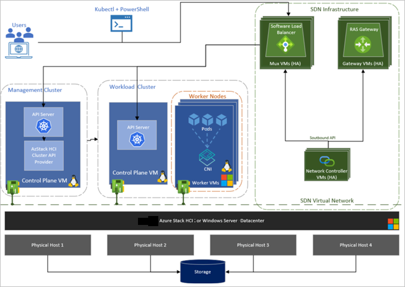
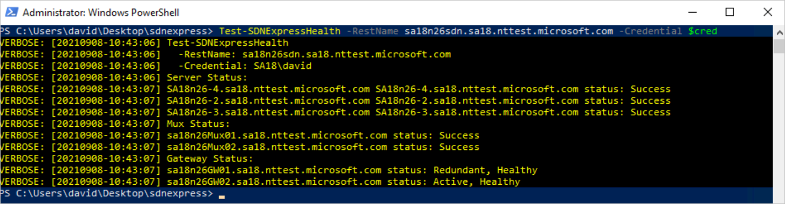
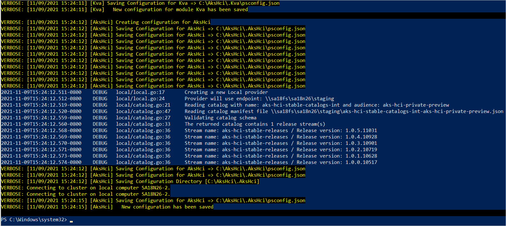
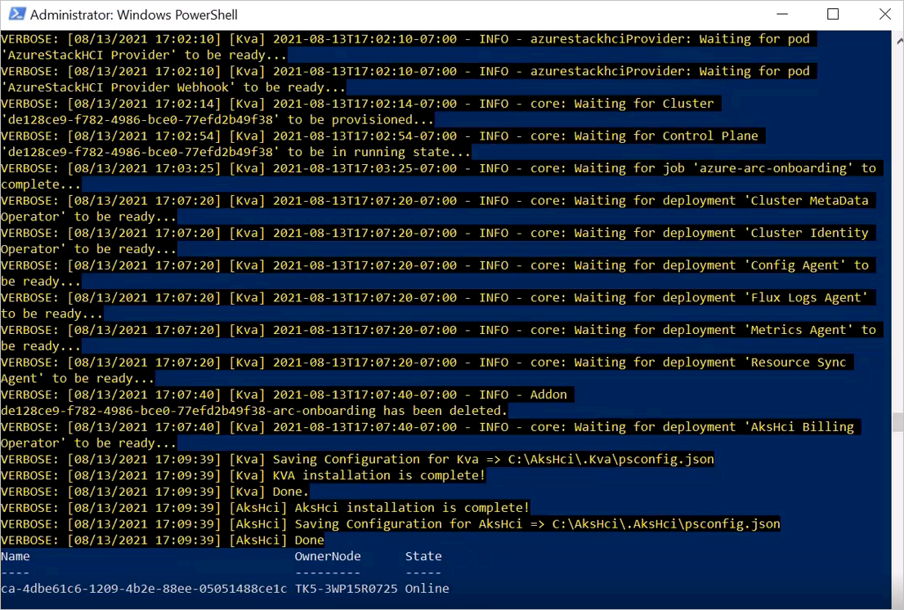

# How to use Azure Kubernetes Service on Azure Stack HCI and Windows Server with software defined networking and virtual networking infrastructure (Public Preview)

You can deploy Azure Kubernetes Service (AKS) on Azure Stack HCI and Windows Server on top of a software defined networking (SDN) virtual networking infrastructure using PowerShell.

> [!IMPORTANT]
> Integration of software defined networking and virtual networking infrastructure with AKS on Azure Stack HCI and Windows Server is currently in PREVIEW.
> See the [Supplemental Terms of Use for Microsoft Azure Previews](https://azure.microsoft.com/support/legal/preview-supplemental-terms/) for legal terms that apply to Azure features that are in beta, preview, or otherwise not yet released into general availability.

## Scope of the public preview

You can configure AKS on Azure Stack HCI and Windows Server to:

 - Attach AKS on Azure Stack HCI and Windows Server infrastructure and workload virtual machines (VM)s to an SDN virtual network.
 - Use the SDN [Software Load Balancer](/azure-stack/hci/concepts/software-load-balancer) (SLB) for all AKS on Azure Stack HCI and Windows Server load balancing purposes.

[  ](media/software-defined-networking/architecture-diagram-for-sdn-on-aks.png#lightbox)

## Limits of SDN on AKS on Azure Stack HCI and Windows Server

The following features aren't supported:

 - Attaching pods and containers to an SDN virtual network. Pods will use Flannel or Calico (default) as the network provider.
- Network policy enforcement using the SDN access Control lists. The SDN access control Lists can still be configured outside of AKS on Azure Stack HCI and Windows Server using SDN tools, such as REST endpoints, PowerShell, Windows Admin Center, and System Center Virtual Machine Manager, but Kubernetes NetworkPolicy objects won't configure them.
-   Attaching AKS on Azure Stack HCI and Windows Server VM NICs to SDN logical networks
-   Installation using Windows Admin Center.
-   Physical host to AKS on Azure Stack HCI and Windows Server  VM connectivity: VM NICs will be joined to an SDN virtual network and thus won't be accessible from the host by default. You can enable this manually by attaching a public IP directly to the VM using SDN's Software Load Balancer.

## Prerequisites

To deploy AKS on Azure Stack HCI and Windows Server with SDN, you need to make sure your environment satisfies the deployment criteria of both AKS on Azure Stack HCI and Windows Server and SDN.

- **AKS on Azure Stack HCI and Windows Server requirements**  
    [Azure Kubernetes Service on Azure Stack HCI requirements](system-requirements.md)
- **SDN requirements**  
    [Plan a Software Defined Network infrastructure](/azure-stack/hci/concepts/plan-software-defined-networking-infrastructure)
- **Learn module**  
    [Plan for and deploy SDN infrastructure on Azure Stack HCI](/learn/modules/plan-deploy-sdn-infrastructure/)

> [!NOTE]  
> For SDN integration with AKS on Azure Stack HCI and Windows Server you need the network controller and software load balancer components. Gateway VMs are optional and not required.

## Install and preparing SDN

In order to use SDN with AKS on Azure Stack HCI and Windows Server, you will need to set up your SDN, and then install AKS. 
### Install SDN

The first step is to install SDN. To install SDN, we recommend [SDN Express](/azure-stack/hci/manage/sdn-express) or [Windows Admin Center](/azure-stack/hci/deploy/sdn-wizard).

A reference configuration file that deploys all the needed SDN infrastructure components can be found at [Software Load Balancer.psd1](https://github.com/microsoft/SDN/blob/master/SDNExpress/scripts/Sample%20-%20Software%20Load%20Balancer.psd1)

Once the SDN Express deployment has completed, there should be a screen with the status reporting as healthy:



If anything goes wrong or is being reported as unhealthy, see [Troubleshooting SDN](/windows-server/networking/sdn/troubleshoot/troubleshoot-software-defined-networking).

It's important that SDN is healthy before proceeding. If you're deploying SDN in a new environment, create test VMs and verifying connectivity to the load balancer VIPs. See [how to create and attach VMs to an SDN virtual network](/azure-stack/hci/manage/vm) using Windows Admin Center.

## Install AKS on Azure Stack HCI and Windows Server 

Initialize and prepare all the physical host machines for AKS on Azure Stack HCI and Windows Server. Refer to [Quickstart: Set up an Azure Kubernetes Service host on Azure Stack HCI and Windows Server and deploy a workload cluster using PowerShell](kubernetes-walkthrough-powershell.md) for most up-to-date instructions.

### Install the AKS on Azure Stack HCI and Windows Server  PowerShell module

Refer to the instructions [Install the AksHci PowerShell module](kubernetes-walkthrough-powershell.md#install-the-akshci-powershell-module) to install the AKS on Azure Stack HCI and Windows Server PowerShell module.

> [!NOTE]  
> You might have to change the PowerShell ExecutionPolicy to `Unrestricted` so that you can import and execute some of these scripts. You can do so by running `Set-ExecutionPolicy Unrestricted`.

After you complete the previous step, follow instructions [On all nodes in your Azure Stack HCI cluster](kubernetes-walkthrough-powershell.md#on-all-nodes-in-your-azure-stack-hci-cluster) to install **PowerShellGet** and **AksHci** modules.

Retrieve the [`sdn_public_preview.zip` from Download Center](https://download.microsoft.com/download/3/f/f/3ffb7097-e32b-4aa0-b977-1c1feb774749/sdn_public_preview.zip). 

Extract `sdn_public_preview.zip` file, and copy the updated PowerShell modules. On every physical host:

1.  Replace the contents of the `AksHci.psm1` and `Moc.psm1` PowerShell modules in the `Akshci` and `Moc` directories respectively. These can be found in your PowerShell module path (`%ProgramFiles%\\WindowsPowerShell\\Modules`).

2.  Replace or add the `Common.psm1` PowerShell modules used in the `Akshci`, `DownloadSdk`, `Kva`, and `Moc` directories.

> [!NOTE]  
> After completing this step, refresh or reload any opened PowerShell sessions so the modules are reloaded.

### Register the resource provider to your subscription

Follow instructions [Register the resource provider to your subscription](/azure-stack/AKS-HCI/kubernetes-walkthrough-powershell#register-the-resource-provider-to-your-subscription) to register the resource provider to your subscription.

### Prepare your machines for deployment

Follow instructions [Prepare your machine(s) for deployment](/azure-stack/AKS-HCI/kubernetes-walkthrough-powershell#step-1-prepare-your-machines-for-deployment) to prepare your machines for deployment.

### Configure AKS on Azure Stack HCI and Windows Server for installation

Choose one of your HCI machines to drive the creation of AKS on Azure Stack HCI and Windows Server. There are two steps that need to be done before installation.

1.  Configure the AKS on Azure Stack HCI and Windows Server network settings for SDN. For example, using:

    1.  SDN Virtual network `10.20.0.0/24` (`10.20.0.0 - 10.20.0.255`)

        This is a virtualized network and you can use any IP subnet. This subnet doesn't need to exist on your physical network.

    2.  **PublicVIP** Logical network `10.127.132.16/29` (`10.127.132.16 - 10.127.132.23`)

        This is the **PublicVIP** logical network that you provided when configuring SDN software load balancer.

    3.  Gateway `10.20.0.1`

        This is the gateway for your virtual network.

    4.  DNS Server `10.127.130.7`

        This is the DNS server for your virtual network.

        ```powershell
        $vnet = New-AksHciNetworkSetting -name "myvnet" -vswitchName "External" -k8sNodeIpPoolStart "10.20.0.2" -k8sNodeIpPoolEnd "10.20.0.255" -vipPoolStart "10.127.132.16" -vipPoolEnd "10.127.132.23" -useNetworkController -ipAddressPrefix "10.20.0.0/24" -gateway "10.20.0.1" -dnsServers "10.127.130.7"
        ```

        | Parameter                             | Description                                                                                                                                       |
        |---------------------------------------|---------------------------------------------------------------------------------------------------------------------------------------------------|
        | -name                                 | Name of virtual network in AKS on Azure Stack HCI and Windows Server                                                                                                                 |
        | -vswitchName                          | Name of external vSwitch on the HCI servers                                                                                                       |
        | -k8sNodeIpPoolStart -k8sNodeIpPoolEnd | IP start/end range of SDN virtual network                                                                                                         |
        | -vipPoolStart -vipPoolEnd             | IP start/end range of logical network used for load balancer VIP pool. Above, we've used an address range from the "PublicVIP" logical network. |
        | -useNetworkController                 | Enable integration with SDN                                                                                                                       |
        | -ipAddressPrefix                      | Virtual network subnet in CIDR notation                                                                                                           |
        | -gateway                  | Gateway                                                                                                                             |
        | -dnsServers                  | DNS server                                                                                                                            |
        
        > [!NOTE]  
        > For more information about these parameters, see: [New-AksHciNetworkSetting](/azure-stack/AKS-HCI/reference/ps/new-akshcinetworksetting)

1.  In the same PowerShell window used in the last step, create the AKS on Azure Stack HCI and Windows Server  configuration for SDN by providing references to the targeted SDN networks, and passing in the network settings (**$vnet**) we defined:

    ```powershell
    Set-AksHciConfig -imageDir "C:\clusterstorage\Volume1\images" -workingDir "C:\clusterstorage\Volume1\store" -cloudConfigLocation "C:\clusterstorage\Volume1\config" -vnet $vnet -useNetworkController -networkControllerFqdnOrIpAddress "nc.contoso.com" -networkControllerLbSubnetRef "/logicalnetworks/PublicVIP/subnets/my_vip_subnet" -networkControllerLnetRef "/logicalnetworks/HNVPA" -ring "SDNPreview" -catalog AKS-HCI -stable-catalogs-ext -version 1.0.10.40517
    ```
    
    > [!NOTE]  
    > The HNVPA logical network will be used as the underlay provider for the AKS on Azure Stack HCI and Windows Server virtual network.
    
    > [!NOTE]  
    > If you are using static IP address assignment for your Azure Stack HCI cluster nodes, you must also provide the `CloudServiceCidr` parameter. This is the IP Address of the MOC cloud service and must be in the same subnet as Azure Stack HCI cluster nodes. More details [Microsoft On-premises Cloud service](/azure-stack/AKS-HCI/concepts-node-networking#microsoft-on-premises-cloud-service).
    
    | Parameter                         | Description                                                                                                                                                                                                                                                                                                                                                           |
    |-----------------------------------|-----------------------------------------------------------------------------------------------------------------------------------------------------------------------------------------------------------------------------------------------------------------------------------------------------------------------------------------------------------------------|
    | -imageDir                         | The path to the directory where VHD images are stored.                                                                                                                                                                                                                                                                                                                |
    | -workingDir                       | The path to the directory where AKS on Azure Stack HCI and Windows Server  stores temporary files                                                                                                                                                                                                                                                                                                        |
    | -cloudConfigLocation              | The path to the directory where cloud agent configuration is stored                                                                                                                                                                                                                                                                                                   |
    | -vnet                             | Name of AksHciNetworkSetting variable created in the previous step                                                                                                                                                                                                                                                                                                    |
    | -useNetworkController             | Enable integration with SDN                                                                                                                                                                                                                                                                                                                                           |
    | -networkControllerFqdnOrIpAddress  | Network controller FQDN. You can get the FQDN by executing Get-NetworkController on the Network Controller VM and using the RestName parameter.                                                                                                                                                                                                                       |
    | -networkControllerLbSubnetRef     | Reference to the public VIP logical network subnet configured in Network Controller. You can get this subnet by executing Get-NetworkControllerLogicalSubnet command. When using this command, use PublicVIP as the LogicalNetworkId. VipPoolStart and vipPoolEnd parameters in the New-AksHciNetworkSetting cmdlet must be part of the subnet referenced here. |
    | -networkControllerLnetRef         | Normally, this would be "/logicalnetworks/HNVPA"                                                                                                                                                                                                                                                                                                                      |
    | -version                          | Use 1.0.10.40517                                                                                                                                                                                                                                                                                                                                                      |
    | -ring                             | Use SDNPreview                                                                                                                                                                                                                                                                                                                                                        |
    | -catalog                          | Use AKS on Azure Stack HCI and Windows Server -stable-catalogs-ext                                                                                                                                                                                                                                                                                                                                       |
    
> [!NOTE]  
> For more information about these parameters, see: [Set-AksHciConfig](/azure-stack/AKS-HCI/reference/ps/set-akshciconfig)




### Sign in to Azure and configure registration settings

Follow instructions [sign-in to Azure and configure registration settings](/azure-stack/AKS-HCI/kubernetes-walkthrough-powershell#step-4-log-in-to-azure-and-configure-registration-settings) to configure registration settings.

### Install AKS on Azure Stack HCI and Windows Server

Once the AKS configuration has completed, you're ready to install AKS on Azure Stack HCI and Windows Server:

```powershell
Install-AksHci
```

Once the installation has succeeded, a control plane VM (management cluster) should have been created and its VmNIC attached to your SDN network.



### Feedback and issues

There are also some self-help resources that can be found [Troubleshoot SDN](/windows-server/networking/sdn/troubleshoot/troubleshoot-software-defined-networking) for SDN and [Resolve general issues when using Azure Kubernetes Service on Azure Stack HCI](/azure-stack/AKS-HCI/known-issues) for AKS on Azure Stack HCI and Windows Server. We sincerely appreciate and thank you for your feedback and participation!

## Next steps

 - Create [workload clusters](/azure-stack/AKS-HCI/kubernetes-walkthrough-powershell#step-6-create-a-kubernetes-cluster)
 - [Deploy your applications](/azure-stack/AKS-HCI/deploy-windows-application).
