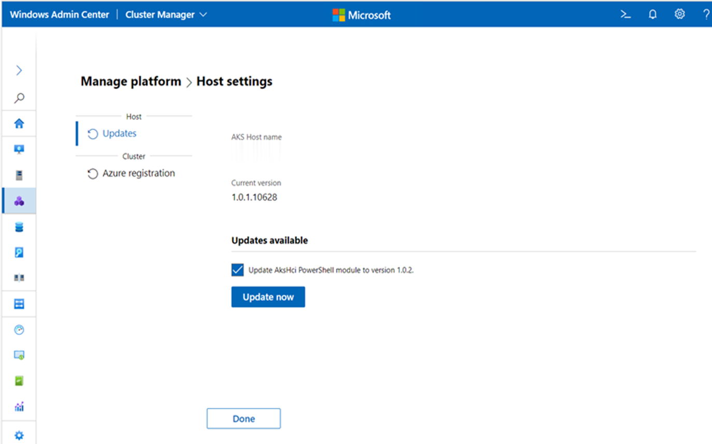

# Upgrade the Azure Kubernetes Service on Azure Stack HCI and Windows Server host using Windows Admin Center

This article describes how to upgrade the Azure Kubernetes Service (AKS) on Azure Stack HCI and Windows Server core system to the latest version. For information on updating an AKS workload cluster, see [update the Kubernetes version of AKS clusters](./upgrade.md).

> [!Note]  
> Microsoft recommends upgrading your AKS on Azure Stack HCI and Windows Server clusters within 30 days of a new release. If you do not update within this window, you have up to 90 days from your last upgrade before internal certificates and tokens expire. Once expired, the cluster will still be functional, however, you will need to call Microsoft Support to upgrade. Upon rebooting the cluster after the 90-day period, it will continue to remain in a non-functional state. For more information about internal certificates and tokens, visit [Certificates and tokens](certificates-and-tokens.md).

There are several types of updates, which can happen independently from each other and in certain supported combinations:

- Update the AKS on Azure Stack HCI and Windows Server core system to the latest version.
- Update an AKS on Azure Stack HCI and Windows Server workload cluster to a new Kubernetes version.
- Update the container hosts of AKS workload clusters to a newer version of the operating system.
- Combined update of the operating system and Kubernetes version of AKS workload clusters.

All updates are done in a rolling update flow to avoid outages and availability in AKS on Azure Stack HCI. 

When you bring a _new_ node with a newer build into the cluster, resources move from the _old_ node to the _new_ node, and when the resources are successfully moved, the _old_ node is decommissioned and removed from the cluster.

We recommend that you update workload clusters immediately after updating the AKS host to prevent running unsupported container host OS versions or Kubernetes versions in your workload clusters. If your workload clusters are on an old Kubernetes version, they are still supported, but you will not be able to scale your cluster. 

## Update the AKS on Azure Stack HCI and Windows Server host

To update the AKS on Azure Stack HCI and Windows Server host with Windows Admin Center, follow the steps below: 

1. Update your Azure Kubernetes Service extension by navigating to **Settings** > **Extensions** > **Installed Extensions**, and then click **Update**. The latest available Azure Kubernetes Service extension version is 1.82.0. You do not need to complete this step if you have enabled auto-update for your extensions. However, make sure that you have version 1.82.0 of the AKS extension installed before proceeding to the next step.

2. On the **Host settings** page, select **Update AksHci PowerShell module to version x.x.x** under **Updates available**, and then click **Update now**.
   
   
   
4. You can now go back to the Windows Admin Center **Connections** page and connect to your Azure Stack HCI or Windows Server cluster.
5. Select the **Azure Kubernetes Service** tool from the **Tools** list. When the tool loads, you will see with the **Overview** page.
6. Select **Updates** from the page list on the left side of the tool, and then select **Update now** to upgrade your AKS host.

> [!NOTE]
> - The update process may stall if you navigate away from the update window when updating AKS on Azure Stack HCI and Windows Server.
> - During the update process, if you receive an error that says _Could not install updates_, the current deployment cannot update to the latest version. To work around this error, run `Get-AksHciUpdates` in PowerShell and review the recommendations provided in the output.

## Next steps
[Update Kubernetes version of your workload clusters](./upgrade-kubernetes.md)
