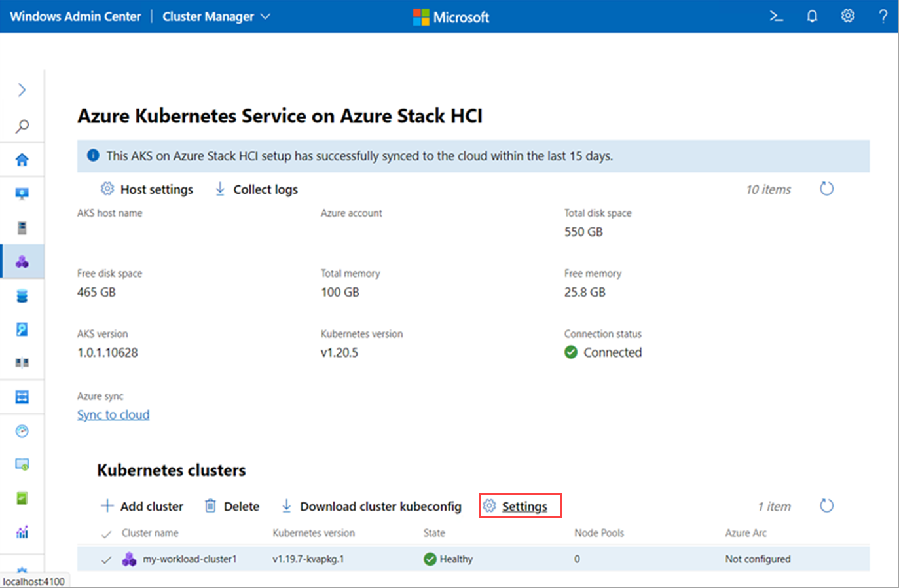
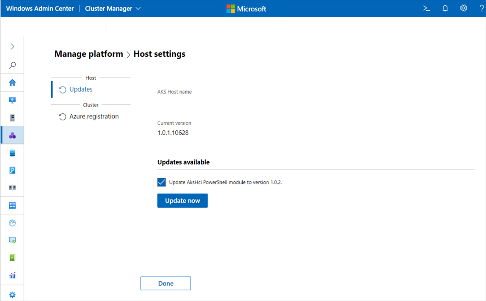

# Upgrade the Kubernetes version of a workload cluster using Windows Admin Center

This article describes how to upgrade an AKS on Azure Stack HCI and Windows Server workload cluster to a new Kubernetes version. We recommend that you [update the AKS hosts](update-akshci-host-windows-admin-center.md) to a new version of the operating system before updating the Kubernetes version.

> [!NOTE]
> You can also use PowerShell to [upgrade AKS workload clusters](upgrade.md).

We recommend updating an AKS workload cluster on Azure Stack HCI at least once every 60 days. New updates are available every 30 days. All updates are done in a rolling update flow to avoid outages in workload availability. 

When you bring a _new_ node with a newer build into the cluster, resources move from the _old_ node to the _new_ node, and when the resources are successfully moved, the _old_ node is decommissioned and removed from the cluster.

## Upgrade the Kubernetes version

To upgrade the Kubernetes version of a workload cluster with Windows Admin Center, follow these steps: 

1. On the Windows Admin Center **Connections** page, connect to your management cluster.
2. Select **Azure Kubernetes Service** from the **Tools** list. When the tool loads, you will see the **Overview** page.
3. Select the workload cluster you wish to upgrade.
4. Select **Settings** under Kubernetes clusters to navigate to the **Settings** page. 
   
   
   
5. Select **Update now** to upgrade your workload cluster’s Kubernetes version. 
   
   

The following update scenarios are not supported in Windows Admin Center, however, you can [use PowerShell](upgrade.md) to run these operations: 

- Windows Admin Center does not support skipping a patch update. You can only update a workload cluster to the next available patch version even when a minor update is available.  
- Windows Admin Center does not support upgrading the OS image of the Kubernetes cluster without updating the Kubernetes version.

## Next steps

In this article, you learned how to upgrade AKS workload clusters on Azure Stack HCI. Next, you can:
- [Deploy a Linux applications on a Kubernetes cluster](./deploy-linux-application.md).
- [Deploy a Windows Server application on a Kubernetes cluster](./deploy-windows-application.md).
