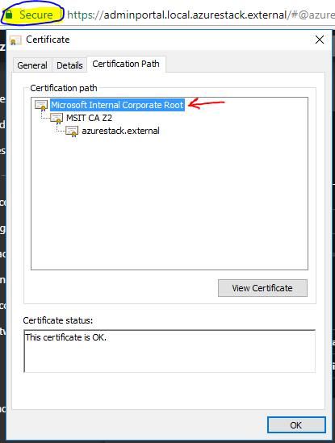

# Setting up certificates for Azure CLI on Azure Stack Hub or Azure Stack Development Kit

Follow the steps in this article to set up the Azure Command-Line Interface (CLI) to manage Azure Stack Development Kit (ASDK) resources from Linux, Mac, and Windows client platforms. You can also follow these steps if you are using an integrated system Azure Stack Hub in a disconnected environment or if your certificates are not issued by a CA in the trusted roots program.

This article addresses getting your certificates and trusting them on your remote management machine. To install the Azure CLI and connect to your environment, see [Install Azure CLI on Azure Stack Hub](../user/azure-stack-version-profiles-azurecli2.md).

## Prepare for Azure CLI

You need the CA root certificate for Azure Stack Hub to use Azure CLI on your development machine. You use the certificate to manage resources through the CLI.

 - **The Azure Stack Hub CA root certificate** is required if you're using the CLI from a workstation outside the the Azure Stack Hub environment. 

 - **The virtual machine aliases endpoint** provides an alias, like "UbuntuLTS" or "Win2012Datacenter." This alias references an image publisher, offer, SKU, and version as a single parameter when deploying VMs.  

The following sections describe how to get these values.

## Export the Azure Stack Hub CA root certificate

Export the CA root certificate. To export the ASDK root certificate in PEM format:

1. Get the name of your Azure Stack Hub Root Cert:
    1. Sign in to the Azure Stack Hub User or Azure Stack Hub Administrator portal.
    2. Select the lock in the browser address bar.
    3. In the pop-up window, select **Connection is secure**.
    4. In the Certificate window, select the **Certification Path** tab.
    5. Note down the name of your Azure Stack Hub Root Cert, for example, `*.<locale>.<FQDN>`

    

2. [Create a Windows VM on Azure Stack Hub](../user/azure-stack-quick-windows-portal.md).

3. Sign in to the VM, open an elevated PowerShell prompt, and then run the following script:

    ```powershell  
      $label = "*.<locale>.<FQDN> from step 1"
      Write-Host "Getting certificate from the current user trusted store with subject CN=$label"
      $root = Get-ChildItem Cert:\CurrentUser\Root | Where-Object Subject -eq "CN=$label" | select -First 1
      if (-not $root)
      {
          Write-Error "Certificate with subject CN=$label not found"
          return
      }

    Write-Host "Exporting certificate"
    Export-Certificate -Type CERT -FilePath root.cer -Cert $root

    Write-Host "Converting certificate to PEM format"
    certutil -encode root.cer root.pem
    ```

4. Copy the certificate to your local machine.

## Set up the virtual machine alias endpoint

You can set up a publicly accessible endpoint that hosts a VM alias file. The VM alias file is a JSON file that provides a common name for an image. You use the name when you deploy a VM as an Azure CLI parameter.

1. If you publish a custom image, make note of the publisher, offer, SKU, and version information that you specified during publishing. If it's an image from the marketplace, you can view the information by using the ```Get-AzureVMImage``` cmdlet.  

2. Download the [sample file](https://raw.githubusercontent.com/Azure/azure-rest-api-specs/master/arm-compute/quickstart-templates/aliases.json) from GitHub.

3. Create a storage account in Azure Stack Hub. When that's done, create a blob container. Set the access policy to "public."  

4. Upload the JSON file to the new container. When that's done, you can view the URL of the blob. Select the blob name and then selecting the URL from the blob properties.


## Trust the certificate

To use Azure CLI with the ASDK, you must trust the CA root certificate on your remote machine.

### [Windows](#tab/win)

1. Find the certificate location on your machine. The location may vary depending on where you've installed Python. 

2. To find the location, open a CMD prompt or an elevated PowerShell prompt and type: `az --version`. The version and python location appears in the prompt.

    ```powershell
    azure-cli                         2.30.0

    core                              2.30.0
    telemetry                          1.0.6

    Python location 'C:\Program Files (x86)\Microsoft SDKs\Azure\CLI2\python.exe'
    Extensions directory 'C:\Users\username\.azure\cliextensions'

    Python (Windows) 3.8.9 (tags/v3.8.9:a743f81, Apr  6 2021, 13:22:56) [MSC v.1928 32 bit (Intel)]

    Legal docs and information: aka.ms/AzureCliLegal

    Your CLI is up-to-date.

    Please let us know how we are doing: https://aka.ms/azureclihats
    and let us know if you're interested in trying out our newest features: https://aka.ms/CLIUXstudy
    ```

3. Change to the directory where Azure CLI has installed the Python. For example, using the location in step 2, `cd "C:\Program Files (x86)\Microsoft SDKs\Azure\CLI2\`.
4. Type the following command:

    ```powershell  
    .\python -c "import certifi; print(certifi.where())"
    ```

    This will return the path of the certificate location on your machine. Your particular path depends on your OS and the version of Python that you've installed. For example:

    ```powershell
    C:\Program Files (x86)\Microsoft SDKs\Azure\CLI2\lib\site-packages\certifi\cacert.pem
    ```

    Make a note of the certificate location. You will use the path in the next step.

2. Trust the Azure Stack Hub CA root certificate by appending it to the existing Python certificate.

    ```powershell
    $pemFile = "<Fully qualified path to the PEM certificate exported from `
    your Azure Stack Hub and saved. For example: C:\Users\user1\Downloads\root.pem."
    $pythonCertStore = <result from step 4>

    $root = New-Object System.Security.Cryptography.X509Certificates.X509Certificate2
    $root.Import($pemFile)

    Write-Host "Extracting required information from the cert file"
    $md5Hash    = (Get-FileHash -Path $pemFile -Algorithm MD5).Hash.ToLower()
    $sha1Hash   = (Get-FileHash -Path $pemFile -Algorithm SHA1).Hash.ToLower()
    $sha256Hash = (Get-FileHash -Path $pemFile -Algorithm SHA256).Hash.ToLower()

    $issuerEntry  = [string]::Format("# Issuer: {0}", $root.Issuer)
    $subjectEntry = [string]::Format("# Subject: {0}", $root.Subject)
    $labelEntry   = [string]::Format("# Label: {0}", $root.Subject.Split('=')[-1])
    $serialEntry  = [string]::Format("# Serial: {0}", $root.GetSerialNumberString().ToLower())
    $md5Entry     = [string]::Format("# MD5 Fingerprint: {0}", $md5Hash)
    $sha1Entry    = [string]::Format("# SHA1 Fingerprint: {0}", $sha1Hash)
    $sha256Entry  = [string]::Format("# SHA256 Fingerprint: {0}", $sha256Hash)
    $certText = (Get-Content -Path $pemFile -Raw).ToString().Replace("`r`n","`n")

    $rootCertEntry = "`n" + $issuerEntry + "`n" + $subjectEntry + "`n" + $labelEntry + "`n" + `
    $serialEntry + "`n" + $md5Entry + "`n" + $sha1Entry + "`n" + $sha256Entry + "`n" + $certText

    Write-Host "Adding the certificate content to Python Cert store"
    Add-Content $pythonCertStore $rootCertEntry

    Write-Host "Python Cert store was updated to allow the Azure Stack Hub CA root certificate"
    ```

For instructions on installing and connecting with Azure CLI see [Install Azure CLI on Azure Stack Hub](../user/azure-stack-version-profiles-azurecli2.md).

### [Linux](#tab/lin)

When setting up CLI, trust the Azure Stack Hub CA root certificate by appending it to the existing Python certificate.

1. Find the certificate location on your machine. The location may vary depending on where you've installed Python. You need to have pip and the certifi module installed. Use the following Python command from the bash prompt:

    ```bash  
    az --version
    ```

    Make a note of the certificate location. For example, `~/lib/python3.5/site-packages/certifi/cacert.pem`. Your specific path depends on your operating system and the version of Python that you've installed.

2. Run the following bash command with the path to your certificate.

   - For a remote Linux machine:

     ```bash  
     sudo cat PATH_TO_PEM_FILE >> ~/<yourpath>/cacert.pem
     ```

   - For a Linux machine within the Azure Stack Hub environment:

     ```bash  
     sudo cat /var/lib/waagent/Certificates.pem >> ~/<yourpath>/cacert.pem
     ```

For instructions on Installing and connecting with Azure CLI see [Install Azure CLI on Azure Stack Hub](../user/azure-stack-version-profiles-azurecli2.md).

---

## Next steps

[Install Azure CLI on Azure Stack Hub](../user/azure-stack-version-profiles-azurecli2.md)