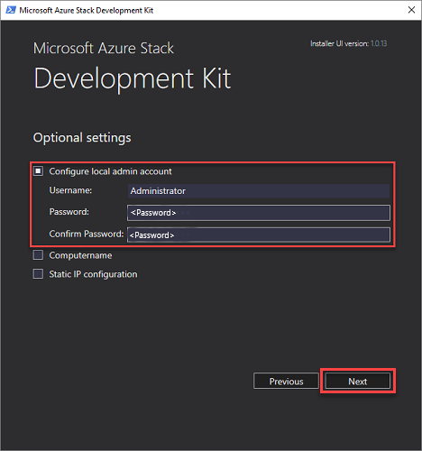
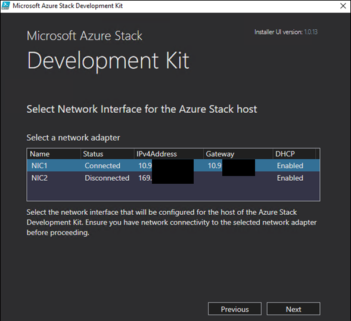
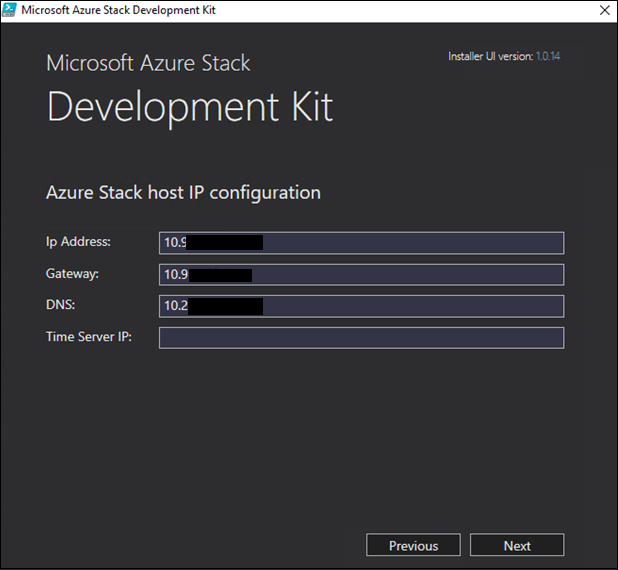

# Prepare the ASDK host computer
Before you can install the Azure Stack Development Kit (ASDK) on the host computer, the ASDK host must be prepared for installation. When the host has been prepared, it will boot from the CloudBuilder.vhdx virtual machine (VM) hard drive to begin ASDK deployment.

## Prepare the development kit host computer
Before you can install the ASDK on the host computer, the ASDK host computer environment must be prepared. To prepare that environment, follow these steps:

1. Sign in as a local admin to your ASDK host computer.
2. Ensure that the CloudBuilder.vhdx file has been moved to the root of the C:\ drive (`C:\CloudBuilder.vhdx`).
3. Run the following script to download the ASDK installer file (asdk-installer.ps1) from the [Azure Stack GitHub tools repository](https://github.com/Azure/AzureStack-Tools) to the **C:\AzureStack_Installer** folder on your ASDK host computer:

   > [!IMPORTANT]
   > Be sure to download the asdk-installer.ps1 file each time you install the ASDK. Frequent changes are made to this script and the most current version should be used for each ASDK deployment. Older versions of the script might not work with the most current release.

   ```powershell
   # Variables
   $Uri = 'https://raw.githubusercontent.com/Azure/AzureStack-Tools/master/Deployment/asdk-installer.ps1'
   $LocalPath = 'C:\AzureStack_Installer'
   # Create folder
   New-Item $LocalPath -Type directory
   # Enforce usage of TLSv1.2 to download from GitHub
   [Net.ServicePointManager]::SecurityProtocol = [Net.SecurityProtocolType]::Tls12
   # Download file
   Invoke-WebRequest $uri -OutFile ($LocalPath + '\' + 'asdk-installer.ps1')
   ```

4. From an elevated PowerShell console, start the **C:\AzureStack_Installer\asdk-installer.ps1** script, and then click **Prepare Environment**.

     

5. On the **Select Cloudbuilder vhdx** page of the installer, browse to and select the **cloudbuilder.vhdx** file that you downloaded and extracted in [the previous steps](asdk-download.md). On this page, you can also enable the **Add drivers** check box if you need to add additional drivers to the ASDK kit host computer. Click **Next**.  

    

6. On the **Optional settings** page, provide the local admin account info for the ASDK host computer and then click **Next**.

    If you don't provide the local admin credentials in this step, you'll need direct or KVM access to the host after the computer restarts as part of setting up the ASDK.

   

    You can also provide values for the following optional settings:
    - **Computername**: This option sets the name for the ASDK host. The name must comply with FQDN requirements and must be 15 characters or less in length. The default is a random computer name generated by Windows.

        - Select a network adapter. Make sure you can connect to the adapter before you click **Next**.

            

        - Make sure that the displayed **IP address**, **Gateway**, and **DNS** values are correct, provide a valid **Time server IP** address, and then click **Next**.

            >[!TIP]
            >To find a time server IP address, visit [ntppool.org](https://www.ntppool.org/) or ping time.windows.com. 

            

7. Click **Next** to start the preparation process.
8. When the preparation indicates **Completed**, click **Next**.

    

9. Click **Reboot now** to boot the ASDK host computer into the cloudbuilder.vhdx and [continue the deployment process](asdk-install.md).

    


## Next steps
[Install the ASDK](asdk-install.md)
