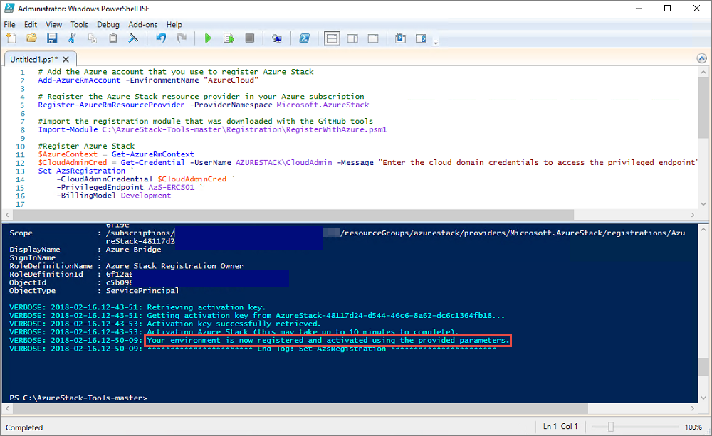
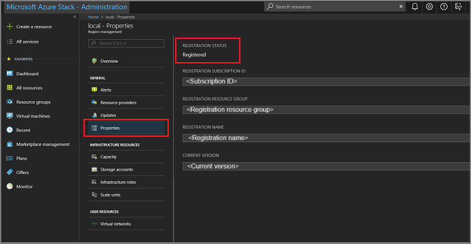

# Register the ASDK with Azure

You can register your Azure Stack Development Kit (ASDK) installation with Azure to download marketplace items from Azure and to set up commerce data reporting back to Microsoft. Registration is required to support full Azure Stack Hub functionality, including marketplace syndication. Registration is required to enable you to test important Azure Stack Hub functionality like marketplace syndication and usage reporting. After you register Azure Stack Hub, usage is reported to Azure commerce. You can see it under the subscription you used for registration. However, ASDK users aren't charged for any usage they report.

If you don't register your ASDK, you might see an **Activation Required** warning alert that advises you to register your ASDK. This behavior is expected.

## Prerequisites

Before using these instructions to register the ASDK with Azure, ensure that you've installed the Azure Stack Hub PowerShell and downloaded the Azure Stack Hub tools as described in the [post-deployment configuration](asdk-post-deploy.md) article.

The PowerShell language mode must also be set to **FullLanguage** on the computer used to register the ASDK with Azure. To verify that the current language mode is set to full, open an elevated PowerShell window and run the following PowerShell commands:

```powershell  
$ExecutionContext.SessionState.LanguageMode
```

Ensure the output returns **FullLanguage**. If any other language mode is returned, registration needs to be run on another computer or the language mode set to **FullLanguage** before continuing.

The Microsoft Entra account used for registration needs to have access to the Azure subscription and have permissions to create identity apps and service principals in the directory associated with that subscription. We recommend you register Azure Stack Hub with Azure by [creating a service account to use for registration](../operator/azure-stack-registration-role.md) rather than using global admin credentials.

## Register the ASDK

Follow these steps to register the ASDK with Azure.

> [!NOTE]
> All these steps must be run from a computer that has access to the privileged endpoint. For the ASDK, that's the ASDK host computer.


### [Az modules](#tab/az1)

1. Open an elevated PowerShell prompt.  

2. Run the following PowerShell cmdlets to register your ASDK installation with Azure. Sign in to both your Azure billing Subscription ID and the local ASDK installation. If you don't have an Azure billing subscription ID yet, you can [create a free Azure account here](https://azure.microsoft.com/free/?b=17.06). Registering Azure Stack Hub incurs no cost on your Azure subscription.<br><br>Set a unique name for the registration when you run the **Set-AzsRegistration** cmdlet. The **RegistrationName** parameter has a default value of **AzureStackRegistration**. However, if you use the same name on more than one instance of Azure Stack Hub, the script will fail.

    ```powershell  
    # Add the Azure cloud subscription environment name. 
    # Supported environment names are AzureCloud, AzureChinaCloud, or AzureUSGovernment depending which Azure subscription you're using.
    Connect-AzAccount -EnvironmentName "<environment name>"
    
    # Register the Azure Stack Hub resource provider in your Azure subscription
    Register-AzResourceProvider -ProviderNamespace Microsoft.AzureStack
    
    # Import the registration module that was downloaded with the GitHub tools
    Import-Module C:\AzureStack-Tools-az\Registration\RegisterWithAzure.psm1
    
    # If you have multiple subscriptions, run the following command to select the one you want to use:
    # Get-AzSubscription -SubscriptionID "<subscription ID>" | Select-AzSubscription
    
    # Register Azure Stack Hub
    $AzureContext = Get-AzContext
    $CloudAdminCred = Get-Credential -UserName AZURESTACK\CloudAdmin -Message "Enter the credentials to access the privileged endpoint."
    $RegistrationName = "<unique-registration-name>"
    Set-AzsRegistration `
    -PrivilegedEndpointCredential $CloudAdminCred `
    -PrivilegedEndpoint AzS-ERCS01 `
    -BillingModel Development `
    -RegistrationName $RegistrationName `
    -UsageReportingEnabled:$true
    ```

3. When the script completes, you should see this message: **Your environment is now registered and activated using the provided parameters.**

### [AzureRM modules](#tab/azurerm1)

1. Open an elevated PowerShell prompt.  

2. Run the following PowerShell commands to register your ASDK installation with Azure. Sign in to both your Azure billing Subscription ID and the local ASDK installation. If you don't have an Azure billing subscription ID yet, you can [create a free Azure account here](https://azure.microsoft.com/free/?b=17.06). Registering Azure Stack Hub incurs no cost on your Azure subscription.<br><br>Set a unique name for the registration when you run the **Set-AzsRegistration** cmdlet. The **RegistrationName** parameter has a default value of **AzureStackRegistration**. However, if you use the same name on more than one instance of Azure Stack Hub, the script will fail.

    ```powershell  
    # Add the Azure cloud subscription environment name. 
    # Supported environment names are AzureCloud, AzureChinaCloud, or AzureUSGovernment depending which Azure subscription you're using.
    Add-AzureRmAccount -EnvironmentName "<environment name>"
    
    # Register the Azure Stack Hub resource provider in your Azure subscription
    Register-AzureRmResourceProvider -ProviderNamespace Microsoft.AzureStack
    
    # Import the registration module that was downloaded with the GitHub tools
    Import-Module C:\AzureStack-Tools-master\Registration\RegisterWithAzure.psm1
    
    # If you have multiple subscriptions, run the following command to select the one you want to use:
    # Get-AzureRmSubscription -SubscriptionID "<subscription ID>" | Select-AzureRmSubscription
    
    # Register Azure Stack Hub
    $AzureContext = Get-AzureRmContext
    $CloudAdminCred = Get-Credential -UserName AZURESTACK\CloudAdmin -Message "Enter the credentials to access the privileged endpoint."
    $RegistrationName = "<unique-registration-name>"
    Set-AzsRegistration  `
    -PrivilegedEndpointCredential $CloudAdminCred `
    -PrivilegedEndpoint AzS-ERCS01 `
    -BillingModel Development `
    -RegistrationName $RegistrationName `
    -UsageReportingEnabled:$true
    ```

3. When the script completes, you should see this message: **Your environment is now registered and activated using the provided parameters.**

---



## Register in disconnected environments

If you're registering Azure Stack Hub in a disconnected environment (with no internet connectivity), you need to get a registration token from the Azure Stack Hub environment and then use that token on a computer that can connect to Azure to register and create an activation resource for your ASDK environment.

 > [!IMPORTANT]
 > Before using these instructions to register Azure Stack Hub, ensure that you've installed PowerShell for Azure Stack Hub and downloaded the Azure Stack Hub tools as described in the [post-deployment configuration](asdk-post-deploy.md) article on both the ASDK host computer and the computer with internet access used to connect to Azure and register.

### Get a registration token from the Azure Stack Hub environment

On the ASDK host computer, start PowerShell as an admin and navigate to the **Registration** folder in the **AzureStack-Tools-az** directory created when you downloaded the Azure Stack Hub tools. Use the following PowerShell commands to import the **RegisterWithAzure.psm1** module and then use the **Get-AzsRegistrationToken** cmdlet to get the registration token:  

### [Az modules](#tab/az2)

   ```powershell  
   # Import the registration module that was downloaded with the GitHub tools
   Import-Module C:\AzureStack-Tools-az\Registration\RegisterWithAzure.psm1

   # Create registration token
   $CloudAdminCred = Get-Credential -UserName AZURESTACK\CloudAdmin -Message "Enter the credentials to access the privileged endpoint."
   # File path to save the token. This example saves the file as C:\RegistrationToken.txt.
   $FilePathForRegistrationToken = "$env:SystemDrive\RegistrationToken.txt"
   $RegistrationToken = Get-AzsRegistrationToken -PrivilegedEndpointCredential $CloudAdminCred `
   -UsageReportingEnabled:$false `
   -PrivilegedEndpoint AzS-ERCS01 `
   -BillingModel Development `
   -MarketplaceSyndicationEnabled:$false `
   -TokenOutputFilePath $FilePathForRegistrationToken
   ```

### [AzureRM modules](#tab/azurerm2)

  ```powershell  
  # Import the registration module that was downloaded with the GitHub tools
  Import-Module C:\AzureStack-Tools-master\Registration\RegisterWithAzure.psm1

  # Create registration token
  $CloudAdminCred = Get-Credential -UserName AZURESTACK\CloudAdmin -Message "Enter the credentials to access the privileged endpoint."
  # File path to save the token. This example saves the file as C:\RegistrationToken.txt.
  $FilePathForRegistrationToken = "$env:SystemDrive\RegistrationToken.txt"
  $RegistrationToken = Get-AzsRegistrationToken -PrivilegedEndpointCredential $CloudAdminCred `
  -UsageReportingEnabled:$false `
  -PrivilegedEndpoint AzS-ERCS01 `
  -BillingModel Development `
  -MarketplaceSyndicationEnabled:$false `
  -TokenOutputFilePath $FilePathForRegistrationToken
  ```

---

Save this registration token for use on the internet-connected computer. You can copy the file or the text from the file created by the `$FilePathForRegistrationToken` parameter.

### Connect to Azure and register

On the internet-connected computer, use the following PowerShell commands to import the **RegisterWithAzure.psm1** module and then use the **Register-AzsEnvironment** cmdlet to register with Azure using the registration token you just created and a unique registration name:  

### [Az modules](#tab/az3)

  ```powershell  
  # Add the Azure cloud subscription environment name. 
  # Supported environment names are AzureCloud, AzureChinaCloud or AzureUSGovernment depending which Azure subscription you are using.
  Connect-AzAccount -EnvironmentName "<environment name>"

  # If you have multiple subscriptions, run the following command to select the one you want to use:
  # Get-AzSubscription -SubscriptionID "<subscription ID>" | Select-AzSubscription

  # Register the Azure Stack Hub resource provider in your Azure subscription
  Register-AzResourceProvider -ProviderNamespace Microsoft.AzureStack

  # Import the registration module that was downloaded with the GitHub tools
  Import-Module C:\AzureStack-Tools-az\Registration\RegisterWithAzure.psm1

  # Register with Azure
  # This example uses the C:\RegistrationToken.txt file.
  $registrationToken = Get-Content -Path "$env:SystemDrive\RegistrationToken.txt"
  $RegistrationName = "<unique-registration-name>"
  Register-AzsEnvironment -RegistrationToken $registrationToken `
  -RegistrationName $RegistrationName
  ```


### [AzureRM modules](#tab/azurerm3)

  ```powershell  
  # Add the Azure cloud subscription environment name. 
  # Supported environment names are AzureCloud, AzureChinaCloud or AzureUSGovernment depending which Azure subscription you are using.
  Add-AzureRMAccount -EnvironmentName "<environment name>"

  # If you have multiple subscriptions, run the following command to select the one you want to use:
  # Get-AzureRMSubscription -SubscriptionID "<subscription ID>" | Select-AzureRMSubscription

  # Register the Azure Stack Hub resource provider in your Azure subscription
  Register-AzureRMResourceProvider -ProviderNamespace Microsoft.AzureStack

  # Import the registration module that was downloaded with the GitHub tools
  Import-Module C:\AzureStack-Tools-master\Registration\RegisterWithAzure.psm1

  # Register with Azure
  # This example uses the C:\RegistrationToken.txt file.
  $registrationToken = Get-Content -Path "$env:SystemDrive\RegistrationToken.txt"
  $RegistrationName = "<unique-registration-name>"
  Register-AzsEnvironment -RegistrationToken $registrationToken `
  -RegistrationName $RegistrationName
  ```

---

Alternatively, you can use the **Get-Content** cmdlet to point to a file that contains your registration token:

### [Az modules](#tab/az4)

  ```powershell  
  # Add the Azure cloud subscription environment name. 
  # Supported environment names are AzureCloud, AzureChinaCloud or AzureUSGovernment depending which Azure subscription you are using.
  Connect-AzAccount -EnvironmentName "<environment name>"

  # If you have multiple subscriptions, run the following command to select the one you want to use:
  # Get-AzSubscription -SubscriptionID "<subscription ID>" | Select-AzSubscription

  # Register the Azure Stack Hub resource provider in your Azure subscription
  Register-AzResourceProvider -ProviderNamespace Microsoft.AzureStack

  # Import the registration module that was downloaded with the GitHub tools
  Import-Module C:\AzureStack-Tools-az\Registration\RegisterWithAzure.psm1

  # Register with Azure 
  # This example uses the C:\RegistrationToken.txt file.
  $registrationToken = Get-Content -Path "$env:SystemDrive\RegistrationToken.txt"
  Register-AzsEnvironment -RegistrationToken $registrationToken `
  -RegistrationName $RegistrationName
  ```

### [AzureRM modules](#tab/azurerm4)

  ```powershell  
  # Add the Azure cloud subscription environment name. 
  # Supported environment names are AzureCloud, AzureChinaCloud or AzureUSGovernment depending which Azure subscription you are using.
  Add-AzureRMAccount -EnvironmentName "<environment name>"

  # If you have multiple subscriptions, run the following command to select the one you want to use:
  # Get-AzureRMSubscription -SubscriptionID "<subscription ID>" | Select-AzureRMSubscription

  # Register the Azure Stack Hub resource provider in your Azure subscription
  Register-AzureRMResourceProvider -ProviderNamespace Microsoft.AzureStack

  # Import the registration module that was downloaded with the GitHub tools
  Import-Module C:\AzureStack-Tools-master\Registration\RegisterWithAzure.psm1

  # Register with Azure 
  # This example uses the C:\RegistrationToken.txt file.
  $registrationToken = Get-Content -Path "$env:SystemDrive\RegistrationToken.txt"
  Register-AzsEnvironment -RegistrationToken $registrationToken `
  -RegistrationName $RegistrationName
  ```

---

When registration is complete, you should see a message similar to: **Your Azure Stack Hub environment is now registered with Azure.**

> [!IMPORTANT]
> Do **not** close the PowerShell window.

Save the registration token and registration resource name for future reference.

### Retrieve an activation key from the Azure registration resource

Still using the internet-connected computer, **and the same PowerShell console window**, retrieve an activation key from the registration resource created when you registered with Azure.

To get the activation key, run the following PowerShell commands. Use the same unique registration name value you provided when registering with Azure in the previous step:  

### [Az modules](#tab/az5)

  ```Powershell
  $RegistrationResourceName = "<unique-registration-name>"
  # File path to save the activation key. This example saves the file as C:\ActivationKey.txt.
  $KeyOutputFilePath = "$env:SystemDrive\ActivationKey.txt"
  $ActivationKey = Get-AzsActivationKey -RegistrationName $RegistrationResourceName `
  -KeyOutputFilePath $KeyOutputFilePath
  ```


### [AzureRM modules](#tab/azurerm5)

  ```Powershell
  $RegistrationResourceName = "<unique-registration-name>"
  # File path to save the activation key. This example saves the file as C:\ActivationKey.txt.
  $KeyOutputFilePath = "$env:SystemDrive\ActivationKey.txt"
  $ActivationKey = Get-AzsActivationKey -RegistrationName $RegistrationResourceName `
  -KeyOutputFilePath $KeyOutputFilePath
  ```

---


### Create an activation resource in Azure Stack Hub

Return to the Azure Stack Hub environment with the file or text from the activation key created from **Get-AzsActivationKey**. Run the following PowerShell commands to create an activation resource in Azure Stack Hub using that activation key:   

### [Az modules](#tab/az6)

  ```Powershell
  # Import the registration module that was downloaded with the GitHub tools
  Import-Module C:\AzureStack-Tools-az\Registration\RegisterWithAzure.psm1
  
  $CloudAdminCred = Get-Credential -UserName AZURESTACK\CloudAdmin -Message "Enter the credentials to access the privileged endpoint."
  $ActivationKey = "<activation key>"
  New-AzsActivationResource -PrivilegedEndpointCredential $CloudAdminCred `
  -PrivilegedEndpoint AzS-ERCS01 `
  -ActivationKey $ActivationKey
  ```


### [AzureRM modules](#tab/azurerm6)

  ```Powershell
  # Import the registration module that was downloaded with the GitHub tools
  Import-Module C:\AzureStack-Tools-master\Registration\RegisterWithAzure.psm1
  
  $CloudAdminCred = Get-Credential -UserName AZURESTACK\CloudAdmin -Message "Enter the credentials to access the privileged endpoint."
  $ActivationKey = "<activation key>"
  New-AzsActivationResource -PrivilegedEndpointCredential $CloudAdminCred `
  -PrivilegedEndpoint AzS-ERCS01 `
  -ActivationKey $ActivationKey
  ```

---


Alternatively, you can use the **Get-Content** cmdlet to point to a file that contains your registration token:

### [Az modules](#tab/az7)

  ```Powershell
  # Import the registration module that was downloaded with the GitHub tools
  Import-Module C:\AzureStack-Tools-az\Registration\RegisterWithAzure.psm1

  $CloudAdminCred = Get-Credential -UserName AZURESTACK\CloudAdmin -Message "Enter the credentials to access the privileged endpoint."
  # This example uses the C:\ActivationKey.txt file.
  $ActivationKey = Get-Content -Path "$env:SystemDrive\Activationkey.txt"
  New-AzsActivationResource -PrivilegedEndpointCredential $CloudAdminCred `
  -PrivilegedEndpoint AzS-ERCS01 `
  -ActivationKey $ActivationKey
  ```


### [AzureRM modules](#tab/azurerm7)

  ```Powershell
  # Import the registration module that was downloaded with the GitHub tools
  Import-Module C:\AzureStack-Tools-master\Registration\RegisterWithAzure.psm1

  $CloudAdminCred = Get-Credential -UserName AZURESTACK\CloudAdmin -Message "Enter the credentials to access the privileged endpoint."
  # This example uses the C:\ActivationKey.txt file.
  $ActivationKey = Get-Content -Path "$env:SystemDrive\Activationkey.txt"
  New-AzsActivationResource -PrivilegedEndpointCredential $CloudAdminCred `
  -PrivilegedEndpoint AzS-ERCS01 `
  -ActivationKey $ActivationKey
  ```

---


When activation is complete, you should see a message similar to: **Your environment has finished the registration and activation process.**

## Verify the registration was successful

You can use the **Region management** tile to verify that the Azure Stack Hub registration was successful. This tile is available on the default dashboard in the administrator portal.

1. Sign in to the Azure Stack Hub administrator portal `https://adminportal.local.azurestack.external`.

2. From the Dashboard, select **Region management**.

    [](media/asdk-register/admin1.png#lightbox)

3. Select **Properties**. This blade shows the status and details of your environment. The status can be **Registered** or **Not registered**. If registered, it also shows the Azure subscription ID that you used to register your Azure Stack Hub, along with the registration resource group and name.

## Move a registration resource
Moving a registration resource between resource groups under the same subscription **is** supported. For more info on moving resources to a new resource group, see [Move resources to new resource group or subscription](/azure/azure-resource-manager/resource-group-move-resources).


## Next steps

- [Add an Azure Stack Hub Marketplace item](../operator/azure-stack-marketplace.md)
