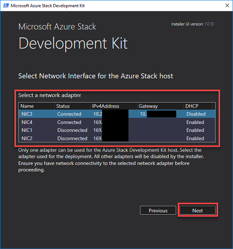
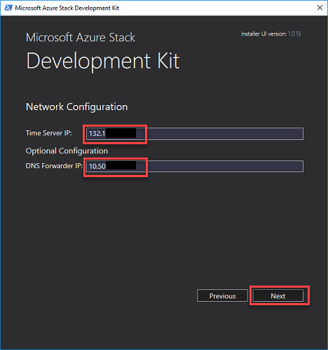
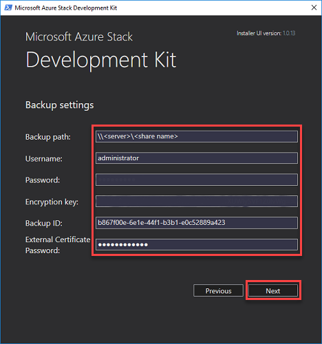

# Use the ASDK to validate an Azure Stack backup
After deploying Azure Stack and provisioning user resources (such as offers, plans, quotas, and subscriptions), you should [enable Azure Stack infrastructure backup](../operator/azure-stack-backup-enable-backup-console.md). Scheduling and running regular infrastructure backups will ensure infrastructure management data isn't lost if there's a catastrophic hardware or service failure.

> [!TIP]
> We recommended that you [run an on-demand backup](../operator/azure-stack-backup-back-up-azure-stack.md) before beginning this procedure to ensure you have a copy of the latest infrastructure data available. Make sure to capture the backup ID after the backup successfully completes. This ID is required during cloud recovery.

Azure Stack infrastructure backups contain important data about your cloud that can be restored during redeployment of Azure Stack. You can use the ASDK to validate these backups without impacting your production cloud. 

Validating backups on ASDK is supported for the following scenarios:

|Scenario|Purpose|
|-----|-----|
|Validate infrastructure backups from an integrated solution.|Short lived validation that the data in the backup is valid.|
|Learn the end-to-end recovery workflow.|Use ASDK to validate the entire backup and restore experience.|
|     |     |

The following scenario **is not** supported when validating backups on the ASDK:

|Scenario|Purpose|
|-----|-----|
|ASDK build to build backup and restore.|Restore backup data from a previous version of the ASDK to a newer version.|
|     |     |


## Cloud recovery deployment
Infrastructure backups from your integrated systems deployment can be validated by performing a cloud recovery deployment of the ASDK. In this type of deployment, specific service data is restored from backup after the ASDK is installed on the host computer.

### <a name="prereqs"></a>Cloud recovery prerequisites
Before starting a cloud recovery deployment of the ASDK, ensure that you have the following info:

**UI installer requirements**

*Current UI installer only supports encryption key*

|Prerequisite|Description|
|-----|-----|
|Backup share path|The UNC file share path of the latest Azure Stack backup that will be used to recover Azure Stack infrastructure info. This local share will be created during the cloud recovery deployment process.|
|Backup ID to restore|The backup ID, in the alphanumeric form of "xxxxxxxx-xxxx-xxxx-xxxx-xxxxxxxxxxxx", that identifies the backup to be restored during cloud recovery.|
|Time server IP|A valid time server IP, such as 132.163.97.2, is required for Azure Stack deployment.|
|External certificate password|The password for the external certificate used by Azure Stack. The CA backup contains external certificates that need to be restored with this password.|
|Backup encryption key|Required if backup settings are configured in with an encryption key, which is deprecated. The installer will support encryption key in backwards compatibility mode for at least 3 releases. Once you update backup settings to use a certificate, refer to the next table for required info.|
|     |     | 

**PowerShell installer requirements**

*Current PowerShell installer supports encryption key or decryption certificate*

|Prerequisite|Description|
|-----|-----|
|Backup share path|The UNC file share path of the latest Azure Stack backup that will be used to recover Azure Stack infrastructure info. This local share will be created during the cloud recovery deployment process.|
|Backup ID to restore|The backup ID, in the alphanumeric form of "xxxxxxxx-xxxx-xxxx-xxxx-xxxxxxxxxxxx", that identifies the backup to be restored during cloud recovery.|
|Time server IP|A valid time server IP, such as 132.163.97.2, is required for Azure Stack deployment.|
|External certificate password|The password for the external certificate used by Azure Stack. The CA backup contains external certificates that need to be restored with this password.|
|Decryption certification password|Optional. Required only if the backup is encrypted using a certificate. The password is for the self-signed certificate's (.pfx) that contains the private key necessary to decrypt backup data.|
|Backup encryption key|Optional. Required if backup settings are still configured with an encryption key. The installer will support encryption key in backwards compatibility mode for at least 3 releases. Once you update backup settings to use a certificate, you must provide the password for the decryption certificate.|
|     |     | 

## Prepare the host computer 
As in a normal ASDK deployment, the ASDK host system environment must be prepared for installation. When the ASDK host computer has been prepared, it will boot from the CloudBuilder.vhdx VM hard drive to begin ASDK deployment.

On the ASDK host computer, download a new cloudbuilder.vhdx corresponding to the same version of Azure Stack that was backed up, and follow the instructions for [preparing the ASDK host computer](asdk-prepare-host.md).

After the host server restarts from the cloudbuilder.vhdx, you must create a file share and copy your backup data into. The file share should be accessible to the account running setup; Administrator in these example PowerShell commands: 

```powershell
$shares = New-Item -Path "c:\" -Name "Shares" -ItemType "directory"
$azsbackupshare = New-Item -Path $shares.FullName -Name "AzSBackups" -ItemType "directory"
New-SmbShare -Path $azsbackupshare.FullName -FullAccess ($env:computername + "\Administrator")  -Name "AzSBackups"
```

Next, copy your latest Azure Stack backup files to the newly created share. Make sure to copy the parent folder of `<BackupID>` folder, which is the timestamp of when the backup was taken. The folder structure within the share should be: `\\<ComputerName>\AzSBackups\MASBackup\<TimeStamp>\<BackupID>\`. 

Finally, copy the decryption certificate (.pfx) to the certificate directory: `C:\CloudDeployment\Setup\BackupDecryptionCert\` and rename the file to `BackupDecryptionCert.pfx`.

## Deploy the ASDK in cloud recovery mode

> [!IMPORTANT]
> 1. The current installer UI only supports encryption key. You can only validate backups from systems that continue to use encryption key. If the backup was encrypted on an integrated system or ASDK using certificate, you must use the PowerShell installer (**InstallAzureStackPOC.ps1**). 
> 2. The PowerShell installer (**InstallAzureStackPOC.ps1**) supports encryption key or certificate.
> 3. ASDK installation supports exactly one network interface card (NIC) for networking. If you have multiple NICs, make sure that only one is enabled (and all others are disabled) before running the deployment script.

### Use the installer UI to deploy the ASDK in recovery mode
The steps in this section show you how to deploy the ASDK using a graphical user interface (GUI) provided by downloading and running the **asdk-installer.ps1** PowerShell script.

> [!NOTE]
> The installer user interface for the ASDK is an open-sourced script based on WCF and PowerShell.

> [!IMPORTANT]
> The current installer UI only supports encryption key.

1. After the host computer successfully boots into the CloudBuilder.vhdx image, sign in using the admin credentials specified when you [prepared the ASDK host computer](asdk-prepare-host.md) for ASDK installation. These credentials should be the same as the ASDK host local admin credentials.
2. Open an elevated PowerShell console and run the **&lt;drive letter>\AzureStack_Installer\asdk-installer.ps1** PowerShell script. The script might now be on a different drive than C:\ in the CloudBuilder.vhdx image. Click **Recover**.

     

3. Enter your Azure AD directory info (optional) and the local admin password for the ASDK host computer on the identity provider and credentials page. Click **Next**.

     

4. Select the network adapter to be used by the ASDK host computer and click **Next**. All other network interfaces will be disabled during ASDK installation. 

     

5. On the Network Configuration page, provide valid time server and DNS forwarder IP addresses. Click **Next**.

     

6. When network interface card properties have been verified, click **Next**. 

     

7. Provide the required info described earlier in [prerequisites section](#prereqs) on the Backup Settings page and the username and password to be used to access the share. Click **Next**: 

    

8. Review the deployment script to be used for deploying the ASDK on the Summary page. Click **Deploy** to begin deployment. 

     


### Use PowerShell to deploy the ASDK in recovery mode

Modify the following PowerShell commands for your environment and run them to deploy the ASDK in cloud recovery mode:

**Use the InstallAzureStackPOC.ps1 script to start cloud recovery with encryption key.**

```powershell
cd C:\CloudDeployment\Setup     
$adminpass = Read-Host -AsSecureString -Prompt "Local Administrator password"
$certPass = Read-Host -AsSecureString -Prompt "Password for the external certificate"
$backupstorecredential = Read-Host -AsSecureString -Prompt "Credential for backup share"
$key = Read-Host -AsSecureString -Prompt "Your backup encryption key"

.\InstallAzureStackPOC.ps1 -AdminPassword $adminpass `
 -BackupStorePath ("\\" + $env:COMPUTERNAME + "\AzSBackups") `
 -BackupEncryptionKeyBase64 $key `
 -BackupStoreCredential $backupstorecredential `
 -BackupId "<Backup ID to restore>" `
 -TimeServer "<Valid time server IP>" -ExternalCertPassword $certPass
```

**Use the InstallAzureStackPOC.ps1 script to start cloud recovery with decryption certificate.**

```powershell
cd C:\CloudDeployment\Setup     
$adminpass = Read-Host -AsSecureString -Prompt "Local Administrator password"
$certPass = Read-Host -AsSecureString -Prompt "Password for the external certificate"
$backupstorecredential = Read-Host -AsSecureString -Prompt "Credential for backup share"
$decryptioncertpassword  = Read-Host -AsSecureString -Prompt "Password for the decryption certificate"

.\InstallAzureStackPOC.ps1 -AdminPassword $adminpass `
 -BackupStorePath ("\\" + $env:COMPUTERNAME + "\AzSBackups") `
 -BackupDecryptionCertPassword $decryptioncertpassword `
 -BackupStoreCredential $backupstorecredential `
 -BackupId "<Backup ID to restore>" `
 -TimeServer "<Valid time server IP>" -ExternalCertPassword $certPass
```

## Complete cloud recovery 
After a successful cloud recovery deployment, you need to complete the restore using the **Restore-AzureStack** cmdlet. 

After logging in as the Azure Stack operator, [install Azure Stack PowerShell](asdk-post-deploy.md#install-azure-stack-powershell) and run the following commands to specify the certificate and password to be used when restoring from backup:

**Recovery mode with certificate file**

> [!NOTE]
> Azure Stack deployment doesn't persist the decryption certificate for security reasons. You'll need to provide the decryption certificate and associated password again.

```powershell
$decryptioncertpassword = Read-Host -AsSecureString -Prompt "Password for the decryption certificate"
Restore-AzsBackup -ResourceId "<BackupID>" `
 -DecryptionCertPath "<path to decryption certificate with file name (.pfx)>" `
 -DecryptionCertPassword $decryptioncertpassword
```

**Recovery mode with encryption key**
```powershell
$decryptioncertpassword = Read-Host -AsSecureString -Prompt "Password for the decryption certificate"
Restore-AzsBackup -ResourceId "<BackupID>"
```

Wait 60 minutes after calling this cmdlet to start verification of backup data on the cloud recovered ASDK.

## Next steps
[Register Azure Stack](asdk-register.md)

