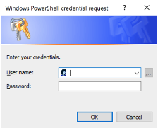

# BitLocker encryption

Out of the box data-at-rest encryption is enabled with the military grade standard XTS AES256.

We recommend you retrieve your BitLocker recovery keys right after the deployment and store them in a secure location outside of the system. Not having the recovery keys during certain support scenarios may result in data loss and require a system restore from a backup image.  

## How to get your BitLocker recovery keys

1. Open a PowerShell session as Admin and use the following command (make sure you add your host IP address.)

```powershell
Invoke-Command -ComputerName <host ip address> -Credential $cred -Authentication Credssp -ScriptBlock { Get-AszRecoveryKeyInfo } | ft ComputerName, PasswordID, RecoveryKey
```

2. Sign in with your Administrator account credentials.



3. See the results of the recovery keys displayed in PowerShell.


## Next steps

- [Azure Stack HCI security considerations](./security.md)
