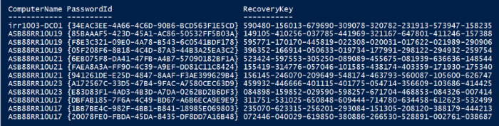

# BitLocker encryption

Out of the box data-at-rest encryption is enabled with the military grade standard XTS AES256.

We recommend you retrieve your BitLocker recovery keys right after the deployment and store them in a secure location outside of the system. Not having the recovery keys during certain support scenarios may result in data loss and require a system restore from a backup image.  

## How to get your BitLocker recovery keys

1. Open a PowerShell session as Admin in one of the cluster nodes and run the following command.

```powershell
Get-AszRecoveryKeyInfo | ft ComputerName, PasswordID, RecoveryKey
```

2. See the results of the recovery keys displayed in PowerShell.



## Next steps

- [Azure Stack HCI security considerations](./security.md)
