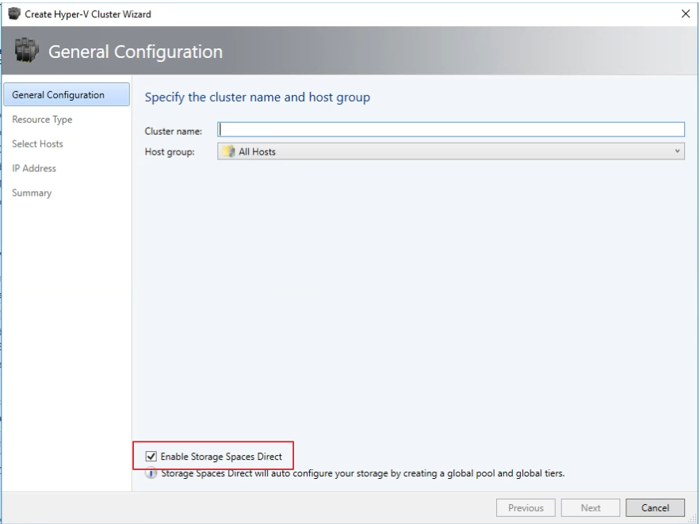
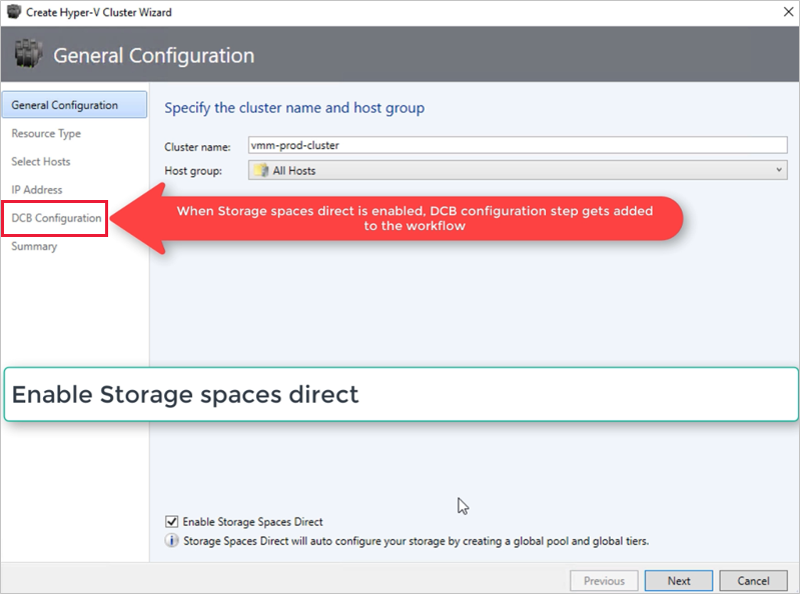
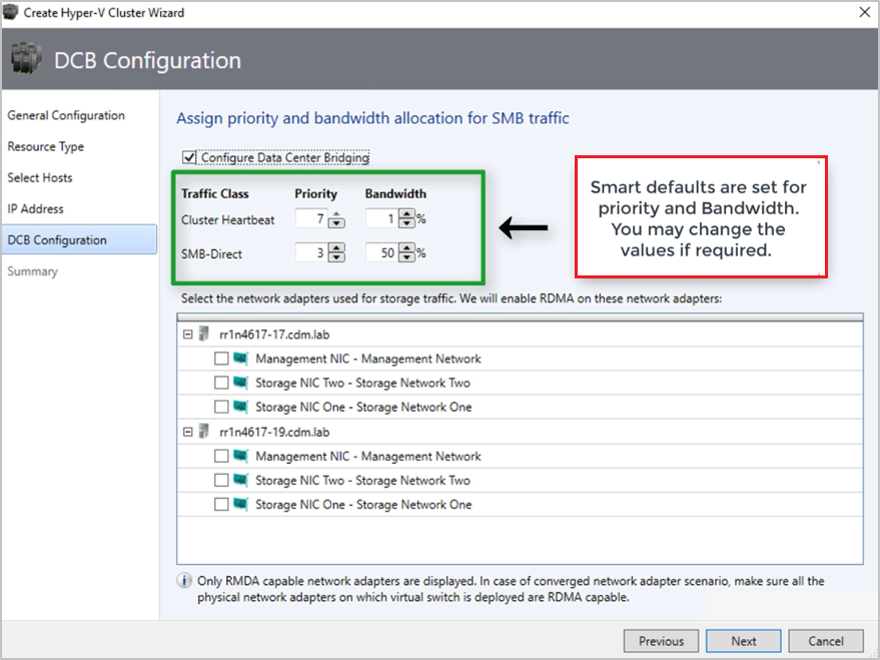
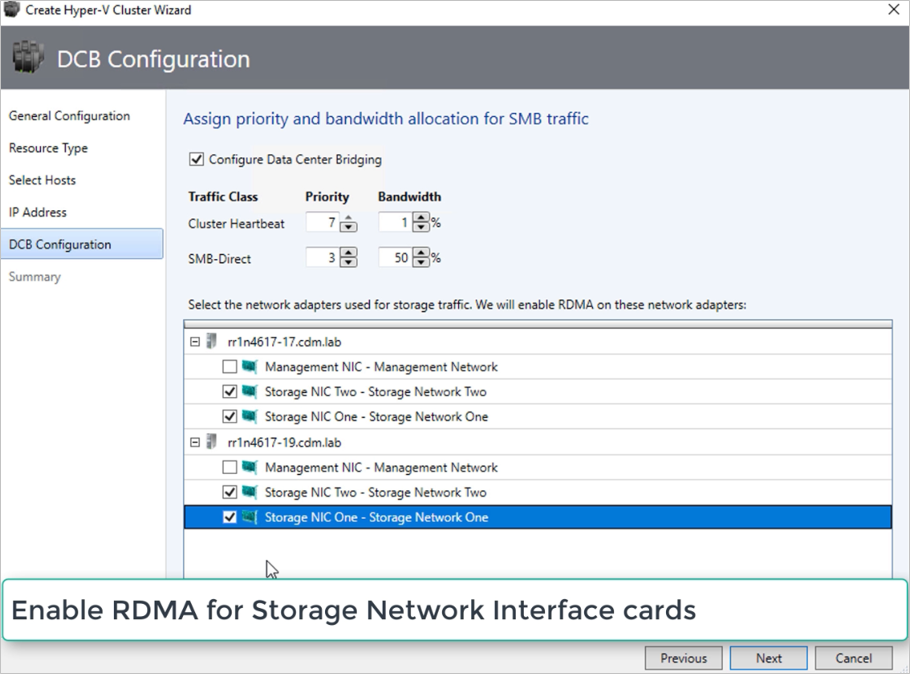
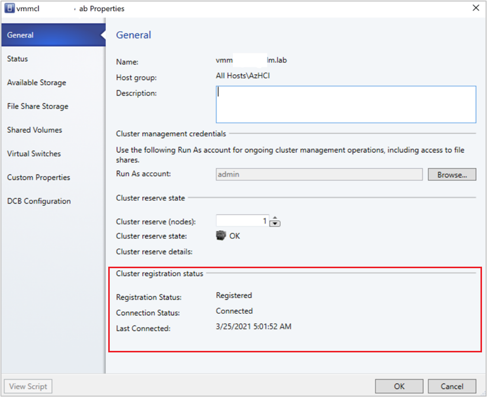
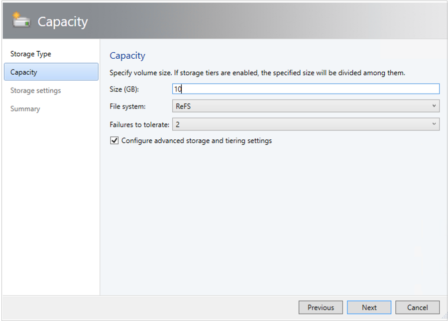
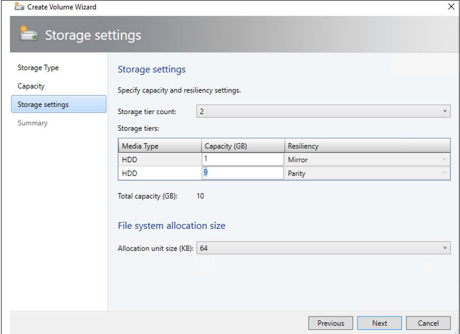

# Deploy and manage Azure Stack HCI clusters in VMM

> Applies to: Azure Stack HCI, version 20H2

This article provides information about how to set up a Azure Stack HCI, version 20H2 cluster in System Center - Virtual Machine Manager (VMM) 2019 UR3 and later. You can deploy an Azure Stack HCI cluster by provisioning from bare-metal servers.

   > [!IMPORTANT]
   > If you're using Microsoft System Center Virtual Machine Manager 2019 to manage your Azure Stack HCI, version 20H2 cluster, don't attempt to upgrade the cluster to Azure Stack HCI, version 21H2 without first installing [System Center 2022](/system-center/vmm/overview).

## Before you start

Make sure you're running VMM 2019 UR3 or later.

**What's supported?**

- Addition, creation, and management of Azure Stack HCI clusters. [See detailed steps](/system-center/vmm/provision-vms) to create and manage HCI clusters.

- Ability to provision & deploy VMs on the Azure Stack HCI clusters and perform VM life cycle operations. VMs can be provisioned using VHD files, templates or from an existing VM. [Learn more](/system-center/vmm/provision-vms).

- [Set up VLAN based network on Azure Stack HCI clusters](/system-center/vmm/manage-networks).

- [Deployment and management of SDN network controller on Azure Stack HCI clusters](/system-center/vmm/sdn-controller).

- Management of storage pool settings, creation of virtual disks, creation of cluster shared volumes (CSVs) and application of [QOS settings](/system-center/vmm/qos-storage-clusters#assign-storage-qos-policy-for-clusters).

- The PowerShell cmdlets used to manage Windows Server clusters can be used to manage Azure Stack HCI clusters as well.

**What's not supported?**

- Management of *Azure Stack HCI stretched clusters* is currently not supported in VMM.

- Azure Stack HCI is intended as a virtualization host where you run all your workloads in virtual machines, the Azure Stack HCI terms allow you to run only what's necessary for hosting virtual machines. Azure Stack HCI clusters should not be used for other purposes like WSUS servers, WDS servers or library servers. Refer to [Use cases for Azure Stack HCI](../overview.md#why-azure-stack-hci) and [When to use Azure Stack HCI](../concepts/compare-windows-server.md#when-to-use-azure-stack-hci).

- Live migration of VM is not supported between any version of Windows Server and Azure Stack HCI clusters.

- Network migration from Windows Server 2019 to Azure Stack HCI cluster will work, as well as migrating an offline (shut down) VM. VMM performs export and import operation here.


> [!NOTE]
> You must enable Storage Spaces Direct when creating a Azure Stack HCI cluster.
> To enable Storage Spaces Direct, in the cluster creation wizard, go to **General Configuration**, under **Specify the cluster name and host group**, select **Enable Storage Spaces Direct**, as shown below:



After you enable a cluster with Storage Spaces Direct, VMM does the following:
- The Failover Clustering feature is enabled.
- Storage replica and data deduplication are enabled.
- The cluster is optionally validated and created.
- Storage Spaces Direct is enabled, and a storage array is created with the same name as you provided in the wizard.

If you use PowerShell to create a hyper-converged cluster, the pool and the storage tier is automatically created with the **Enable-ClusterS2D autoconfig=true** option.

After these prerequisites are in place, you provision a cluster, and set up storage resources on it. You can then deploy VMs on the cluster.

Follow these steps:

## Step 1: Provision the cluster

You can provision a cluster by Hyper-V hosts and bare-metal machines:

### Provision a cluster from Hyper-V hosts

If you need to add the Azure Stack HCI  hosts to the VMM fabric, [follow these steps](/system-center/vmm/hyper-v-existing). If they're already in the VMM fabric, skip to the next step.

> [!NOTE]
> - When you set up the cluster, select the **Enable Storage Spaces Direct** option on the **General Configuration** page of the **Create Hyper-V Cluster** wizard.
> - In **Resource Type**, select **Existing servers running a Windows Server operating system**, and select the Hyper-V hosts to add to the cluster.
> - All the selected hosts should have Azure Stack HCI OS installed.
> - Since Storage Spaces Direct is enabled, the cluster must be validated.

### Provision a cluster from bare metal machines

> [!NOTE]
> Typically, a Storage Spaces Direct node requires RDMA, QOS and SET settings. To configure these settings for a node using bare metal computers, you can use the post deployment script capability in PCP. Here is the  [sample PCP post deployment script](/system-center/vmm/hyper-v-bare-metal#sample-script).
> You can also use this script to configure RDMA, QoS and SET while adding a new node to an existing Storage Spaces Direct deployment from bare metal computers.

1.    Read the [prerequisites](/system-center/vmm/hyper-v-bare-metal#before-you-start) for bare-metal cluster deployment. Note that:

    - The generalized VHD or VHDX in the VMM library should be running Azure Stack HCI with the latest updates. The **Operating system** and **Virtualization platform** values for the hard disk should be set.
    - For bare-metal deployment, you need to add a pre-boot execution environment (PXE) server to the VMM fabric. The PXE server is provided through Windows Deployment Services. VMM uses its own WinPE image, and you need to make sure that it's the latest. To do this, click **Fabric** > **Infrastructure** > **Update WinPE image**, and make sure that the job finishes.

2.    Follow the instructions for [provisioning a cluster from bare-metal computers](/system-center/vmm/hyper-v-bare-metal).

## Step 2: Set up networking for the cluster

After the cluster is provisioned and managed in the VMM fabric, you need to set up networking for cluster nodes.

1.    Start by [creating a logical network](/system-center/vmm/network-logical) to mirror your physical management network.
2.    You need to [set up a logical switch](/system-center/vmm/network-switch) with Switch Embedded Teaming (SET) enabled, so that the switch is aware of virtualization. This switch is connected to the management logical network, and has all of the host virtual adapters that are required to provide access to the management network, or configure storage networking. Storage Spaces Direct relies on a network to communicate between hosts. RDMA-capable adapters are recommended.
3.    [Create VM networks](/system-center/vmm/network-virtual).


## Step 3: Configure DCB settings on the Azure Stack HCI cluster

>[!NOTE]
>Configuration of DCB settings is an optional step to achieve high performance during Storage Spaces Direct cluster creation workflow. Skip to step 4, if you do not wish to configure DCB settings.

### Recommendations
- If you have vNICs deployed, for optimal performance, we recommend to map all your vNICs with the corresponding pNICs. Affinities between vNIC and pNIC are set randomly by the operating system, and there could be scenarios where multiple vNICs are mapped to the same pNIC. To avoid such scenarios, we recommend you to manually set affinity between vNIC and pNIC by following the steps listed [here](/system-center/vmm/hyper-v-network#set-affinity-between-vnics-and-pnics).


- When you create a network adapter port profile, we recommend you to allow **IEEE priority**. [Learn more](/system-center/vmm/network-port-profile#create-a-virtual-network-adapter-port-profile).

    You can also set the IEEE Priority by using the following PowerShell commands:

    ```
    PS> Set-VMNetworkAdapterVlan -VMNetworkAdapterName SMB2 -VlanId "101" -Access -ManagementOS
    PS> Set-VMNetworkAdapter -ManagementOS -Name SMB2 -IeeePriorityTag on
    ```


**Use the following steps to configure DCB settings**:

1. [Create a new Hyper-V cluster](/system-center/vmm/hyper-v-standalone), select **Enable Storage Spaces Direct**.
   *DCB Configuration* option gets added to the Hyper-V cluster creation workflow.

    

2. In **DCB configuration**, select **Configure Data Center Bridging**.

3. Provide **Priority** and **Bandwidth** values for SMB-Direct and Cluster Heartbeat traffic.

   > [!NOTE]
   > Default values are assigned to **Priority** and **Bandwidth**. Customize these values based on your organization's environment needs.

   

   Default values:

   | Traffic Class | Priority | Bandwidth (%) |
   | --- | --- | --- |
   | Cluster Heartbeat | 7 | 1 |
   | SMB-Direct | 3 | 50 |

4. Select the network adapters used for storage traffic. RDMA is enabled on these network adapters.

    > [!NOTE]
    > In a converged NIC scenario, select the storage vNICs. The underlying pNICs should be RDMA capable for vNICs to be displayed and available for selection.

    

5. Review the summary and select **Finish**.

    An Azure Stack HCI cluster will be created and the DCB parameters are configured on all the Storage Spaces Direct nodes.

    > [!NOTE]
    > - DCB settings can be configured on the existing Hyper-V Storage Spaces Direct clusters by visiting the **Cluster Properties** page, and navigating to **DCB configuration** page.
    > - Any out-of-band changes to DCB settings on any of the nodes will cause the Storage Spaces Direct cluster to be non-compliant in VMM. A Remediate option will be provided in the **DCB configuration** page of cluster properties, which you can use to enforce the DCB settings configured in VMM on the cluster nodes.

## Step 4: Register Azure Stack HCI cluster with Azure

After creating an Azure Stack HCI cluster, it must be registered with Azure within 30 days of installation per Azure Online Service terms. Follow the steps [here](./register-with-azure.md) to register the Azure Stack HCI cluster with Azure.

The registration status will reflect in VMM after a successful cluster refresh.

## Step 5: View the registration status of Azure Stack HCI clusters

1. In VMM console, you can view the registration status and last connected date of Azure Stack HCI clusters.
2. Click **Fabric** and right-click the **Azure Stack HCI** cluster and select **Properties**.

   

3. Get -SCVMM host has new properties to check registration status.

## Step 6: Manage the pool and create CSVs

You can now modify the storage pool settings, and create virtual disks and CSVs.

1. Click **Fabric** > **Storage** > **Arrays**.
2. Right-click the cluster > **Manage Pool**, and select the storage pool that was created by default. You can change the default name, and add a classification.
3. To create a CSV, right-click the cluster > **Properties** > **Shared Volumes**.
4. In the **Create Volume Wizard** > **Storage Type**, specify the volume name, and select the storage pool.
5. In **Capacity**, you can specify the volume size, file system, and resiliency (Failures to tolerate) settings.

    

6. Click **Configure advanced storage and tiering settings** to set up these options.

    


7. In **Summary**, verify settings and finish the wizard. A virtual disk will be created automatically when you create the volume.

If you use PowerShell, the pool and the storage tier is automatically created with the **Enable-ClusterS2D autoconfig=true** option.

## Step 7: Deploy VMs on the cluster

In a hyper-converged topology VMs can be directly deployed on the cluster. Their virtual hard disks are placed on the volumes you created using Storage Spaces Direct. You [create and deploy these VMs](/system-center/vmm/provision-vms) just as you would create any other VM.

> [!Important]
> If the Azure Stack HCI cluster is not registered with Azure or not connected to Azure for more than 30 days post registration, High availability Virtual machine (HAVM) creation will be blocked on the cluster. Refer to step 4 & 5 for cluster registration.


## Next steps

- [Provision VMs](/system-center/vmm/provision-vms)
- [Manage the cluster](/system-center/vmm/s2d-manage)