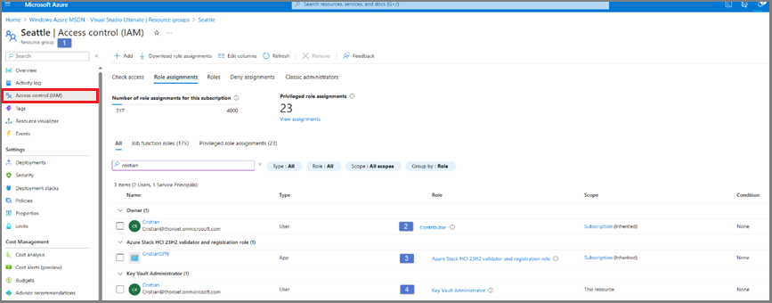
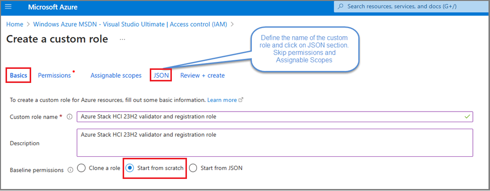
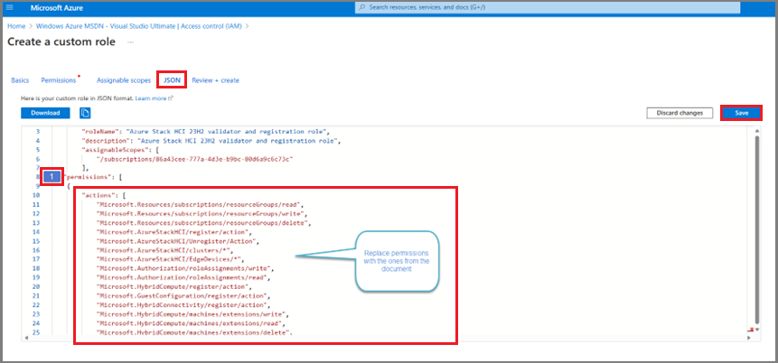
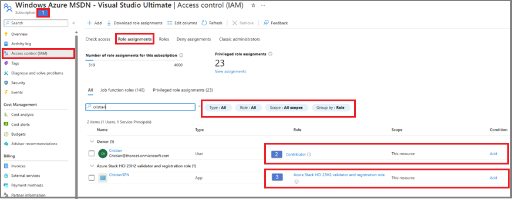

--- 
title: Set up the first server for new Azure Stack HCI, version 23H2 deployment (preview) 
description: Learn how to set up the first server before you deploy Azure Stack HCI, version 23H2 (preview).
author: alkohli
ms.topic: how-to
ms.date: 10/24/2023
ms.author: alkohli
ms.subservice: azure-stack-hci
---

# Set up the first server for new Azure Stack HCI, version 23H2 deployment (preview)

[!INCLUDE [applies-to](../../includes/hci-applies-to-23h2.md)]

This article describes how to set up the first server in the cluster for a new Azure Stack HCI version, version 23H2 deployment. The first server listed for the cluster acts as a staging server in the deployment.

The deployment is part of the preview package that you have downloaded. You need to install and set up the deployment only on the first server in the cluster.

[!INCLUDE [important](../../includes/hci-preview.md)]

## Prerequisites

Before you begin, make sure you've done the following:

- Satisfy the [prerequisites](../index.yml).
- Complete the [deployment checklist](../index.yml).
- Prepare your [Active Directory](../index.yml) environment.
- [Install the Azure Stack HCI, version 23H2 operating system](../index.yml) on each server.
- Register your subscription against the `Microsoft.ResourceConnector` resource provider. Run the following PowerShell cmdlet to register your subscription:

    ```powershell
    Register-AzResourceProvider -ProviderNamespace Microsoft.ResourceConnector
    ```

- Before you start the deployment, run the following command to check for any mapped drives and then remove those:

    ```powershell
    (Get-PSDrive -PSProvider FileSystem).Root 
    ```

    The installation could potentially fail if there are mapped drives other than the drive where the package is being installed.

- Ensure that the user registering the servers has `Contributor` permissions and `User Access Administrator` permissions for the subscription. For more information, see how to verify that you have the [Permissions for your subscription](../index.yml).

## Register server with Azure Arc

Follow these steps to register the servers with Azure Arc:

1. Download the registration script from PSGallery.
1. Run the script.

   Here's a sample output from a successful run of the script:

   ```powershell
   #Install required PowerShell modules in your node for the Azure registration

   Install-Module AzsHCI.arcinstaller
   Install-Module Az.Accounts -Force
   Install-Module Az.ConnectedMachine -Force
   Install-Module Az.Resources -Force

   #Define the subscription where you want to register your server as Arc device

   $Subscription = "YourSubscriptionID"

   #Define the resource group where you want to register your server as Arc device
   $RG = "YourResourceGroupName"

   #Define the tenant you will use to register your server as Arc device
   $Tenant = "YourTenantID"

   #Connect to your Azure account and Subscription
   Connect-AzAccount -SubscriptionId $Subscription -TenantId $Tenant -DeviceCode

   #Get the Access Token and Account ID for the registration
   $ARMtoken = (Get-AzAccessToken).Token

   #Get the Account ID for the registration
   $id = (Get-AzContext).Account.Id

   #Invoke the registration script. For Private Preview only eastus region is supported.
   Invoke-AzStackHciArcInitialization -SubscriptionID $Subscription -ResourceGroup $RG -TenantID $Tenant -Region eastus -Cloud "AzureCloud" -ArmAccessToken $ARMtoken -AccountID $id -Force
   ```

## Assign required permissions for deployment

This section describes how to assign Azure permissions for deployment from the Azure portal.


1. In the Azure portal, go to the Resource Group where you registered the servers on the subscription. Assign `Key Vault Administrator` permissions to the user who will deploy the cluster.

   

1. Create a custom role named `Azure Stack HCI 23H2 validator and registration role` with the necessary permissions to create and deploy Azure Stack HCI clusters from the Azure portal.

   

1. Specify the **JSON** option. Provide a name and description for the custom role, and then select **Start from scratch**.

   

1. To specify permissions for the custom role, use the sample JSON code.

   

   Sample JSON code with permissions for the custom role `Azure Stack HCI 23H2 validator and registration role` to create and deploy HCI clusters on Azure portal:

   ```json
   "permissions": [
    {
        "actions": [
            "Microsoft.Resources/subscriptions/resourceGroups/read",
            "Microsoft.Resources/subscriptions/resourceGroups/write",
            "Microsoft.Resources/subscriptions/resourceGroups/delete",
            "Microsoft.AzureStackHCI/register/action",
            "Microsoft.AzureStackHCI/Unregister/Action",
            "Microsoft.AzureStackHCI/clusters/*",
            "Microsoft.AzureStackHCI/EdgeDevices/*",
            "Microsoft.Authorization/roleAssignments/write",
            "Microsoft.Authorization/roleAssignments/read",
            "Microsoft.HybridCompute/register/action",
            "Microsoft.GuestConfiguration/register/action",
            "Microsoft.HybridConnectivity/register/action",
            "Microsoft.HybridCompute/machines/extensions/write",
            "Microsoft.HybridCompute/machines/extensions/read",
            "Microsoft.HybridCompute/machines/extensions/delete",
            "Microsoft.HybridCompute/machines/read",
            "Microsoft.HybridCompute/machines/write",
            "Microsoft.HybridCompute/machines/delete",
            "Microsoft.HybridCompute/privateLinkScopes/read",
            "Microsoft.GuestConfiguration/guestConfigurationAssignments/read",
            "Microsoft.ResourceConnector/register/action",
            "Microsoft.ResourceConnector/appliances/read",
            "Microsoft.ResourceConnector/appliances/write",
            "Microsoft.ResourceConnector/appliances/delete",
            "Microsoft.ResourceConnector/locations/operationresults/read",
            "Microsoft.ResourceConnector/locations/operationsstatus/read",
            "Microsoft.ResourceConnector/appliances/listClusterUserCredential/action",
            "Microsoft.ResourceConnector/operations/read",
            "Microsoft.Kubernetes/register/action",
            "Microsoft.KubernetesConfiguration/register/action",
            "Microsoft.ExtendedLocation/register/action",
            "Microsoft.HybridContainerService/register/action",
            "Microsoft.KubernetesConfiguration/extensions/write",
            "Microsoft.KubernetesConfiguration/extensions/read",
            "Microsoft.KubernetesConfiguration/extensions/delete",
            "Microsoft.KubernetesConfiguration/extensions/operations/read",
            "Microsoft.KubernetesConfiguration/namespaces/read",
            "Microsoft.KubernetesConfiguration/operations/read",
            "Microsoft.ExtendedLocation/customLocations/deploy/action",
            "Microsoft.ExtendedLocation/customLocations/read",
            "Microsoft.ExtendedLocation/customLocations/write",
            "Microsoft.ExtendedLocation/customLocations/delete"
        ],
        "notActions": [],
        "dataActions": [],
        "notDataActions": []
    }
    ]
   ```

1. Create a new SPN in your tenant that will be used for the HCI Cluster deployment. This SPN is required to deploy ARB. In GA, the portal will create this SPN automatically and it won’t be needed anymore.
1. Add a new role assignment at the subscription level for the custom role created in Step 2 above, and assign the newly created SPN.

   

1. Verify that all required permissions are in place.

## Reference: Required permissions for deployment

The following table explains why the Azure permissions described in this article are required:

| Operation | Description |
|--|--|
| "Microsoft.Resources/subscriptions/resourceGroups/read"<br>"Microsoft.Resources/subscriptions/resourceGroups/write"<br>"Microsoft.Resources/subscriptions/resourceGroups/delete"<br>"Microsoft.AzureStackHCI/register/action"<br>"Microsoft.AzureStackHCI/Unregister/Action"<br>"Microsoft.AzureStackHCI/clusters/\*"<br>"Microsoft.Authorization/roleAssignments/read" | To register and unregister the Azure Stack HCI cluster. |
| "Microsoft.Authorization/roleAssignments/write"<br>"Microsoft.HybridCompute/register/action"<br>"Microsoft.GuestConfiguration/register/action"<br>"Microsoft.HybridConnectivity/register/action" | To register and unregister the Arc for server resources. |
| "Microsoft.HybridCompute/machines/extensions/write" <br> "Microsoft.HybridCompute/machines/extensions/read" <br> "Microsoft.HybridCompute/machines/extensions/delete" | To list and enable Arc Extensions on Azure Stack HCI cluster. |
| "Microsoft.HybridCompute/machines/read" <br> "Microsoft.HybridCompute/machines/write" <br> "Microsoft.HybridCompute/machines/delete" | To enable Arc for Servers on each node of your Azure Stack HCI cluster. |
| "Microsoft.HybridCompute/privateLinkScopes/read" | To enable private endpoints. |
| "Microsoft.GuestConfiguration/guestConfigurationAssignments/read" <br> "Microsoft.ResourceConnector/register/action" <br> "Microsoft.ResourceConnector/appliances/read" <br> "Microsoft.ResourceConnector/appliances/write" <br>"Microsoft.ResourceConnector/appliances/delete" <br> "Microsoft.ResourceConnector/locations/operationresults/read" <br> "Microsoft.ResourceConnector/locations/operationsstatus/read" <br> "Microsoft.ResourceConnector/appliances/listClusterUserCredential/action" <br> "Microsoft.ResourceConnector/operations/read" <br> "Microsoft.Kubernetes/register/action" <br> "Microsoft.KubernetesConfiguration/register/action" <br> "Microsoft.ExtendedLocation/register/action" <br> "Microsoft.HybridContainerService/register/action" <br> "Microsoft.KubernetesConfiguration/extensions/write" <br> "Microsoft.KubernetesConfiguration/extensions/read" <br> "Microsoft.KubernetesConfiguration/extensions/delete" <br> "Microsoft.KubernetesConfiguration/extensions/operations/read" <br> "Microsoft.KubernetesConfiguration/namespaces/read" <br> "Microsoft.KubernetesConfiguration/operations/read" <br> "Microsoft.ExtendedLocation/customLocations/deploy/action" <br> "Microsoft.ExtendedLocation/customLocations/read" <br> "Microsoft.ExtendedLocation/customLocations/write" <br> "Microsoft.ExtendedLocation/customLocations/delete" | For Azure Arc Resource Bridge installation. |

## Next steps

After setting up the first server in your cluster, you're ready to deploy using Azure portal:

- [Deploy using Azure portal](../index.yml).

<!--Some admins might prefer a more restrictive option. In this case, it's possible to create a custom Azure role specific for Azure Stack HCI deployment. To create this custom role, you need to be either an Owner or a User Access Administrator on the subscription. For more information about how to create a custom role including the various manage operations, see [Tutorial: Create an Azure custom role using Azure PowerShell](/azure/role-based-access-control/tutorial-custom-role-powershell).

The following procedure provides a typical set of permissions to the custom role.

1. Create a **customHCIRole.json** with the following content. Make sure to change `<subscriptionID>` to your Azure subscription ID. To get your Azure subscription ID, use the [`Get-AzSubscription`](/powershell/module/az.accounts/get-azsubscription) command.

    ```jason
    {
	    "id": "/subscriptions/<Azure subscription ID>",
        "properties": {
        "roleName": "Azure Stack HCI 23H2 validator and registration role",
        "description": "Custom Azure role to allow subscription-level access to register Azure Stack HCI",
        "assignableScopes": [
            "/subscriptions/<Azure subscription ID>"
        ],
        "permissions": [
        {
	    "Actions": [
		"Microsoft.Resources/subscriptions/resourceGroups/read",
        "Microsoft.Resources/subscriptions/resourceGroups/write",
        "Microsoft.Resources/subscriptions/resourceGroups/delete",
        "Microsoft.AzureStackHCI/register/action",
        "Microsoft.AzureStackHCI/Unregister/Action",
        "Microsoft.AzureStackHCI/clusters/*",
        "Microsoft.Authorization/roleAssignments/write",
        "Microsoft.Authorization/roleAssignments/read",
        "Microsoft.HybridCompute/register/action",
        "Microsoft.GuestConfiguration/register/action",
        "Microsoft.HybridConnectivity/register/action",
        "Microsoft.HybridCompute/machines/extensions/write",
        "Microsoft.HybridCompute/machines/extensions/read",
        "Microsoft.HybridCompute/machines/extensions/delete",
        "Microsoft.HybridCompute/machines/read",
        "Microsoft.HybridCompute/machines/write",
        "Microsoft.HybridCompute/machines/delete",
        "Microsoft.HybridCompute/privateLinkScopes/read",
        "Microsoft.GuestConfiguration/guestConfigurationAssignments/read",
        "Microsoft.ResourceConnector/register/action",
        "Microsoft.ResourceConnector/appliances/read",
        "Microsoft.ResourceConnector/appliances/write",
        "Microsoft.ResourceConnector/appliances/delete",
        "Microsoft.ResourceConnector/locations/operationresults/read",
        "Microsoft.ResourceConnector/locations/operationsstatus/read",
        "Microsoft.ResourceConnector/appliances/listClusterUserCredential/action",
        "Microsoft.ResourceConnector/operations/read",
        "Microsoft.Kubernetes/register/action",
        "Microsoft.KubernetesConfiguration/register/action",
        "Microsoft.ExtendedLocation/register/action",
        "Microsoft.HybridContainerService/register/action",
        "Microsoft.KubernetesConfiguration/extensions/write",
        "Microsoft.KubernetesConfiguration/extensions/read",
        "Microsoft.KubernetesConfiguration/extensions/delete",
        "Microsoft.KubernetesConfiguration/extensions/operations/read",
        "Microsoft.KubernetesConfiguration/namespaces/read",
        "Microsoft.KubernetesConfiguration/operations/read",
        "Microsoft.ExtendedLocation/customLocations/deploy/action",
        "Microsoft.ExtendedLocation/customLocations/read",
        "Microsoft.ExtendedLocation/customLocations/write",
        "Microsoft.ExtendedLocation/customLocations/delete"
	    ],
	    "notActions": [],
        "dataActions": [],
        "notDataActions": []
            }
        ]
    }
    }
    ```

1. Create the custom role:

    ```powershell
    New-AzRoleDefinition -InputFile "C:\CustomRoles\customHciRole.json"
    ```

1. Assign the custom role to the user:

    ```powershell
    $user = Get-AzADUser -DisplayName <userdisplayname>
    $role = Get-AzRoleDefinition -Name "Azure Stack HCI 23H2 validator and registration role"
    New-AzRoleAssignment -ObjectId $user.Id -RoleDefinitionId $role.Id -Scope /subscriptions/<Azure Subscription ID>
    ```

    

To set more restrictive permissions, see [How do I use a more restricted custom permissions role?](../manage/manage-cluster-registration.md#how-do-i-use-a-more-restricted-custom-permissions-role) -->


