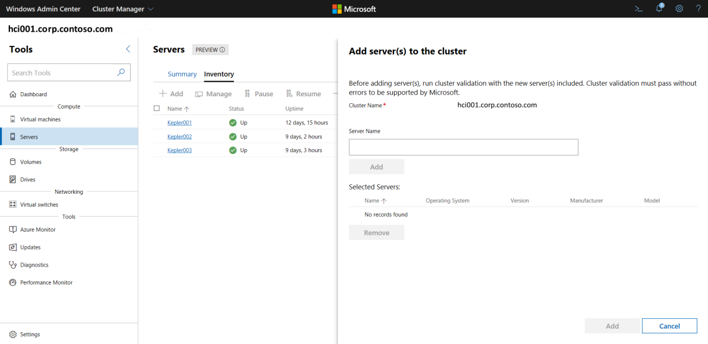
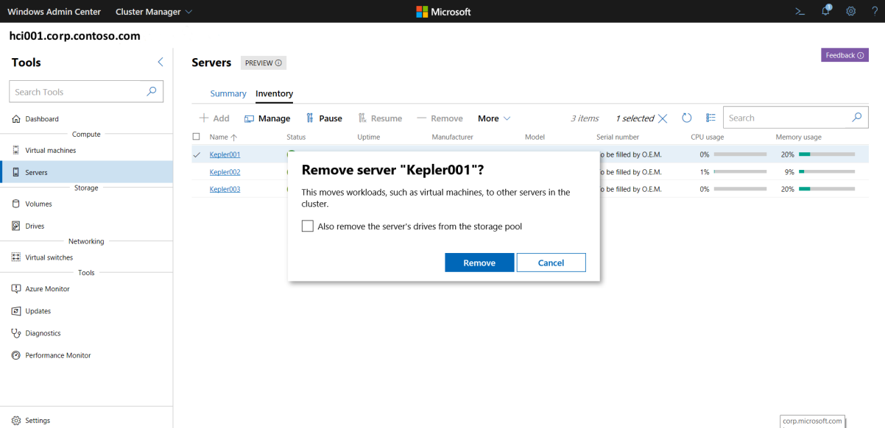
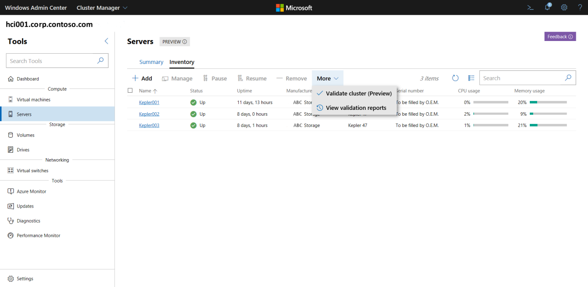

# Add or remove servers for an Azure Stack HCI cluster

> Applies to: Windows Server 2019

You can easily add or remove servers from a cluster in Azure Stack HCI. Keep in mind that each new physical server must be homogeneous in CPU type, memory, and disk number and size to the servers that are already present in the cluster.

Whenever you add or remove a server, you must also perform cluster validation afterwards to ensure the cluster is functioning normally.

## Obtain server hardware from your OEM ##

The first step is to acquire new HCI hardware from your original OEM. Always refer to your OEM-provided documentation when adding new server hardware for use in your cluster.

1. Place the new physical server in the rack and cable it appropriately.
1. Enable physical switch ports and adjust access control lists (ACLs) if applicable.
1. Configure the correct IP address in the baseboard management controller (BMC) and apply all BIOS settings per OEM instructions.
1. Apply the current firmware baseline to all components by using the tools that are provided by your OEM.
1. Run OEM validation tests to ensure homogeneity with the existing cluster servers.

## Add the server to the cluster ##

Once your server has spun up correctly, use Windows Admin Center to join the server to your cluster.

> [!div class="mx-imgBorder"]
> 

1. In **Windows Admin Center**, select **Cluster Manager** from the top drop-down arrow.
1. Under **Cluster connections**, select the cluster.
1. Under **Tools**, select **Servers**.
1. Under **Servers**, select the **Inventory** tab.
1. On the **Inventory** tab, select **Add**.
1. In **Server name**, enter the full-qualified domain name of the server you want to add, click **Add**, then click **Add** again at the bottom.
1. Verify the server has been successfully added to your cluster.

## Remove a server from the cluster ##

The steps for removing a server from your cluster are similar to those for adding a server to a cluster.

Keep in mind that when you remove a server, you will also remove any virtual machines, storage drives, and workloads associated with the server.

> [!div class="mx-imgBorder"]
> 

1. In **Windows Admin Center**, select **Cluster Manager** from the top drop-down arrow.
1. Under **Cluster connections**, select the cluster.
1. Under **Tools**, select **Servers**.
1. Under **Servers**, select the **Inventory** tab.
1. On the **Inventory** tab, select the server you want to remove, then select **Remove**.
1. To also remove any server drives from the storage pool, enable that checkbox.
1. Verify the server has been successfully removed from the cluster.

## Validate the cluster ##

Whenever you add or remove a server from a cluster, you must validate the cluster. Cluster validation must pass without errors to be supported by Microsoft.

> [!div class="mx-imgBorder"]
> 

> [!NOTE]
> Cluster validation requires that [CredSSP](https://docs.microsoft.com/windows-server/manage/windows-admin-center/understand/faq#does-windows-admin-center-use-credssp) is enabled.

1. In **Windows Admin Center**, select **Cluster Manager** from the top drop-down arrow.
1. Under **Tools**, select **Servers**.
1. Under **Servers**, select the **Inventory** tab, select **More**, then select **Validate Cluster (Preview)**.
1. Verify that all validation steps passed successfully.

## Next Steps ##

 - To learn more about cluster validation, see [Future Topic]
 To manage your clusters, see [Manage clusters in Azure Stack HCI].