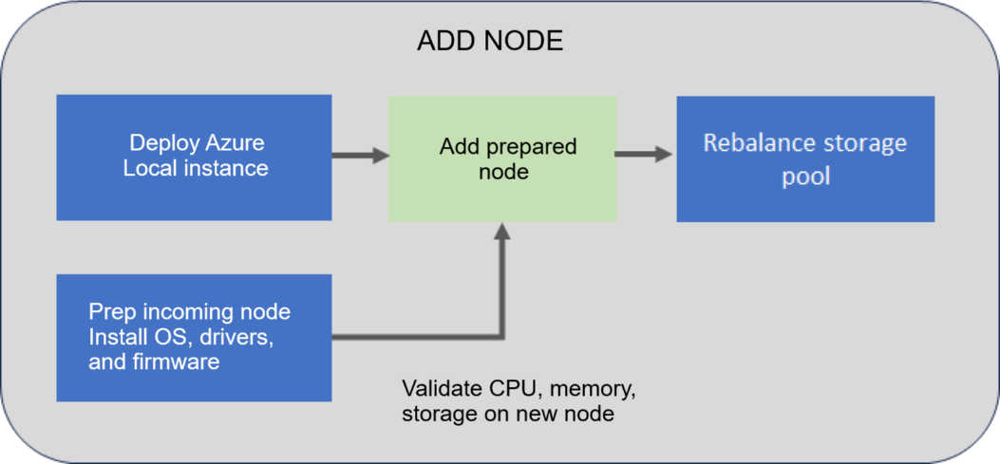

# Add a server on your Azure Stack HCI (preview)

[!INCLUDE [applies-to](../../includes/hci-applies-to-23h2.md)]

This article describes how to manage capacity by adding a server (often called scale-out) to your Azure Stack HCI cluster.

[!INCLUDE [hci-preview](../../includes/hci-preview.md)]

## About add servers

You can easily scale the compute and storage at the same time on your Azure Stack HCI by adding servers to an existing cluster. Your Azure Stack HCI cluster supports a maximum of up to 16 servers.

Each new physical server that you add to your cluster must closely match the rest of the servers in terms of CPU type, memory, number of drives, and the type and size of the drives. 

You can dynamically scale your Azure Stack HCI cluster from 1 to 16 servers. In response to the scaling, the orchestrator (also known as Lifecycle Manager) adjusts the drive resiliency, network configuration including the on-premises agents such as orchestrator agents, and Arc registration. The dynamic scaling may require the network architecture change from connected without a switch to connected via a network switch.

> [!IMPORTANT]
> - In this preview release, you can only add one server at any given time. You can however add multiple servers sequentially so that the storage pool is rebalanced only once. 
> - It is not possible to permanently remove a server from a cluster.


## Add server workflow

The following flow diagram shows the overall process to add a server:



To add a server, follow these high-level steps:

1. Install the operating system, drivers, and firmware on the new cluster server that you plan to add. For more information, see [Install OS](../deploy/deployment-tool-install-os.md).
1. Add the prepared server via the `Add-server` PowerShell cmdlet.
1. When adding a server to the cluster, the system validates that the new incoming server meets the CPU, memory, and storage (drives) requirements before it actually adds the server.
1. Once the server is added, cluster is also validated to ensure that it's functioning normally. Next, the storage pool is automatically rebalanced. Storage rebalance is a low priority task that doesn't impact actual workloads. The rebalance can run for multiple days depending on number of the servers and the storage used.

## Supported scenarios

For adding a server, the following scale-out scenarios are supported:

| **Start scenario**  | **Target scenario** | **Resiliency settings** | **Storage network architecture**     | **Witness settings**     |
|---------------------|---------------------|---------------------|--------------------------------------|----------------------------|
| Single-server       | Two-server cluster  | Two-way mirror  | Configured with and without a switch | Witness required for target scenario.    |
| Two-server cluster  | Three-server cluster| Three-way mirror  | Configured with a switch only      | Witness optional for target scenario.    |
| Three-server cluster| N-server cluster    | Three-way mirror| Switch only                          | Witness optional for target scenario.    |

When upgrading a cluster from two to three servers, the storage resiliency level is changed from a two-way mirror to a three-way mirror.

### Resiliency settings

In this preview release, for add server operation, specific tasks aren't performed on the workload volumes created after the deployment.

For add server operation, the resiliency settings are updated for the required infrastructure volumes and the workload volumes created during the deployment. The settings remain unchanged for other workload volumes that you created after the deployment (since the intentional resiliency settings of these volumes aren't known and you may just want a 2-way mirror volume regardless of the cluster scale).

However, the default resiliency settings are updated at the storage pool level and so any new workload volumes that you created after the deployment will inherit the resiliency settings.

### Hardware requirements

When adding a server, the system validates the hardware of the new, incoming server and ensures that the server meets the hardware requirements before it's added to the cluster.

[!INCLUDE [hci-hardware-requirements-add-repair-server](../../includes/hci-hardware-requirements-add-repair-server.md)]

## Prerequisites

Before you add a server, you would need to complete the hardware and software prerequisites.

#### Hardware prerequisites

Make sure to complete the following prerequisites:

1. The first step is to acquire the new Azure Stack HCI hardware from your original OEM. Always refer to your OEM-provided documentation when adding new server hardware for use in your cluster.
1. Place the new physical server in the predetermined location, for example, a rack and cable it appropriately.
1. Enable and adjust physical switch ports as applicable in your network environment.


#### Software prerequisites

Make sure to complete the following prerequisites:

[!INCLUDE [hci-prerequisites-add-repair-server](../../includes/hci-prerequisites-add-repair-server.md)]


## Add a server

This section describes how to add a server using PowerShell, monitor the status of the `Add-Server` operation and troubleshoot, if there are any issues.

### Add a server using PowerShell

Make sure that you have reviewed and completed the [prerequisites](#prerequisites). 

On the new server that you plan to add, follow these steps.

1. Install the operating system and required drivers on the new server that you plan to add. Follow the steps in [Install the Azure Stack HCI, version 23H2 Operating System](../deploy/deployment-install-os.md).

    > [!NOTE]
    > You must also [Install required Windows Roles](../deploy/deployment-install-os.md#install-required-windows-roles).

On a server that already exists on your cluster, follow these steps:

1. Sign in with the domain user credentials that you provided during the deployment of the cluster.

1. Before you add the server, make sure to get an updated authentication token. Run the following command:

    ```powershell
    Update-AuthenticationToken 
    ```
   
1. Run the following command to add the new incoming server:

    ```powershell
    $HostIpv4 = "<IPv 4 for the new server>"
    $Cred = Get-Credential 
    Add-Server -Name "< Name of the new server>" -HostIpv4 $HostIpv4 -LocalAdminCredential $Cred 
    ```
1. Make a note of the operation ID as output by the `Add-Server` command. You use this operation ID later to monitor the progress of the `Add-Server` operation.

### Monitor operation progress

To monitor the progress of the add server operation, follow these steps:

[!INCLUDE [hci-monitor-add-repair-server](../../includes/hci-monitor-add-repair-server.md)]


The newly added server shows in the Azure portal in your Azure Stack HCI cluster list after several hours. To force the server to show up in Azure portal, run the following command:

```powershell
Sync-AzureStackHCI
```

### Recovery scenarios

Following recovery scenarios and the recommended mitigation steps are tabulated for adding a server:

| Scenario description                                                                                          | Mitigation                                                                                                | Supported?   |
|------------------------------------------------------------------------------------------------------|-------------------------------------------------------------------------------------------------------------------|---------------|
| Added a new server out of band without using the orchestrator.                            | Remove the added server. <br> Use the orchestrator to add the server.                                              | No|
| Added a new server with orchestrator and the operation failed.                                                | To complete the operation, investigate the failure. <br>Rerun the failed operation using `Add-Server -Rerun`.     | Yes    |
| Added a new server with orchestrator. <br>The operation succeeded partially but had to start with a fresh operating system install. | In this scenario, orchestrator has already updated its knowledge store with the new server. Use the repair server scenario. | Yes     |


### Troubleshoot issues

If you experience failures or errors while adding a server, you can capture the output of the failures in a log file. On a server that already exists on your cluster, follow these steps:

- Sign in with the domain user credentials that you provided during the deployment of the cluster. Capture the issue in the log files.
 

    ```powershell
    Get-ActionPlanInstance -ActionPlanInstanceID $ID|out-file log.txt
    ```

- To rerun the failed operation, use the following cmdlet:

    ```powershell
    Add-Server -Rerun
    ``` 


## Next steps

Learn more about how to [Repair a server](./repair-server.md).
