# Attaching a GPU to an Ubuntu Linux VM on Azure Stack HCI

> Applies to: Azure Stack HCI, Windows Server 2019

This topic provides step-by-step instructions on how to install and configure an NVIDIA graphics processing unit (GPU) with Azure Stack HCI using Discrete Device Assignment (DDA) technology for an Ubuntu virtual machine (VM).
This document assumes you have the Azure Stack HCI cluster deployed and VMs installed.

## Configure the Azure Stack HCI node

Choose the server node(s) in your Azure Stack HCI cluster to install NVIDIA GPUs. Install the NVIDIA GPU physically into the server, following OEM instructions and BIOS recommendations. Once the server boots up:

1. Login as Administrator to the Azure Stack HCI node with the NVIDIA GPU installed.
2. Open **Device Manager** and navigate to the *other devices* section. You should see a device listed as "PCI Express Graphics Processing Unit."
3. Right-click on "PCI Express Graphics Processing Unit" to bring up the **Properties** page. Click **Details**. From the dropdown under **Property**, select "Location paths."
4. Note the value with string PCIRoot as highlighted in the screen shot below. Right-click on **Value** and copy/save it.
    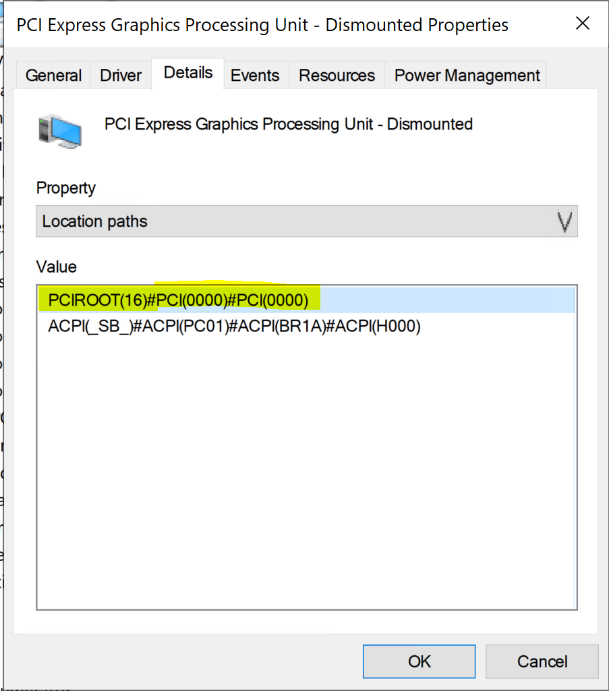
5. Open Windows PowerShell with elevated privileges and execute the `Dismount-VMHostAssignableDevice` cmdlet to dismount the GPU device for DDA to VM. Replace the *LocationPath* value with the value for your device obtained in step 4.
    ```PowerShell
    Dismount-VMHostAssignableDevice -LocationPath "PCIROOT(16)#PCI(0000)#PCI(0000)" -force
    ```
6. Confirm the device is listed under system devices in **Device Manager** as Dismounted.
    > [!div class="mx-imgBorder"]
    > 

## Create and configure an Ubuntu virtual machine

1. Download [Ubuntu desktop release 18.04.02 ISO](http://cdimage.ubuntu.com/lubuntu/releases/18.04.2/release/lubuntu-18.04.2-desktop-amd64.iso).
2. Open **Hyper-V Manager** on the node of the system with the GPU installed.
   > [!NOTE]
   > DDA does not support failover, and [here's why](/windows-server/virtualization/hyper-v/plan/plan-for-deploying-devices-using-discrete-device-assignment). This is a virtual machine limitation with DDA. Therefore, we recommend using **Hyper-V Manager** to deploy the VM on the node instead of **Failover Cluster Manager**. Use of **Failover Cluster Manager** with DDA will fail with an error message indicating that the VM has a device that doesn't support high availability.
3. Using the Ubuntu ISO downloaded in step 1, create a new virtual machine using the **New Virtual Machine Wizard** in **Hyper-V Manager** to create a Ubuntu Gen 1 VM with 2GB of memory and a network card attached to it.
4. In PowerShell, assign the Dismounted GPU device to the VM using the cmdlets below, replacing the *LocationPath* value with the value for your device.
    ```PowerShell
    # Confirm that there are no DDA devices assigned to the VM
    Get-VMAssignableDevice -VMName Ubuntu

    # Assign the GPU to the VM
    Add-VMAssignableDevice -LocationPath "PCIROOT(16)#PCI(0000)#PCI(0000)" -VMName Ubuntu

    # Confirm that the GPU is assigned to the VM
    Get-VMAssignableDevice -VMName Ubuntu
    ```

    Successful assignment of the GPU to the VM will show the output below:
    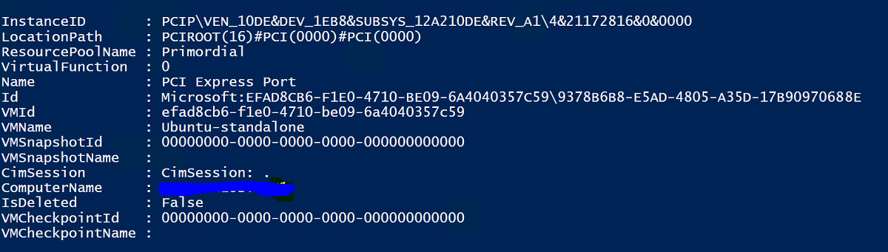

    Configure additional values following GPU documentation [here](/windows-server/virtualization/hyper-v/deploy/deploying-graphics-devices-using-dda):

   ```PowerShell
    # Enable Write-Combining on the CPU
    Set-VM -GuestControlledCacheTypes $true -VMName VMName

    # Configure the 32 bit MMIO space
    Set-VM -LowMemoryMappedIoSpace 3Gb -VMName VMName

    # Configure greater than 32 bit MMIO space
    Set-VM -HighMemoryMappedIoSpace 33280Mb -VMName VMName
   ```

   > [!NOTE]
   > The Value 33280Mb should suffice for most GPUs, but should be replaced with a value greater than your GPU memory.

5. Using Hyper-V Manager, connect to the VM and start the Ubuntu OS install. Choose the defaults to install the Ubuntu OS on the VM.

6. After the installation is complete, use **Hyper-V Manager** to shut down the VM and configure the **Automatic Stop Action** for the VM to shut down the guest operating system as in the screenshot below:
    > [!div class="mx-imgBorder"]
    > 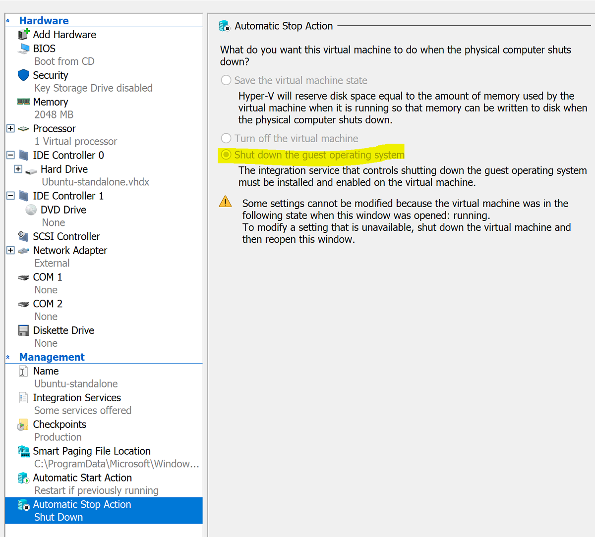

7. Log in to Ubuntu and open the terminal to install SSH:

   ```shell
    $ sudo apt install openssh-server
   ```

8. Find The TCP/IP address for the Ubuntu installation using the **ifconfig** command and copy the IP address for the **eth0** interface.

9. Use an SSH client such as [Putty](https://www.chiark.greenend.org.uk/~sgtatham/putty/) to connect to the Ubuntu VM for further configuration.

10. Upon login through the SSH client, issue the command **lspci** and validate that the NVIDIA GPU is listed as "3D controller."

    > [!IMPORTANT]
    > If The NVIDIA GPU is not seen as "3D controller," please do not proceed further. Please ensure that the steps above are followed before proceeding.

11. Within the VM, search for and open **Software & Updates**. Navigate to **Additional Drivers**, then choose the latest NVIDIA GPU drivers listed. Complete the driver install by clicking the **Apply Changes** button.
    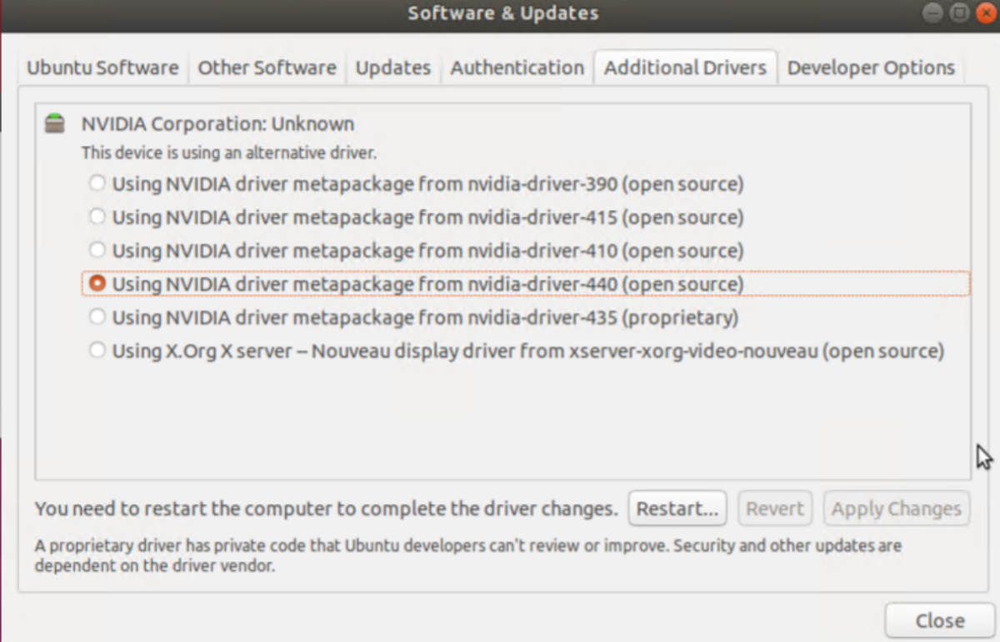

12. Restart the Ubuntu VM after the driver installation completes. Once the VM starts, connect through the SSH client and issue the command **nvidia-smi** to verify that the NVIDIA GPU driver installation completed successfully. The output should be similar to the screenshot below:
    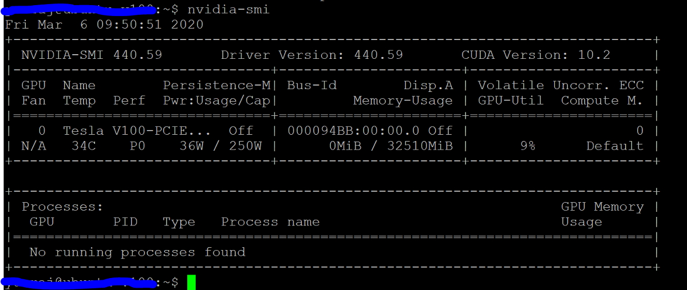

13. Using the SSH client, set up the repository and install the Docker CE Engine:

    ```shell
    $ sudo apt-get update
    $ sudo apt-get install \
    apt-transport-https \
    ca-certificates \
    curl \
    gnupg-agent \
    software-properties-common
    ```
    Add Docker's official GPG key:

    ```shell
    $ curl -fsSL https://download.docker.com/linux/ubuntu/gpg | sudo apt-key add -
    ```

    Verify that you now have the key with the fingerprint 9DC8 5822 9FC7 DD38 854A E2D8 8D81 803C 0EBF CD88 by searching for the last eight characters of the fingerprint:

    ```shell
    $ sudo apt-key fingerprint 0EBFCD88
    ```

    Your output should look similar to this:

    ```shell
    pub   rsa4096 2017-02-22 [SCEA]
    9DC8 5822 9FC7 DD38 854A  E2D8 8D81 803C 0EBF CD88
    uid           [ unknown] Docker Release (CE deb) <docker@docker.com>
    sub   rsa4096 2017-02-22 [S]
    ```

    Set up the stable repository for Ubuntu AMD64 architecture:

    ```shell
    $ sudo add-apt-repository \
    "deb [arch=amd64] https://download.docker.com/linux/ubuntu \
    $(lsb_release -cs) \
    stable"
    ```

    Update packages and install Docker CE:

    ```shell
    $ sudo apt-get update
    $ sudo apt-get install docker-ce docker-ce-cli containerd.io
    ```

    Verify the Docker CE install:

    ```shell
    $ sudo docker run hello-world
    ```

## Configure Azure IoT Edge

To prepare for this configuration, please review the FAQ contained in the [NVIDIA-Deepstream-Azure-IoT-Edge-on-a-NVIDIA-Jetson-Nano](https://github.com/Azure-Samples/NVIDIA-Deepstream-Azure-IoT-Edge-on-a-NVIDIA-Jetson-Nano) GitHub repo, which explains the need to install Docker instead of Moby. After reviewing, proceed to the steps below.

### Install NVIDIA Docker

1. From the SSH client, add package repositories:

    ```shell
    curl -s -L https://nvidia.github.io/nvidia-docker/gpgkey | \
    sudo apt-key add -
    distribution=$(. /etc/os-release;echo $ID$VERSION_ID)

    curl -s -L https://nvidia.github.io/nvidia-docker/$distribution/nvidia-docker.list | \
    sudo tee /etc/apt/sources.list.d/nvidia-docker.list

    sudo apt-get update
    ```

2. Install nvidia-docker2 and reload the Docker daemon configuration:

    ```shell
    sudo apt-get install -y nvidia-docker2
    sudo pkill -SIGHUP dockerd
    ```

3. Reboot the VM:

    ```shell
    sudo /sbin/shutdown -r now
    ```

4. Upon reboot, verify successful installation of NVIDIA Docker:

    ```shell
    sudo docker run --runtime=nvidia --rm nvidia/cuda:9.0-base nvidia-smi
    ```

    Successful installation will look like the output in the screenshot below:
    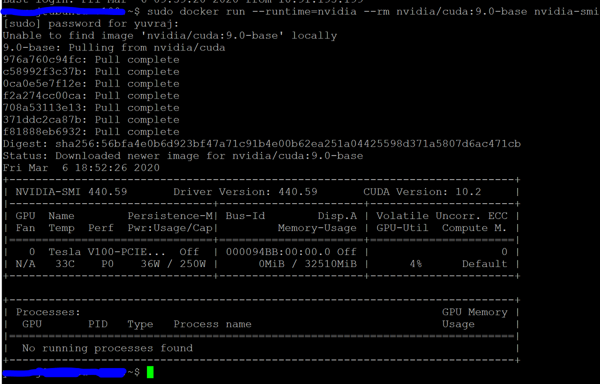

5. Following the instructions here, proceed to install Azure IoT Edge, skipping the runtime install:

    ```shell
    curl https://packages.microsoft.com/config/ubuntu/18.04/multiarch/prod.list > ./microsoft-prod.list

    sudo cp ./microsoft-prod.list /etc/apt/sources.list.d/

    curl https://packages.microsoft.com/keys/microsoft.asc | gpg --dearmor > microsoft.gpg
    sudo cp ./microsoft.gpg /etc/apt/trusted.gpg.d/
    sudo apt-get update

    sudo apt-get install iotedge
    ```

    > [!NOTE]
    > After installing Azure IoT Edge, verify that the config.yaml is present on the Ubuntu VM at /etc/iotedge/config.yaml

6. Create an IoT Edge device identity in the Azure portal following guidance [here](/azure/iot-edge/how-to-register-device#register-in-the-azure-portal). Next, copy the device connection string for the newly created IoT Edge.

7. Using the SSH client, update the device connection string in config.yaml on the Ubuntu VM:

    ```shell
    sudo nano /etc/iotedge/config.yaml
    ```

    Find the provisioning configurations of the file and uncomment the "Manual provisioning configuration" section. Update the value of device_connection_string with the connection string from your IoT Edge device. Make sure any other provisioning sections are commented out. Make sure that the provisioning: line has no preceding whitespace and that nested items are indented by two spaces:

    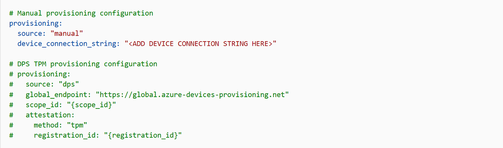

    To paste clipboard contents into Nano, shift+right click or press shift+insert. Save and close the file (Ctrl + X, Y, Enter).

8. Using the SSH client, restart the IoT Edge daemon:

    ```shell
    sudo systemctl restart iotedge
    ```

    Verify the installation and check the status of the IoT Edge daemon:

    ```shell
    systemctl status iotedge

    journalctl -u iotedge --no-pager --no-full
    ```

9. Using the SSH client, create the following directory structure on the Ubuntu VM:

    ```shell
    cd /var
    sudo mkdir deepstream
    mkdir ./deepstream/custom_configs
    cd /var/deepstream
    sudo mkdir custom_streams
    sudo chmod -R 777 /var/deepstream
    cd ./custom_streams
    ```

10. Ensure your working directory is /var/deepstream/custom_streams and download the demo videos file as indicated [here](https://github.com/Azure-Samples/NVIDIA-Deepstream-Azure-IoT-Edge-on-a-NVIDIA-Jetson-Nano) by executing the following command in the SSH client:

    ```shell
    wget -O cars-streams.tar.gz --no-check-certificate https://onedrive.live.com/download?cid=0C0A4A69A0CDCB4C&resid=0C0A4A69A0CDCB4C%21588371&authkey=AAavgrxG95v9gu0
    ```

    Un-compress the video files:

    ```shell
    tar -xzvf cars-streams.tar.gz
    ```

    The contents of the directory /var/deepstream/custom_streams should be similar to the screenshot below:

    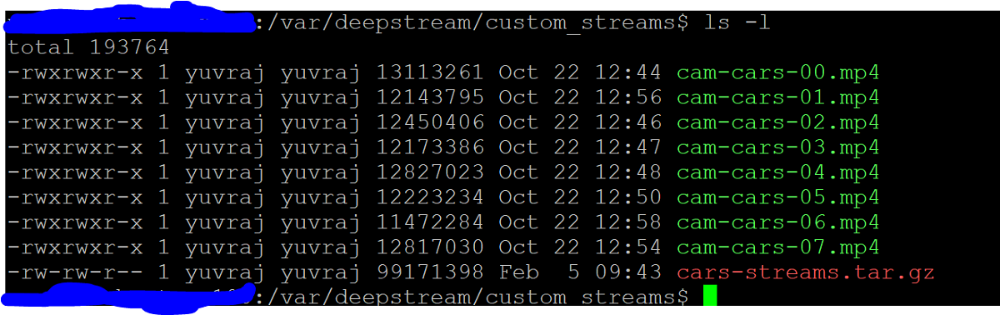

11. Download the [test5_config_file_src_infer_azure_iotedge_edited.txt](test5_config_file_src_infer_azure_iotedge_edited.txt) file and copy it to /var/deepstream/custom_configs

12. Navigate to the Azure Portal. Select **IoT Hub Provisioned**, click on **Automatic Device Management**, then click on **IoT Edge**:

    

13. In the right-hand pane, select the device identity whose device connection string was used above. Click on set modules:

    

14. Under IoT Edge Modules, click and choose Marketplace Module:

    

15. Search for NVIDIA and choose DeepStream SDK like displayed below:

    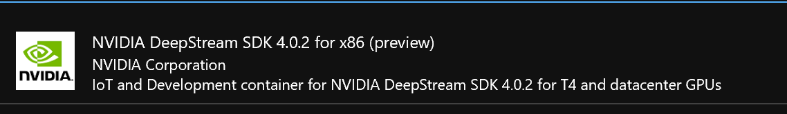

16. Ensure NvidiaDeepStreamSDK module is listed under IoT Edge Modules:

    

17. Click on The "NVIDIADeepStreamSDK" module and choose "Container Create Options." The default configuration is shown here:

    

    Replace the configuration above with the configuration below:

    ```shell
    {
      "ExposedPorts": {
        "8554/tcp": {}
      },
      "Entrypoint": [
        "/usr/bin/deepstream-test5-app",
        "-c",
        "test5_config_file_src_infer_azure_iotedge_edited.txt",
        "-p",
        "1",
        "-m",
        "1"
      ],
      "HostConfig": {
        "runtime": "nvidia",
        "Binds": [
          "/var/deepstream/custom_configs:/root/deepstream_sdk_v4.0.2_x86_64/sources/apps/sample_apps/deepstream-test5/custom_configs/",
          "/var/deepstream/custom_streams:/root/deepstream_sdk_v4.0.2_x86_64/sources/apps/sample_apps/deepstream-test5/custom_streams/"
        ],
        "PortBindings": {
          "8554/tcp": [
            {
              "HostPort": "8554"
            }
          ]
        }
      },
      "WorkingDir": "/root/deepstream_sdk_v4.0.2_x86_64/sources/apps/sample_apps/deepstream-test5/custom_configs/"
    }
    ```

18. Click **Review and Create**, and on the next page click **Create**. You should now see the three modules listed below for your IoT Edge device in the Azure Portal:

    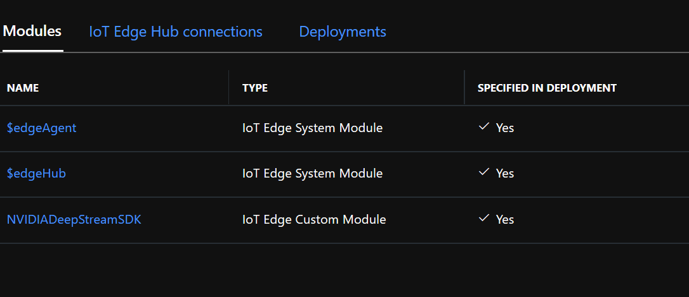

19. Connect to the Ubuntu VM using the SSH client and verify that the correct modules are running:

    ```shell
    sudo iotedge list
    ```

    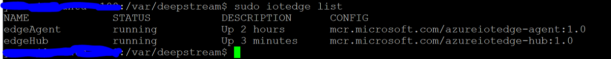

    ```shell
    nvidia-smi
    ```

    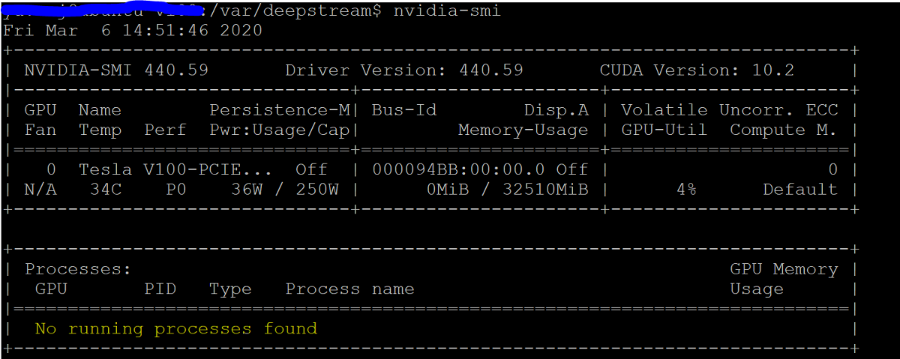

    > [!NOTE]
    > It will take a few minutes for the NvidiaDeepstream Container to be downloaded. You can validate the download using the command "journalctl -u iotedge --no-pager --no-full" to look at the iotedge daemon logs.

20. Confirm that the NvdiaDeepStreem Container is operational. The command output in the screenshots below indicates success.

    ```shell
    sudo iotedge list
    ```

    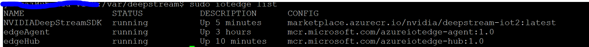

    ```shell
    sudo iotedge logs -f NVIDIADeepStreamSDK
    ```

    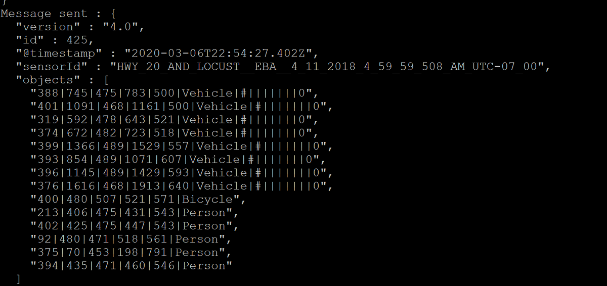

    ```shell
    nvidia-smi
    ```

    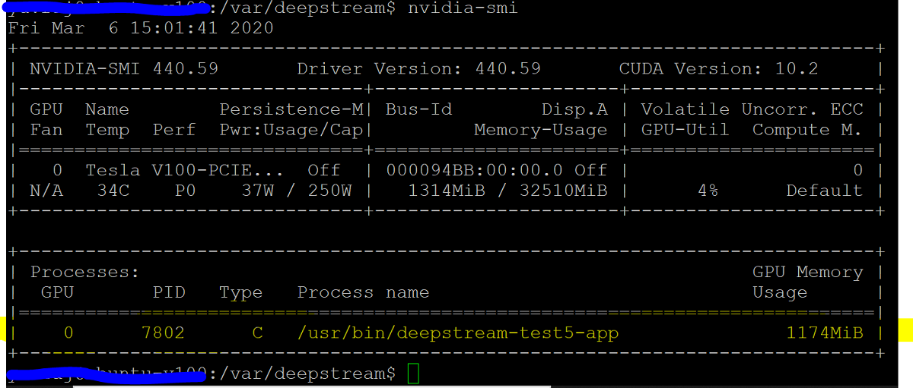

21. Confirm the TCP/IP address for your Ubuntu VM using the **ifconfig** command and look for the TCP/IP address next to the **eth0** interface.

22. Install the VLC Player on your workstation. Within the VLC Player, click **Media -> open network stream**, and type in the address using this format:

    rtsp://ipaddress:8554/ds-test

    where ipaddress is the TCP/IP address of your VM.

    :::image type="content" source="media/attach-gpu-to-linux-vm/vlc-player.png" alt-text="VLC Player Screenshot":::

## Next steps

For more on GPUs and DDA, see also:

- [Plan for deploying devices using Discrete Device Assignment](/windows-server/virtualization/hyper-v/plan/plan-for-deploying-devices-using-discrete-device-assignment)
- [Deploy graphics devices using Discrete Device Assignment](/windows-server/virtualization/hyper-v/deploy/deploying-graphics-devices-using-dda)