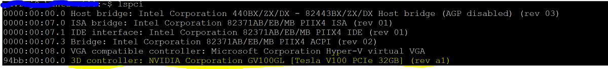

# Attaching a GPU to an Ubuntu Linux VM on Azure Stack HCI

> Applies to: Windows Server 2019

This topic provides step-by-step instructions to configure an NVIDIA graphics processing unit (GPU) with Azure Stack HCI using Discrete Device Assignment (DDA) technology for an Ubuntu VM.
This document assumes you have the Azure Stack HCI cluster deployed and VMs installed.

## Install and configure NVIDIA GPU with DDA

Install the NVIDIA GPU physically into the server, following OEM instructions and BIOS recommendations.

### Configure the Azure Stack HCI node

Choose the server node(s) in your Azure Stack HCI cluster to install NVIDIA GPUs. Once the server boots up:

1. Login as Administrator to the Azure Stack HCI node with the NVIDIA GPU installed.
2. Open **Device Manager** and navigate to the *other devices* section. You should see a device listed as "PCI Express Graphics Processing Unit."
3. Right-click on "PCI Express Graphics Processing Unit" to bring up the **Properties** page. Click **Details**. From the dropdown under **Property**, select "Location paths."
4. Note the value with string PCIRoot as highlighted in the screen shot below. Right-click on **Value** and copy/save it.
    
5. Open Windows PowerShell with elevated privileges and execute the **Dismount-VMHostAssignableDevice** cmdlet to dismount the GPU device for DDA to VM. Replace the LocationPath value for your device obtained in step 4.
    ```PowerShell
    Dismount-VMHostAssignableDevice -LocationPath "PCIROOT(16)#PCI(0000)#PCI(0000)" -force
    ```
6. Confirm the device is listed under system devices in device manager as Dismounted.
    > [!div class="mx-imgBorder"]
    > 

### Create and configure an Ubuntu virtual machine

1. Download [Ubuntu desktop release 18.04.02 ISO](http://cdimage.ubuntu.com/lubuntu/releases/18.04.2/release/lubuntu-18.04.2-desktop-amd64.iso).
2. Open **Hyper-V Manager** on the node of the system with the GPU installed.
   > [!NOTE]
   > DDA does not support failover, and [here's why](/windows-server/virtualization/hyper-v/plan/plan-for-deploying-devices-using-discrete-device-assignment). This is a virtual machine limitation with DDA. Therefore, we recommend using **Hyper-V Manager** to deploy the VM on the node instead of **Failover Cluster Manager**. Use of **Failover Cluster Manager** with DDA will fail with an error message indicating that the VM has a device that doesn't support high availability.
3. Using the Ubuntu ISO downloaded in step 1, create a new virtual machine using the **New Virtual Machine Wizard** to create a Ubuntu Gen 1 VM with 2GB of memory and a network card attached to it.
4. Assign the Dismounted GPU device to the VM using commands below, replacing *LocationPath* value with value for your device.
    ```PowerShell
    # Confirm that there are no DDA devices assigned to the VM
    Get-VMAssignableDevice -VMName Ubuntu

    # Assign the GPU to the VM
    Add-VMAssignableDevice -LocationPath "PCIROOT(16)#PCI(0000)#PCI(0000)" -VMName Ubuntu

    # Confirm that the GPU is assigned to the VM
    Get-VMAssignableDevice -VMName Ubuntu
    ```

    Successful assignment of the GPU to the VM will show the output below:
    

    Configure additional values following GPU documentation [here.](/windows-server/virtualization/hyper-v/deploy/deploying-graphics-devices-using-dda)

   ```PowerShell
    # Enable Write-Combining on the CPU
    Set-VM -GuestControlledCacheTypes $true -VMName VMName

    # Configure the 32 bit MMIO space
    Set-VM -LowMemoryMappedIoSpace 3Gb -VMName VMName

    # Configure greater than 32 bit MMIO space
    Set-VM -HighMemoryMappedIoSpace 33280Mb -VMName VMName
   ```

   > [!NOTE]
   > The Value 33280Mb should suffice for most GPUs, but should be replaced with a value greater than your GPU memory.

5. Connect to the VM and start the Ubuntu OS install. Choose the defaults to install the Ubuntu OS on the VM.

6. After the installation is complete, shut down the VM and configure the "Automatic stop action" for the VM to shut down the guest operating system as in the screenshot below:
    > [!div class="mx-imgBorder"]
    > 

7. Log in to Ubuntu and open the terminal to install SSH using commands below.

   ```shell
    $ sudo apt install openssh-server
   ```

8. Find The TCP/IP address for the Ubuntu installation using the ifconfig command and copy the IP address for the eth0 interface.

9. Use a SSH client such as [Putty](https://www.chiark.greenend.org.uk/~sgtatham/putty/) and connect to the Ubuntu VM for further configuration.

10. Upon login through the SSH client, issue the command "lspci" to validate that the NVIDIA GPU is listed:
    

    > [!IMPORTANT]
    > If The NVIDIA GPU is not seen as "3D controller," please do not proceed further. Please ensure that the steps above are followed before proceeding.

## Next steps

For more on GPUs and DDA, see also:

- [Plan for deploying devices using Discrete Device Assignment](/windows-server/virtualization/hyper-v/plan/plan-for-deploying-devices-using-discrete-device-assignment)
- [Deploy graphics devices using Discrete Device Assignment](/windows-server/virtualization/hyper-v/deploy/deploying-graphics-devices-using-dda)