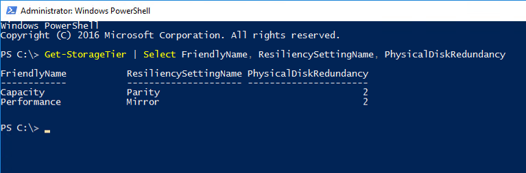

# Creating volumes in Azure Stack HCI

> Applies to: Azure Stack HCI, version 20H2; Windows Server 2019

This topic describes how to create volumes on a Storage Spaces Direct cluster by using Windows Admin Center and Windows PowerShell, how to work with files on the volumes, and how to enable data deduplication and compression on volumes.

## Create a three-way mirror volume

To create a three-way mirror volume using Windows Admin Center:

1. In Windows Admin Center, connect to a Storage Spaces Direct cluster, and then select **Volumes** from the **Tools** pane.
2. On the **Volumes** page, select the **Inventory** tab, and then select **Create volume**.
3. In the **Create volume** pane, enter a name for the volume, and leave **Resiliency** as **Three-way mirror**.
4. In **Size on HDD**, specify the size of the volume. For example, 5 TB (terabytes).
5. Select **Create**.

Depending on the size, creating the volume can take a few minutes. Notifications in the upper-right will let you know when the volume is created. The new volume appears in the Inventory list.

Watch a quick video on how to create a three-way mirror volume.

> [!VIDEO https://www.youtube-nocookie.com/embed/o66etKq70N8]

## Create a mirror-accelerated parity volume

Mirror-accelerated parity reduces the footprint of the volume on the HDD. For example, a three-way mirror volume would mean that for every 10 terabytes of size, you will need 30 terabytes as footprint. To reduce the overhead in footprint, create a volume with mirror-accelerated parity. This reduces the footprint from 30 terabytes to just 22 terabytes, even with only 4 servers, by mirroring the most active 20 percent of data, and using parity, which is more space efficient, to store the rest. You can adjust this ratio of parity and mirror to make the performance versus capacity tradeoff that's right for your workload. For example, 90 percent parity and 10 percent mirror yields less performance but streamlines the footprint even further.

To create a volume with mirror-accelerated parity in Windows Admin Center:

1. In Windows Admin Center, connect to a Storage Spaces Direct cluster, and then select **Volumes** from the **Tools** pane.
2. On the Volumes page, select the **Inventory** tab, and then select **Create volume**.
3. In the **Create volume** pane, enter a name for the volume.
4. In **Resiliency**, select **Mirror-accelerated parity**.
5. In **Parity percentage**, select the percentage of parity.
6. Select **Create**.

Watch a quick video on how to create a mirror-accelerated parity volume.

> [!VIDEO https://www.youtube-nocookie.com/embed/R72QHudqWpE]

## Open volume and add files

To open a volume and add files to the volume in Windows Admin Center:

1. In Windows Admin Center, connect to a Storage Spaces Direct cluster, and then select **Volumes** from the **Tools** pane.
2. On the **Volumes** page, select the **Inventory** tab.
2. In the list of volumes, select the name of the volume that you want to open.

    On the volume details page, you can see the path to the volume.

4. At the top of the page, select **Open**. This launches the **Files** tool in Windows Admin Center.
5. Navigate to the path of the volume. Here you can browse the files in the volume.
6. Select **Upload**, and then select a file to upload.
7. Use the browser **Back** button to go back to the **Tools** pane in Windows Admin Center.

Watch a quick video on how to open a volume and add files.

> [!VIDEO https://www.youtube-nocookie.com/embed/j59z7ulohs4]

## Turn on deduplication and compression

Deduplication and compression is managed per volume. Deduplication and compression uses a post-processing model, which means that you won't see savings until it runs. When it does, it'll work over all files, even those that were there from before.

1. In Windows Admin Center, connect to a Storage Spaces Direct cluster, and then select **Volumes** from the **Tools** pane.
2. On the **Volumes** page, select the **Inventory** tab.
3. In the list of volumes, select the name of the volume that want to manage.
4. On the volume details page, click the switch labeled **Deduplication and compression**.
5. In the **Enable deduplication** pane, select the deduplication mode.

    Instead of complicated settings, Windows Admin Center lets you choose between ready-made profiles for different workloads. If you're not sure, use the default setting.

6. Select **Enable**.

Watch a quick video on how to turn on deduplication and compression.

> [!VIDEO https://www.youtube-nocookie.com/embed/PRibTacyKko]

## Create volumes using Windows PowerShell

First, launch Windows PowerShell from the Windows start menu. We recommend using the **New-Volume** cmdlet to create volumes for Azure Stack HCI. It provides the fastest and most straightforward experience. This single cmdlet automatically creates the virtual disk, partitions and formats it, creates the volume with matching name, and adds it to cluster shared volumes – all in one easy step.

The **New-Volume** cmdlet has four parameters you'll always need to provide:

- **FriendlyName:** Any string you want, for example *"Volume1"*
- **FileSystem:** Either **CSVFS_ReFS** (recommended) or **CSVFS_NTFS**
- **StoragePoolFriendlyName:** The name of your storage pool, for example *"S2D on ClusterName"*
- **Size:** The size of the volume, for example *"10TB"*

   > [!NOTE]
   > Windows, including PowerShell, counts using binary (base-2) numbers, whereas drives are often labeled using decimal (base-10) numbers. This explains why a "one terabyte" drive, defined as 1,000,000,000,000 bytes, appears in Windows as about "909 GB". This is expected. When creating volumes using **New-Volume**, you should specify the **Size** parameter in binary (base-2) numbers. For example, specifying "909GB" or "0.909495TB" will create a volume of approximately 1,000,000,000,000 bytes.

### Example: With 2 or 3 servers

To make things easier, if your deployment has only two servers, Storage Spaces Direct will automatically use two-way mirroring for resiliency. If your deployment has only three servers, it will automatically use three-way mirroring.

```PowerShell
New-Volume -FriendlyName "Volume1" -FileSystem CSVFS_ReFS -StoragePoolFriendlyName S2D* -Size 1TB
```

### Example: With 4+ servers

If you have four or more servers, you can use the optional **ResiliencySettingName** parameter to choose your resiliency type.

-	**ResiliencySettingName:** Either **Mirror** or **Parity**.

In the following example, *"Volume2"* uses three-way mirroring and *"Volume3"* uses dual parity (often called "erasure coding").

```PowerShell
New-Volume -FriendlyName "Volume2" -FileSystem CSVFS_ReFS -StoragePoolFriendlyName S2D* -Size 1TB -ResiliencySettingName Mirror
New-Volume -FriendlyName "Volume3" -FileSystem CSVFS_ReFS -StoragePoolFriendlyName S2D* -Size 1TB -ResiliencySettingName Parity
```

### Example: Using storage tiers

In deployments with three types of drives, one volume can span the SSD and HDD tiers to reside partially on each. Likewise, in deployments with four or more servers, one volume can mix mirroring and dual parity to reside partially on each.

To help you create such volumes, Storage Spaces Direct provides default tier templates called *Performance* and *Capacity*. They encapsulate definitions for three-way mirroring on the faster capacity drives (if applicable), and dual parity on the slower capacity drives (if applicable).

You can see them by running the **Get-StorageTier** cmdlet.

```PowerShell
Get-StorageTier | Select FriendlyName, ResiliencySettingName, PhysicalDiskRedundancy
```



To create tiered volumes, reference these tier templates using the **StorageTierFriendlyNames** and **StorageTierSizes** parameters of the **New-Volume** cmdlet. For example, the following cmdlet creates one volume which mixes three-way mirroring and dual parity in 30:70 proportions.

```PowerShell
New-Volume -FriendlyName "Volume4" -FileSystem CSVFS_ReFS -StoragePoolFriendlyName S2D* -StorageTierFriendlyNames Performance, Capacity -StorageTierSizes 300GB, 700GB
```

You're done! Repeat as needed to create more than one volume.

## Create volumes and setup replication for stretched clusters

For stretched clusters, Storage Replica is used to provide replication between sites. Specifically, data and log volumes for each node pair across sites are created, a storage pool for each site is created, a replication group for each site is created, and a replication partnership between the sites is created - all automatically. You can also specify unidirectional replication (active/passive) or bidirectional (active/passive) operation.

OK, let's begin:

1. In Windows Admin Center, under **Tools**, select **Volumes**.
1. In the right pane, select the **Inventory** tab, then select **Create**.
1. In the **Create volume** panel, select **Replicate volume between sites**.
1. Select a replication direction between sites from the drop-down box.
1. Under **Replication mode**, select **Asynchronous** or **Synchronous**.
1. Enter a Source replication group name and a Destination replication group name.
1. Enter the desired size for the log volume.
1. Under **Advanced**, do the following:
     - Enter/change the **Source replication group name**.
     - Enter/change the **Destination replication group name**.
     - To **use blocks already seeded on the target**..., select that checkbox.
     - To **encrypt replication traffic**, select that checkbox.
     - To **enable consistency groups**, select that checkbox.
1. When finished, click **Create**.
1. In the right pane, verify that a data disk and a log disk are created in your primary (active) site, and that corresponding data and log replica disks are created in the secondary (passive) site. For bidirectional replication, you should see two sets of data and volume disks.
1. Under **Tools**, select **Storage Replica**.
1. In the right pane, under **Partnerships**, verify that the replication partnership has been successfully created.

Afterwards, you should verify successful data replication between sites before deploying VMs and other workloads. See the Verifying replication section in [Validate the cluster] for more information.

## Create volumes for stretched clusters using PowerShell

Volume creation is different for single-site standard clusters versus stretched (two-site) clusters. For both scenarios however, you use the `New-Volume` cmdlet to create a virtual disk, partition and format it, create a volume with matching name, and add it to cluster shared volumes (CSV).

For more information, see [Create volumes] (https://docs.microsoft.com/azure-stack/hci/manage/create-volumes).

Creating volumes and virtual disks for stretched clusters is a bit more involved than for single-site clusters. Stretched clusters require a minimum of four volumes - two data volumes and two log volumes, with a data/log volume pair residing in each site. Then you will create a replication group for each site, and setup replication between them.

There are two types of stretched clusters, active/passive and active/active. You can set up active-passive site replication, where there is a preferred site and direction for replication. Active-active replication is where replication can happen bi-directionally from either site. This article covers the active/passive configuration only.

You can also define a global preferred site where all resources and groups run on that site. There is a `PreferredSite` parameter used for just this purpose. This setting can be defined at the site and group level.  

```powershell
(Get-Cluster).PreferredSite = Site1
```

### Active/passive stretched cluster

The following diagram shows Site 1 as the active site with replication to Site 2, a unidirectional replication.

:::image type="content" source="media/creating-volumes/active-passive-stretched-cluster.png" alt-text="Active/passive stretched cluster scenario" lightbox="media/creating-volumes/active-passive-stretched-cluster.png":::

### Active/active stretched cluster

The following diagram shows both Site 1 and Site 2 as being active sites, with bidirectional replication to the other site.

:::image type="content" source="media/creating-volumes/active-active-stretched-cluster.png" alt-text="Active/active stretched cluster scenario" lightbox="media/creating-volumes/active-active-stretched-cluster.png":::

OK, now we are ready to begin. We first need to move resource groups around from node to node. The `Move-ClusterGroup` cmdlet is used to this.

First we move the "Available Storage" storage pool resource group to node Server1 in Site1 using the `Move-ClusterGroup` cmdlet:

```powershell
Move-ClusterGroup -Cluster ClusterS1 -Name ‘Available Storage’ -Node Server1
```

Next, create the first virtual disk (Disk1) for node Server1 on site Site1:

```powershell
New-Volume -CimSession Server1 -FriendlyName Disk1 -FileSystem REFS -DriveLetter F -ResiliencySettingName Mirror -Size 10GB -StoragePoolFriendlyName "Storage Pool for Site 1"
```

Create a second first virtual disk (Disk2) for node Server1:

```powershell
New-Volume -CimSession Server1 -FriendlyName Disk2 -FileSystem REFS -DriveLetter G -ResiliencySettingName Mirror -Size 10GB -StoragePoolFriendlyName "Storage Pool for Site 1"
```

Now, take the "Available Storage" group offline:

```powershell
Stop-ClusterGroup -Cluster ClusterS1 -Name 'Available Storage'
```

And move the "Available Storage" group to node Server3 in Site2:

```powershell
Move-ClusterGroup -Name 'Available Storage' -Node Server3
```

Create the first virtual disk (Disk3) on node Server3 in Site2:

```powershell
New-Volume -CimSession Server3 -FriendlyName Disk3 -FileSystem REFS -DriveLetter H -ResiliencySettingName Mirror -Size 10GB -StoragePoolFriendlyName "Storage Pool for Site 2"
```

And create a second virtual disk (Disk4) on node Server3:

```powershell
New-Volume -CimSession Server3 -FriendlyName Disk4 -FileSystem REFS -DriveLetter I -ResiliencySettingName Mirror -Size 10GB -StoragePoolFriendlyName "Storage Pool for Site 2"
```

Now take the `Available Storage` group offline and then move it back to one of the nodes in Site1:

```powershell
Stop-ClusterGroup -Cluster ClusterS1 -Name 'Available Storage'
```

```powershell
Move-ClusterGroup -Cluster ClusterS1 -Name 'Available Storage' -Node Server1
```

Using the `Get-ClusterResource` cmdlet, ensure that four virtual disk volumes were created, two in each storage pool:

```powershell
Get-ClusterResource -Cluster ClusterS1
```

Now add Disk1 to Cluster Shared Volumes:

```powershell
Add-ClusterSharedVolume -Name 'Cluster Virtual Disk (Disk1)'
```

## Setup replication for stretched clusters using PowerShell

When using PowerShell to set up Storage Replica for a stretched cluster, the disk that will be used for the source data will need to be added as a Cluster Shared Volume (CSV). All other disks must remain as non-CSV drives in the Available Storage group. These disks will then be added as Cluster Shared Volumes during the Storage Replica creation process.

In the previous step, the virtual disks were added using drive letters to make the identification of them easier. Storage Replica is a one-to-one replication, meaning a single disk can replicate to another single disk.

### Validate the topology for replication

Before starting, you should run the `Test-SRTopology` cmdlet for an extended period (like several hours). The `Test-SRTopology` cmdlet validates a potential replication partnership and validates the local host to the destination server or remotely between source and destination servers.

This cmdlet will perform will validate that:

- SMB can be accessed over the network, which means that TCP port 445 and port 5445 are open bi-directionally.
- WS-MAN can be accessed over HTTP on the network, which means that TCP port 5985 and 5986 are open.
- An SR WMIv2 provider can be accessed and accepts requests.
- Source and destination data volumes exist and are writable.
- Source and destination log volumes exist with NTFS formatting or ReFS formatting and sufficient free space.
- Storage is initialized in GPT format, not MBR, with matching sector sizes.
- There is sufficient physical memory to run replication.

In addition, the `Test-SRTopology` cmdlet will also measure:

- Round-trip latency of ICMP and report the average.
- Performance counters for write Input/Output and report the average seen on that volume.
- Estimated initial synchronization time.

Once Test-SRTopology completes, it will create an .html file (TestSrTopologyReport with date and time) in your Windows Temp folder. Any warning or failures should be reviewed as they could cause Storage Replica to not be properly created.

An example command that would run for 5 hours would be:

```powershell
Test-SRTopology -SourceComputerName Server1 -SourceVolumeName W: -SourceLogVolumeName X: -DestinationComputerName Server3 -DestinationVolumeName Y: -DestinationLogVolumeName Z: -DurationInMinutes 300 -ResultPath c:\temp
```

### Create the replication partnership

Now that you completed the `Test-SRTopology` tests, you are ready to configure Storage Replica and create the replication partnership. In a nutshell, we will configure Storage Replica by creating replication groups (RG) for each site and specifying the data volumes and log volumes for both the source server nodes in Site1 (Server1, Server2) and the destination (replicated) server nodes in Site2 (Server3, Server4).

Let's begin:

1. Add the Site1 data disk as a Cluster Shared Volume (CSV):

```powershell
Add-ClusterSharedVolume -Name "Cluster Virtual Disk (Site1)"
```

1. The Available Storage group should be "owned" by the node it is currently sitting on. The group can be moved to Server1 using:

```powershell
Move-ClusterGroup -Name “Available Storage” -Node Server1
```

1. To create the replication partnership, use the `New-SRPartnership` cmdlet. This cmdlet is also where you specify the source data volume and log volume names:

```powershell
New-SRPartnership -SourceComputerName "Server1" -SourceRGName "Replication1" -SourceVolumeName "C:\ClusterStorage\Disk1\" -SourceLogVolumeName "G:" -DestinationComputerName "Server3" -DestinationRGName "Replication2" -DestinationVolumeName "H:" -DestinationLogVolumeName "I:"
```

The `New-SRPartnership` cmdlet creates a replication partnership between the two replication groups for the two sites. In this example `Replication1` is the replication group for primary node Server1 in Site1, and `Replication2` is the replication group for destination node Server3 in Site2.

Storage Replica will now be setting everything up. If there is any data to be replicated, it will do it here. Depending on the amount of data it needs to replicate, this may take a while. It is recommended to not move any groups around until this process completes.

## Next steps

To perform other storage management tasks in Storage Spaces Direct, see also:

- [Storage Spaces Direct overview](/windows-server/storage/storage-spaces/storage-spaces-direct-overview)
- [Planning volumes in Storage Spaces Direct](/windows-server/storage/storage-spaces/plan-volumes)
- [Extending volumes in Storage Spaces Direct](/windows-server/storage/storage-spaces/resize-volumes)
- [Deleting volumes in Storage Spaces Direct](/windows-server/storage/storage-spaces/delete-volumes)