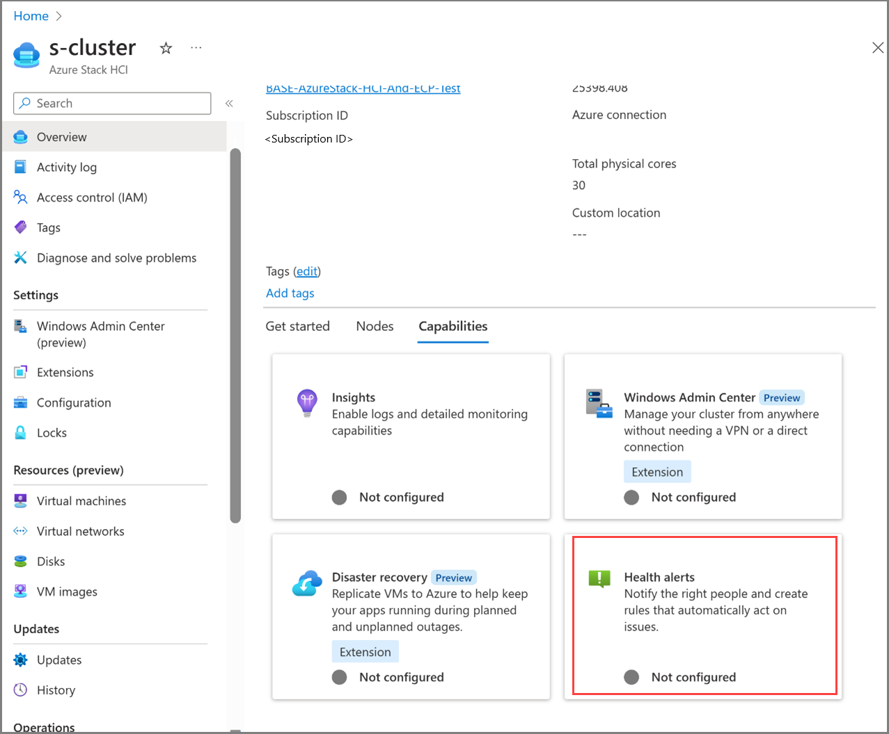
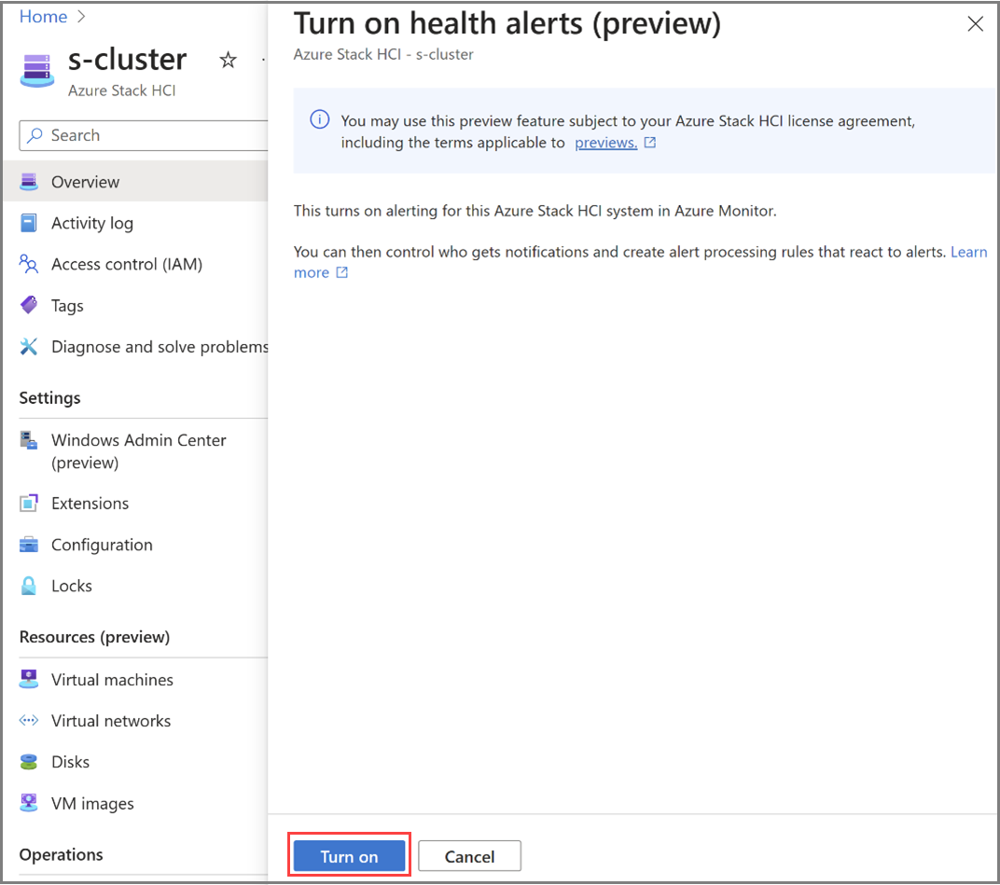
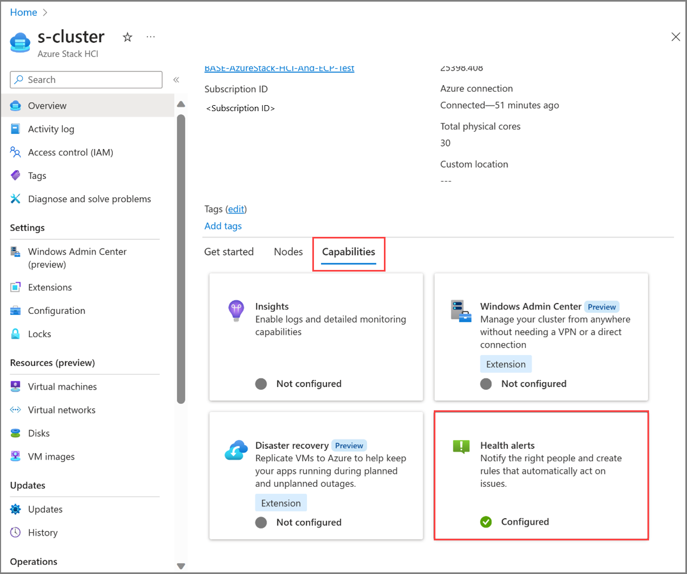
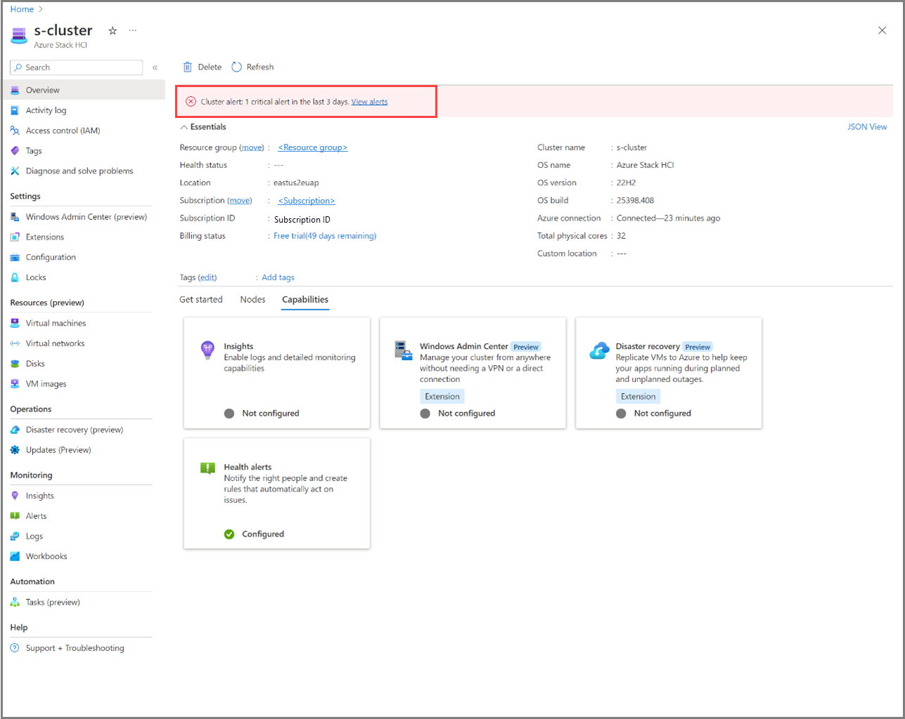

# Respond to Azure Stack HCI health alerts using Azure Monitor alerts (preview)

[!INCLUDE [hci-applies-to-23h2](../../includes/hci-applies-to-23h2.md)]

This article describes how to use [Azure Monitor alerts](/azure/azure-monitor/alerts/alerts-overview) to proactively identify, notify, and respond to Azure Stack HCI health alerts.

[!INCLUDE [important](../../includes/hci-preview.md)]

## About integration of Azure Monitor and Azure Stack HCI alerts

The integration of Azure Monitor alerts with Azure Stack HCI enhances the health alerts capability of Azure Stack HCI. With this integration, any health alerts generated within your on-premises Azure Stack HCI system are automatically forwarded to Azure Monitor alerts. You can link these alerts with your automated incident management systems, ensuring timely and efficient responses.

For more information about Azure Monitor alerts, see [What are Azure Monitor alerts?](/azure/azure-monitor/alerts/alerts-overview).

## Benefits

The integration of Azure Monitor alerts with Azure Stack HCI offers several key benefits:

- **No additional cost.** By enabling the health alerts capability, you automatically get Azure Monitor alerts for all your Azure Stack HCI cluster health issues at no additional cost. There's no need to set up Log Analytics or manually author any alert rules.
- **Near real-time monitoring.** With Azure Stack HCI health alerts providing near real-time monitoring, you can detect issues as they occur and take immediate action, thereby reducing downtime.
- **Customizability.** The Azure Stack HCI health alerts experience is built on top of Azure Monitor alerts. You can configure the alert processing rules to notify the right team via your preferred [Incident management partners](/azure/azure-monitor/partners), ensuring quick and effective response to the issues.

## Prerequisites  

Here are the prerequisites for using health alerts with Azure Stack HCI:

- Have access to an Azure Stack HCI, version 23H2 system that is deployed and registered. For more information, see [Deploy Azure Stack HCI via Azure portal](../deploy/deploy-via-portal.md). 

## Configure alerts for Azure Stack HCI

Here are the high-level steps to configure health alerts for Azure Stack HCI:

- **Step 1:** Turn on the health alerts capability.
- **Step 2:** Configure alert processing rules.

### Step 1: Turn on the health alerts capability

Make sure your Azure subscription is activated for evaluation before you turn on the health alerts capability on your Azure Stack HCI system.

When you enable alerts via the Azure portal, the Azure Monitor extension is installed in the background. To verify that this extension is installed, go to **Settings** > **Extensions** in the Azure portal. This extension shows up as **AzureEdgeAlerts** in the list of extensions.

Follow these steps to turn on health alerts via the Azure portal.

1. Go to your Azure Stack HCI cluster resource page and select your cluster. Under the **Capabilities** tab, select the **Health alerts** tile.

   

2. On the **Turn on health alerts** pane on the right, select the **Turn on** button.  

   

   The installation of the Azure Monitor alerts extension begins in the background.

3. After the extension is successfully installed, you are taken to the **Capabilities** tab. Verify that the **Health alerts** tile under the **Capabilities** tab now shows as **Configured**.

   

### Step 2: Configure alert processing rules

In this step, you configure alert processing rules, consisting of a series of configurations and actions to determine how to handle the incoming alerts. These rules enable you to add or suppress action groups, apply filters, or specify predefined schedules to apply the rule.

Here are some common use cases of how you can configure alert processing rules to handle Azure Stack HCI health alerts:

- Configure an action group to determine who receives a notification and the type of notification to send. Notifications can be sent via email, SMS message, or both.
- Specify that all alerts for storage-related health faults should be directed to the team responsible for addressing storage issues.
- Configure when to apply the rule. By default, the rule is always active. You can set it to work at a specific time, or you can set up a recurring schedule.

For information about alert processing rules and how to configure them, see [Alert processing rules](/azure/azure-monitor/alerts/alerts-processing-rules?tabs=portal) and [Configure an alert processing rule](/azure/azure-monitor/alerts/alerts-processing-rules?tabs=portal#configure-an-alert-processing-rule).

## Review alerts

In the Azure portal, you can review health alerts on your Azure Stack HCI cluster in real-time from the **Monitoring** > **Alerts** blade.

The **Alerts** blade has a high-level summary of alerts at each severity level. You can drill down to see individual alerts at each severity level.

   

<!--The **Overview** page of your Azure Stack HCI cluster resource page also displays the alerts.

   -->

## Disable health alerts

To disable the health alerts capability, uninstall the Azure Monitor alerts extension that you installed earlier.

For instructions, see [Uninstall an extension from the Azure portal](./arc-extension-management.md#uninstall-an-extension)

## Next steps

- [View a list of health alerts](./health-service-faults.md) that you might run across within your Azure Stack HCI system.
