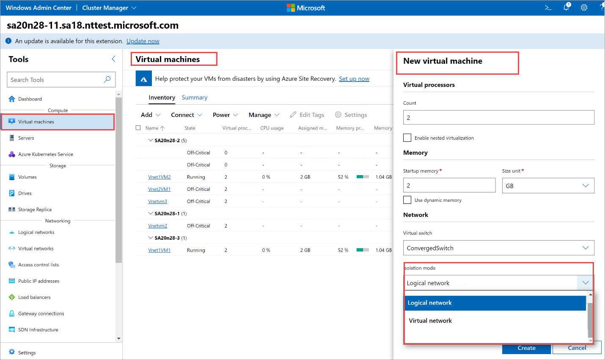
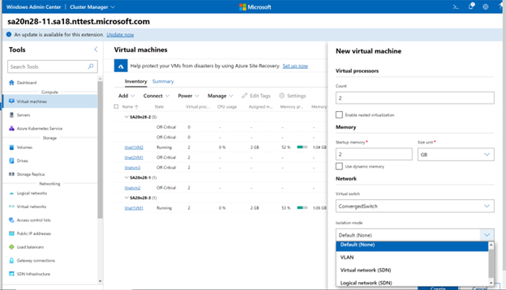
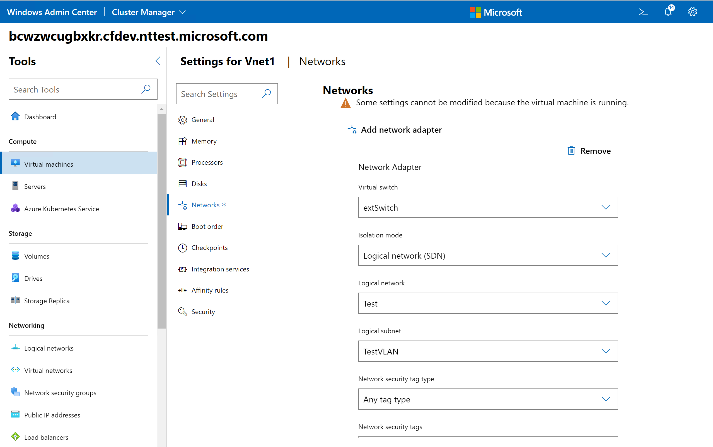

# Use default network access policies on virtual machines on your Azure Stack HCI

> Applies to: Azure Stack HCI, version 22H2 and version 22H1

Default network policies can be used to protect virtual machines running on your Azure Stack HCI from external unauthorized attacks. These policies block all inbound access to virtual machines on your Azure Stack HCI (except the specified management ports you want enabled) while allowing all outbound access.

This article describes how to enable these default network policies and assign these to VMs running on your Azure Stack HCI.

> [!NOTE]
> In this release, you can enable and assign default network policies through the Windows Admin Center.

## Enable default network access policies

To enable default network access policies, you need to install Network Controller (NC). Network Controller enforces the default network policies and is deployed in the virtual machines. For more information, see how to [Install Network Controller](../deploy/sdn-wizard.md).

## Assign default network policies to a VM

You can attach default policies to a VM in two ways:

- When creating a VM. You'll need to attach the VM to a logical network (traditional vLAN network) or a SDN virtual network.
- After the VM is created.

### Create and attach networks

Depending on the type of network you want to attach your VM to, steps may be different.

- **Attach VMs to a physical network**: Create one or more logical networks to represent those physical networks. A logical network is just a representation of the physical network(s) available to your Azure Stack HCI. For more information, see how to [Create a logical network](./tenant-logical-networks.md).

- **Attach VMs to a SDN virtual network**: Create a virtual network before you create the VM. For more information, see how to [Create a virtual network](./tenant-virtual-networks.md).

The steps to attach a VM to the physical network are different depending on whether you are using Azure Stack HCI version 22H2 or 21H2.

### [version 22H2](#tab/version-22h2)

With 22H2, if you have Network Controller installed, that option is no longer available. Instead, you must create a logical network representing the VLAN, create a logical network subnet with the VLAN, and then attach the VM to the logical network subnet.

Here is an example that explains how you can attach your VM directly to a VLAN with Azure Stack HCI 22H2 when Network Controller is installed. In this example, we will demonstrate how to connect your VM to VLAN 5: 

1. Create a logical network with any name. Ensure that Network Virtualization is disabled.

1. Add a logical subnet with any name. Provide the VLAN ID (5) when creating the subnet.

1. Apply the changes.

1. When creating a VM, attach it to the logical network and logical network subnet created earlier. For more information, see how to [Create a logical network](./tenant-logical-networks.md).

    

### [version 21H2](#tab/version-21h2)

In 21H2, you may be attaching your VM directly to a VLAN through Windows Admin Center. <!-- is there a procedure for 21H2?-->



---

### Apply default network policies

When you create a VM through Windows Admin Center, you'll see a **Security level** setting.

:::image type="content" source="./media/manage-default-network-access-policies-virtual-machines/security-level-2.png" alt-text="Screenshot showing the three security level options for VMs in Windows Admin Center." lightbox="./media/manage-default-network-access-policies-virtual-machines/security-level-2.png":::

You have three options:

- **No protection** - Choose this option if you don't want to enforce any network access policies to your VM. When this option is selected, all ports on your VM are exposed to external networks thereby posing a security risk. This option is not recommended.

    :::image type="content" source="./media/manage-default-network-access-policies-virtual-machines/no-protection-1.png" alt-text="Screenshot showing the ports that can be opened on VMs in Windows Admin Center." lightbox="./media/manage-default-network-access-policies-virtual-machines/no-protection-1.png":::

- **Open some ports** - Choose this option to go with default policies. The default policies block all inbound access and allow all outbound access. You can optionally enable inbound access to one or more well defined ports, for example, HTTP, HTTPS, SSH or RDP as per your requirements.

    :::image type="content" source="./media/manage-default-network-access-policies-virtual-machines/ports-to-open-1.png" alt-text="Screenshot showing the ports that can be opened on VMs in Windows Admin Center." lightbox="./media/manage-default-network-access-policies-virtual-machines/ports-to-open-1.png":::

- **Use existing NSG** - Choose this option to apply custom policies. You'll specify a Network Security Group (NSG) that you have already created.

    :::image type="content" source="./media/manage-default-network-access-policies-virtual-machines/use-existing-nsg-1.png" alt-text="Screenshot showing the ports that can be opened on VMs in Windows Admin Center." lightbox="./media/manage-default-network-access-policies-virtual-machines/use-existing-nsg-1.png":::

## VMs created outside of Windows Admin Center

If you are using alternate mechanisms (for example, Hyper-V UI or New-VM PowerShell cmdlet) to create VMs on your Azure Stack HCI, and you have enabled default network access policies, you will see two issues:

- The VMs may not have network connectivity. This will happen since the VM is being managed by a Hyper-V switch extension called Virtual Filtering Platform (VFP) and by default, the Hyper-V port connected to the VM is in blocked state.

    To unblock the port, run the following commands from a PowerShell session on a Hyper-V host where the VM is located:

    1. Run PowerShell as an administrator.
    1. Download and install the PowerShell Script from the gallery. Run the following command:
    
        ```azurepowershell
        Install-Script -Name SetVMPortProfile
        ```

        Accept all prompts to install from Powershell Gallery

    1. Specify the ports to be unblocked on the VM.
    
        ```azurepowershell
        SetVMPortProfile.ps1 -VMName \<Name of VM whose port has to be unblocked\> -VMNetworkAdapterName \<Name of the adapter in the
        VM\> -ProfileId "00000000-0000-0000-0000-000000000000" -ProfileData 2
        ```

- The VM doesn't have default network policies applied. Since this VM was created outside Windows Admin Center, the default policies for the VM aren't applied and the **Network Settings** for the VM doesn't display correctly. To rectify this issue, follow these steps:

    1. In Windows Admin Center, create a logical network. Create a subnet under the logical network and provide no VLAN ID or subnet prefix.

    [!INCLUDE [hci-display-correct-default-network-policies-windows](../../includes/hci-display-correct-default-network-policies-windows.md)]

    


## Upgrade from 21H2

> [!NOTE]
> Skip this section, if you upgraded from Azure Stack HCI 21H2 version and didn't have the Network Controller installed.

If you had Network Controller installed on 21H2 version and also had workload VMs on your cluster, those VMs would be in one of the following 4 isolation modes in VM (in **Network Settings**):

1. **Default (None)**: Since this mode no longer exists after you move to 22H2, The **Isolation Mode** in the VM **Network Settings** page on Windows Admin Center will be blank. Note that the VM will still continue to have same level of network connectivity as before upgrade to 22H2. To display the correct network settings in Windows Admin Center and apply default policies, follow these steps:

    1. In Windows Admin Center, create a logical network. Create a subnet under the logical network and provide the VLAN ID for network to which the VM is connected.

    [!INCLUDE [hci-display-correct-default-network-policies-windows](../../includes/hci-display-correct-default-network-policies-windows.md)]

1. **VLAN**: Since this mode no longer exists in 22H2, the **Isolation mode** in the VM **Network Settings** page on Windows Admin Center will be blank. The VM will continue to have same level of network connectivity as before upgrading to 22H2.

    1. In Windows Admin Center, create a logical network. Create a subnet under the logical network and provide no VLAN ID or subnet prefix.

    [!INCLUDE [hci-display-correct-default-network-policies-windows](../../includes/hci-display-correct-default-network-policies-windows.md)]

1. **Logical Network**: The **Network Settings** page for the VM remains the same as in 21H2.

1. **Virtual Network**: The **Network Settings** page for the VM remains the same as in 21H2.

## Next steps

Learn more about:

- [Configure network security groups with tags](../concepts/datacenter-firewall-overview.md)