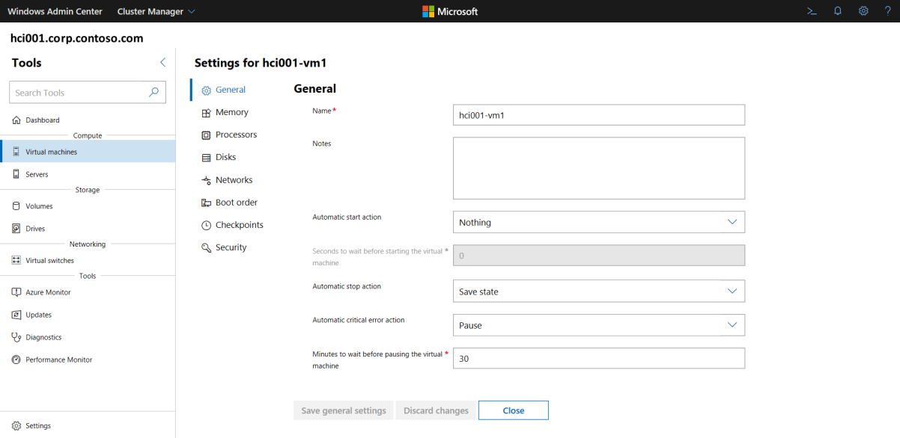
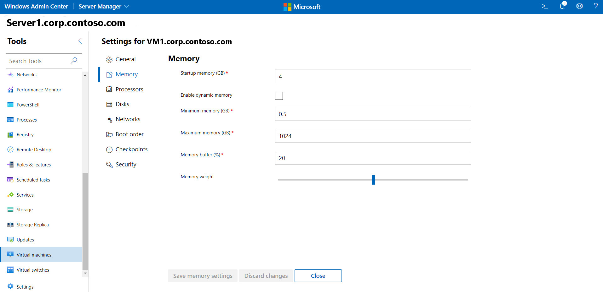
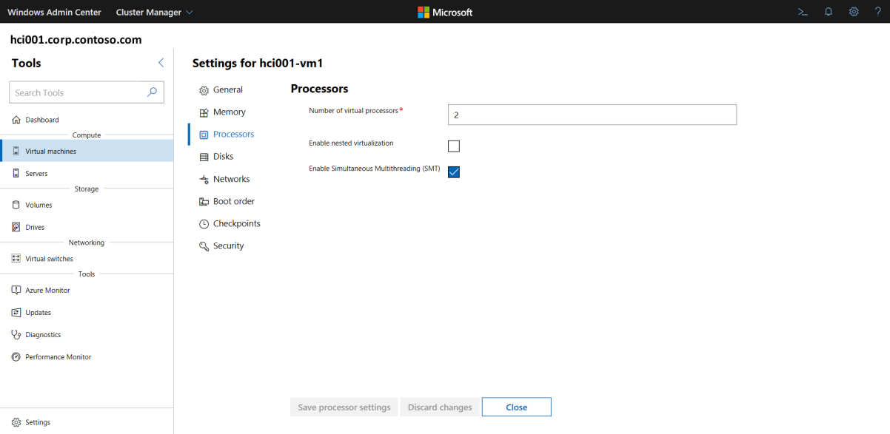
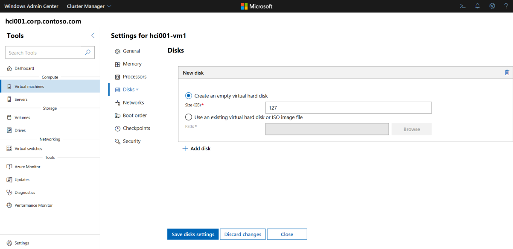
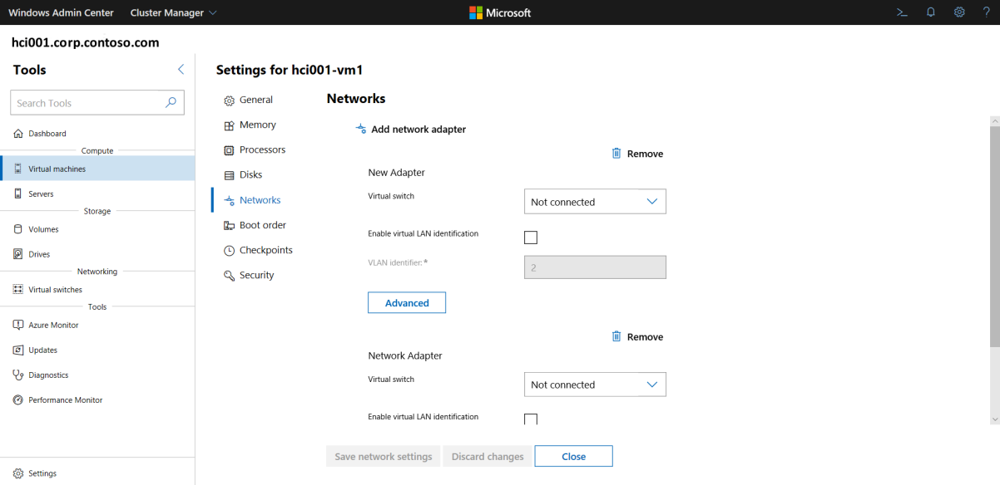
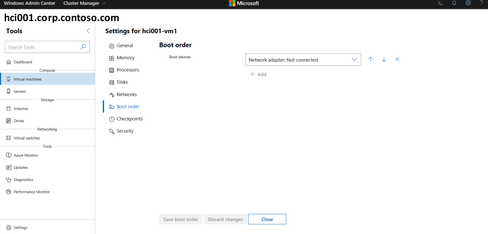
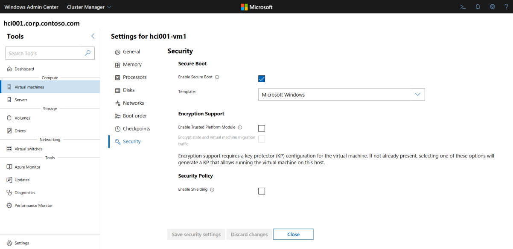
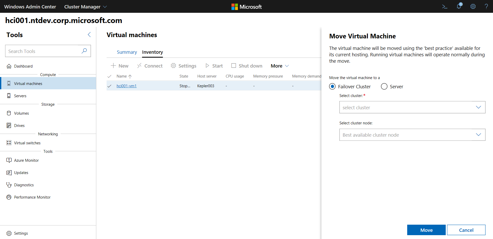
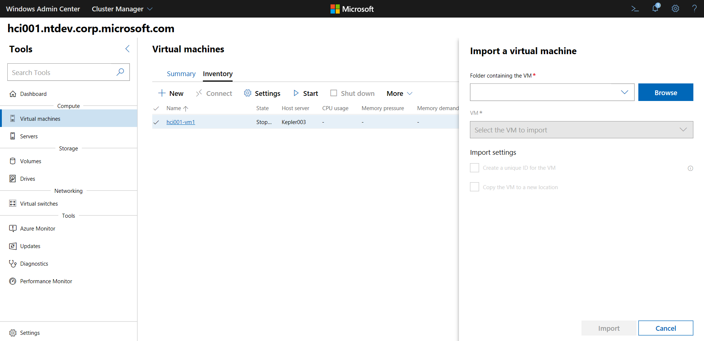
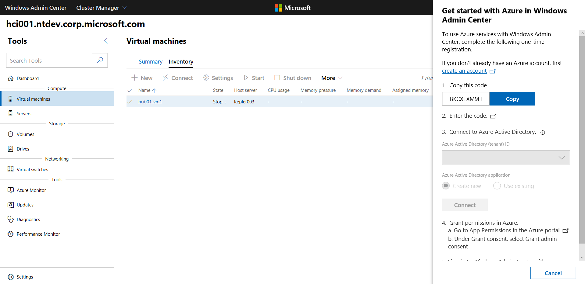

# Manage VMs on Azure Stack HCI with Windows Admin Center

> Applies to Windows Server 2019

Windows Admin Center can be used to create and manage your virtual machines (VMs) on Azure Stack HCI. This article discusses how to manage individual VMs. If you want to manage multiple VMs or cluster-wide VM settings, such as load-balancing VMs across your cluster, see [Manage Azure Stack HCI clusters].

## View VM inventory ##

You can easily see all VMs on a server or in your cluster.

> [!div class="mx-imgBorder"]
> 

1. In Windows Admin Center, under **Tools**, scroll down and select **Virtual Machines**.
1. The  **Inventory** tab on the right lists all VMs available on the current server or the cluster, and provides commands to manage individual VMs. You can:
    - View a list of the VMs running on the current server or cluster.
    - View the VM's state and host server if you are viewing VMs for a cluster. Also view CPU and memory usage from the host perspective, including memory pressure, memory demand and assigned memory, and the VM's uptime, heartbeat status, and protection status (using Azure Site Recovery).
    - Create a new VM.
    - Delete, start, turn off, shut down, pause, resume, reset or rename a VM. Also save the VM, delete a saved state, or create a checkpoint.
    - Change settings for a VM.
    - Connect to a VM console via the Hyper-V host.
    - Replicate a VM using Azure Site Recovery.
    - For operations that can be run on multiple VMs, such as Start, Shut down, Save, Pause, Delete, or Reset, you can select multiple VMs and run the operation once.

## View VM metrics ##

You can view detailed information and performance charts for a specific VM from its dedicated page.

> [!div class="mx-imgBorder"]
> 

1. Under **Tools**, scroll down and select **Virtual Machines**.
1. Click the **Inventory** tab on the right, then select the VM. On the subsequent page, you can do the following:

   - View live and historical data line charts for CPU, memory, network, IOPS and IO throughput (historical data is only available for hyperconverged clusters)
   - View, create, apply, rename, and delete checkpoints.
   - View details for the virtual hard disk (.vhd) files, network adapters, and host server.
   - View the state of the VM.
   - Save the VM, delete a saved state, or create a checkpoint.
   - Change settings for the VM.
   - Connect to the VM console using VMConnect via the Hyper-V host.
   - Replicate the VM using Azure Site Recovery.

## View aggregate VM metrics ##

You can view resources usage and performance metrics for all VMs in your cluster.

> [!div class="mx-imgBorder"]
> 

1. Under **Tools**, scroll down and select **Virtual Machines**.
1. The **Summary** tab on the right provides a holistic view of Hyper-V host resources and performance for a selected server or cluster, including the following: 
    - The number of VMs that are running, stopped, paused, and saved
    - Recent health alerts or Hyper-V event log events for clusters
    - CPU and memory usage with host vs guest breakdown
    - Live and historical data line charts for IOPS and I/O throughput for clusters

## Change VM settings ##

There are a variety of settings that you can change for a VM.

> [!NOTE]
> Some settings cannot be changed for a VM that is running and you will need to stop the VM first.

1. Under **Tools**, scroll down and select **Virtual Machines**.
1. Click the **Inventory** tab on the right, select the VM, then click **Settings**.

1. To change VM start/stop actions and general settings, select **General** and do the following:
    - To change the VM name, enter it in the **Name** field
    - To change default VM start/stop actions, select the appropriate settings from the dropdown boxes.
    - To change time intervals for pausing or starting a VM, enter the appropriate values in the fields shown

    > [!div class="mx-imgBorder"]
    > 

4. Select **Memory** to change VM startup memory, dynamic memory range, memory buffer percentage, and memory weight.

    > [!div class="mx-imgBorder"]
    > 

5. Select **Processors** to change the number of virtual processors, to enable nested virtualization, or to enable simultaneous multithreading (SMT).

    > [!div class="mx-imgBorder"]
    > 

6. To add a new virtual disk, select **Disks** and then select whether to create an empty virtual disk or to use an existing virtual disk or ISO (.iso) image file. Click **Browse** and select the path to the virtual disk or image file.

    > [!div class="mx-imgBorder"]
    > 

7. To add, remove, or change network adapter settings, select **Networks** and do the following:
    - specify the virtual switch to use, and whether to enable virtual LAN identification (you must also specify the VLAN identifier as well)
    - to change additional settings for a network adapter adapter, click **Advanced** to be able to:
        - Select between dynamic or static MAC address type
        - Enable MAC address spoofing
        - Enable bandwidth management and specify the max/min range

    > [!div class="mx-imgBorder"]
    > 

8. Select **Boot order** to add boot devices or change the VM boot sequence.

    > [!div class="mx-imgBorder"]
    > 

9. Select **Checkpoints** to enable VM checkpoints, select checkpoint type, and select checkpoint location.

    > [!NOTE]
    > The **Production** checkpoint setting is recommended and uses backup technology in the guest operating system to create data-consistent checkpoints. The **Standard** setting uses VHD snapshots to create checkpoints with application and service state.

    > [!div class="mx-imgBorder"]
    > 

10. To change VM security settings, select **Security** and do the following:
    - Select **Enable Secure Boot** to help prevent unauthorized code from running at boot time (recommended). Also select a Microsoft or open-source template from the drop-down box

    - Under **Encryption Support**, you can

        - Select **Enable Trusted Platform Module** to be able to use a hardware cryptographic service module

        - Enable encryption of state and virtual machine migration traffic

        > [!NOTE]
        > Encryption support requires a key protector (KP) for the
VM. If not already present, selecting one of these options will
generate a KP that allows running the VM on this host.

    - Under **Security Policy**, select **Enable Shielding** for additional protection options for the VM.

        > [!div class="mx-imgBorder"]
        > 

## Create a new VM ##

You can easily create a new virtual machine using Windows Admin Center.

> [!div class="mx-imgBorder"]
> 

1. In Windows Admin Center home, under **All connections**, select the server or cluster you want to create the virtual machine on.
1. Under **Tools**, scroll down and select **Virtual Machines**.
1. Under **Virtual Machines**, select the **Inventory** tab, then select **New**.
1. Under **New Virtual Machine**, enter a name for your VM.
1. Select **Generation 2 (Recommended)**.
1. Select a preassigned file path from the dropdown list or click **Browse** to choose the folder to save the VM configuration and virtual hard disk (VHD) files to. You can browse to any available SMB share on the network by entering the path as *\\server\share*.

> [!NOTE]
> Using a network share for VM storage will require that [CredSSP](https://docs.microsoft.com/windows-server/manage/windows-admin-center/understand/faq#does-windows-admin-center-use-credssp) is enabled.

7. Under **Virtual processors**, select the number of virtual processors and whether you want nested virtualization enabled.
1. Under **Memory**, select the amount of startup memory (4 GB is recommended as a minimum), and a min and max range of dynamic memory as applicable to be allocated to the VM.
1. Under **Network**, select a network adapter from the dropdown list.
1. Under **Storage**, click **Add** and select whether to create a new virtual hard disk or to use an existing virtual hard disk. If you're using an existing virtual hard disk, click **Browse** and select the applicable file path.  
1. Under **Operating system**, do one of the following:
   - Select **Install an operating system later** if you want to install an operating system for the VM later.
   - Select **Install an operating system from an image file (*.iso)**, click **Browse**, then select the applicable .iso image file to use.
   - Select **Install an operating system from a network-based installation server** if you want to install an OS on the VM later using this method. Make sure you have selected a network adapter previously or else it won't work.
1. When finished, click **Create** to create the VM.
1. To start the VM, in the **Virtual Machines** list, hover over the new VM, enable the checkbox for it on the left, and select **Start**.
1. Under **State**, verify that the VM state is **Running**.

## Move a VM to another node ##

You can easily move a virtual machine to another cluster node as follows:

> [!div class="mx-imgBorder"]
> 

1. Under **Tools**, scroll down and select **Virtual Machines**.
1. Select the **Inventory** tab on the right. Choose a clustered virtual machine from the list and select **More > Move**.
1. Choose a server from the list and select **Move**.
1. Under **Move Virtual Machine**, select **Failover cluster**, then enter the cluster name and cluster node to move the VM to.
1. After a successful move, you will see the name updated in the list under **Host server**.

## Import or Export a VM ##

You can easily import or export a VM. The following procedure describes the import process.

> [!div class="mx-imgBorder"]
> 

1. Under **Tools**, scroll down and select **Virtual Machines**.
1. Select the **Inventory** tab on the right. Choose a clustered virtual machine from the list and select **More > Import**.
1. Enter the folder name containing the VM or click **Browse** and select a folder.
1. Select the VM you want to import.
1. Create a unique ID for the VM if needed.
1. When finished, select **Import**.

For exporting a VM, the process is very similar. simply select **More > Export** instead.

##  View VM event logs ##

You can view VM event logs as follows:

1. Under **Tools**, scroll down and select **Virtual Machines**.
1. On the **Summary** tab on the right, select **View all events**.
1. Select an event category and expand the view.

## Manage a VM through a host ## 

Instead of using Windows Admin Center, you can also manage your VMs through a Hyper-V host using a Remote Desktop Protocol (RDP) connection.

1. Under **Tools**, scroll down and select **Virtual Machines**.
1. Select the **Inventory** tab on the right. Choose a virtual machine from the list and select **More > Connect** or **More > Download RDP file**. The **Connect** option will allow you to interact with the guest VM using the **Remote Desktop** tool in Windows Admin Center. The **Download RDP file** option will download an .rdp file that you can open using the Remote Desktop Connection app (mstsc.exe). Both options use the VMConnect tool to connect to the guest VM through the Hyper-V host and require you to enter your domain administrator username and password credentials for the Hyper-V host.

## Protect VMs with Azure Site Recovery ##

You can use Windows Admin Center to configure Azure Site Recovery and replicate your on-premises VMs to Azure. This is an optional value-add service. To get started, see [Protect VMs using Azure Site Recovery](https://docs.microsoft.com/windows-server/manage/windows-admin-center/azure/azure-site-recovery).

> [!div class="mx-imgBorder"]
> 

## Next Steps ##

- You can also manage your VMs using Windows PowerShell. For more information, see [Managing virtual machines using PowerShell](manage-vm-ps.md).

- Find out how to manage cluster-wide VM settings. See [Manage Azure Stack HCI clusters]
