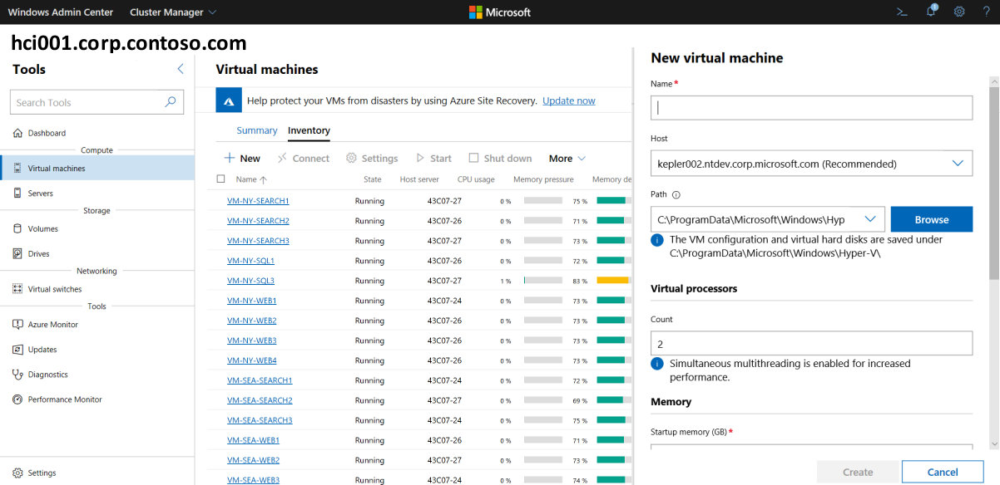
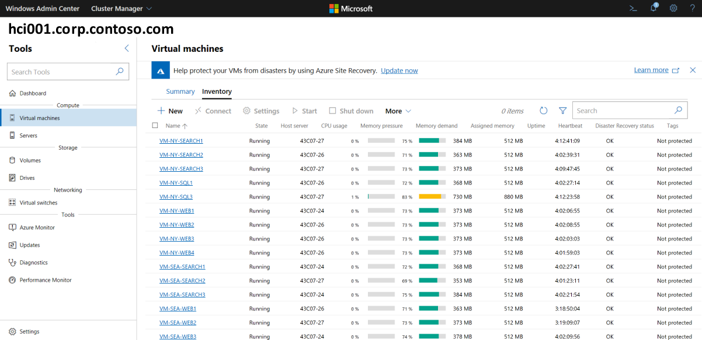
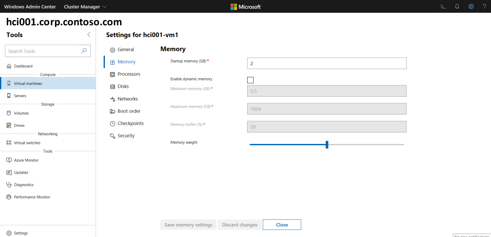
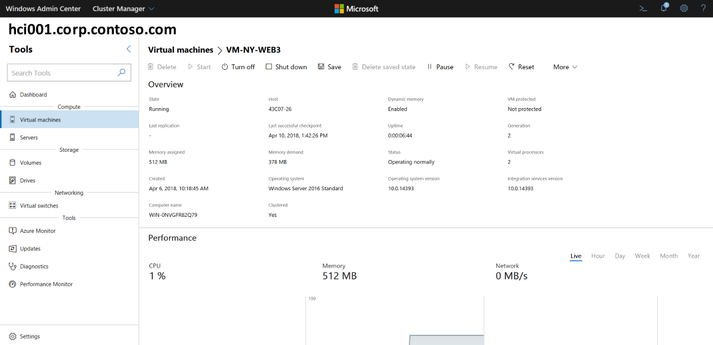
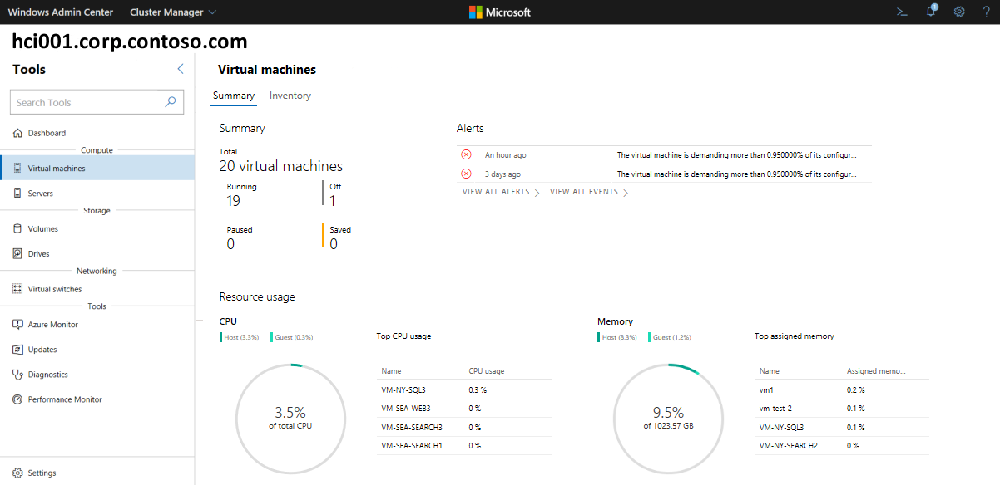
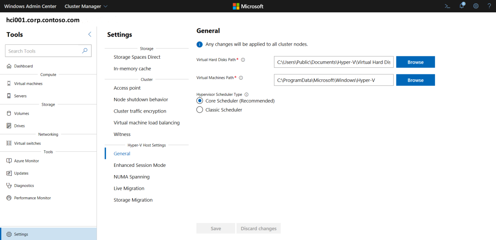

# Managing VMs with Windows Admin Center

> Applies to Windows Server 2019

Windows Admin Center can be used to create and manage the virtual machines in Azure Stack HCI.

## Create a new virtual machine ##

1. In Windows Admin Center, select the server or cluster you want to create the virtual machine on.
1. Under **Tools**, scroll down and select **Virtual Machines**.
1. Under **Virtual Machines**, select **Inventory**, and then select **New**.
1. Under **New Virtual Machine**, enter a name for your VM.
1. Choose **Generation 2 (Recommended)**.
1. Select a preassigned file path from the dropdown list or select **Browse** to choose the folder to save the VM configuration and virtual hard disk (VHD) files to. You can browse to any available SMB share on the network by entering the path as *\\server\share*.

> [!NOTE]
> Using a network share for VM storage will require that [CredSSP](https://docs.microsoft.com/windows-server/manage/windows-admin-center/understand/faq#does-windows-admin-center-use-credssp) is enabled.

1. Under **Virtual processors**, select the number of virtual processors and whether you want nested virtualization enabled.
1. Under **Memory**, select the amount of startup memory (4 GB is recommended as a minimum), and a min and max range of dynamic memory as applicable to be allocated to the VM.
1. Under **Network**, select a network adapter from the drop-down list.
1. Under **Storage**, click **Add** and select whether to create a new virtual hard disk or to use an existing virtual hard disk. If you're using an existing virtual hard disk, click **Browse** and select the applicable file path.  
1. Under **Operating system**, do one of the following:
   - Select **Install an operating system later** if you want to create the VM now and install an OS for it later.
    - Select **Install an operating system from an image file (*.iso)**, click **Browse**, then select the image file to install an OS on the VM now.
    - Select **Install an operating system from a network-based installation server** if you want to install an OS on the VM later using this method. Make sure you have selected a network adapter in Step 3 or else it won't work.
1. When finished, click **Create** to create the VM.
1. To start the VM, in the **Virtual Machines** list, hover over the new VM, enable the checkbox for it on the left, and select **Start**.
1. Under **State**, verify that the VM is **Running**.

## Install an OS on the VM from a network share

You can install an operating system on a virtual machine from an RDP file on a network share. This the 3rd option for Step 5 in the preceding procedure.

1. On the **Inventory** tab, select the virtual machine.
1. On the virtual machine page, click **Start**.
1. Select **More**, select **Download RDP file**, click **Open** at the bottom, then click **Connect** in the pop-up to open a Remote Desktop connection.
1. Enter your domain username and password credentials.
1. In the remote session window, use ** [NEEDS TO BE VALIDATED - BLOCKAGE]**.

## View VM inventory ##

1. Under **Tools**, scroll down and select **Virtual Machines**.
1. The  **Inventory** tab on the right lists the virtual machines available on the current server or the cluster, and provides commands to manage individual virtual machines. You can:
    - View a list of the virtual machines running on the current server or cluster.
    - View the virtual machine's state and host server if you are viewing virtual machines for a cluster. Also view CPU and memory usage from the host perspective, including memory pressure, memory demand and assigned memory, and the virtual machine's uptime, heartbeat status and protection status (using Azure Site Recovery).
    - Create a new virtual machine.
    - Delete, start, turn off, shut down, pause, resume, reset or rename a virtual machine. Also save the virtual machine, delete a saved state, or create a checkpoint.
    - Change settings for a virtual machine.
    - Connect to a virtual machine console via the Hyper-V host.
    - Replicate a virtual machine using Azure Site Recovery.
    - For operations that can be run on multiple VMs, such as Start, Shut down, Save, Pause, Delete, Reset, you can select multiple virtual machines and run the operation at once.

## Change VM settings ##

1. Under **Tools**, scroll down and select **Virtual Machines**.
1. Click the **Inventory** tab on the right. Select the virtual machine, then click **Settings**.
1. Select a category as applicable and make setting changes as needed.
1. When finished, click **Save settings** to save the specific category settings. 

> [!NOTE]
> Some settings cannot be changed for a VM that is running and you will need to stop the VM first.

## Migrate a VM to another cluster node ##

If you are connected to a cluster, you can live migrate a virtual machine to another cluster node as follows:

1. Under **Tools**, scroll down and select **Virtual Machines**.
1. Click the **Inventory** tab on the right. Choose a clustered virtual machine from the list and click **More > Move**.
1. Choose a server from the list and click **Move**.
1. After a successful move, you will see the **Host** name updated in the virtual machine list.

## View detailed information for a VM ##

You can view detailed information and performance charts for a specific virtual machine from its page as follows:

1. Under **Tools**, scroll down and select **Virtual Machines**.
1. Click the **Inventory** tab on the right, then click on the name of the virtual machine. On the subsequent page, you can do the following:

    - View Live and historical data line charts for CPU, memory, network, IOPS and IO throughput (historical data is only available for hyperconverged clusters)
   - View, create, apply, rename and delete checkpoints.
   - View details for the virtual hard disk (.vhd) files, network adapters and host server.
   - View the state of the virtual machine. 
   - Save the virtual machine, delete a saved state, or create a checkpoint.
   - Change settings for the virtual machine.
   - Connect to the virtual machine console using VMConnect via the Hyper-V host.
   - Replicate the virtual machine using Azure Site Recovery.

##  View VM event logs ##

You can view virtual machine event logs using Windows Admin Center as follows:

1. Under **Tools**, scroll down and select **Virtual Machines**.
1. On the **Summary** tab on the right, click **View all events**.
1. Select an event category to expand the view.

## Protect VMs with Azure Site Recovery ##

You can use Windows Admin Center to configure Azure Site Recovery and replicate your on-premises virtual machines to Azure. This is an optional service. [Learn More](https://docs.microsoft.com/windows-server/manage/windows-admin-center/azure/azure-site-recovery)

## Manage a VM through the Hyper-V host ## 

1. Under **Tools**, scroll down and select **Virtual Machines**.
1. Click the **Inventory** tab on the right. Choose a virtual machine from the list and select **More > Connect** or **More > Download RDP file**. The **Connect** option will allow you to interact with the guest VM using **Remote Desktop** in Windows Admin Center. The **Download RDP file** option will download an .rdp file that you can open using the Remote Desktop Connection app (mstsc.exe). Both options use VMConnect to connect to the guest VM through the Hyper-V host and require you to enter your domain administrator username and password credentials for the Hyper-V host server.

## Monitor Hyper-V host resources and performance ##

1. Under **Tools**, scroll down and select **Virtual Machines**.
1. The **Summary** tab on the right provides a holistic view of Hyper-V host resources and performance for a selected server or cluster, including the following: 
    - The number of VMs that are running, stopped, paused, and saved
    - Recent health alerts or Hyper-V event log events for clusters
    - CPU and memory usage with host vs guest breakdown
    - Live and historical data line charts for IOPS and IO throughput for clusters

## Change Hyper-V host settings ##

1. For the applicable server or cluster, select **Settings** on the left menu.
1. Under the **Settings** group, see the following sections:

   - General: Change virtual hard disks and virtual machines file path, and hypervisor schedule type (if supported)
   - Enhanced Session Mode
   - NUMA Spanning
   - Live Migration
   - Storage Migration

If you make Hyper-V host setting changes in a cluster, the change will be applied to all cluster nodes.

##  View Hyper-V event logs ##

You can view Hyper-V event logs using Windows Admin Center as follows:

1. Under **Tools**, select **Events**.
1. Select an event category to expand the view. For clusters, the event logs will display events for all cluster nodes, displaying the host server in the **Machine** column.

## Next Steps ##

- You can also manage VMs using Windows PowerShell. For more information, see [Managing virtual machines using PowerShell](manage-vm-ps.md).
