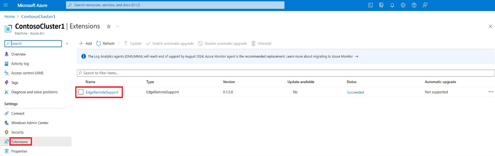

# Azure Stack HCI Remote Support ARC extension overview

[!INCLUDE [applies-to](../../includes/hci-applies-to-23h2.md)]

This article provides a brief overview of the Remote Support Arc extension, its benefits, and how to enable it on your Azure Stack HCI system using PowerShell.

## About the Remote Support Arc extension

The Remote Support Arc extension, shown as AzureEdgeRemoteSupport in the Azure portal, can expedite setup time and enhance support issue resolution. This capability happens by pre-installing the remote support agent on all nodes of the cluster. Additionally, it supports the configuration of scheduled tasks for [Just Enough Administration (JEA)](../manage/get-remote-support.md#install-jea-configurations-before-azure-registration).

The scheduled tasks to configure JEA are set up through either:

- Enable remote support (recommended)
- Restart the host or node

[](../manage/media/remote-support-extension/remote-support-extension.png#lightbox)

Remote support with your consent, as detailed in [Get remote support for Azure Stack HCI](../manage/get-remote-support.md#remote-support-terms-and-conditions), grants Microsoft support professionals’ access to your device remotely.

Access is used to solve your support cases only after you submit a [support request](/azure/azure-portal/supportability/how-to-create-azure-support-request#create-a-support-request) and is based on the level and duration of time that you grant.

For information on how remote support works, see [How remote support works](../manage/get-remote-support.md).

## Benefits

Remote support gives you the ability to:

- Improve the speed to resolution as Microsoft support no longer needs to arrange a meeting with you for troubleshooting.
- View the detailed transcript of all executed operations at any time.
- Grant just-in-time authenticated access on an incident-by-incident basis. You can define the access level and duration for each incident.
- Revoke consent at any time, which in turn terminates the remote session. Access is automatically disabled once the consent duration expires.

## Scenarios for remote support

The scenarios in this list highlight the critical role of remote support in efficiently managing and troubleshooting complex systems.

|Scenario | Description|
|---------|------------|
|Log Collection Initiation | Use remote support to initiate log collection for diagnostic purposes. This includes the initiation of the command `Send-Diagnosticdata`. |
|Azure Stack HCI Information Retrieval | Obtain details related to Azure Stack HCI, including node connections, Arc integration, billing, licensing, registration, subscription information, and test connections to Azure Stack HCI. |
|Hyper-V Troubleshooting |Retrieve comprehensive information about Hyper-V issues, such as virtual hard disks, Hyper-V hosts, virtual switches, virtual hard disk sets, BIOS settings, VMConnect, firmware details, GPU configuration, virtual network adapters, CPU settings, security configurations, and virtual machine settings.<br></br> Additionally, address Access Control Lists (ACL) settings for network adapters.|
|Observability Pipeline Testing | Verify the functionality of the observability pipeline to ensure the ability to send data to Microsoft.|
|Cluster Information Retrieval | Retrieve relevant details about clusters, cluster groups, cluster nodes, cluster resources, shared volumes, and Cluster-Aware Updating (CAU) specifics. |
| Network Adapter Details | Access basic properties of network adapters, configure Remote Direct Memory Access (RDMA) settings, examine path configurations, review network connection specifics, gather virtual port information, capture packet details, manage firewall settings, and explore NAT configuration details.<br></br> Additionally, retrieve information about VM Switches and IPsec settings. |
|Storage, Clusters, and Networking Insights | Gather information related to storage enclosures, storage-related jobs, storage nodes, storage subsystems, virtual disks, volumes, Storage Spaces Direct (S2D) Clusters, fault domain details, cluster group sets, available disks, network specifics for clusters, SMB client information, and disk images. 

## Enable remote support via PowerShell on your Azure Stack HCI system

To enable remote support on your Azure Stack HCI cluster, follow these steps:

1. On the client you're using to connect to your cluster, run PowerShell as an administrator.

2. Open a remote PowerShell session to a node on your Azure Stack HCI cluster. Run the following command and provide the credentials of your server when prompted:

    ```powershell
    $cred = Get-credential
    Enter-PsSession -ComputerName <NodeName> -Credential $cred
    ```

    Here's a sample output:

    ```console
    PS C:\Users\Administrator> etsn -ComputerName v-host1 -Credential $cred
    ```

    > [!NOTE]
    > First time users, if you enable Remote Support through a remote PowerShell session, you might receive the following error:
    >
    > `Processing data from remote server NodeName failed with the following error message: The I/O operation has been aborted because of either a thread exit or an application request.`
    >
    > For more information, see [Error handling](./remote-support-arc-extension.md#error-handling).

3. To enable remote support, run this command:

    ```powershell
    Enable-RemoteSupport -AccessLevel <Diagnostics Or DiagnosticsRepair> -ExpireInMinutes <1440>
    ```

    Here's a sample output:

    ```console
    PS C:\Users\Administrator> etsn -ComputerName v-host1 -Credential $cred

    PS C:\Users\HciDeploymentUser\Documents> Enable-RemoteSupport -AccessLevel Diagnostics -ExpireInMinutes 1440

    By approving this request, the Microsoft support organization or the Azure engineering team supporting this feature ('Microsoft Support Engineer') will be given direct access to your device for troubleshooting purposes and/or resolving the technical issue described in the Microsoft support case.

    During a remote support session, a Microsoft Support Engineer may need to collect logs. By enabling remote support, you have agreed to a diagnostic logs collection by Microsoft Support Engineer to address a support case You also acknowledge and consent to the upload and retention of those logs in an Azure storage account managed and controlled by Microsoft. These logs may be accessed by Microsoft in the context of a support case and to improve the health of Azure Stack HCI.

    The data will be used only to troubleshoot failures that are subject to a support ticket, and will not be used for marketing, advertising, or any other commercial purposes without your consent. The data may be retained for up to ninety (90) days and will be handled following our standard privacy practices (https://privacy.microsoft.com/en-US/). Any data previously collected with your consent will not be affected by the revocation of your permission.

    Proceed with enabling remote support?
    [Y] Yes  [N] No  [?] Help (default is "Y"): Y
         
    Enabling Remote Support for 'Diagnostics' expiring in '1440' minutes.
    Remote Support successfully Enabled.
     
    State                  : Active
    CreatedAt              : 9/6/2023 10:05:52 PM +00:00
    UpdatedAt              : 9/6/2023 10:05:52 PM +00:00
    ConnectionStatus       : Connecting
    ConnectionErrorMessage :
    TargetService          : PowerShell
    AccessLevel            : Diagnostics
    ExpiresAt              : 9/7/2023 10:05:50 PM +00:00
    SasCredential          :
    ```

## Remote support operations

There are various operations that you can perform to grant remote access for Microsoft support, after you enable remote support. The next sections detail some examples of those operations.

### Enable remote support for diagnostics

In this example, you grant remote support access for diagnostic-related operations only. The consent expires in 1,440 minutes (one day) after which remote access can't be established.

```powershell
Enable-RemoteSupport -AccessLevel Diagnostics -ExpireInMinutes 1440
```

Use the `ExpireInMinutes` parameter to set the duration of the session. In the example, consent expires in 1,440 minutes (one day). After one day, remote access can't be established.

You can set `ExpireInMinutes` a minimum duration of 60 minutes (one hour) and a maximum of 20,160 minutes (14 days).

If duration isn't defined, the remote session expires in 480 (8 hours) by default.

### Enable remote support for diagnostics and repair

In this example, you grant remote support access for diagnostic and repair related operations only. Because expiration wasn't explicitly provided, it expires in eight hours by default.

```powershell
Enable-RemoteSupport -AccessLevel DiagnosticsRepair
```

### Retrieve existing consent grants

In this example, you retrieve any previously granted consent. The result includes expired consent in the last 30 days.

```powershell
Get-RemoteSupportAccess -IncludeExpired
```

### Revoke remote access consent

In this example, you revoke remote access consent. Any existing sessions are terminated and new sessions can no longer be established.

```powershell
Disable-RemoteSupport
```

### List existing remote sessions

In this example, you list all the remote sessions that were made to the device since FromDate.

```powershell
Get-RemoteSupportSessionHistory -FromDate <Date>
```

### Get details on a specific remote session

In this example, you get the details for remote session with the ID SessionID.

```powershell
Get-RemoteSupportSessionHistory -IncludeSessionTranscript -SessionId <SessionId>
```

> [!NOTE]
> Session transcript details are retained for ninety days. You can retrieve details for a remote session within ninety days after the session.

## Error handling

When you run the enable remote support command for the first time, you may see the following error message:

```console
PS C:\Users\Administrator> etsn -ComputerName v-host1 -Credential $cred

PS C:\Users\HciDeploymentUser\Documents> Enable-RemoteSupport -AccessLevel Diagnostics -ExpireMinutes 1440

Proceed with enabling remote support?
[Y] Yes  [N] No  [?] Help (default is "Y"): Y

Type            Keys                                Name
----            ----                                ----
Container       {Name=SupportDiagnosticEndpoint}    SupportDiagnosticEndpoint


Processing data from remote server NodeName failed with the following error message: The I/O operation has been aborted because of either a thread exit or an application request. 
```

**Error Message**: Processing data from remote server `NodeName` failed with the following error message: The I/O operation has been aborted because of either a thread exit or an application request.

**Cause**: When you enable remote support, a Windows Remote Management (WinRM) service restart is required to active JEA. During the remote support JEA configuration, the WinRM restarts twice, which might disrupt the PowerShell session to the node.

**Suggested resolutions**: You can choose one of the following options to resolve this error and enable remote support:

- Wait for a few minutes. Repeat step #2 and #3 for each JEA endpoint to reconnect to your server and enable remote support.
  - After the third run of the enable remote support command, you shouldn’t see any other error. Refer to the output at step #3 for a successful example of the remote support installation.
- Instead of using the remote PowerShell session, you can enable remote support by connecting to each node using [RDP](https://support.microsoft.com/windows/how-to-use-remote-desktop-5fe128d5-8fb1-7a23-3b8a-41e636865e8c) and enabling it.

## Next step

Learn more about [Azure Arc extension management on Azure Stack HCI](../manage/arc-extension-management.md).
