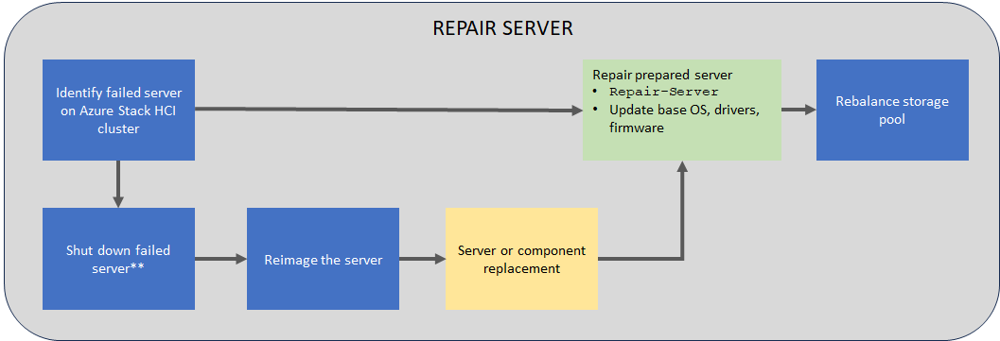

# Repair a server on your Azure Stack HCI (preview)

[!INCLUDE [applies-to](../../includes/hci-applies-to-23h2.md)]

This article describes how to repair a server on your Azure Stack HCI cluster.

[!INCLUDE [hci-preview](../../includes/hci-preview.md)]

## About repair servers

Azure Stack HCI is a hyperconverged system that allows you to repair servers from existing clusters. You may need to repair a server in a cluster if there's a hardware failure. 

Before you repair a server, make sure to check with your solution provider, which components on the server are field replacement units (FRUs) that you can replace yourself and which components would require a technician to replace. 

Parts that support hot swap typically do not require you to reimage the server unlike the non hot-swappable components such as motherboard do. Consult your hardware manufacturer to determine which component replacements would require you to reimage the server. For more information, see [Component replacement](#component-replacement).


## Repair server workflow

The following flow diagram shows the overall process to repair a server.


\**Server may not be in a state where shutdown is possible or necessary*

To repair an existing server, follow these high-level steps:

1. If possible, shut down the server that you want to repair. Depending on the state of the server, a shutdown may not be possible or necessary.
1. Reimage the server that needs to be repaired. 
1. Run the repair server operation. The Azure Stack HCI operating system, drivers, and firmware are updated as part of the repair operation. 

    The storage is automatically rebalanced on the reimaged server. Storage rebalance is a low priority task that can run for multiple days depending on number of the servers and the storage used.


## Supported scenarios

Repairing a server reimages a server and brings it back to the cluster with the previous name and configuration. 

Repairing a single server results in a redeployment with the option to persist the data volumes. Only the system volume is deleted and newly provisioned during deployment.

> [!IMPORTANT]
> Make sure that you always have backups for your workloads and do not rely on the system resiliency only. This is especially critical in single-server scenarios.

### Resiliency settings 

In this preview release, for repair server operation, specific tasks aren't performed on the workload volumes that you created after the deployment. For repair server operation, only the required infrastructure volumes and the workload volumes are restored and surfaced as cluster shared volumes (CSVs). 

The other workload volumes that you created after the deployment are still retained and you can discover these volumes by running `Get-VirtuaDisk` cmdlet. You'll need to manually unlock the volume (if the volume has BitLocker enabled), and create a CSV (if needed).

### Hardware requirements

When repairing a server, the system validates the hardware of the new, incoming server and ensures that the server meets the hardware requirements before it's added to the cluster.

[!INCLUDE [hci-hardware-requirements-add-repair-server](../../includes/hci-hardware-requirements-add-repair-server.md)]

### Server replacement

You may replace the entire server:

- With a new server that has a different serial number compared to the old server. 
- With the current server after you reimage it.

The following scenarios are supported during server replacement:

| **Server** | **Disk**                             | **Supported** |
|------------------------------ |-----------------------|-----------|
| New server                    | New disks             |Yes        |
| New server                    | Current disks             |Yes        |
| Current server (reimaged)     | Current disks reformatted *|No         |
| Current server (reimaged)     | New disks             |Yes        |
| Current server (reimaged)     | Current disks |Yes        |

**Disks that have been used by Storage Spaces Direct, require proper cleaning. Reformatting isn't sufficient. See how to [Clean drives](/windows-server/storage/storage-spaces/deploy-storage-spaces-direct#step-31-clean-drives).

> [!IMPORTANT]
> If you replace a component during server repair, you don't need to replace or reset data drives. If you replace a drive or reset it, then the drive won't be recognized once the server joins the cluster.

### Component replacement

On your Azure Stack HCI cluster, non hot-swappable components include the following items:

- Motherboard/baseboard management controller (BMC)/video card
- Disk controller/host bus adapter (HBA)/backplace
- Network adapter
- Graphics processing unit
- Data drives (drives that don't support hot swap, for example PCI-e add-in cards)

The actual replacement steps for non hot-swappable components vary based on your original equipment manufacturer (OEM) hardware vendor. See your OEM vendor's documentation if a server repair is required for non hot-swappable components.

## Prerequisites

Before you repair a server, you must ensure that:

[!INCLUDE [hci-prerequisites-add-repair-server](../../includes/hci-prerequisites-add-repair-server.md)]

- If needed, take the server that you have identified for repair offline. Follow the steps here:
    - [Verify the server is healthy prior to taking it offline](maintain-servers.md#verify-its-safe-to-take-the-server-offline-1).
    - [Pause and drain the server](maintain-servers.md#pause-and-drain-the-server-1).
    - [Shut down the server](maintain-servers.md#shut-down-the-server-1).

## Repair a server

This section describes how to repair a server using PowerShell, monitor the status of the `Repair-Server` operation and troubleshoot, if there are any issues.

Make sure that you have reviewed the [prerequisites](#prerequisites). 

Follow these steps on the server you are trying to repair.

1. Install the operating system and required drivers. Follow the steps in [Install the Azure Stack HCI, version 23H2 Operating System](../deploy/deployment-install-os.md).

    > [!NOTE]
    > You must also [Install required Windows Roles](../deploy/deployment-install-os.md#install-required-windows-roles).


Follow these steps on another server that is a member of the same Azure Stack HCI cluster.

1. Before you add the server, make sure to get an updated authentication token. Run the following command:

   ```powershell
    Update-AuthenticationToken
   ```
   
1. Sign into the server that is already a member of the cluster, with the domain user credentials that you provided during the deployment of the cluster. Run the following command to repair the incoming server:

    ```powershell
    $Cred = Get-Credential 
    Repair-Server -Name "< Name of the new server>" -LocalAdminCredential $Cred
    ```

1. Make a note of the operation ID as output by the `Repair-Server` command. You use this later to monitor the progress of the `Repair-Server` operation.

### Monitor operation progress

To monitor the progress of the add server operation, follow these steps:

[!INCLUDE [hci-monitor-add-repair-server](../../includes/hci-monitor-add-repair-server.md)]

### Recovery scenarios

Following recovery scenarios and the recommended mitigation steps are tabulated for repairing a server:

| Scenario description                                                                                          | Mitigation                                                                                                | Supported ?   |
|------------------------------------------------------------------------------------------------------|-------------------------------------------------------------------------------------------------------------------|---------------|
| Repair server operation failed.                                                                      | To complete the operation, investigate the failure. <br>Rerun the failed operation using `Add-Server -Rerun`.                    | Yes     |
| Repair server operation succeeded partially but had to start with a fresh operation system install.    | In this scenario, the orchestrator (also known as Lifecycle Manager) has already updated its knowledge store with the new server. Use the repair server scenario. | Yes    |


### Troubleshooting

If you experience failures or errors while repairing a server, you can capture the output of the failures in a log file.

- Sign in with the domain user credentials that you provided during the deployment of the cluster. Capture the issue in the log files.

    ```powershell
    Get-ActionPlanInstance -ActionPlanInstanceID $ID |out-file log.txt
    ```

- To rerun the failed operation, use the following cmdlet:

    ```powershell
    Repair-Server -Rerun
    ```


## Next steps

Learn more about how to [Add a server](./add-server.md).
