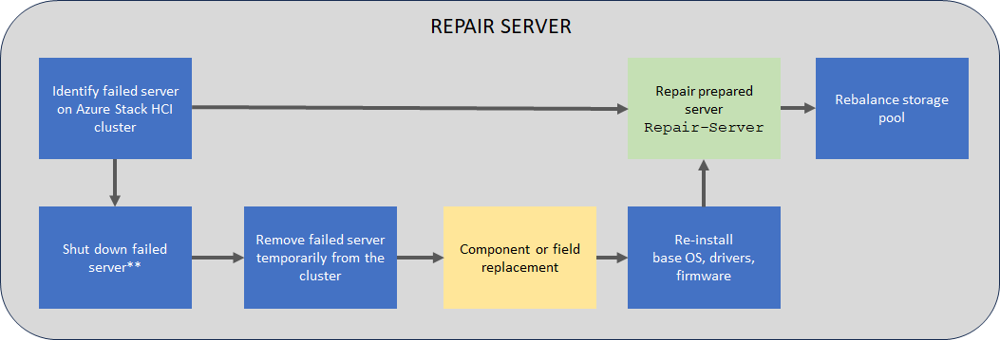

# Repair a server on your Azure Stack HCI (preview)

[!INCLUDE [hci-applies-to-22h2-later](../../includes/hci-applies-to-22h2-later.md)]

This article describes how to repair a server on your Azure Stack HCI cluster.

[!INCLUDE [hci-preview](../../includes/hci-preview.md)]

## About repair servers

Azure Stack HCI is a hyperconverged system that allows you to repair servers from existing clusters. You may need to repair a server in a cluster if there is a hardware failure. 

Before you repair a server, make sure to check with your solution provider, which components on the server are field replacement units (FRUs) that you can replace yourself and which components would require a technician to replace. Any component replacement requires you to reimage the server.

> [!IMPORTANT]
> It is not possible to permanently remove a server from a cluster.


## Repair server workflow

The following flow diagram shows the overall process to repair a server.


\**Server may not be in a state where shutdown is possible/necessary*

To repair an existing server, follow these high-level steps:

1. If possible, shut down the server that you want to repair. Depending on the state of the server, a shutdown may not be possible or necessary.
1. Remove this server temporarily from the cluster.
1. Reimage the server that needs to be repaired. Install the Azure Stack HCI operating system, drivers, and firmware.
1. Add the repaired server back to the cluster. The storage will be automatically rebalanced on the reimaged server. Storage rebalance is a low priority task that doesn't impact actual workloads. The rebalance can run for multiple days depending on number of the servers and the storage used.


## Supported scenarios

Repairing a server will reimage a server and bring it back to the cluster with the previous name and configuration. Repairing a single server will result in a redeployment with the option to persist the data volumes. Only the system volume is deleted and newly provisioned during deployment.

> [!IMPORTANT]
> - Make sure that you always have backups for your workloads and do not rely on the system resiliency only. This is especially critical in single-server scenarios.
> - If you replace a component during server repair, you don't need to replace or reset data drives. If you replace a drive or reset it, then the drive won't be recognized once the server joins the cluster.

### Hardware requirements

When repairing a server, the system validates the hardware of the new, incoming server and ensures that the server meets the hardware requirements before it's added to the cluster.

[!INCLUDE [hci-hardware-requirements-add-repair-server](../../includes/hci-hardware-requirements-add-repair-server.md)]

### Component replacement

| **Server** | **Disk**                              | Supported |
|--------------------------- |-----------------------|-----------|
| New server                 | New disks             |Yes        |
| New server                 | Old disks             |Yes        |
| Old server (re-imaged)     | Reformatted old disks |No         |
| Old server (re-imaged)     | New disks             |Yes        |
| Old server (re-imaged)     | Reformatted old disks |Yes        |


## Prerequisites

Before you repair a server, you must ensure that:

[!INCLUDE [hci-prerequisites-add-repair-server](../../includes/hci-prerequisites-add-repair-server.md)]

- If needed, take the server that you have identified for repair offline. Follow the steps here:
    - [Verify the server is healthy prior to taking it offline](maintain-servers.md#verify-its-safe-to-take-the-server-offline-1).
    - [Pause and drain the server](maintain-servers.md#pause-and-drain-the-server-1).
    - [Shut down the server](maintain-servers.md#shut-down-the-server-1).

## Repair a server

This section describes how to repair a server using PowerShell, monitor the status of the `Repair-Server` operation and troubleshoot, if there are any issues.

Make sure that you have reviewed the [prerequisites](#prerequisites). Follow these steps to repair a server.

1. Install the operating system and required drivers. Follow the steps in [Install the Azure Stack HCI, version 22H2 Operating System](../deploy/deployment-tool-install-os.md).

    > [!NOTE]
    > You must also [Install required Windows Roles](../deploy/deployment-tool-install-os.md#install-required-windows-roles).

1. Sign in with local administrator account, into the server that will be repaired.

1. Open a new PowerShell session on this server. Run the following command:

    ```powershell
    Uninstall-Module –Name PSWindowsUpdate –Force
    ```

1. Sign in with the Lifecycle Manager account into the server that is already a member of the cluster. Run the following command to repair the incoming server:

    ```powershell
    $Cred = Get-Credential 
    Repair-Server -Name "< Name of the new server>" -LocalAdminCredential $Cred
    ```

1. Make a note of the operation ID as output by the `Repair-Server` command. You use this later to monitor the progress of the `Repair-Server` operation.

### Monitor operation progress

To monitor the progress of the add server operation, follow these steps:

[!INCLUDE [hci-monitor-add-repair-server](../../includes/hci-monitor-add-repair-server.md)]

### Troubleshooting

1. If you experience failures or errors while repairing a server, you can capture the output of the failures in a log file.

    ```powershell
    Get-ActionPlanInstance -ActionPlanInstanceID $ID |out-file log.txt
    ```

1. To rerun the failed operation, use the following cmdlet:

    ```powershell
    Repair-Server -Rerun
    ```


## Next steps

Learn more about how to [Add a server](./add-server.md).
