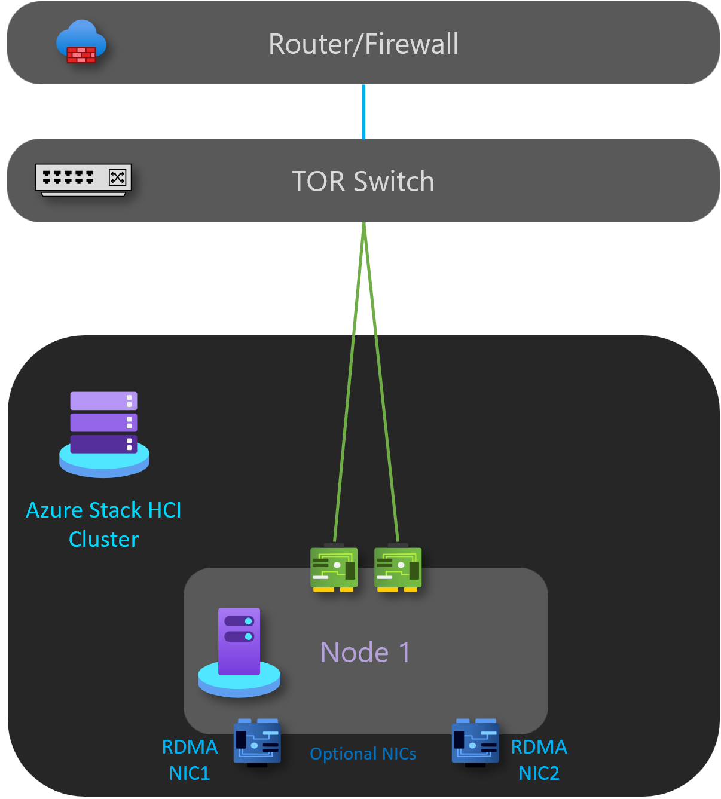
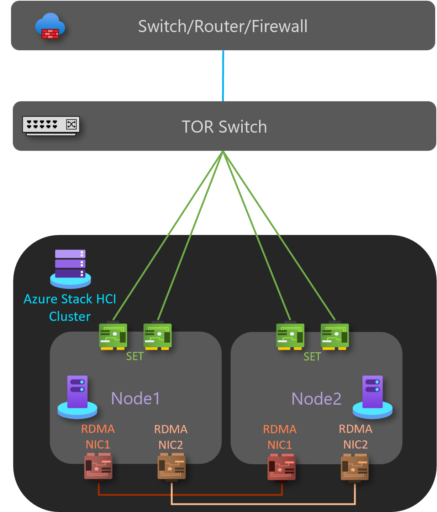
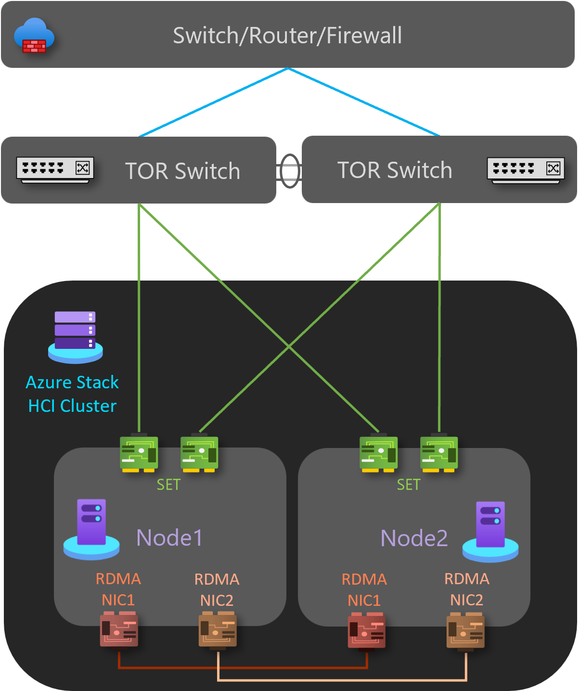

# Azure Stack HCI network deployment patterns

[!INCLUDE [includes](../../includes/hci-applies-to-22h2-21h2.md)]

This article describes a set of network patterns references to architect, deploy, and configure Azure Stack HCI using either one or two physical hosts. Depending on your needs or scenarios, you can go directly to your pattern of interest. Each pattern is described as a standalone entity and includes all the network components for specific scenarios.

## Choose a network reference pattern

Use the following table to directly go to a pattern and its content.

### Single-server deployment pattern

**Go to [single server deployment](single-server-deployment.md)**

### Two-node deployment patterns

|Go to [storage switchless, single TOR switch](two-node-switchless-single-switch.md) |Go to [storage switchless, two TOR switches](two-node-switchless-two-switches.md)|
|---------|---------|
| | |

|Go to [storage switched, non-converged, two TOR switches](two-node-switched-non-converged.md)    |Go to [storage switched, fully-converged, two TOR switches](two-node-switched-converged.md)       |
|---------|---------|
|| |

## Next steps

- [Download Azure Stack HCI](https://azure.microsoft.com/products/azure-stack/hci/hci-download/)