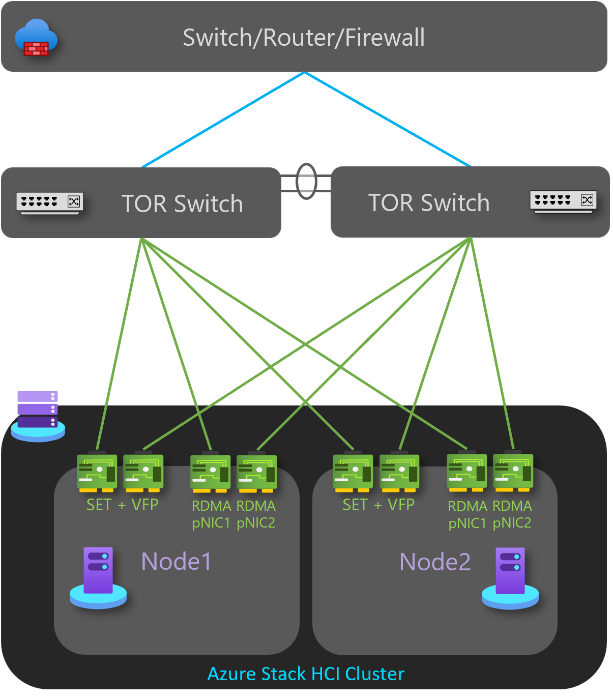
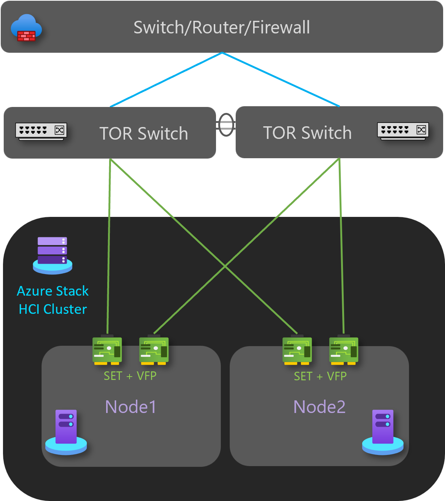

# Azure Stack HCI network deployment patterns

> > Applies to: Azure Stack HCI, version 21H2; Azure Stack HCI, version 22H2 (preview)

This article describes a set of network patterns references to architect, deploy, and configure Azure Stack HCI with either one or two physical hosts (nodes).

The article includes five different deployment patterns. Depending on your needs or scenarios, you can go directly to your pattern of interest. Each pattern is described as a standalone entity and includes all the network components for specific scenarios.

## Choose a network reference pattern

Use the following table to directly go to a pattern and its content.

### Single-server deployment pattern

**Go to [single server deployment](single-server-switchless.md)**

### Two-node deployment patterns

|Go to [storage switchless, single TOR switch](two-node-switchless-single-switch.md) |Go to [storage switchless, two TOR switches](two-node-switchless-two-switches.md)|
|---------|---------|
| | |

|Go to [storage switched, non-converged, two TOR switches](two-node-switched-non-converged.md)    |Go to [storage switched, fully-converged, two TOR switches](two-node-switched-converged.md)       |
|---------|---------|
|| |

## Next steps

- [Download Azure Stack HCI](https://azure.microsoft.com/products/azure-stack/hci/hci-download/)