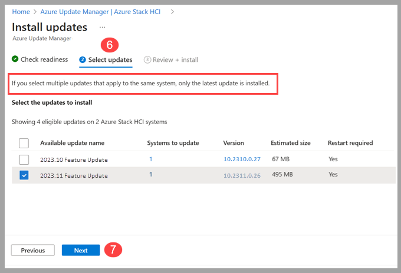
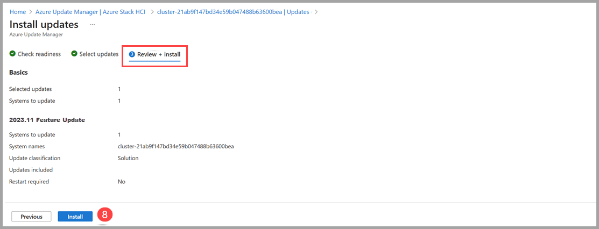
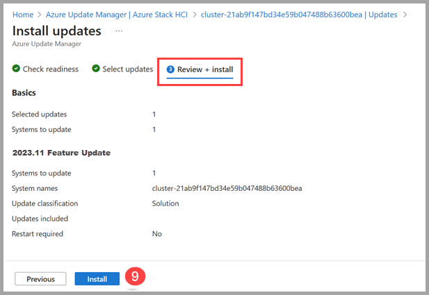

# Use Azure Update Manager to update your Azure Stack HCI, version 23H2 (preview)

[!INCLUDE [applies-to](../../includes/hci-applies-to-23h2.md)]

This article describes how to use Azure Update Manager to find and install available cluster updates on selected Azure Stack HCI clusters. Additionally, we provide guidance on how to review cluster updates, track progress, and browse cluster updates history.

[!INCLUDE [important](../../includes/hci-preview.md)]

> [!NOTE]
> You can view the Azure Update Manager workflow, but this release of Azure Stack HCI, version 23H2 doesn't include an update package that can be installed.

## About Azure Update Manager

Azure Update Manager is an Azure service that allows you to apply, view, and manage updates for each of your Azure Stack HCI cluster's nodes. You can view Azure Stack HCI clusters across your entire infrastructure, or in remote/branch offices and update at scale.

Here are some benefits of the Azure Update Manager:

- The update agent checks Azure Stack HCI clusters for update health and available updates daily.
- You can use the summary grid to view the update status and readiness for each cluster.
- You can update multiple clusters at the same time.
- You can view the status of updates while they're in progress.
- Once complete, you can view the results and history of updates.

## Prerequisites

- An Azure Stack HCI, version 23H2 (preview) cluster deployed and registered with Azure.

## Browse for cluster updates

To browse for available cluster updates using Azure Update Manager, follow these steps:

1. Sign into [the Azure portal](https://portal.azure.com) and go to **Azure Update Manager**.
2. Under Manage Azure Stack HCI, select **Azure Stack HCI (Preview)**.
   - Filter by Subscription, Resource group, Location, Status, Update readiness, Current OS version, and/or Tags to view a list of clusters.
3. In the cluster list, view the clusters update status, update readiness, current OS version, and the date and time of the last successful update.

    

## Install cluster updates

To install cluster updates using Azure Update Manager, follow these steps:

1. Sign into [the Azure portal](https://portal.azure.com) and go to **Azure Update Manager**.
2. Under Manage Azure Stack HCI, select **Azure Stack HCI (Preview)**.
3. Select one or more clusters from the list, then select **One-time Update**.

    

4. On the **Check readiness** page, review the list of readiness checks and their results.
   - You can select the links under **Affected systems** to view more details and individual cluster results.
5. Select **Next**.

    

6. On the **Select updates** page, specify the updates you want to include in the deployment.
   1. Select **Systems to update** to view cluster updates to install or remove from the update installation.
   2. Select the **Version** link to view the update components and their versions.
   3. Select the Details, **View details** link, to view the update release notes.

7. Select **Next**.

    

8. On the **Review + install** page, verify your update deployment options, and then select **Install**.

    

   You should see a notification that confirms the installation of updates. If you don’t see the notification, select the **notification icon** in the top right taskbar.

    

## Track cluster update progress

When you install cluster updates via Azure Update Manager, you can check the progress of those updates.

> [!NOTE]
> After you trigger an update, it can take up to 5 minutes for the update run to show up in the Portal.

To view the progress of your clusters, update installation, and completion results, follow these steps:

1. Sign into [the Azure portal](https://portal.azure.com) and go to **Azure Update Manager**.
2. Under Manage Azure Stack HCI, select **History (Preview)**.
3. Select an update run from the list with a status of **In Progress**.

    

4. On the **Download updates** page, review the progress of the download and preparation, and then select **Next**.
5. On the **Check readiness** page, review the progress of the checks, and then select **Next**.
6. On the **Install** page, review the progress of the update installation.

    

## Browse cluster update job history

To browse for your clusters update history, follow these steps:

1. Sign into [the Azure portal](https://portal.azure.com) and go to **Azure Update Manager**.
2. Under Manage Azure Stack HCI, select **History (Preview)**.
3. Select an update run with a status of “**Failed to update**” or “**Successfully updated**”.

    

4. On the **Download updates** page, review the results of the download and preparation and then select **Next**.
5. On the **Check readiness** page, review the results and then select **Next**.
   - Under the Affected systems column, if you have an error, select **View Details** for more information.
6. On the **Install** page, review the results of the installation.
   - Under the Result column, if you have an error, select **View Details** for more information.

## Update a cluster via the Azure Stack HCI cluster resource page

In addition to using Azure Update Manager, you can update individual Azure Stack HCI clusters from the Azure Stack HCI cluster resource page.

To install updates on a single cluster from the Azure Stack HCI cluster resource page, follow these steps:

1. Sign into [the Azure portal](https://portal.azure.com) and go to **Azure Update Manager**.
2. Under Manage Azure Stack HCI, select **Azure Stack HCI (Preview)**.
3. Select the cluster name from the list.
4. Select the update and then select **One-time update**.

      

5. On the **Check readiness** page, review the list of readiness checks and their results.
   - You can select the links under **Affected systems** to view more details and individual cluster results.
6. Select **Next**.
7. On the **Select updates** page, specify the updates you want to include in the deployment.
   1. Select **Systems to update** to view cluster updates to install or remove from the update installation.
   2. Select the **Version** link to view the update components and their versions.
   3. Select the Details, **View details** link, to view the update release notes.

8. Select **Next**.
9. On the **Review + install** page, verify your update deployment options, and select **Install**.

    

   You should see a notification that confirms the installation of updates. If you don’t see the notification, select the **notification icon** in the top right taskbar.
