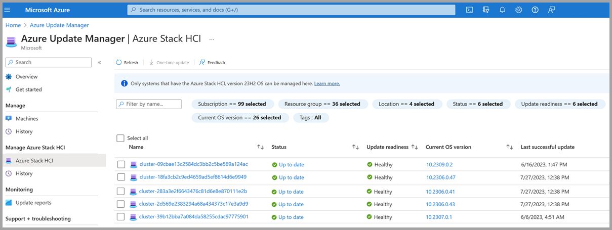
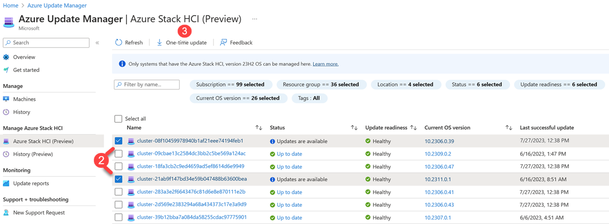
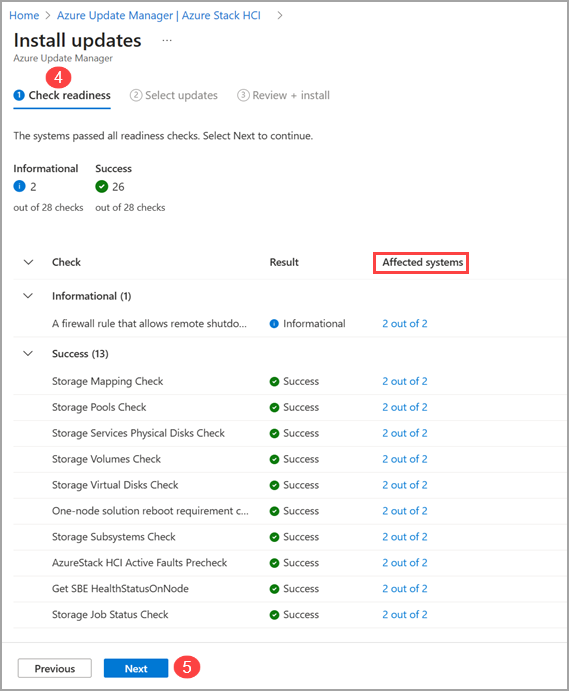
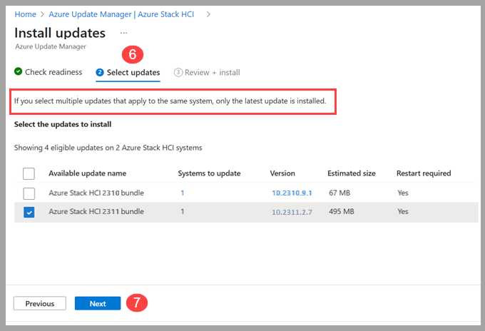
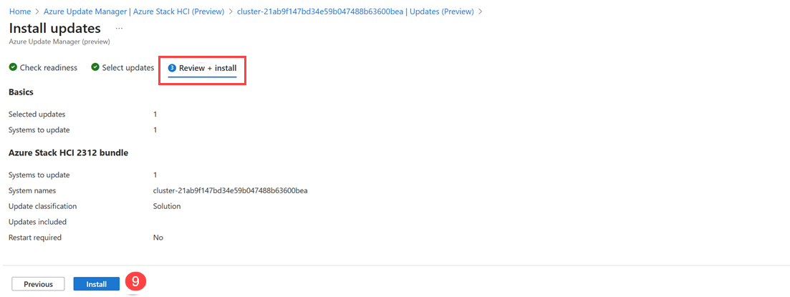
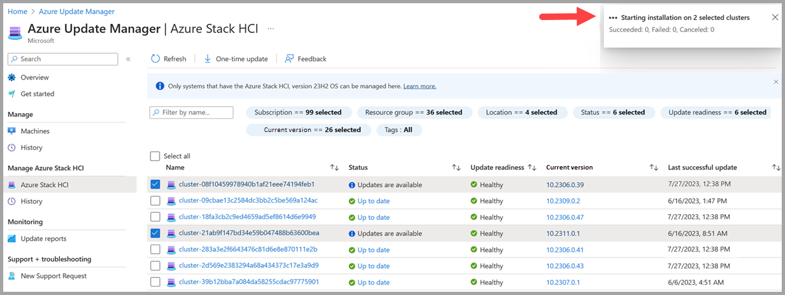
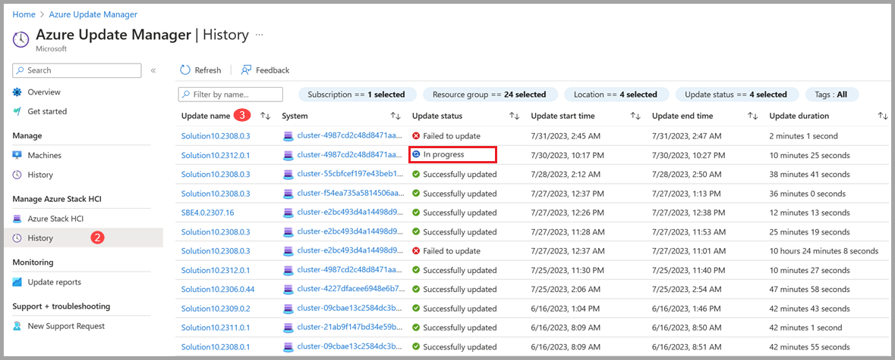
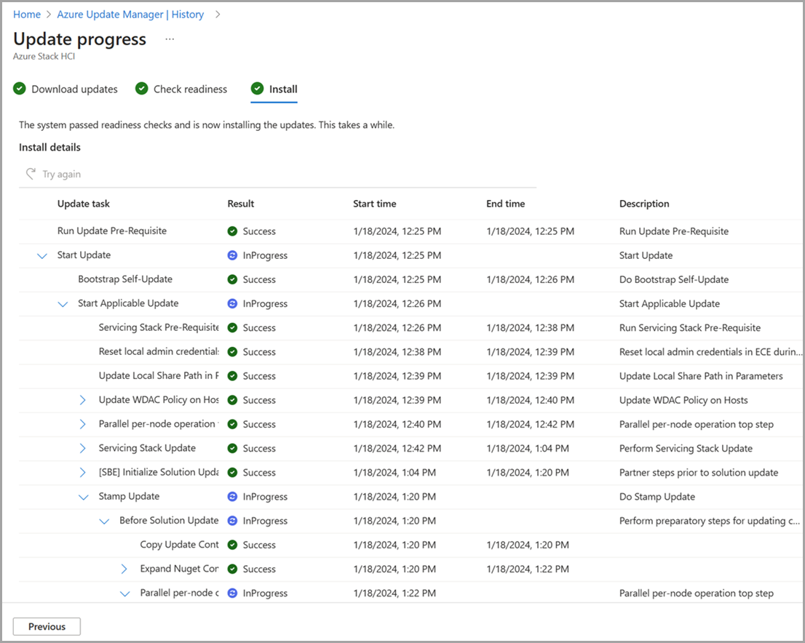
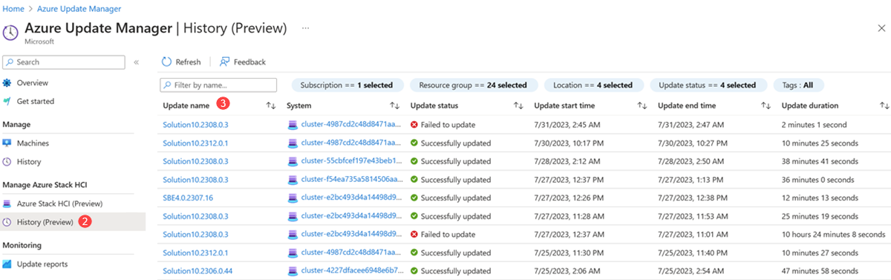
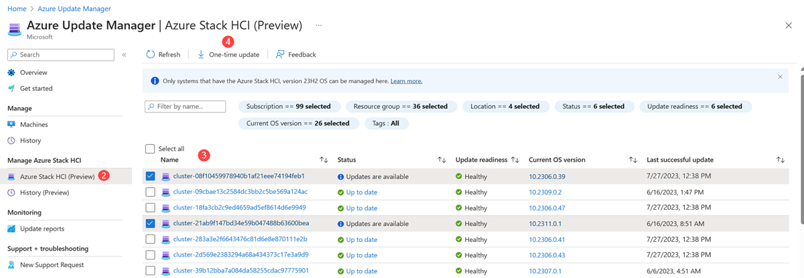

# Update your Azure Stack HCI clusters via Azure Update Manager (preview)

[!INCLUDE [applies-to](../../includes/hci-applies-to-23h2.md)]

This article describes how to use Azure Update Manager (preview) to find and install available cluster updates on selected Azure Stack HCI clusters. Additionally, we provide guidance on how to review cluster updates, track progress, and browse cluster updates history.

> [!IMPORTANT]
> Version 23H2 2309 preview is the latest preview build available for Azure Stack HCI. There are no future preview builds to upgrade to. Instead, we’ve released an empty update package to the Canary update ring which can be installed on top of 2309. This update package doesn’t include any update but will change your cluster version to a higher build number.
>
> We recommend testing the update experience with the empty update package and appreciate any feedback. In future preview releases, we’ll release them as an update package so that you can do build-to-build updates with Azure Update Manager (preview).

## About Azure Update Manager (preview)

Azure Update Manager (preview) is an Azure service that allows you to apply, view, and manage updates for each of your Azure Stack HCI cluster's nodes. You can view Azure Stack HCI clusters across your entire infrastructure, or in remote/branch offices and update at scale.

Here are some benefits of the Azure Update Manager (preview):

- The update agent checks Azure Stack HCI clusters for update health and available updates daily.
- You can use the summary grid to view the update status and readiness for each cluster.
- You can update multiple clusters at the same time.
- You can view the status of updates while they're in progress.
- Once complete, you can view the results and history of updates.

## Prerequisites

- An Azure Stack HCI, version 23H2 (preview) cluster deployed and registered with Azure.

## Prepare your cluster for an update

To prepare your cluster for an update using Azure Update Manager (preview), follow these steps:

1. Sign into one of your cluster nodes.

2. Change the update ring from Production to Canary using the following command (this is required to detect the empty update package available in the Canary ring for testing purposes):

   ```powershell
   Set-UpdateConfiguration -UpdateRingName Canary 
   ```

   > [!NOTE]
   > Host reboots will occur when applying the empty update package.

3. Verify the update package discovered by the update service, using the following command:

   ```powershell
   Get-SolutionUpdate | ft DisplayName, State, Version
   ```

   Here’s a sample output:

   ```powershell
   PS C:\Users\testuser> Get-SolutionUpdate | ft DisplayName, State, Version

   VERBOSE: Looking up shared vhd product drive letter.
   VERBOSE: Suppressed Warning Unknown category for 'NuGet* : :'GetDynamicOptions': 'Provider'
   VERBOSE: Get-Package returned with Success:True
   VERBOSE: Found package Microsoft.AzureStack.LcmUpdateService.PowerShell with version 2.2309.12 at
   C:\NugetStore\Microsoft.AzureStack.LcmUpdateService.PowerShell.2.2309.12\Microsoft.AzureStack.LcmUpdateService.PowerShe ll.nuspec.

   DisplayName					                    State 	     Version
   -----------						                -----	     -------
   Azure Stack HCI Bundle Update – 10.2309.9.10 	Ready 	     10.2309.9.10
   ```

4. Access Azure Update Manager (preview) on the Azure portal using the following link: [https://aka.ms/updatesPreview](https://aka.ms/updatesPreview).

   > [!NOTE]
   > After joining the canary ring, it may take up to 24 hours for the update package to appear in Azure Update Manager (preview).
   >
   > The Azure Update Manager (preview) link includes “feature flags” that enable the Azure Stack HCI update experience. If you don’t use the proper feature flags, the Azure Stack HCI update UI won’t be visible in the Portal UI.

## Browse for cluster updates

To browse for available cluster updates using Azure Update Manager (preview), follow these steps:

1. Sign into [Azure Update Manager (preview)](https://aka.ms/updatesPreview) on the Azure portal.
2. Under Manage Azure Stack HCI, select **Azure Stack HCI**.
   - Filter by Subscription, Resource group, Location, Status, Update readiness, Current OS version, and/or Tags to view a list of clusters.
3. In the cluster list, view the clusters update status, update readiness, current OS version, and the date and time of the last successful update.

    [](media/azure-update-manager/main-link.png#lightbox)

## Install cluster updates

To install cluster updates using Azure Update Manager (preview), follow these steps:

1. Sign into [Azure Update Manager (preview)](https://aka.ms/updatesPreview) on the Azure portal.
2. Under Manage Azure Stack HCI, select **Azure Stack HCI**.
3. Select one or more clusters from the list, then select **One-time Update**.

    [](media/azure-update-manager/install-update.png#lightbox)

4. On the **Check readiness** page, review the list of readiness checks and their results.
   - You can select the links under **Affected systems** to view more details and individual cluster results.
5. Select **Next**.

    [](media/azure-update-manager/check-readiness.png#lightbox)

6. On the **Select updates** page, specify the updates you want to include in the deployment.
   1. Select **Systems to update** to view cluster updates to install or remove from the update installation.
   2. Select the **Version** link to view the update components and their versions.
   3. Select the Details, **View details** link, to view the update release notes.

   > [!NOTE]
   > 2309 preview is a private preview and only test update packages are available. The **View details** link will go to a placeholder webpage, not the actual release notes for the update package.

7. Select **Next**.

    [](media/azure-update-manager/select-updates.png#lightbox)

8. On the **Review + install** page, verify your update deployment options, and then select **Install**.

    [](media/azure-update-manager/review-plus-install-2.png#lightbox)

   You should see a notification that confirms the installation of updates. If you don’t see the notification, select the **notification icon** in the top right taskbar.

    [](media/azure-update-manager/installation-notification.png#lightbox)

## Track cluster update progress

When you install cluster updates via Azure Update Manager (preview), you can check the progress of those updates.

> [!NOTE]
> After you trigger an update, it can take up to 5 minutes for the update run to show up in the Portal.

To view the progress of your clusters, update installation, and completion results, follow these steps:

1. Sign into [Azure Update Manager (preview)](https://aka.ms/updatesPreview) on the Azure portal.
2. Under Manage Azure Stack HCI, select **History**.
3. Select an update run from the list with a status of **In Progress**.

    [](media/azure-update-manager/update-in-progress.png#lightbox)

4. On the **Download updates** page, review the progress of the download and preparation, and then select **Next**.
5. On the **Check readiness** page, review the progress of the checks, and then select **Next**.
6. On the **Install** page, review the progress of the update installation.

    [](update-install-progress.png#lightbox)

## Browse cluster update job history

To browse for your clusters update history, follow these steps:

1. Sign into [Azure Update Manager (preview)](https://aka.ms/updatesPreview) on the Azure portal.
2. Under Manage Azure Stack HCI, select **History**.
3. Select an update run with a status of “**Failed to update**” or “**Successfully updated**”.

    [](media/azure-update-manager/update-history-progress.png#lightbox)

4. On the **Download updates** page, review the results of the download and preparation and then select **Next**.
5. On the **Check readiness** page, review the results and then select **Next**.
   - Under the Affected systems column, if you have an error, select **View Details** for more information.
6. On the **Install** page, review the results of the installation.
   - Under the Result column, if you have an error, select **View Details** for more information.

## Update a cluster via the Azure Stack HCI cluster resource page

In addition to the Azure Update Manager (preview) UI, you can also update individual Azure Stack HCI clusters from the Azure Stack HCI cluster resource page.

To install updates on a single cluster from the Azure Stack HCI cluster resource page, follow these steps:

1. Sign into [Azure Update Manager (preview)](https://aka.ms/updatesPreview) on the Azure portal.
2. Under Manage Azure Stack HCI, select **Azure Stack HCI**.
3. Select the cluster name from the list.
4. Select the update and then select **One-time update**.

      [](media/azure-update-manager/cluster-resource-page.png#lightbox)

5. On the **Check readiness** page, review the list of readiness checks and their results.
   - You can select the links under **Affected systems** to view more details and individual cluster results.
6. Select **Next**.
7. On the **Select updates** page, specify the updates you want to include in the deployment.
   1. Select **Systems to update** to view cluster updates to install or remove from the update installation.
   2. Select the **Version** link to view the update components and their versions.
   3. Select the Details, **View details** link, to view the update release notes.

   > [!NOTE]
   > 2309 preview is a private preview and only test update packages are available. The **View details** link will go to a placeholder webpage, not the actual release notes for the update package.

8. Select **Next**.
9. On the **Review + install** page, verify your update deployment options, and select **Install**.

    [](media/azure-update-manager/review-plus-install-2.png#lightbox)

   You should see a notification that confirms the installation of updates. If you don’t see the notification, select the **notification icon** in the top right taskbar.
