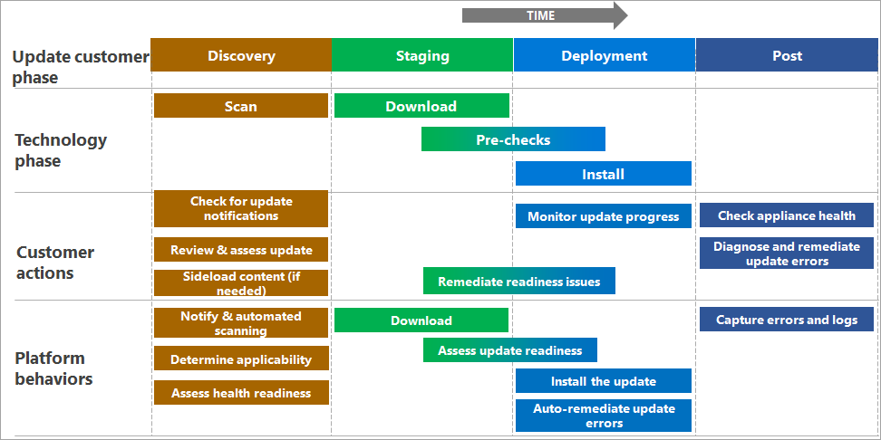

# Phases of Azure Stack HCI, version 23H2 updates (preview)

[!INCLUDE [applies-to](../../includes/hci-applies-to-23h2.md)]

This article describes the various phases of solution updates that are applied to your Azure Stack HCI cluster to keep it up-to-date. This information is applicable to Azure Stack HCI, version 23H2 (preview).

The procedure in this article applies to both a single server and a multi-server cluster that is running software versions with Lifecycle Manager installed.

[!INCLUDE [important](../../includes/hci-preview.md)]

## About update phases

The Azure Stack HCI solution updates can consist of OS, agents and service, and solution extension updates. For more information on these solution updates, see [What is Lifecycle Manager?](whats-the-lifecycle-manager-23h2.md).

The Lifecycle Manager automates the update process for agents, services, operating system content, and Solution Extension content, with the goal of maintaining availability by shifting workloads around throughout the update process when needed.

The updates can be of the following types:

- **Updates not requiring reboots** - The updates that can be applied to your Azure Stack HCI cluster without any server reboots in the cluster.

- **Updates that require reboots** - The updates that might need a server reboot in your Azure Stack HCI cluster. The Lifecycle Manager uses Cluster-Aware Updating to reboot servers in the cluster one by one, ensuring the availability of the cluster during the update process.

The updates consist of several phases: discovering the update, staging the content, deploying the update, and reviewing the installation. Each phase might not require your input but distinct actions occur in each phase.

You can apply these updates via PowerShell or the Azure portal. Regardless of the interface you choose, the subsequent sections summarize what happens within each phase of an update. The following diagram shows what actions you might need to perform during each phase of an update. It also shows what actions the Azure Stack HCI takes throughout the update operation.

## Phase 1: Discovery and acquisition

Before Microsoft releases a new update package, the package is validated as a collection of components. After the validation is complete, the content is released along with the release notes.

The release notes include the update contents, changes, known issues, and links to any external downloads that might be required (for example, drivers and firmware). For more information, see the [Latest release notes](../manage/whats-new-2303-preview.md).

After Microsoft releases the update, your Azure Stack HCI update platform will automatically detect the update. Though you don't need to scan for updates, you must go to the **Updates** page in your management surface to see the new update’s details.

Depending on the hardware in your cluster and the scope of an update bundle, you might need to acquire and sideload extra content to proceed with an update. The **operating system** and **agents and services** content are provided by Microsoft, while depending on your specific solution and the OEM, the **Solution Extension** might require an extra download from the hardware OEM. If this is required, the installation flow prompts you for the content.

## Phase 2: Readiness checks and staging

Before installing a solution update, the Lifecycle Manager performs a series of prechecks. The prechecks are related to the storage systems, failover cluster requirements, remote management of the cluster, and solution extensions. These prechecks help to confirm that your Azure Stack HCI cluster is safe to update and ensures updates go more smoothly.

A subset of these checks can be initiated outside the update process. Because new checks can be included in each update, these readiness checks are executed *after* the update content has been downloaded and *before* it begins installing.

Readiness checks can also result in blocking conditions or warnings.

- If the readiness checks detect a blocking condition, the issues must be remediated before the update can proceed.

- Readiness checks can also result in warnings that won’t block the updates but could introduce longer update times or affect the workloads. You may need to acknowledge the potential impact and bypass the warning before the update can proceed.

Typically the update platform tries to remediate the issues automatically but sometimes manual intervention is required. Once you remediate the issue, you need to rerun the checks to confirm the update readiness before proceeding.

> [!NOTE]
> In this release, you can only initiate immediate install of the updates. Scheduling of updates is not supported.

## Phase 3: Installation progress and monitoring

While the update installs, you can monitor the progress via your chosen interface. Steps within the update are shown within a hierarchy. This hierarchy corresponds to the actions the Lifecycle Manager takes throughout the workflow. Steps may be dynamically generated throughout the workflow, so the list of steps may change. For more information, see examples of [Monitoring progress via PowerShell](../update/update-via-powershell.md).

## Failures and diagnosis

The Lifecycle Manager includes retry and remediation logic. It attempts to fix issues in a non-disruptive way, such as retrying a CAU run. If an update run can't be remediated automatically, it fails. You can retry the update or visit the Azure Support Center to evaluate the next steps.

## Collecting logs

If you encounter failures during the update process, collect diagnostic logs to help Microsoft identify and fix the issues. For more information, see how to [Collect diagnostic logs for Azure Stack HCI, version 23H2](../manage/collect-logs.md).

## Next steps

Learn more about how to [Troubleshoot updates](../update/update-troubleshooting.md).
