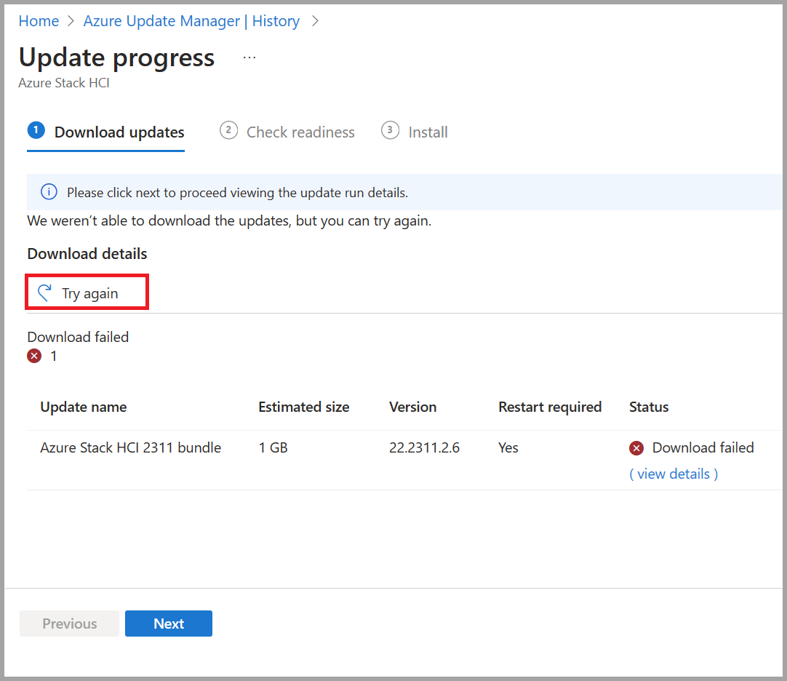

# Troubleshoot solution updates for Azure Stack HCI, version 23H2

[!INCLUDE [hci-applies-to-23h2](../../includes/hci-applies-to-23h2.md)]

This article describes how to troubleshoot solution updates that are applied to your Azure Stack HCI cluster to keep it up-to-date.

## About troubleshooting updates

If your cluster was created via a new deployment of Azure Stack HCI, version 23H2, then an orchestrator was installed during the deployment. The orchestrator manages all of the updates for the platform - OS, drivers and firmware, agents and services, and updates for the workloads.

The new update solution includes a retry and remediation logic. This logic attempts to fix update issues in a non-disruptive way, such as retrying a CAU run. If an update run can't be remediated automatically, it fails. When an update fails, you can retry the update.

## Collect update logs

You can also collect diagnostic logs to help Microsoft identify and fix the issues.

To collect logs for updates using the Azure portal, see [Use Azure Update Manager to update your Azure Stack HCI, version 23H2](../update/azure-update-manager-23h2.md#troubleshoot-updates).

To collect logs for the update failures using PowerShell, follow these steps on the client that you're using to access your cluster:

1. Establish a remote PowerShell session with the server node. Run PowerShell as administrator and run the following command:

    ```powershell
    Enter-PSSession -ComputerName <server_IP_address> -Credential <username\password for the server>
    ```

2. Get all the solutions updates and then filter the solution updates corresponding to a specific version. The version used corresponds to the version of solution update that failed to install.

    ```powershell
    $Update = Get-SolutionUpdate | ? Version -eq "<Version string>" -verbose
    ```

3. Identify the action plan for the failed solution update run.

    ```powershell
    $Failure = $update | Get-SolutionUpdateRun
    ```

4. Identify the `ResourceID` for the Update.

    ```powershell
    $Failure
    ```

    Here's a sample output:

    ```output
    PS C:\Users\lcmuser> $Update = Get-SolutionUpdate| ? Version -eq "10.2303.1.7" -verbose
    PS C:\Users\lcmuser> $Failure = $Update|Get-SolutionUpdateRun
    PS C:\Users\lcmuser> $Failure
    
    ResourceId      : redmond/Solution10.2303.1.7/2c21b859-e063-4f24-a4db-bc1d6be82c4e
    Progress        : Microsoft.AzureStack.Services.Update.ResourceProvider.UpdateService.Models.Step
    TimeStarted     : 4/21/2023 10:02:54 PM
    LastUpdatedTime : 4/21/2023 3:19:05 PM
    Duration        : 00:16:37.9688878
    State           : Failed
    ```

    Note the `ResourceID` GUID. This GUID corresponds to the `ActionPlanInstanceID`.

5. Copy the logs for the `ActionPlanInstanceID` that you noted earlier, to a text file named *log.txt*. Use Notepad to open the text file.

    ```powershell
    Get-ActionplanInstance -ActionplanInstanceId <Action Plan Instance ID> >log.txt
    notepad log.txt
    ```

    Here's sample output:

    ```output
    PS C:\Users\lcmuser> Get-ActionplanInstance -actionplaninstanceid 2c21b859-e063-4f24-a4db-bc1d6be82c4e >log.txt
    
    PS C:\Users\lcmuser>notepad log.txt
    ```

## Resume an update

To resume a previously failed update run, you can retry the update run via the Azure portal or PowerShell.

### The Azure portal

We highly recommend using the Azure portal, to browse to your failed update and select the **Try again** button. This functionality is available at the Download updates, Check readiness, and Install stages of an update run.

[](media/troubleshoot-updates/try-again-update.png#lightbox)

### PowerShell

If you're using PowerShell and need to resume a previously failed update run, use the following command:

```powershell
Get-SolutionUpdate | ? Version -eq "10.2302.0.31" | Start-SolutionUpdate
```

To resume a previously failed update due to update health checks in a **Warning** state, use the following command:

```powershell
Get-SolutionUpdate | ? Version -eq "10.2302.0.31" | Start-SolutionUpdate -IgnoreWarnings
```

## Next steps

Learn more about how to [Run updates via PowerShell](./update-via-powershell-23h2.md).

Learn more about how to [Run updates via the Azure portal](./azure-update-manager-23h2.md).
