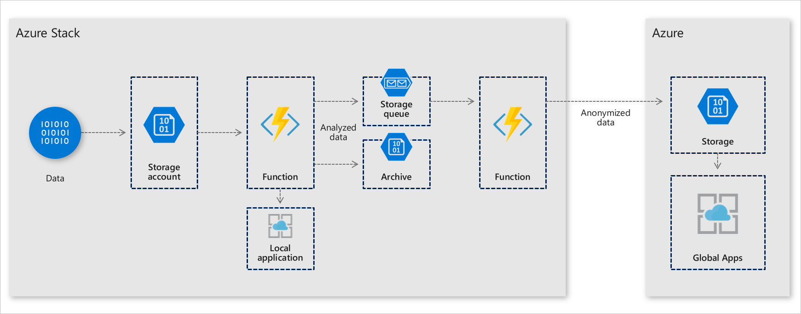
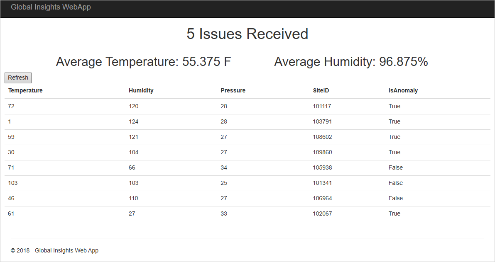

# Deploy a staged data analytics solution to Azure Stack

This article will show you how to deploy a solution for collecting data that requires analysis at the point of collection so that quick
decisions can be made. Often this data collection occurs with no Internet access. When connectivity is established, you may need to do a
resource-intensive analysis of the data to gain additional insight.

In this solution, you'll create a sample environment to:

> [!div class="checklist"]
> - Create the raw data storage blob.
> - Create a New Azure Stack Function to move clean data from Azure Stack to Azure.
> - Create a Blob storage triggered function.
> - Create an Azure Stack storage account containing a blob and a queue.
> - Create a queue triggered function.
> - Test the queue triggered function.

> [!Tip]  
>   
> Microsoft Azure Stack is an extension of Azure. Azure Stack brings the agility and innovation of cloud computing to your on-premises environment, enabling the only hybrid cloud that allows you to build and deploy hybrid apps anywhere.  
> 
> The article [Design Considerations for Hybrid Applications](azure-stack-edge-pattern-overview.md) reviews pillars of software quality (placement, scalability, availability, resiliency, manageability, and security) for designing, deploying, and operating hybrid applications. The design considerations assist in optimizing hybrid app design, minimizing challenges in production environments.

## Architecture for staged data analytics



## Prerequisites for staged data analytics

  - An Azure subscription.
  - An Azure Active Directory (Azure AD) service principal that has permissions to the tenant subscription on Azure and Azure Stack. You may need to create two service principals if the Azure Stack is using a different AAD tenant than your Azure subscription. To learn how to create a service principal for Azure Stack, go [Create service principals to give applications access to Azure Stack resources](https://docs.microsoft.com/azure-stack/user/azure-stack-create-service-principals).
      - **Make a note of each service principal's application ID, client secret, Azure AD Tenant ID, and tenant name (xxxxx.onmicrosoft.com).**
  - You will need to provide a collection of data for data analysis. Sample data is provided.
  - [Docker for Windows](https://docs.docker.com/docker-for-windows/) installed on your local machine.

## Get the Docker image

Docker images for each deployment eliminate dependency issues between different versions of Azure PowerShell.
1.  Make sure that Docker for Windows is using Windows containers.
2.  Run the following in an elevated command prompt to get the Docker container with the deployment scripts.

```
 docker pull intelligentedge/stageddatasolution:1.0.0
```

## Deploy the solution

1.  Once the container image has been successfully pulled, start the image.

      ```powershell  
      docker run -it intelligentedge/stageddatasolution:1.0.0 powershell
      ```

2.  Once the container has started, you will be given an elevated PowerShell terminal in the container. Change directories to get to the deployment script.

      ```powershell  
      cd .\SDDemo\
      ```

3.  Run the deployment. Provide credentials and resource names where needed. HA refers to the Azure Stack where the HA cluster will be deployed, and DR to the Azure Stack where the DR cluster will be deployed.

      ```powershell
      .\DeploySolution-Azure-AzureStack.ps1 `
      -AzureApplicationId "applicationIDforAzureServicePrincipal" `
      -AzureApplicationSercet "clientSecretforServicePrincipal" `
      -AzureTenantId "xxxxxxxx-xxxx-xxxx-xxxx-xxxxxxxxxxxx" `
      -AzureStackAADTenantName "azurestacktenant.onmicrosoft.com" `
      -AzureStackTenantARMEndpoint "https://management.haazurestack.com" `
      -AzureStackApplicationId "applicationIDforStackServicePrincipal" `
      -AzureStackApplicationSercet "ClientSecretforStackServicePrincipal" `
      -AzureStackTenantId "xxxxxxxx-xxxx-xxxx-xxxx-xxxxxxxxxxxx" `
      -ResourcePrefix "aPrefixForResources"
      ```

1.  If prompted; enter a region for the Azure deployment and Application Insights.

2.  Type "Y" to allow the NuGet provider to be installed, which will kick off the API Profile "2018-03-01-hybrid" modules to be installed to allow for deployment to Azure and Azure Stack.

3.  Once the resources have been deployed, test that the data will be generated for both Azure Stack and Azure.

    ```powershell  
      .\TDAGenerator.exe
    ```

4.  See the data being processed by going to the web applications
    deployed to Azure or Azure Stack.

### Azure Web App
 

 
### Azure Stack Web App
 


## Next steps

  - Learn more about hybrid cloud applications, see [Hybrid Cloud Solutions.](https://aka.ms/azsdevtutorials)

  - Use your own data or modify the code to this sample on [GitHub](https://github.com/Azure-Samples/azure-intelligent-edge-patterns).
