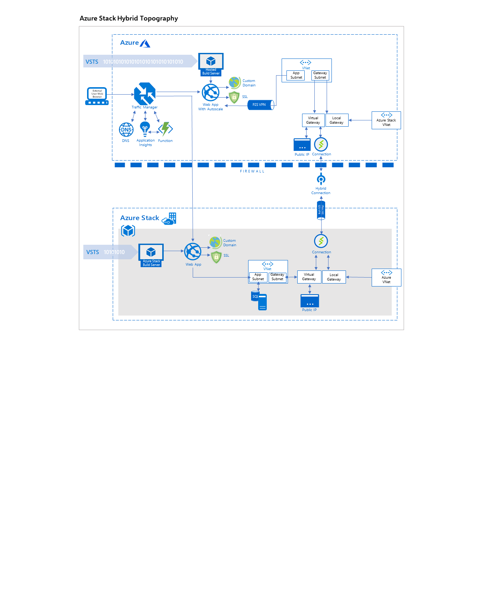

# Cross-cloud scaling (on-premises data) pattern

Learn how to build a hybrid application that spans both Azure and Azure Stack Hub, but uses a single on-prem data source.

## Context and problem

Many organizations collect and store substantial amounts of customer-sensitive data and are often prevented from storing that data in the public cloud due to corporate regulations or government policy. Those organizations want to take advantage of the scalability of the public cloud to deal with seasonal peaks in traffic and to be able to pay for exactly the hardware they need, when they need it.

## Solution

The solution takes advantage of the compliance benefits of the private cloud, and combines them with the scalability of the public cloud. Using Azure and Azure Stack, a consistent hybrid cloud, developers are able to take advantage of the vast Microsoft developer ecosystem and apply their skills to both public cloud and on-premises environments.

We’ve created a workflow that allows developers to deploy an identical web application to a public and private cloud and be able access a non-internet routable network hosted on the private cloud. These web applications are monitored and upon a significant increase in traffic, a program can trigger the manipulation of DNS records to redirect traffic to the public cloud, and vice versa when traffic is no longer significant.

## Components

This solution uses the following components:

| Layer | Component | Description |
|----------|-----------|-------------|
| Azure |  |  |
| | Azure App Services | Build, deploy, and scale enterprise-grade web, mobile, and serverless compute applications and as well as leveraging RESTful APIs running on any platform with Platform-as-a-service (PaaS) offerings. For more information about Azure App Services see Microsoft Azure App Services Overview. |
| Azure Stack Hub |    |             |
| | Compute, SQL Server VM | Use the same application model, self-service portal, and APIs enabled by Azure. Azure Stack IaaS allows for a broad range of open source technologies for consistent hybrid cloud deployments. |
| Azure DevOps | | |
| | Azure DevOps Account | Quickly set up continuous integration for build, test and deployment. For more information, see [Sign up, sign in to Azure DevOps](/azure/devops/user-guide/sign-up-invite-teammates?view=azure-devops). |

## Issues and considerations

Consider the following points when deciding how to implement this solution:

### Scalability 

### Availability

### Manageability

### Security

## Next steps

To learn more about topics introduced in this article:
- See the [Azure Traffic Manager overview](/azure/traffic-manager/traffic-manager-overview) to learn more about how this DNS-based traffic load balancer works.
- See [Hybrid application design considerations](overview-app-design-considerations.md) to learn more about best practices, and answer additional questions.
- This pattern uses the Azure Stack family of products, including Azure Stack Hub. See the [Azure Stack family of products and solutions](/azure-stack), to learn more about the entire portfolio of products and solutions.

When you're ready to test the solution example, continue with the [Cross-cloud scaling (on-premises data) solution deployment guide](solution-deployment-guide-cross-cloud-scaling-onprem-data.md.md). The deployment guide provides step-by-step instructions for deploying and testing its components. 

You learn how to create a cross-cloud solution to provide a manually triggered process for switching from an Azure Stack Hub hosted web app, to an Azure hosted web app. You also learn how to use autoscaling via traffic manager, ensuring flexible and scalable cloud utility when under load.