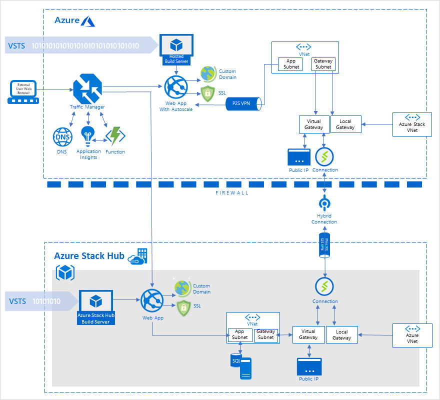

# Cross-cloud scaling (on-premises data) pattern

Learn how to build a hybrid application that spans Azure and Azure Stack Hub. This pattern also shows you how to use a single on-premises data source for compliance.

## Context and problem

Many organizations collect and store massive amounts of customer-sensitive data. Frequently they're prevented from storing sensitive data in the public cloud, because of corporate regulations or government policy. Those organizations also want to take advantage of the scalability of the public cloud. The public cloud can handle seasonal peaks in traffic, allowing customers to pay for exactly the hardware they need, when they need it.

## Solution

The solution takes advantage of the compliance benefits of the private cloud, combining them with the scalability of the public cloud. The Azure and Azure Stack Hub hybrid cloud provide a consistent experience for developers. This consistency allows them to apply their skills to both public cloud and on-premises environments.

The solution deployment guide allows you to deploy an identical web application to a public and private cloud. You can also access a non-internet routable network, hosted on the private cloud. The web applications are monitored for load. Upon a significant increase in traffic, a program manipulates DNS records to redirect traffic to the public cloud. When traffic is no longer significant, the DNS records are updated to direct traffic back to the private cloud.

## Components

This solution uses the following components:

| Layer | Component | Description |
|----------|-----------|-------------|
| Azure | Azure App Service | [Azure App Service](/azure/app-service/) allows you to build and host web apps, RESTful API apps, and Azure Functions. All in the programming language of your choice, without managing infrastructure. |
| | Azure Virtual Network| [Azure Virtual Network (VNet)](/azure/virtual-network/virtual-networks-overview) is the fundamental building block for private networks in Azure. VNet enables multiple Azure resource types, such as Virtual Machines (VM), to securely communicate with each other, the internet, and on-premises networks. The solution also demonstrates the use of additional networking components: - application and gateway subnets - a local on-premises network gateway - a virtual network gateway, which acts as a site-to-site VPN gateway connection - a public IP address - a point-to-site VPN connection - Azure DNS for hosting DNS domains and providing name resolution |
| | Azure Traffic Manager | [Azure Traffic Manager](/azure/traffic-manager/traffic-manager-overview) is a DNS-based traffic load balancer. It allows you to control the distribution of user traffic for service endpoints in different datacenters. |
| | Azure Application Insights | [Application Insights](/azure/azure-monitor/app/app-insights-overview) is an extensible Application Performance Management service, for web developers building and managing apps on multiple platforms.|
| | Azure Functions | [Azure Functions](/azure/azure-functions/) allow you to execute your code in a serverless environment without having to first create a VM or publish a web application. |
| | Azure Autoscale | [Autoscale](/azure/azure-monitor/platform/autoscale-overview) is a built-in feature of Cloud Services, Virtual Machines, and Web apps. The feature allows applications to perform their best when demand changes. Apps will adjust for traffic spikes, notifying you when metrics change, and scaling as needed. |
| Azure Stack Hub | IaaS Compute | Azure Stack Hub allows you to use the same application model, self-service portal, and APIs enabled by Azure. Azure Stack Hub IaaS allows a broad range of open source technologies for consistent hybrid cloud deployments. The solution example uses a Windows Server VM to SQL Server, for example.|
| | Azure App Service | Just like the Azure web app, the solution uses [Azure App Service on Azure Stack Hub](/azure-stack/operator/azure-stack-app-service-overview) to host the web app. |
| | Networking | The Azure Stack Hub Virtual Network, works exactly like the Azure Virtual Network. It uses many of the same networking components, including custom hostnames. 
| Azure DevOps Services | Sign-up | Quickly set up continuous integration for build, test, and deployment. For more information, see [Sign up, sign in to Azure DevOps](/azure/devops/user-guide/sign-up-invite-teammates?view=azure-devops). |
| | Azure Pipelines | Use [Azure Pipelines](/azure/devops/pipelines/agents/agents?view=azure-devops) for Continuous Integration/Continuous delivery. Azure Pipelines allows you to manage hosted build and release agents and definitions. |
| | Code repository | Leverage multiple code repositories to streamline your development pipeline. Use existing code repositories in GitHub, Bitbucket, Dropbox, OneDrive, and Azure Repos. |

## Issues and considerations

Consider the following points when deciding how to implement this solution:

### Scalability 

Azure and Azure Stack Hub are uniquely suited to support the needs of today’s globally distributed business.

**Hybrid cloud without the hassle**

Microsoft offers an unrivaled integration of on-premises assets with Azure Stack Hub and Azure in one unified solution. This integration eliminates the hassle of managing multiple point solutions and a mix of cloud providers. With Cross-Cloud Scaling, the power of Azure is just a few clicks away. Merely connect your Azure Stack Hub to Azure with cloud bursting and your data and applications will be available in Azure when needed.

- Eliminate the need to build and maintain a secondary DR site.
- Save time and money, by eliminating tape backup and house up to 99 years of backup data in Azure.
- Easily migrate running Hyper-V, Physical (in preview), and VMware (in preview) workloads into Azure to leverage the economics and elasticity of the cloud.
- Run compute intensive reports or analytics on a replicated copy of your on-premises asset in Azure, without impacting production workloads.
- Burst into the cloud and run on-premises workloads in Azure, with larger compute templates when needed. Hybrid gives you the power you need, when you need it.
- Create multi-tier development environments in Azure with a few clicks – even replicate live production data to your dev/test environment to keep it in near real-time sync.

**Economy of cross-cloud scaling with Azure Stack Hub**

The key advantage to cloud bursting is economical savings. You only pay for the additional resources when there's a demand for those resources. No more spending on unnecessary extra capacity, or trying to predict demand peaks and fluctuations.

**Reduce high demand loads into the cloud**

Cross-Cloud scaling can be used to shoulder processing burdens. Load is distributed by moving basic applications to the public cloud, freeing up local resources for business-critical applications. An application can be applied to the private cloud, then burst to the public cloud only when necessary to meet demands.

### Availability

Global deployment has its own challenges, such as variable connectivity and differing government regulations by region. Developers can develop just one app and then deploy it across different reasons with different requirements.  Deploy your application to the Azure public cloud, then deploy additional instances or components locally. You can manage traffic between all instances using Azure.

### Manageability

**A single, consistent development approach**

Azure and Azure Stack Hub enable you to use a consistent set of development tools across the organization. This consistency makes it easier to implement a practice of continuous integration and continuous development (CI/CD). Many apps and services deployed in Azure or Azure Stack Hub are interchangeable, and can run in either location seamlessly.

A hybrid CI/CD pipeline can help you:
- Initiate a new build based on code commits to your code repository.
- Automatically deploy your newly built code to Azure for user acceptance testing.
- Once your code has passed testing, automatically deploy to Azure Stack Hub.

**A single, consistent identity management solution**

Azure Stack Hub works with both Azure Active Directory and Active Directory Federation Services (ADFS). Azure Stack Hub works with Azure Active Directory in connected scenarios. For environments that don't have connectivity, you can use ADFS as a disconnected solution. Service principals are used to grant access to applications, allowing them to deploy or configure resources through Azure Resource Manager. 

### Security

**Ensure compliance, and data sovereignty**

Azure Stack Hub enables you to run the same service across multiple countries as you would if using a public cloud. Deploying the same application in data centers in each country, allows data sovereignty requirements to be met. This capability ensures personal data is kept within each country’s borders.

**Azure Stack Hub - security posture**

There's no security posture without a solid, continuous servicing process. For this reason, Microsoft invested in an orchestration engine that applies patches and updates seamlessly across the entire infrastructure.

Thanks to partnerships with Azure Stack Hub OEM partners, Microsoft extends the same security posture to OEM-specific components. Such as the Hardware Lifecycle Host and the software running on top of it. This partnership ensures Azure Stack Hub has a uniform, solid security posture across the entire infrastructure. In turn, customers can build and secure their application workloads.

**Use of service principals via PowerShell, CLI, and Azure portal**

To give resource access to a script or app, set up an identity for your app and authenticate the app with its own credentials. This identity is known as a service principal and enables you to:

- Assign permissions to the app identity that are different than your own permissions and are restricted to precisely the app’s needs.
- Use a certificate for authentication when executing an unattended script. 

For more information about service principal creation, and using a certificate for credentials, see [Use an app identity to access resources](/azure-stack/operator/azure-stack-create-service-principals).

## When to use this pattern 

- My organization is using a DevOps approach, or has one planned for the near future.
- I want to implement CI/CD practices across my Azure Stack Hub implementation and the public cloud.
- I want to consolidate the CI/CD pipeline across cloud and on-premises environments.
- I want the ability to develop applications seamlessly using cloud or on-premises services.
- I want to leverage consistent developer skills across cloud and on-premises applications.
- I'm using Azure, but I have developers who are working in an on-premises Azure Stack Hub cloud.
- My on-premises applications experience spikes in demand during seasonal, cyclical, or unpredictable fluctuations.
- I have on-premises components, and I want to use the cloud to scale them seamlessly.
- I want cloud scalability, but I want my application to run on-premises as much as possible.

## Next steps

To learn more about topics introduced in this article:
- Watch [Dynamically scale apps between data centers and public cloud](https://www.youtube.com/watch?v=2lw8zOpJTn0) for an overview of how this pattern is used.
- See [Hybrid application design considerations](overview-app-design-considerations.md) to learn more about best practices, and answer additional questions.
- This pattern uses the Azure Stack family of products, including Azure Stack Hub. See the [Azure Stack family of products and solutions](/azure-stack), to learn more about the entire portfolio of products and solutions.

When you're ready to test the solution example, continue with the [Cross-cloud scaling (on-premises data) solution deployment guide](solution-deployment-guide-cross-cloud-scaling-onprem-data.md). The deployment guide provides step-by-step instructions for deploying and testing its components.