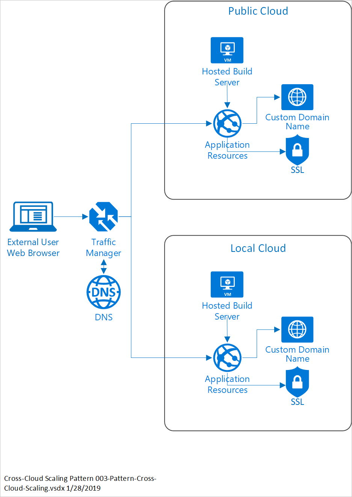

# Cross-cloud scaling pattern

Automatically add resources to an existing application to accommodate an increase in load.

## Context and problem

Your app can't increase capacity to meet unexpected increases in demand. This lack of scalability results in users not reaching the app during peak usage times. The app can service a fixed number of users.

Global enterprises require secure, reliable, and available cloud-based applications. Meeting increases in demand, and using the right infrastructure to support that demand is critical. Businesses struggle to balance costs and maintenance with business data security, storage, and real-time availability.

You may not be able to run your application in the public cloud. However, it may not be economically feasible for the business to maintain the capacity required in their on-premises environment to handle spikes in demand for the app. With this pattern, you can use the elasticity of the public cloud with your on-premises solution.

## Solution

The cross-cloud scaling pattern extends an app located in a local cloud with public cloud resources. The pattern is triggered by an increase or decrease in demand, and respectively adds or removes resources in the cloud. These resources provide redundancy, rapid availability, and geo-compliant routing.

> [!NOTE]
> This pattern applies only to stateless components of your app.

## Components

The Cross-cloud Scaling pattern consists of the following components.

**Traffic Manager**  
**In the diagram this is located outside of the public cloud group, but it would need to able to coordinate traffic in both the local data center and the public cloud. The balancer delivers high availability for application by monitoring endpoints and providing failover redistribution when required.

**Domain Name System (DNS)**  
The Domain Name System, or DNS, is responsible for translating (or resolving) a website or service name to its IP address.

### Cloud

**Hosted Build Server**  
An environment for hosting your build pipeline.

**Application Resources**  
The application resources need to be able to scale in and scale out, such as VM ScaleSets and Containers.

**Custom Domain Name**  
Use a custom domain name for routing requests glob.

**Public IP Addresses**  
Public IP addresses are used to route the incoming traffic through traffic manager to the public cloud application resources endpoint.  

### Local cloud

**Hosted Build Server**  
An environment for hosting your build pipeline.

**Application Resources**  
The application resources need the ability to scale in and scale out, such as VM ScaleSets and Containers.

**Custom Domain Name**  
Use a custom domain name for routing requests glob.

**Public IP Addresses**  
Public IP addresses are used to route the incoming traffic through traffic manager to the public cloud application resources endpoint. 

## Issues and considerations

Consider the following points when deciding how to implement this pattern:

### Scalability considerations

The key component of cross-cloud scaling is the ability to deliver on-demand scaling. Scaling must occur between public and local cloud infrastructure, and provide a  consistent, reliable service per the demand.

### Availability considerations

Ensure locally deployed apps are configured for high-availability through on-premises hardware configuration and software deployment.

### Manageability considerations

The cross-cloud pattern ensures seamless management and familiar interface between environments.

## When to use this pattern

Use this pattern:

- When you need to increase your app capacity with unexpected demands or periodic demands in demand.
- When you do not want to invest in resources that will only be used during peaks. Pay for what you use.

This pattern isn't recommended when:

- Your solution requires users connecting over the internet.
- Your business has local regulations that require that the originating connection to come from an onsite call.
- Your network experiences regular bottlenecks that would restrict the performance of the scaling.
- Your environment is disconnected from the Internet and cannot reach the public cloud.

## Next steps

To learn more about topics introduced in this article:
- See the [Azure Traffic Manager overview](/azure/traffic-manager/traffic-manager-overview) to learn more about how this DNS-based traffic load balancer works.
- See [Hybrid application design considerations](overview-app-design-considerations.md) to learn more about best practices, and answer additional questions.
- See the [Azure Stack family of products and solutions](/azure-stack), to learn more about the entire portfolio of products and solutions.

When you're ready to test the solution example, continue with the [Cross-cloud scaling solution deployment guide](solution-deployment-guide-cross-cloud-scaling.md). The deployment guide provides step-by-step instructions for deploying and testing its components. You learn how to create a cross-cloud solution to provide a manually triggered process for switching from an Azure Stack Hub hosted web app, to an Azure hosted web app. You also learn how to use autoscaling via traffic manager, ensuring flexible and scalable cloud utility when under load.
