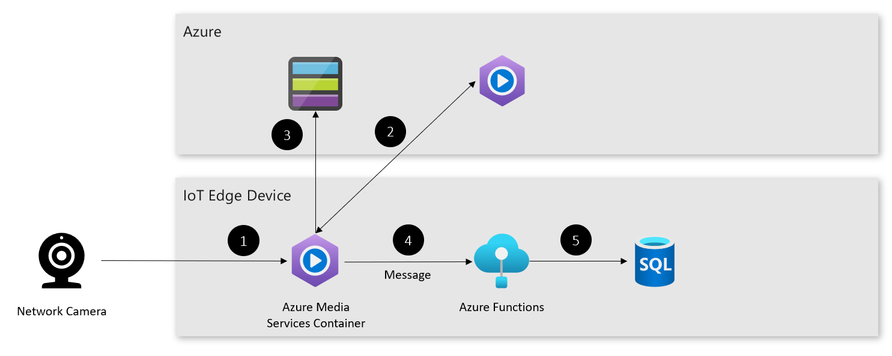

# Analyze live video at the edge pattern

Learn how to generate analytics from multiple on-premises video streams, and send only relevant video clips to the cloud.

## Context and problem

Organizations would like to autonomously monitor video streams from cameras all over their facilities, to ensure workplace safety and security. However, constantly streaming footage to the cloud from several cameras isn't feasible at many locations.

## Solution architecture

This pattern uses Azure Live Video Analytics deployed on an on-premises IoT Edge device to:
1. Collect and analyze video from cameras.
2. Run a detection algorithm and upload relevant clips to Azure Media Services.
3. Store events from the Live Video Analytics container to a SQL database to enable:
   - local video insights.
   - ingestion into a web application or other system.

Here's how the solution works: 

1. Streaming video from the network camera is routed to the Live Video Analytics container. 
2. If motion is detected, then a clip is registered with Azure Media Services.
3. The relevant video is streamed to Azure Blob Storage.
4. A copy of the event is sent to an Azure Function deployed on IoT Edge.
5. The function writes the event to a SQL database for local processing. 

## Components

This solution uses the following components:

| Layer | Component | Description |
|----------|-----------|-------------|
| Azure |  |  |
| | Azure Media Services | [Azure Media Services](/azure/media-services/latest/) ingests events and relevant clips from the cameras on-premises. |
| Azure IoT Edge device |    |             |
| | Azure IoT Edge | [Azure IoT Edge](/azure/iot-edge/) provides a secure runtime and routing framework for all the modules at the edge. |
| | Azure Live Video Analytics Container | This container ingests video from each camera, and processes it according to the specified media graph. |
| | Azure Functions | The [Azure Function](/azure/azure-functions/) deployed here ingests events from the Live Video Analytics container, and copies it to a SQL database for local analytics. |

## Issues and considerations

Consider the following points when deciding how to implement this solution:

### Scalability 

To enable this pattern to scale, you may need to create more Live Video Analytics containers to process streams from all networked cameras. In addition, you need an appropriately sized IoT Edge device, such as Azure Stack Edge, to properly run the LVA container for large numbers of streams.

### Availability

This pattern doesn't work in a permanently disconnected fashion. This is because Live Video Analytics uses Azure Media Services to store relevant video footage in the cloud. The SQL database that stores the local copies of events may be located outside of the IoT Edge device.

### Manageability

If deploying this pattern to multiple locations, it may be necessary to use IoT Hub’s deployment and provisioning feature to securely manage the devices at scale. 

### Security

It’s important that the video sources, such as networked cameras, be appropriately firewalled and have strong passwords, to prevent takeover by unauthorized users. 

## Next steps

To learn more about the topics introduced in this article:

- This pattern uses the following services:
  - [Azure Media Services](/azure/media-services/latest/).
  - [Azure IoT Edge](/azure/iot-edge/).
  - [Azure Functions](/azure/azure-functions/).

- This pattern uses the Azure Stack family of products, including Azure Stack Hub. To learn more, refer to the [Azure Stack documentation](/azure-stack)

When you're ready to test the solution example, continue with the [Live video at the edge deployment guide - TBD](), which provides step-by-step instructions for deploying and testing its components. This example also requires a networked camera.