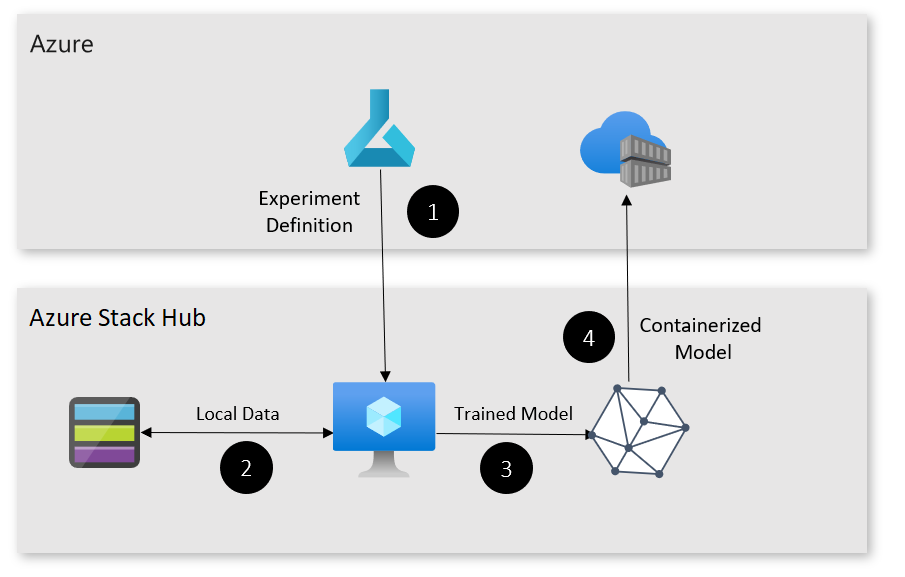

# Train Machine Learning (ML) model at the edge pattern

Generate portable ML models, from data that only exists on-premises.

## Context and problem

Many organizations would like to unlock insights from their on-premises or legacy data using tools that their data scientists understand. [Azure Machine Learning](/azure/machine-learning/) provides cloud-native tooling to train, tune, and deploy ML and Deep Learning models.  

However, some data is too large send to the cloud, or can't be sent to the cloud for regulatory reasons. Using this pattern, data scientists can use Azure Machine Learning to train models using on-premises data and compute. 

## Solution

The training at the edge pattern uses a virtual machine (VM) running on Azure Stack Hub. The VM is registered as a compute target in Azure ML, allowing it to access data only available on-premises. In this case, the data is stored in Azure Stack Hub’s blob storage. 

Once the model is trained, it's registered with Azure ML, containerized, and added to an Azure Container Registry for deployment. For this iteration of the pattern, the Azure Stack Hub training VM must be reachable over the public Internet. 

Here's how the solution works: 

1. The Azure Stack Hub VM is deployed and registered as a compute target with Azure ML.
2. An experiment is created in Azure ML that uses the Azure Stack Hub VM as a compute target.
3. Once the model is trained, it’s registered and containerized.
4. The model can now be deployed to locations that are either on-premises or in the cloud.

## Components

This solution uses the following components:

| Layer | Component | Description |
|----------|-----------|-------------|
| Azure | Azure Machine Learning | [Azure Machine Learning](/azure/machine-learning/) orchestrates the training of the ML model. |
| | Azure Container Registry | Azure ML packages the model into a container and stores it in an [Azure Container Registry](/azure/container-registry/) for deployment.|
| Azure Stack Hub | App Service | [Azure Stack Hub with App Service](/azure-stack/operator/azure-stack-app-service-overview) provides the base for the components at the edge. |
| | Compute | An Azure Stack Hub VM running Ubuntu with Docker is used to train the ML model. |
| | Storage | Private data can be hosted in Azure Stack Hub blob storage. |

## Issues and considerations

Consider the following points when deciding how to implement this solution:

### Scalability 

To enable this solution to scale, you’ll need to create an appropriately sized virtual machine on Azure Stack Hub for training.

### Availability

Ensure that the training scripts and Azure Stack Hub VM have access to the on-premises data used for training.

### Manageability

Ensure that models and experiments are appropriately registered, versioned, and tagged to avoid confusion during model deployment. 

### Security

This pattern allows Azure ML to access possible sensitive data on-premises. Ensure the account used to SSH into Azure Stack Hub VM has a strong password, and training scripts don't preserve or upload data to the cloud. 

## Next steps

To learn more about topics introduced in this article:
- See the [Azure Machine Learning documentation](/azure/machine-learning) for an overview of ML and related topics.
- See [Azure Container Registry](/azure/container-registry/) to learn how to build, store, and manage images for container deployments.
- Refer to [App Service on Azure Stack Hub](/azure-stack/operator/azure-stack-app-service-overview) to learn more about the resource provider and how to deploy.
- See [Hybrid application design considerations](overview-app-design-considerations.md) to learn more about best practices, and answer additional questions.
- See the [Azure Stack family of products and solutions](/azure-stack), to learn more about the entire portfolio of products and solutions.

When you're ready to test the solution example, continue with the [Train ML model at the edge deployment guide](https://aka.ms/edgetrainingdeploy). The deployment guide provides step-by-step instructions for deploying and testing its components.