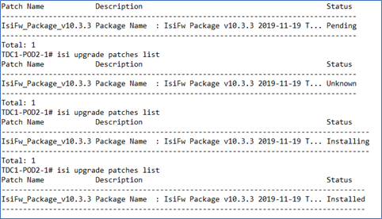
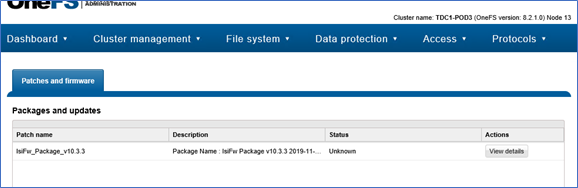

# Updating OneFS and firmware for the datacenter extended storage

This article provides guidance for updating OneFS and the firmware of the datacenter extended storage hardware. 

The final steps in the extended storage hardware integration and deployment are the steps that validate the hardware is healthy and ready for configuration. The steps are described in [Checking health for the extended storage](extended-storage-health-checks.md).

## Update OneFS

Update OneFS so recent operating system patches are applied before you update the firmware. 

1. Verify that your cluster has enough free space to install this patch.
1. Open an SSH connection on any node in the cluster and log in by using the root account.

   >[!NOTE]
   >If the patch is being installed on a compliance mode cluster, log in using the compadmin account.

1. Copy the 8.2.2_GA-RUP_2020-07_PSP-40.tgz file to the /ifs/data/Isilon_Support directory on the cluster.
1. Run the following command to change to the /ifs/data/Isilon_Support directory: 

   ```
   /ifs/data/Isilon_Support
   pwd
   ```

1. To extract the patch file, run the following command:

   ```
   -zxvf 8.2.2_GA-RUP_2020-07_PSP-40.tgz
   ```

1. To install this patch, run the following command:
   >[!WARNING]
   >The following command will reboot all of the nodes in the cluster simultaneously. To install the patch and then reboot each node in succession, omit the `-simultaneous` parameter. For more information, see the Installation/Removal Impacts section of the README.

   ```
   isi upgrade patches install 8.2.2_GA-RUP_2020-07_PSP-40.pkg --simultaneous
   ```

1. To verify that this patch is installed, run the following command:

   ```
   isi upgrade patches list
   ```

1. Confirm that 8.2.2_GA-RUP_2020-07_PSP-40 appears in the list of installed 
   packages and the status is set to Installed.

## Update firmware on nodes

   1. Review the current drive firmware and drive support [package releases](https://aka.ms/currentextstoragerelease).
   1. Download the files to your local machine.  
   1. Upload the drive and node firmware packages to the Isilon file share, placing the files into the following respective directories:
    
        * Drive_Support_*.tgz: /ifs/data/Isilon_Support/dsp/
        * IsiFw_Package_*.tar: /ifs/data 

## Verify disk drive firmware

Perform the Drive Support update/verification first. This will check to see if the Disk Drive firmware is up to date with the package provided. If not, the package can be used to perform the necessary updates:

   1. From an active ssh session, run:

       ```
       cd /ifs/data/Isilon_Support/dsp/
       ```

   1. Make sure the Drive_Support_*.tgz is in this directory by running the ls command.
   1. Expand the .tgz file by running the following command. Make sure you have the full file name and replace * with the actual version number of the package:
       ```
       tar -zxvf Drive_Support_v1.*.tgz
       ```
       For example, if the package version is Drive_Support_v1.33.tgz, run the following command:
       ```
       tar -zxvf Drive_Support_v1.33.tgz
       ```
   1. This expands to three files:
    
        * Drive_Support_v1.33.tar
        * Drive_Support_v1.33.tar.md5
        * Drive_Support_v1.33.tar.sha256
   1. Run the following command to install/verify the Drive Support software:
       ```
       isi_dsp_install Drive_Support_v1.*.tar
       ```
       For example, if the package version is Drive_Support_v1.33.tgz, run the following command:
       ```
       isi_dsp_install Drive_Support_v1.33.tar
       ```
   1. This command runs checks and requests an install for the Drive Support package. If the package is needed, it will be installed; otherwise, it will state that it is installed and skip any further updates for Drive Support software. Example output for v1.33 is as follows:
    
        ```
        Running local CHECKS for patch Drive_Support_v1.33
        INSTALL operation has been requested for patch Drive_Support_v1.33
        Installed Drive_Support_v1.33
        DELETE operation has been requested for patch
        Drive_Support_v1.33
        Removed Drive_Support_v1.33 package files
        DSP Install Succeeded, 170.605088949 sec elapsed
        ```
        
   1. Final confirmation can be done by running the following command. Anything other than a "-" in the "Desired" column indicates the drive needs to be updated:
       ```
       isi devices drive firmware list --node-lnn all
       ```
   1. If there are some drives that need to be updated, the following command should be used to perform the disk firmware updates:
       ```
       isi devices drive firmware update start all --node-lnn all
       ```
   1. This process can be monitored using the following command:
       ```
       isi devices drive firmware update list
       ```
   1. And once complete, the health of the drives can be verified using the following command:
       ```
       isi devices drive list --node-lnn all
       ```
## Install node firmware

Once Drive Support updates have been completed/verified, the Node Firmware can be installed leveraging the IsiFw_Package_*.tar.

   1. From an active ssh session, run:
        ```
        cd /ifs/data/
        ```
   1. Make sure the IsiFw_Package_*.tar is in this directory by running the ls command.
   1. Run the following command to stage and install the firmware across the nodes. Make sure you have the full file name and replace the * with the actual version number of the package:
       ```
       isi upgrade patches install IsiFw_Package_v*.tar --rolling=false
       ```
       For example, if the version number is v10.3.3.tar, run the following command:
       ```
       isi upgrade patches install IsiFw_Package_v10.3.3.tar --rolling=false
       ```
   1. Once executed, the following message will be sent as confirmation:
       ```
        Requested install of patch IsiFw_Package_v10.3.3.
       ```
   1. Verify the status of the stage/install with the following command:
       ```
       isi upgrade patches list
       ```
   1. The "Status" column will update as the process completes, the status seen will be: Pending, Unknown, Installing, and Installed, as seen in the following output example:
        
       
        
   1. Now that the IsiFw_Package*.tar has been staged/installed, deployment of the updated firmware can be started across the nodes, with the following command:
        ```
        isi upgrade cluster firmware start --no-verify
        ```
   1. This will prompt the following confirmation, type "yes" to continue:
       ```
       You are about to start a Rolling Firmware UPGRADE, are you sure? (yes/[no]):
       ```
        
       > [!NOTE]
       > The Node firmware update can take several hours and nodes will be taken offline during the process. As execution of all these commands was being performed from Node 1, connection will be dropped as this is the first node to be updated. The same goes for the OneFS portal – wait 5-10 minutes before attempting to reconnect to check status (if needed, connection through another management interface that is not being updated is also possible).
   1. From an active management interface/connection, the ongoing status of this firmware update can be tracked using the following command:
       ```
       isi upgrade cluster nodes firmware progress list
       ```
       Or by using the OneFS portal, under Cluster Management – Patches and firmware:
        
       
        
       Once complete, the status will change from **Unknown** to **Installed**.

## Remove firmware packages

Remove the firmware packages after they have been fully installed across drives and nodes with the following commands. Make sure you have the full file name and replace v* with the actual package version:
   ```
   isi upgrade patches uninstall IsiFw_Package_ v*.tar --rolling=false
   ```
   For example, if the package is version IsiFw_Package_ v10.3.1.tar, run the following command:
   ```
   isi upgrade patches uninstall IsiFw_Package_ v10.3.1.tar --rolling=false
   ```
From an active ssh session, run:
   ```
   cd /ifs/data/
   rm -f Drive_Support_v*.tgz
   rm -f Drive_Support_v*.tar
   rm -f Drive_Support_v*.tar.md5
   rm -f Drive_Support_v*.tar.sha256
   ```
   For example:
   ```
   cd /ifs/data/
   rm -f Drive_Support_v10.3.1.tgz
   rm -f Drive_Support_v10.3.1.tar
   rm -f Drive_Support_v10.3.1.tar.md5
   rm -f Drive_Support_v10.3.1.tar.sha256
   ```


        
<!-- ## Contact Dell EMC for support -->

[!INCLUDE [contact-dell-emc](../includes/contact-dell-emc.md)]

## Next steps

- [Extended storage health checks](extended-storage-health-checks.md)
