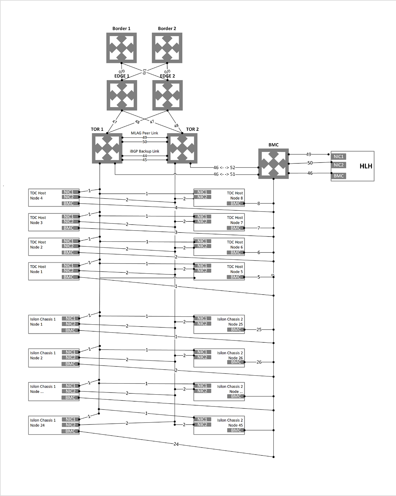
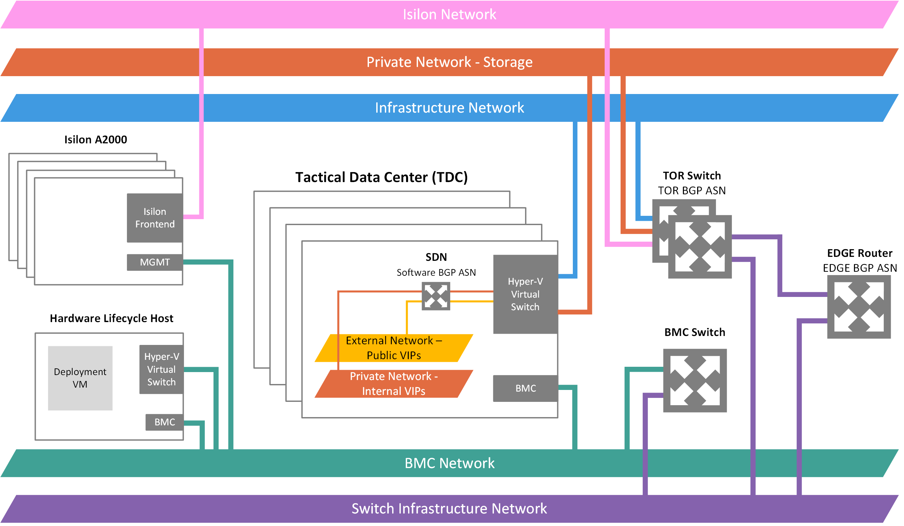
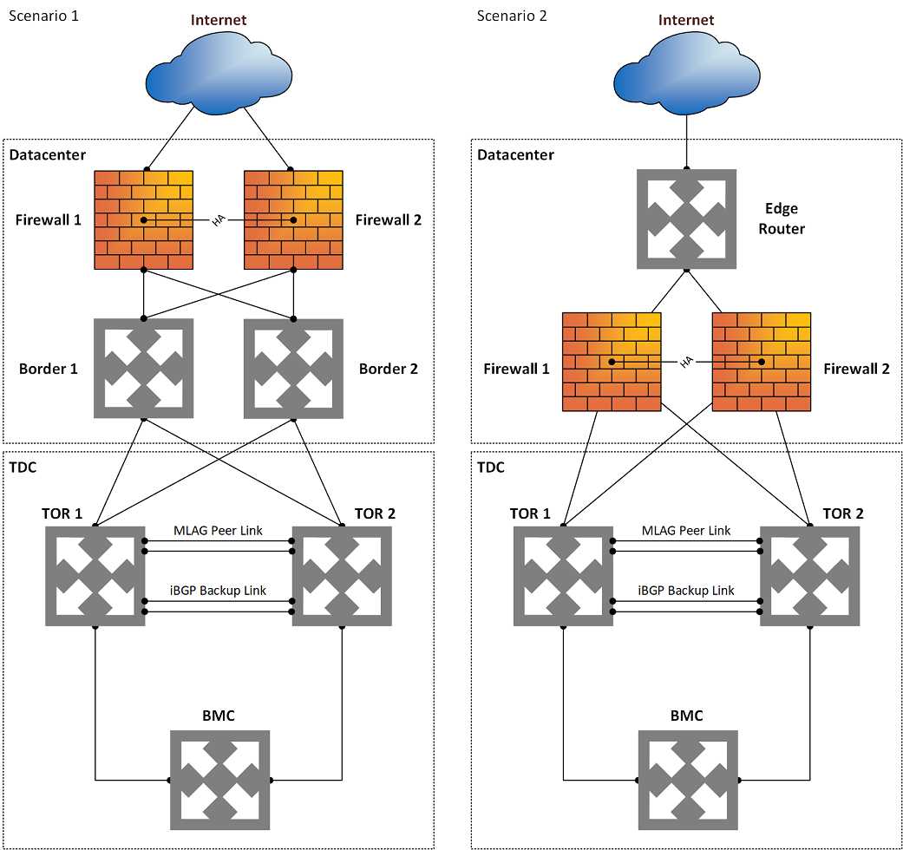
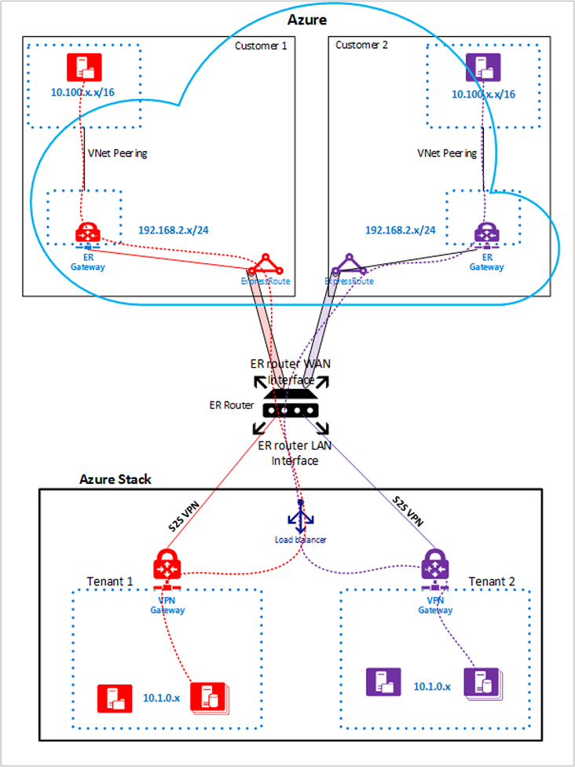

# Modular Datacenter (MDC) network introduction

## Package content

The Azure Modular Datacenter (MDC) solution ships with the additional network equipment referenced in this article. This equipment is used to connect the container to your network.

Confirm the switch optics that match your environment.

| Quantity | Type | Model |
|-----|---------------|-------|
| 12 | 12x QSFP-40G | "SR" |
| 12 | 12x SFP+ 10 GB | "SR" |
| 12 | 12x SFP 1G | "SR" |
| 12 | 12x QSFP-40G | "LR" |
| 12 | 12x SFP+ 10 GB | "LR" |
| 12 | 12x SFP 1G | "LR" |

## Network design overview

### Physical network design

The MDC solution requires a resilient and highly available physical infrastructure to support its operation and services. Uplinks from top-of-rack (TOR) to border switches are limited to SFP+ or SFP28 media and 1-GB, 10-GB, or 40-GB speeds.

The following diagram presents our recommended design for MDC.

### Logical network design

A logical network design represents an abstraction of a physical network infrastructure. They're used to organize and simplify network assignments for hosts, virtual machines (VMs), and services. As part of logical network creation, network sites are created to define the:

- Virtual local area networks (VLANs).
- IP subnets.
- IP subnet/VLAN pairs.

All of these VLANs and subnets are associated with the logical network in each physical location.

The following table shows the logical networks and associated IPv4 subnet ranges that you must plan for.

| **Logical network** | **Description** | **Size** |
|---------------------|-----------------|----------|
| Public virtual IP (VIP) | MDC uses a total of 31 addresses from this network. Eight public IP addresses are used for a small set of MDC services, and the rest are used by tenant VMs. If you plan to use Azure App Service and the SQL resource providers, seven more addresses are used. The remaining 15 IPs are reserved for future Azure services. | /26 (62 hosts) - /22 (1022 hosts)   Recommended = /24 (254 hosts) |
| Switch infrastructure | Point-to-point IP addresses for routing purposes, dedicated switch management interfaces, and loopback addresses assigned to the switch. | /26 |
| Infrastructure | Used for MDC internal components to communicate. | /24 |
| Private | Used for the storage network, private VIPs, infrastructure containers, and other internal functions. | /20 |
| Baseboard management controller (BMC) | Used to communicate with the BMCs on the physical hosts. | /26 |
| Isilon | Used to communicate with the Isilon storage. | 1x /25 TOR 1x /25 BMC (management) |

### Network infrastructure

The network infrastructure for MDC consists of several logical networks that are configured on the switches. The following diagram shows these logical networks and how they integrate with the top-of-rack (TOR), BMC, and border (customer network) switches.

#### BMC network

This network is dedicated to connecting all the BMCs (also known as service processors) to the management network. Examples include iDRAC, iLO, and iBMC. Only one BMC account is used to communicate with any BMC node. If present, the Hardware Lifecycle Host (HLH) is located on this network and might provide OEM-specific software for hardware maintenance or monitoring.

The HLH also hosts the deployment VM (DVM). The DVM is used during MDC deployment and is removed when deployment completes. The DVM requires internet access in connected deployment scenarios to test, validate, and access multiple components. These components can be inside and outside of your corporate network. Examples include NTP, Domain Name System (DNS), and Azure. For more information about connectivity requirements, see the network address translation (NAT) section in MDC firewall integration.

#### Private network

The /20 (4096 host IPs) network is private to the MDC region. It doesn't expand beyond the border switch devices of the MDC region. This network is divided into multiple subnets, for example:

- **Storage network**: A /25 (128 IPs) network used to support the use of Storage Spaces Direct and Server Message Block (SMB) storage traffic and VM live migration.
- **Internal virtual IP network**: A /25 network dedicated to internal-only VIPs for the software load balancer.
- **Container network**: A /23 (512 IPs) network dedicated to internal-only traffic between containers running infrastructure services.

The size for the private network changed is /20 (4096 IPs) of private IP space. This network is private to the MDC system. It doesn't route beyond the border switch devices of the MDC system and can be reused on multiple MDC systems. While the network is private to MDC, it must not overlap with other networks in the datacenter. For guidance on private IP space, we recommend that you follow the RFC 1918.

The /20 private IP space is divided into multiple networks that enable the MDC system infrastructure to run on containers in future releases. For more information, see the 1910 release notes. This new private IP space enables ongoing efforts to reduce the required routable IP space before deployment.

#### MDC infrastructure network

The /24 network is dedicated to internal MDC components so that they can communicate and exchange data among themselves. This subnet can be routable externally of the MDC solution to your datacenter. We *don't* recommend using public or internet routable IP addresses on this subnet. This network is advertised to the border, but most of its IPs are protected by access control lists. The IPs allowed for access are within a small range, equivalent in size to a /27 network. The IPs host services like the privileged endpoint (PEP) and MDC backup.

#### Public VIP network

The public VIP network is assigned to the network controller in MDC. It's not a logical network on the switch. The SLB uses the pool of addresses and assigns /32 networks for tenant workloads. On the switch routing table, these /32 IPs are advertised as an available route via the Border Gateway Protocol (BGP). This network contains public addresses that are externally accessible. The MDC infrastructure reserves the first 31 addresses from this public VIP network, while the remainders are used by tenant VMs. The network size on this subnet can range from a minimum of /26 (64 hosts) to a maximum of /22 (1,022 hosts). We recommend that you plan for a /24 network.

#### Switch infrastructure network

The /26 network is the subnet that contains the routable point-to-point IP /30 (two host IPs) subnets and the loopbacks. These subnets are dedicated /32 subnets for in-band switch management and BGP router ID. This range of IP addresses must be routable outside the MDC solution to your datacenter. The IP addresses might be private or public.

#### Switch management network

The /29 (six host IPs) network is dedicated to connecting the management ports of the switches. This network allows out-of-band access for deployment, management, and troubleshooting. It's calculated from the switch infrastructure network mentioned in the preceding section.

#### Isilon network

There are two /25 networks. One lives on the TOR switch, and one /25 is used on the BMC switch for management.

## DNS design overview

To access MDC endpoints (*portal*, *adminportal*, *management*, and *adminmanagement*) from outside MDC, you must integrate the MDC DNS services with the DNS servers that host the DNS zones you want to use in MDC.

### MDC DNS namespace

You're required to provide some important information related to DNS when you deploy the MDC solution.

| **Field** | **Description** | **Example** |
|-----------|-----------------|-------------|
| Region | The geographic location of your MDC deployment. | *east* |
| External domain name | The name of the zone you want to use for your MDC deployment. | *cloud.fabrikam.com* |
| Internal domain name | The name of the internal zone that's used for infrastructure services in the MDC. It's directory service-integrated and private (not reachable from outside the MDC deployment). | *azurestack.local* |
| DNS forwarders | DNS servers that are used to forward DNS queries, DNS zones, and records that are hosted outside MDC, either on the corporate intranet or public internet. You can edit the DNS forwarder value with the **Set-AzSDnsForwarder** cmdlet after deployment. | |
| Naming prefix (optional) | The naming prefix you want your MDC infrastructure role instance machine names to have. If not provided, the default is *azs*. | *azs* |

The fully qualified domain name (FQDN) of your MDC deployment and endpoints is the combination of the region parameter and the external domain name parameter. Using the values from the examples in the previous table, the FQDN for this MDC deployment would be *east.cloud.fabrikam.com*.

Examples of some of the endpoints for this deployment would look like the following URLs:

- `https://portal.east.cloud.fabrikam.com`
- `https://adminportal.east.cloud.fabrikam.com`

To use this example DNS namespace for an MDC deployment, the following conditions are required:

- The zone fabrikam.com is registered with a domain registrar, internal corporate DNS server, or both. Registration depends on your name resolution requirements.
- The child domain cloud.fabrikam.com exists under the zone fabrikam.com.
- The DNS servers that host the zones fabrikam.com and cloud.fabrikam.com can be reached from the MDC deployment.

To resolve DNS names for MDC endpoints and instances from outside MDC, you must integrate the DNS servers. Include servers that host the external DNS zone for MDC with the DNS servers that host the parent zone you want to use.

#### DNS name labels

MDC supports adding a DNS name label to a public IP address to allow name resolution for public IP addresses. DNS labels are a convenient way for users to reach apps and services hosted in MDC by name. The DNS name label uses a slightly different namespace than the infrastructure endpoints. Following the previous example namespace, the namespace for DNS name labels would be *\*.east.cloudapp.cloud.fabrikam.com*.

If a tenant specifies **MyApp** in the DNS name label field of a public IP address resource, it creates an A record for myapp in the zone *east.cloudapp.cloud.fabrikam.com* on the MDC external DNS server. The resulting FQDN would be *myapp.east.cloudapp.cloud.fabrikam.com*.

If you want to take advantage of this functionality and use this namespace, you must integrate the DNS servers. Include servers that host the external DNS zone for MDC and the DNS servers that host the parent zone you want to use as well. This namespace is different from the one used for the MDC service endpoints, so you must create an additional delegation or conditional forwarding rule.

For more information about how the DNS name label works, see "Using DNS" in the MDC documentation.

### Resolution and delegation

There are two types of DNS servers:

- An authoritative DNS server hosts DNS zones. It answers DNS queries for records in those zones only.
- A recursive DNS server doesn't host DNS zones. It answers all DNS queries by calling authoritative DNS servers to gather the data it needs.

MDC includes both authoritative and recursive DNS servers. The recursive servers are used to resolve names of everything except for the internal private zone and the external public DNS zone for that MDC deployment.

### Resolve external DNS names from MDC

To resolve DNS names for endpoints outside MDC (for example, www.bing.com), you must provide DNS servers for MDC to forward DNS requests, for which MDC isn't authoritative. DNS servers that MDC forwards requests to are required in the Deployment Worksheet (in the DNS forwarder field). Provide at least two servers in this field for fault tolerance. Without these values, MDC deployment fails. You can edit the DNS forwarder values with the **Set-AzSDnsForwarder** cmdlet after deployment.

## Firewall design overview

We recommend that you use a firewall device to help secure MDC. Firewalls can help defend against things like distributed denial of service (DDoS) attacks, intrusion detection, and content inspection. They can also become a throughput bottleneck for Azure storage services like blobs, tables, and queues.

If a disconnected deployment mode is used, you must publish the Active Directory Federation Services endpoint. For more information, see the datacenter integration identity article.

The Azure Resource Manager (administrator), administrator portal, and Azure Key Vault (administrator) endpoints don't necessarily require external publishing. For example, as a service provider, you could limit the attack surface by only administering MDC from inside your network and not from the internet.

For enterprise organizations, the external network can be the existing corporate network. In this scenario, you must publish endpoints to operate MDC from the corporate network.

### Network address translation

We recommend the NAT method to allow the DVM to access external resources during deployment. We also recommend NAT for the Emergency Recovery Console (ERCS) VMs or PEP during registration and troubleshooting.

NAT can also be an alternative to public IP addresses on the external network or public VIPs. We don't recommend this option because it limits the tenant user experience and increases complexity. One option would be a one-to-one NAT that still requires one public IP per user IP on the pool. Another option is a many-to-one NAT that requires a NAT rule per user VIP for all ports a user might use.

Some of the downsides of using NAT for public VIP are:

- Overhead when managing firewall rules, because users control their own endpoints and publishing rules in the software-defined networking stack. Users must contact the MDC operator to get their VIPs published and to update the port list.
- While NAT usage limits the user experience, it gives full control to the operator over publishing requests.
- For hybrid cloud scenarios with Azure, consider that Azure doesn't support setting up a VPN tunnel to an endpoint using NAT.

### SSL interception

Currently, we recommend that you disable any SSL interception (for example, decryption offloading) on all MDC traffic. If it's supported in future updates, guidance will be provided about how to enable SSL interception for MDC.

### Edge deployment firewall scenario

In an edge deployment, MDC is deployed directly behind the edge router or the firewall. In these scenarios, it's supported for the firewall to be above the border (Scenario 1) where it supports both active-active and active-passive firewall configurations. It can also act as the border device (Scenario 2), where it only supports active-active firewall configuration. Scenario 2 relies on equal-cost multipath with either BGP or static routing for failover.

Public routable IP addresses are specified for the public VIP pool from the external network at deployment time. For security purposes, public routable IPs *aren't* recommended on any other network in an edge scenario. This scenario enables a user to experience the full self-controlled cloud experience as in a public cloud like Azure.

  

### Enterprise intranet or perimeter network firewall scenario

In an enterprise intranet or perimeter deployment, MDC is deployed on a multizoned firewall or in between the edge firewall and the internal corporate network firewall. Its traffic is then distributed between the secure, perimeter network (or DMZ), and unsecure zones, as described:

- **Secure zone**: The internal network that uses internal or corporate routable IP addresses. The secure network can be divided. It can have internet outbound access through the firewall NAT. It's normally accessible from inside your datacenter via the internal network. All MDC networks should reside in the secure zone, except for the external network's public VIP pool.
- **Perimeter zone**: The perimeter network is where external or internet-facing apps like web servers are typically deployed. It's normally monitored by a firewall to avoid attacks like DDoS and intrusion (hacking) while still allowing specified inbound traffic from the internet. Only the external network public VIP pool of MDC should reside in the DMZ zone.
- **Unsecure zone**: The external network, the internet. We *don't* recommend that you deploy MDC in the unsecure zone.

## VPN design overview

Although VPN is a user concept, there are some important considerations that a solution owner and operator need to know.

Before you can send network traffic between your Azure virtual network and your on-premises site, you must create a virtual network (VPN) gateway for your virtual network.

A VPN gateway is a type of virtual network gateway that sends encrypted traffic across a public connection. You can use VPN gateways to send traffic securely between a virtual network in MDC and a virtual network in Azure. You can also send traffic securely between a virtual network and another network that's connected to a VPN device.

When you create a virtual network gateway, you specify the gateway type that you want to create. MDC supports one type of virtual network gateway: the VPN type.

Each virtual network can have two virtual network gateways, but only one of each type. Depending on the settings that you choose, you can create multiple connections to a single VPN gateway. An example of this kind of setup is a multisite connection configuration.

Before you create and configure VPN gateways for MDC, review the considerations for MDC networking. You'll learn how configurations for MDC differ from Azure.

In Azure, the bandwidth throughput for the VPN gateway SKU you choose must be divided across all connections that are connected to the gateway. But in MDC, the bandwidth value for the VPN gateway SKU is applied to each connection resource that's connected to the gateway. For example:

- In Azure, the basic VPN gateway SKU can accommodate approximately 100 Mbps of aggregate throughput. If you create two connections to that VPN gateway, and one connection is using 50 Mbps of bandwidth, then 50 Mbps is available to the other connection.
- In MDC, each connection to the basic VPN gateway SKU is allocated 100 Mbps of throughput.

### VPN types

When you create the virtual network gateway for a VPN gateway configuration, you must specify a VPN type. The VPN type that you choose depends on the connection topology that you want to create. A VPN type can also depend on the hardware that you're using. Site-to-site configurations require a VPN device. Some VPN devices only support a certain VPN type.

>[!IMPORTANT]
> Currently, MDC only supports the route-based VPN type. If your device only supports policy-based VPNs, connections to those devices from MDC aren't supported. MDC also doesn't support using policy-based traffic selectors for route-based gateways at this time because custom IPsec/IKE policy configurations aren't supported.

- **PolicyBased**: Policy-based VPNs encrypt and direct packets through IPsec tunnels, based on IPsec policies. Policies are configured with the combinations of address prefixes between your on-premises network, and the MDC virtual network. The policy, or traffic selector, is usually an access list in the VPN device configuration. **PolicyBased** is supported in Azure, but not in MDC.
- **RouteBased**: Route-based VPNs use routes that are configured in the IP forwarding or routing table. The routes direct packets to their corresponding tunnel interfaces. The tunnel interfaces then encrypt or decrypt the packets in and out of the tunnels. The policy, or traffic selector, for **RouteBased** VPNs is configured as any-to-any (or use wildcards). By default, they can't be changed. The value for a **RouteBased** VPN type is **RouteBased**.

### Configure a VPN gateway

A VPN gateway connection relies on several resources that are configured with specific settings. Most of these resources can be configured separately, but in some cases they must be configured in a specific order.

#### Settings

The settings that you choose for each resource are critical for creating a successful connection.

This article helps you understand:

- Gateway types, VPN types, and connection types.
- Gateway subnets, local network gateways, and other resource settings that you might want to consider.

#### Connection topology diagrams

There are different configurations available for VPN gateway connections. Determine which configuration best fits your needs. In the following sections, you can view information and topology diagrams about the following VPN gateway connections:

- Available deployment model
- Available configuration tools
- Links that take you directly to an article, if available

The diagrams and descriptions in the following sections can help you select a connection topology to match your requirements. The diagrams show the main baseline topologies, but it's possible to build more complex configurations by using the diagrams as a guide.

#### Site-to-site and multisite (IPsec/IKE VPN tunnel)

##### Site-to-site

A site-to-site VPN gateway connection is a connection over an IPsec/IKE (IKEv2) VPN tunnel. This type of connection requires a VPN device that's located on-premises and is assigned a public IP address. This device can't be located behind a NAT. Site-to-site connections can be used for cross-premises and hybrid configurations.

##### Multisite

A multisite connection is a variation of the site-to-site connection. You create more than one VPN connection from your virtual network gateway and typically connect to multiple on-premises sites. When you work with multiple connections, you must use a route-based VPN type (known as a dynamic gateway when you work with classic virtual networks). Because each virtual network can have only one VPN gateway, all connections through the gateway share the available bandwidth.

### Gateway SKUs

When you create a virtual network gateway for MDC, you specify the gateway SKU that you want to use. The following VPN gateway SKUs are supported:

- Basic
- Standard
- High Performance

Selecting a higher gateway SKU allocates more CPUs and network bandwidth to the gateway. As a result, the gateway can support higher network throughput to the virtual network.

MDC doesn't support the Ultra Performance gateway SKU, which is used exclusively with Azure ExpressRoute. Consider the following points when you select the SKU:

- MDC doesn't support policy-based gateways.
- BGP isn't supported on the Basic SKU.
- ExpressRoute-VPN gateway coexisting configurations aren't supported in MDC.

#### Gateway availability

High-availability scenarios can only be configured on the High-Performance Gateway connection SKU. Unlike Azure, which provides availability through both active/active and active/passive configurations, MDC only supports the active/passive configuration.

#### Failover

There are three multitenant gateway infrastructure VMs in MDC. Two of these VMs are in active mode. The third VM is in redundant mode. Active VMs enable the creation of VPN connections on them. The redundant VM only accepts VPN connections if a failover happens. If an active gateway VM becomes unavailable, the VPN connection fails over to the redundant VM after a short period (a few seconds) of connection loss.

### Estimated aggregate throughput by SKU

The following table shows the gateway types and the estimated aggregate throughput by gateway SKU.

| Gateway type | VPN gateway throughput (1) | VPN gateway maximum IPsec tunnels (2) |
|--------------|----------------------------|---------------------------------------|
| Basic SKU (3) | 100 Mbps | 20 |
| Standard SKU | 100 Mbps | 20 |
| High-Performance SKU | 200 Mbps | 10 |

Table notes:

(1) VPN throughput isn't a guaranteed throughput for cross-premises connections across the internet. It's the maximum possible throughput measurement.

(2) Maximum tunnels is the total per MDC deployment for all subscriptions.

(3) BGP routing isn't supported for the Basic SKU.

>[!IMPORTANT]
> Only one site-to-site VPN connection can be created between two MDC deployments. This restriction is because a limitation in the platform only allows a single VPN connection to the same IP address. Because MDC uses the multitenant gateway, which uses a single public IP for all VPN gateways in the MDC system, there can be only one VPN connection between two MDC systems.
>
> This limitation also applies to connecting more than one site-to-site VPN connection to any VPN gateway that uses a single IP address. MDC doesn't allow more than one local network gateway resource to be created using the same IP address.

### IPsec/IKE parameters

When you set up a VPN connection in MDC, you must configure the connection at both ends. If you're configuring a VPN connection between MDC and a hardware device, that device might ask you for additional settings. For example, the device might ask for a switch or router that's acting as a VPN gateway.

Unlike Azure, which supports multiple offers as both an initiator and a responder, MDC supports only one offer by default. If you need to use different IPsec/IKE settings to work with your VPN device, there are more settings available to you to configure your connection manually.

#### IKE Phase 1 (Main Mode) parameters

| **Property** | **Value** |
|--------------|-----------|
| IKE version | IKEv2 |
| Diffie-Hellman Group | ECP384 |
| Authentication method | Pre-shared key |
| Encryption & hashing algorithms | AES256, SHA384 |
| SA lifetime (time) | 28,800 seconds |

#### IKE Phase 2 (Quick Mode) parameters

| **Property** | **Value** |
|--------------|-----------|
| IKE version | IKEv2 |
| Encryption & hashing algorithms (encryption) | GCMAES256 |
| Encryption & hashing algorithms (authentication) | GCMAES256 |
| SA lifetime (time) | 27,000 seconds |
| SA lifetime (kilobytes) | 33,553,408 |
| Perfect forward secrecy (PFS) | ECP384 |
| Dead peer detection | Supported |

### Configure custom IPsec/IKE connection policies

The IPsec and IKE protocol standard supports a wide range of cryptographic algorithms in various combinations. To see which parameters are supported in MDC to satisfy compliance or security requirements, see IPsec/IKE parameters.

This article provides instructions on how to create and configure an IPsec/IKE policy and apply to a new or existing connection.

#### Considerations

Note the following important considerations when you use these policies:

- The IPsec/IKE policy only works on the Standard and High Performance (route-based) gateway SKUs.
- You can only specify one policy combination for a given connection.
- You must specify all algorithms and parameters for both IKE (Main Mode) and IPsec (Quick Mode). Partial policy specification isn't allowed.
- Consult with your VPN device vendor specifications to ensure the policy is supported on your on-premises VPN devices. Site-to-site connections can't be established if the policies are incompatible.

#### Workflow to create and set IPsec/IKE policy

This section outlines the workflow required to create and update the IPsec/IKE policy on a site-to-site VPN connection.

1. Create a virtual network and a VPN gateway.
1. Create a local network gateway for cross-premises connection.
1. Create an IPsec/IKE policy with selected algorithms and parameters.
1. Create an IPsec connection with the IPsec/IKE policy.
1. Add, update, or remove an IPsec/IKE policy for an existing connection.

#### Supported cryptographic algorithms and key strengths

The following table lists the supported cryptographic algorithms and key strengths configurable by MDC customers.

| **IPsec/IKEv2** | **Options** |
|-----------------|-------------|
| IKEv2 encryption | AES256, AES192, AES128, DES3, DES |
| IKEv2 integrity | SHA384, SHA256, SHA1, MD5 |
| DH Group | ECP384, ECP256, DHGroup14, DHGroup2048, DHGroup2, DHGroup1, None |
| IPsec encryption | GCMAES256, GCMAES192, GCMAES128, AES256, AES192, AES128, DES3, DES, None |
| IPsec integrity | GCMASE256, GCMAES192, GCMAES128, SHA256, SHA1, MD5 |
| PFS Group | PFS24, ECP384, ECP256, PFS2048, PFS2, PFS1, None |
| QM SA lifetime | (Optional: Default values are used if not specified.) |
| | Seconds (integer, min. 300/default 27,000 seconds) |
| | KBytes (integer, min. 1024/default 102,400,000 KBytes) |
| Traffic selector | Policy-based traffic selectors aren't supported in MDC. |

Your on-premises VPN device configuration must match or contain the following algorithms and parameters that you specify on the Azure IPsec/IKE policy:

- IKE encryption algorithm (Main Mode/Phase 1).
- IKE integrity algorithm (Main Mode/Phase 1).
- DH Group (Main Mode/Phase 1).
- IPsec encryption algorithm (Quick Mode/Phase 2).
- IPsec integrity algorithm (Quick Mode/Phase 2).
- PFS Group (Quick Mode/Phase 2).
- The SA lifetimes are local specifications only. They don't need to match.

If GCMAES is used as for the IPsec encryption algorithm, you must select the same GCMAES algorithm and key length for IPsec integrity. For example, use GCMAES128 for both.

In the preceding table:

- IKEv2 corresponds to Main Mode or Phase 1.
- IPsec corresponds to Quick Mode or Phase 2.
- DH Group specifies the Diffie-Hellman Group used in Main Mode or Phase 1.
- PFS Group specifies the Diffie-Hellman Group used in Quick Mode or Phase 2.
- IKEv2 Main Mode SA lifetime is fixed at 28,800 seconds on the MDC VPN gateways.

The following table lists the corresponding Diffie-Hellman Groups supported by
the custom policy.

| **Diffie-Hellman Group** | **DHGroup** | **PFSGroup** | **Key length** |
|--------------------------|-------------|--------------|----------------|
| 1 | DHGroup1 | PFS1 | 768-bit MODP |
| 2 | DHGroup2 | PFS2 | 1024-bit MODP |
| 14 | DHGroup14 | PFS2048 | 2048-bit MODP |
| | DHGroup2048 | | |
| 19 | ECP256 | ECP256 | 256-bit ECP |
| 20 | ECP384 | ECP384 | 384-bit ECP |
| 24 | DHGroup24 | PFS24 | 2048-bit MODP |

### Connect MDC to Azure by using Azure ExpressRoute

#### Overview, assumptions, and prerequisites

Azure ExpressRoute lets you extend your on-premises networks into the Microsoft cloud. You use a private connection supplied by a connectivity provider. ExpressRoute isn't a VPN connection over the public internet.

For more information about Azure ExpressRoute, see the ExpressRoute overview.

#### Assumptions

This article assumes that you have a:

- Working knowledge of Azure.
- Basic understanding of MDC.
- Basic understanding of networking.

#### Prerequisites

To connect MDC and Azure by using ExpressRoute, you must meet the following requirements:

- Have a provisioned ExpressRoute circuit through a connectivity provider.
- Have an Azure subscription to create an ExpressRoute circuit and virtual networks in Azure.
- Have a router that must:
  - Support site-to-site VPN connections between its LAN interface and Azure Stack multitenant gateway.
  - Support creating multiple instances of virtual routing and forwarding if there's more than one tenant in your MDC deployment.
- Have a router that has:
  - A WAN port connected to the ExpressRoute circuit.
  - A LAN port connected to the MDC multitenant gateway.

#### ExpressRoute network architecture

The following diagram shows the MDC and Azure environments after you finish setting up ExpressRoute using the examples in this article.

 

