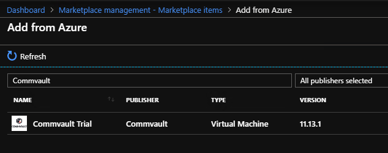

# Offer Commvault marketplace item in Azure Stack - Modular Data Center (MDC)

*Applies to: Modular Data Center, Azure Stack Hub ruggedized*

Commvault supports backup and restore of the following resource types on Azure Stack Hub:

- VM level backup
  - IaaS VM
  - Unmanaged disks
  - Managed disks
  - For more information, see [Backing Up Virtual Machines](https://documentation.commvault.com/commvault/v11/article?p=86503.htm).

- Storage account backup
  - Blob
  - For more information, see [Azure Blob Storage Overview](https://documentation.commvault.com/commvault/v11/article?p=30063.htm).

- Agent-based backup
  - Guest OS -- Windows and Linux
  - Application -- SQL, MySQL
  - For more information, see [Backup Agents](https://documentation.commvault.com/commvault/v11/article?p=14333.htm).

You can deploy Commvault on an external machine and protect resources on Azure Stack Hub remotely. In addition, it is possible to deploy Commvault as a virtual appliance on Azure Stack Hub. Complete guidance from Commvault is available on their documentation site that covers [Azure Stack Hub](https://documentation.commvault.com/commvault/v11/article?p=86486.htm). For reference, Commvault also publishes a [complete list of capabilities for Microsoft Azure](https://documentation.commvault.com/commvault/v11/article?p=109795_1.htm).

## Deploy from Azure Stack Hub Marketplace

Commvault publishes a BYOL image in the Azure Marketplace and enables the image for syndication to Azure Stack Hub. The minimum version required to back up VMs on Azure Stack is SP16. If you plan to use a virtual appliance, make sure to update to at SP16 (the latest [long-term supported release](https://documentation.commvault.com/commvault/v11/article?p=2617.htm)) or SP17 (the latest mainstream release available).

| Cloud        | Version | Available for syndication | Next update |
|--------------|---------|---------------------------|-------------|
| Azure public | SP13    | Yes                       | TBD         |
| Azure Gov    | SP13    | TBD                       | TBD         |

## Download from Azure Marketplace

Azure Stack Hub operators can download items to the local Azure Stack Marketplace for connected and disconnected environments. In a connected environment, the operator can browse the list of available items to add from Azure:

## Upload and publish manually

In disconnected environments, the item must be downloaded from Azure, and then uploaded to Azure Stack Hub manually. For more information, see the [full instructions for connected and disconnected environments](../../operator/azure-stack-download-azure-marketplace-item.md).

## Deployment considerations

- Deploy external to Azure Stack Hub
- Deploy as virtual appliance on Azure Stack Hub
- Disk Library vs Cloud Library
- Network line of sight consideration
- Subscription level isolation

## Next steps

- To learn more about protecting IaaS VMs, see Protecting VMs on Azure Stack Hub.
