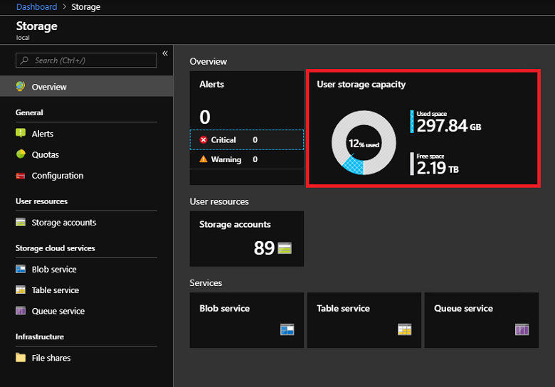
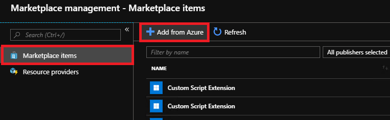

# Download Marketplace items to Azure Stack Hub 

As a cloud operator, you can download items to Azure Stack Hub from the Marketplace and make them available to all users using the Azure Stack Hub environment. The items you can choose are from a curated list of Azure Marketplace items that are pre-tested and supported to work with Azure Stack. Additional items are frequently added to this list, so continue to check back for new content.

There are two scenarios for downloading Marketplace products:

- **Connected scenario**: Requires your Azure Stack Hub environment to be connected to the internet. You use the Azure Stack Hub administrator portal to locate and download items.
- **Disconnected or partially connected scenario**: Requires you to access the internet using the Marketplace syndication tool to download Marketplace items. Then, you transfer your downloads to your disconnected Azure Stack installation. This scenario uses PowerShell.

See [Azure Marketplace items for Azure Stack](../../operator/azure-stack-marketplace-azure-items.md) for a complete list of the marketplace items you can download. See the [Azure Stack Marketplace changes](../../operator/azure-stack-marketplace-changes.md) article for a list of recent additions, deletions, and updates to Azure Stack Marketplace.

> [!NOTE]
> The catalog will be different based on the cloud your Azure Stack Hub system is connected to. The cloud environment is determined by the Azure subscription you use for registering your Azure Stack Hub.

## Connected scenario

If Azure Stack Hub connects to the internet, you can use the administrator portal to download marketplace items.

### Prerequisites

Your Azure Stack Hub deployment must have internet connectivity and be [registered with Azure](registration-tzl.md).

### Use the portal to download marketplace items

1. Sign into the Azure Stack Hub administrator portal.

2. Review the available storage space before downloading marketplace items. Later, when you select items for download, you can compare the download size to your available storage capacity. If capacity is limited, consider options for [managing available space](../../operator/azure-stack-manage-storage-shares.md#manage-available-space).

   To review available space: in **Region management**, select the region you want to explore and then go to **Resource Providers** > **Storage**:

   

3. Open Azure Stack Hub Marketplace and connect to Azure. To do so, select the **Marketplace management** service, select **Marketplace items**, and then select **Add from Azure**:

   

4. Each line item also shows the currently available version. If more than one version of a Marketplace item is available, the **Version** column shows **Multiple**. You can click on each item to view its description and additional information, including its download size:

   

5. If the version of an item is shown as **Multiple**, you can select that item and then choose a specific version from the resulting version selector dropdown:

   

6. Select the item you want, and then select **Download**. Download times vary and depends on the network connectivity. After the download completes, you can deploy the new marketplace item as either an Azure Stack operator or a user.

7. To deploy the downloaded item, select **+ Create a resource**, and then search among the categories for the new marketplace item. Next, select the item to begin the deployment process. The process varies for different marketplace items.

## Disconnected or a partially connected scenario

In a disconnected environment, you cannot download marketplace items from Azure. You must use the offline syndication tool to download the marketplace items to a local drive, and then upload those items to your Azure Stack Hub from there.

You can [download the offline syndication tools here](https://aka.ms/azsSyndicationtool).

### Download Marketplace items from Azure

#### Prerequisites

- Azure PowerShell installed on the machine.

- Azure subscription ID, registration resource group and registration name that you used to register your Azure Stack Hub. You can find this information in the **Properties** tab of the **Region Management** blade within your Azure Stack Hub operator portal.

- The username and password for the account that has owner/contributor privileges to the Azure subscription ID.

- A local drive or network path to which the offline files can be written.

#### Download items


### [Az modules](#tab/az1)

1. Open PowerShell and go to the extracted folder.

2. Run the **Invoke-AzSMarketplaceDownload.ps1** PowerShell script:

    ```powershell
    .\Invoke-AzSMarketplaceDownload.ps1 -RegistrationSubscriptionId '<subscription ID>' ` 
       -RegistrationResourceGroup 'azurestack' -RegistrationName '<registration name>' `
       -TenantName mytenant.onmicrosoft.com -DownloadFolder 'F:\offlineSyndication'
    ```

    Alternatively, if you've already logged in through Azure PowerShell, you can pass in the Azure context:

    ```powershell
    Add-AzAccount -Environment AzureCloud -Tenant mytenant.onmicrosoft.com 
    .\Invoke-AzSMarketplaceDownload.ps1 -RegistrationResourceGroup 'azurestack' -RegistrationName '<registration name>' -DownloadFolder 'F:\offlineSyndication' -AzureContext $(Get-AzureRMContext)
    ```
    If you do not pass in the Azure context, it will ask you to sign in.

3. A window appears in which you can select the product you would like to download. You can Ctrl + click to select multiple items.

4. Select **OK**. This downloads the marketplace item and its dependencies, if any.
### [AzureRM modules](#tab/azurerm1)

1. Open PowerShell and go to the extracted folder.

2. Run the **Invoke-AzSMarketplaceDownload.ps1** PowerShell script:

    ```powershell
    .\Invoke-AzSMarketplaceDownload.ps1 -RegistrationSubscriptionId '<subscription ID>' ` 
       -RegistrationResourceGroup 'azurestack' -RegistrationName '<registration name>' `
       -TenantName mytenant.onmicrosoft.com -DownloadFolder 'F:\offlineSyndication'
    ```

    Alternatively, if you've already logged in through Azure PowerShell, you can pass in the Azure context:

    ```powershell
    Add-AzureRmAccount -Environment AzureCloud -Tenant mytenant.onmicrosoft.com 
    .\Invoke-AzSMarketplaceDownload.ps1 -RegistrationResourceGroup 'azurestack' -RegistrationName '<registration name>' -DownloadFolder 'F:\offlineSyndication' -AzureContext $(Get-AzureRMContext)
    ```
    If you do not pass in the Azure context, it will ask you to sign in.

3. A window appears in which you can select the product you would like to download. You can Ctrl + click to select multiple items.

4. Select **OK**. This downloads the marketplace item and its dependencies, if any.

---

### Upload Marketplace items to Azure Stack Hub

#### Prerequisites

- Azure Stack admin Resource Manager endpoint and directory tenant.

- Access to the offline Marketplace items.

#### Upload items

### [Az modules](#tab/az2)

1. Open PowerShell and go to the extracted folder.

2. Run the **Invoke-AzSMarketplaceUpload.ps1** PowerShell script:

    ```powershell
    .\Invoke-AzsMarketplaceUpload.ps1 -AzureStackCloudName "AzureStack-Admin" -AzureStackAdminARMEndpoint https://adminmanagement.<region>.<fqdn> -TenantName mytenant.onmicrosoft.com -DownloadFolder F:\offlineSyndication
    ```

    Alternatively, you can set up the Azure Stack environment yourself in Azure PowerShell, authenticate to the admin Resource Manager endpoint, and pass the context to the script:

    ```powershell
    Add-AzEnvironment -Name Redmond-Admin -ARMEndpoint https://adminmanagement.redmond.azurestack.corp.microsoft.com

    Add-AzAccount -Environment Redmond-Admin

    .\Invoke-AzsMarketplaceUpload.ps1 -DownloadFolder F:\Downloads\offlining -AzureContext $(GetAzContext)
    ```

    This procedure uploads the marketplace items to the specified Azure Stack Hub.

### [AzureRM modules](#tab/azurerm2)

1. Open PowerShell and go to the extracted folder.

2. Run the **Invoke-AzSMarketplaceUpload.ps1** PowerShell script:

    ```powershell
    .\Invoke-AzsMarketplaceUpload.ps1 -AzureStackCloudName "AzureStack-Admin" -AzureStackAdminARMEndpoint https://adminmanagement.<region>.<fqdn> -TenantName mytenant.onmicrosoft.com -DownloadFolder F:\offlineSyndication
    ```

    Alternatively, you can set up the Azure Stack environment yourself in Azure PowerShell, authenticate to the admin Resource Manager endpoint, and pass the context to the script:

    ```powershell
    Add-AzureRmEnvironment -Name Redmond-Admin -ARMEndpoint https://adminmanagement.redmond.azurestack.corp.microsoft.com

    Add-AzureRmAccount -Environment Redmond-Admin

    .\Invoke-AzsMarketplaceUpload.ps1 -DownloadFolder F:\Downloads\offlining -AzureContext $(Get-AzureRmContext)
    ```

    This procedure uploads the marketplace items to the specified Azure Stack Hub.

---
