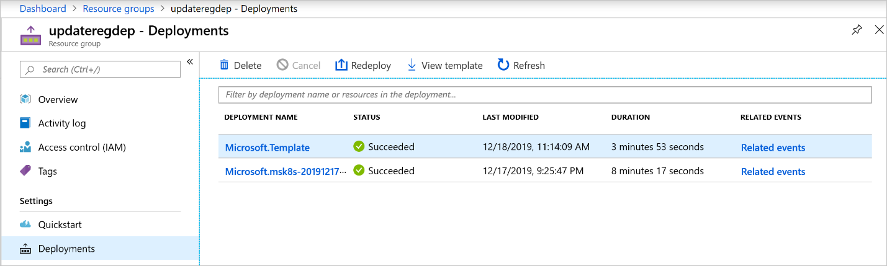
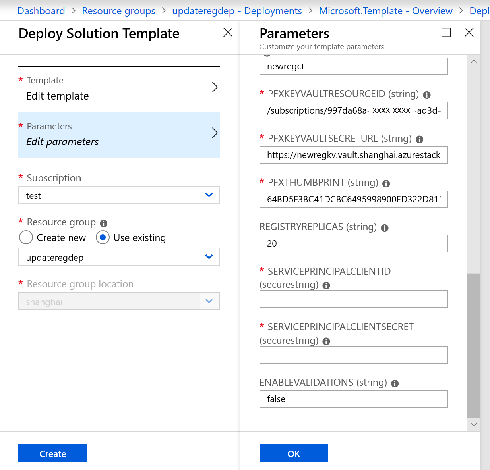

# Rotate container registry secrets in Azure Stack Hub

Your Azure Stack Hub users can rotate the secrets (certificates, username, and password) for a container registry template deployment. You can run a script to populate new secret values in Microsoft Azure Key Vault and **redeploy** the existing Container registry template instance. Rotating secrets by themselves doesn't require a new deployment.

## Prerequisites for the user

 - The user will need to have the Azure Stack Hub Powershell modules installed. For more information, see [Install PowerShell for Azure Stack](../../operator/azure-stack-powershell-install.md?toc=https%3A%2F%2Fdocs.microsoft.com%2Fazure-stack%2Fuser%2FTOC.json&bc=https%3A%2F%2Fdocs.microsoft.com%2Fazure-stack%2Fbreadcrumb%2Ftoc.json).

 - Get the update secrets for the container registry template. You can use a new SSL certificate or a new username and password combination for accessing the Docker registry.

 - Get the scripts found in `\registry\scripts` after downloading the zip file from the [msazurestackworkloads/azurestack-gallery](https://github.com/msazurestackworkloads/azurestack-gallery/archive/master.zip) GitHub repository.

## Import new secrets into Key Vault

Follow the instructions below to set new secrets in Key Vault.

### Set updated registry user password for existing username

1.  Open an elevated PowerShell prompt and then run `Import-Module .\\pre-reqs.ps1` from the scripts folder.

2.  To update the value of the existing registry user, run the cmdlet:

    ```powershell  
    Set-RegistryAccessSecret -KeyVaultName newregkv `
        -RegistryUserName <username> `
        -RegistryUserPassword <newpassword> `
        -SkipExistCheck $true
    ```
    For example, the cmdlet returns the following output:

    ```powershell  
    PS C:\azurestack-gallery-master\registry\Scripts> Set-RegistryAccessSecret -KeyVaultName newregkv `
        -RegistryUserName admin `
        -RegistryUserPassword password1 `
        -SkipExistCheck $true 
    
    Check if key vault secret name (admin) exists.
    Creating key vault secret name (admin) as it does not exist.
    ```

1.  To validate that a new value has been entered for this record, open an elevated PowerShell prompt and run the following cmdlet:

    ```powershell  
    Get-AzureKeyVaultSecret -VaultName newregkv -Name admin -IncludeVersions
    ```
    For example, the cmdlet returns the following output:
    ```powershell  
    PS C:\azurestack-gallery-master\registry\Scripts> Get-AzureKeyVaultSecret -VaultName newregkv -Name admin -IncludeVersions
    
    
    Vault Name   : newregkv
    Name         : admin
    Version      : 2a1495372c474cc890c888518f02b19f
    Id           : https://newregkv.vault.shanghai.azurestack.corp.microsoft.com:443/secrets/
                   admin/2a1495372c474cc890c888518f02b19f
    Enabled      : True
    Expires      : 
    Not Before   : 
    Created      : 12/18/2019 7:05:56 PM
    Updated      : 12/18/2019 7:05:56 PM
    Content Type : 
    Tags         : 
    
    Vault Name   : newregkv
    Name         : admin
    Version      : 3fd65c1719c74997984648de18a1fa0e
    Id           : https://newregkv.vault.shanghai.azurestack.corp.microsoft.com:443/secrets/
                   admin/3fd65c1719c74997984648de18a1fa0e
    Enabled      : True
    Expires      : 
    Not Before   : 
    Created      : 12/17/2019 5:05:56 AM
    Updated      : 12/17/2019 5:05:56 AM
    Content Type : user credentials
    Tags         : 
    ```

### Set new Registry username and password

1.  Open an elevated PowerShell prompt and `Import-Module .\pre-reqs.ps1` from the scripts folder.

2.  To create a new secret for the new username and password, open an elevated PowerShell prompt and run the following cmdlet:

    ```powershell  
    Set-RegistryAccessSecret -KeyVaultName newregkv `
        -RegistryUserName <newusername> `
        -RegistryUserPassword <newpassword> 
    ```
    For example, the cmdlet returns the following output:
    ```powershell  
    PS C:\azurestack-gallery-master\registry\Scripts> Set-RegistryAccessSecret -KeyVaultName newregkv `
        -RegistryUserName admin1 `
        -RegistryUserPassword password1
    
    Check if key vault secret name (admin1) exists.
    Creating key vault secret name (admin1) as it does not exist. 
    ```

1.  To validate that a new secret has been created, open an elevated PowerShell prompt and run the following cmdlet:

    ```powershell  
    Get-AzureKeyVaultSecret -VaultName \<KeyVaultName> -Name \<username>
    ```

    For example, the cmdlet returns the following output:

    ```powershell  
    PS C:\azurestack-gallery-master\registry\Scripts> Get-AzureKeyVaultSecret -VaultName newregkv -Name admin1
    
    
    Vault Name   : newregkv
    Name         : admin1
    Version      : 2ae9a7239f4044be82ca9d1e9b80e85a
    Id           : https://newregkv.vault.shanghai.azurestack.corp.microsoft.com:443/secrets/admin1/2ae9a7239f4044be82ca9d1e9b80e85a
    Enabled      : True
    Expires      : 
    Not Before   : 
    Created      : 12/18/2019 11:28:18 PM
    Updated      : 12/18/2019 11:28:18 PM
    Content Type : user credentials
    Tags         : 
    ```

> [!Important]  
> If you are creating a new secret (username/password combination) you will need to delete the old Key Vault secret. If you redeploy the existing container registry template without deleting the old secret both the old and new username and password combinations will be valid for logging into the registry.

### Update the SSL certificate for existing Key Vault secret

1. Open an elevated PowerShell prompt and run the following cmdlet:

    ```powershell
    Set-CertificateSecret -KeyVaultName \<keyvaultname> `
     -CertificateSecretName \<originalsecretnameforcertificate> `
    Set-CertificateSecret -KeyVaultName <keyvaultname> `
        -CertificateSecretName <originalsecretnameforcertificate> `
        -CertificateFilePath <pathtonewcertificate> `
        -CertificatePassword <certificatepassword> `
        -SkipExistCheck $true
    ```

    For example, the cmdlet returns the following output:

    ```powershell  
    PS C:\azurestack-gallery-master\registry\Scripts> Set-CertificateSecret -KeyVaultName newregkv `
        -CertificateSecretName containersecret `
        -CertificateFilePath C:\crinstall\shanghairegcertnew.pfx `
        -CertificatePassword <certificatepassword> `
        -SkipExistCheck $true
    Check if key vault secret name (containersecret) exists.
    Creating key vault secret name (containersecret) as it does not exist.
    ----------------------------------------------------------------
    PFX KeyVaultResourceId       : /subscriptions/997da68a-xxxx-xxxx-ad3d-ffeac81b02dc/resourceGroups/newregreg/providers/Microsoft.KeyVault/vaults/newregkv
    PFX KeyVaultSecretUrl        : https://newregkv.vault.shanghai.azurestack.corp.microsoft.com:443/secrets/containersecret/a07ece6b9914408e8f20c516e15b66c9
    PFX Certificate Thumbprint   : 31810AA7FEF1173188691FB3F47208E5389FBA61
    ---------------------------------------------------------------- 
    ```

1.  You will use the values produced by this function when redeploying the existing container registry template.

2.  To validate that a new version of the existing secret was created, open an elevated PowerShell prompt and run the following cmdlet:

    ```powershell  
    Get-AzureKeyVaultSecret -VaultName <KeyVaultName> -Name <secretname>
    ```

    For example, the cmdlet returns the following output:

    ```powershell  
    PS C:\azurestack-gallery-master\registry\Scripts> Get-AzureKeyVaultSecret -VaultName newregkv -Name containersecret -IncludeVersions
    
    
    Vault Name   : newregkv
    Name         : containersecret
    Version      : a07ece6b9914408e8f20c516e15b66c9
    Id           : https://newregkv.vault.shanghai.azurestack.corp.microsoft.com:443/secrets/containersecret/a07ece6b9914408e8f20c516e15b66c9
    Enabled      : True
    Expires      : 
    Not Before   : 
    Created      : 12/18/2019 11:46:28 PM
    Updated      : 12/18/2019 11:46:28 PM
    Content Type : 
    Tags         : 
    
    Vault Name   : newregkv
    Name         : containersecret
    Version      : 0199c7ec1d8d41bb9ddff0f39dca9931
    Id           : https://newregkv.vault.shanghai.azurestack.corp.microsoft.com:443/secrets/containersecret/0199c7ec1d8d41bb9ddff0f39dca9931
    Enabled      : True
    Expires      : 
    Not Before   : 
    Created      : 12/17/2019 5:06:03 AM
    Updated      : 12/17/2019 5:06:03 AM
    Content Type : pfx
    Tags         : 
    ```

### Set a new SSL certificate for the container registry template

1.  Open an elevated PowerShell prompt, and run the following cmdlet:

    ```powershell  
    Set-CertificateSecret -KeyVaultName <keyvaultname> `
        -CertificateSecretName <newsecretnameforcertificate> `
        -CertificateFilePath <pathtonewcertificate> `
        -CertificatePassword <certificatepassword>
    ```

    For example, the cmdlet returns the following output:

    ```powershell  
    PS C:\azurestack-gallery-master\registry\Scripts>    Set-CertificateSecret -KeyVaultName newregkv `
        -CertificateSecretName containersecret121719 `
        -CertificateFilePath C:\crinstall\shanghairegcertnew.pfx `
        -CertificatePassword <certificatepassword> 
    Check if key vault secret name (containersecret121719) exists.
    Creating key vault secret name (containersecret121719) as it does not exist.
    ----------------------------------------------------------------
    PFX KeyVaultResourceId       : /subscriptions/997da68a-xxxx-xxxx-ad3d-ffeac81b02dc/resourc
    eGroups/newregreg/providers/Microsoft.KeyVault/vaults/newregkv
    PFX KeyVaultSecretUrl        : https://newregkv.vault.shanghai.azurestack.corp.microsoft.c
    om:443/secrets/containersecret121719/bb2cfe4df7bc4fbe854a00799afa8566
    PFX Certificate Thumbprint   : 31810AA7FEF1173188691FB3F47208E5389FBA61 
    ```

## Redeploy existing container registry template

1. Open the Azure Stack Hub user portal.

2.  Navigate to the resource group that the container registry template VM is deployed.

    

3. Select the deployments under **Deployments**.

    

4.  If rotating secrets for the first time, select the original deployment. If this isn't the first time rotating secrets, select the most recent deployment and then select **Redeploy**.

    

5.  In **Deploy Solution Template**, select **Use Existing Resource Group** and select the resource group that was used to originally deploy the container registry template. In order for a redeployment to be successful, it must use the same resource group.

    

6.  In **Parameters** check that the parameters match the original deployment. The service principal client ID and service principal secret will need to be added.

    - If you're only rotating the username and password for the registry service, you just need to add the service principal parameters.

    - If you're rotating the certificate, you'll need to input the new values for the PFXKeyVaultSecretURL and PFXThumbprint that were output from setting the new secrets.

    

7.  Select **OK** and then **Create**. The redeployment will proceed. Registry functionality will continue to function during redeployment.

    - If you are rotating username and password, you will need to authenticate to the registry again once the redeployment is complete.

    - If you are rotating the certificate, you shouldn't experience any loss of access to the registry. This assumes you are using a certificate from a trusted cert provider. If using a private certificate this certificate will need to be installed on clients to prevent loss of access.

## Next steps

[Azure Stack Marketplace overview](../../operator/azure-stack-marketplace.md)
