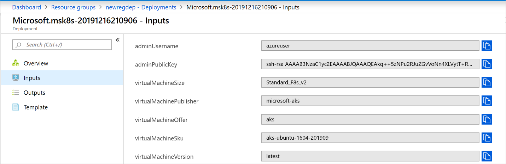
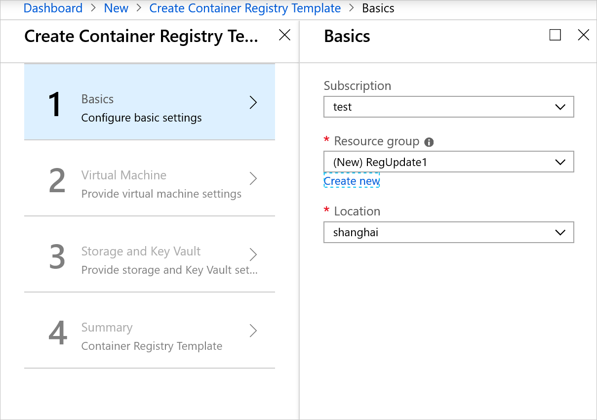
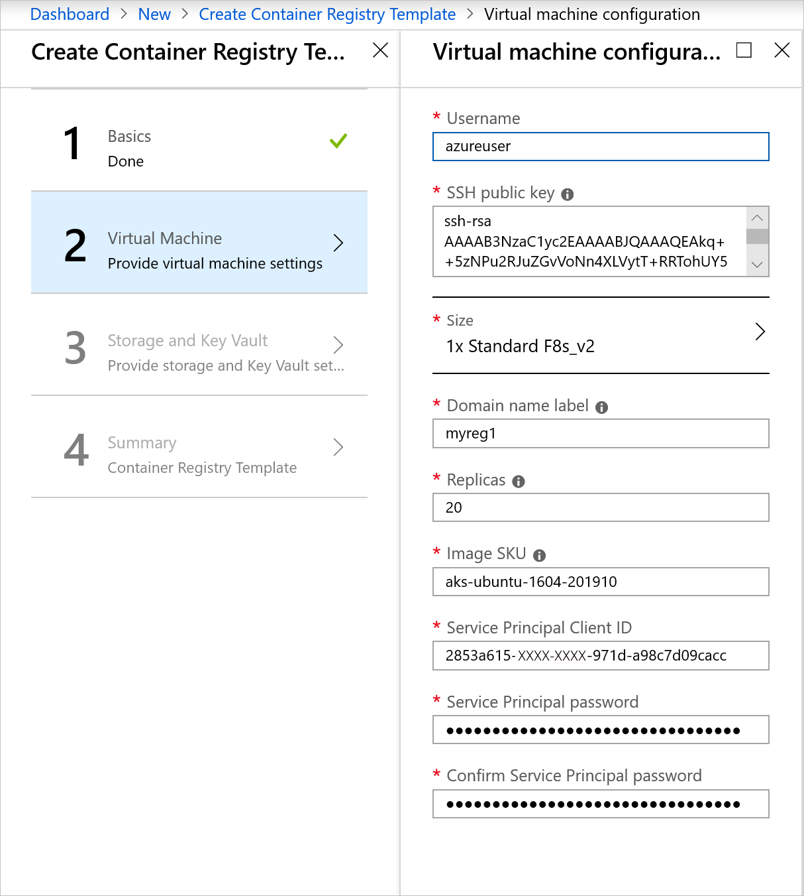
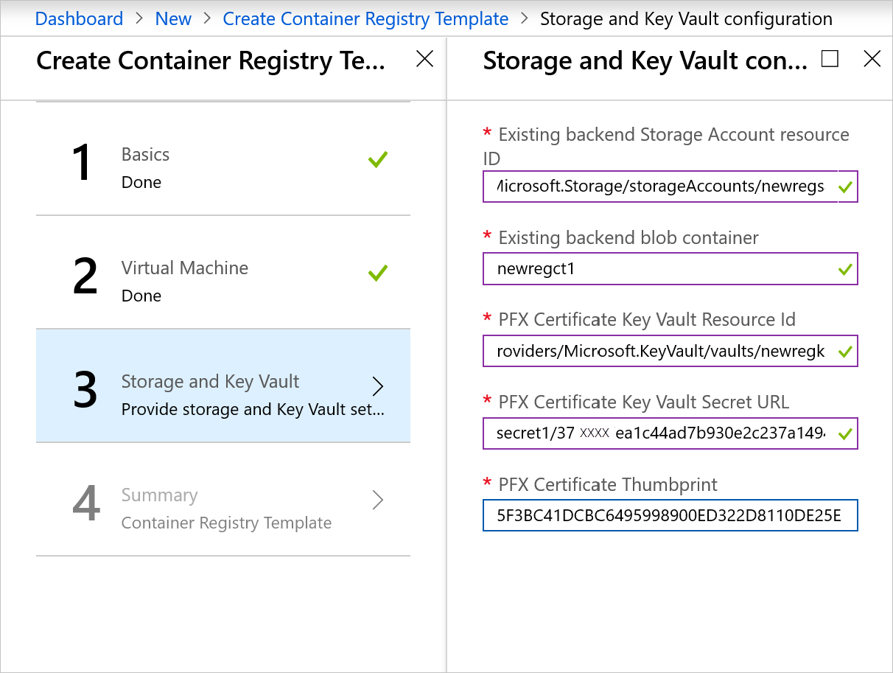
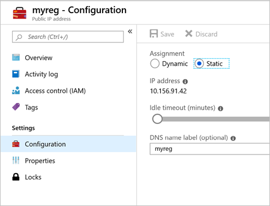
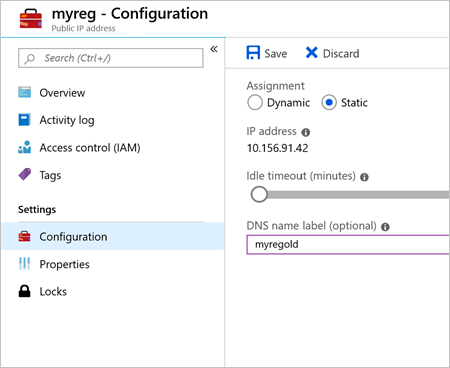
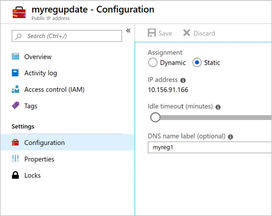

# Update the container registry in Azure Stack Hub - Modular Data Center (MDC)

Azure Stack Hub users can update their container registry deployment to a more recent AKS Base Image SKU using the instructions below. The container registry template VM and service are stateless as all the state and container images are stored in blob storage. An update is as simple as deploying the Container registry template with a more recent version of the AKS Base Image VHD and repointing DNS to the new VM. The action of updating the DNS value for the old and new Container registry template VMs will result in small window of intermittent registry connectivity while the values propagate.

## Prerequisites

### Operator

- Syndicate the latest AKS Base Image from the Azure Stack Marketplace. The AKS Base Image is updated on a monthly cadence.

  

### User

1.  Check the SKU of the AKS Base Image that was used to deploy the container registry template by browsing to the deployment record in the resource group and select **Inputs**.

    

2.  Determine if there are newer SKUs of the AKS Base Image available using the **Get-VMImageSku** function, requires `Import-Module .\pre-reqs.ps1` from the container registry template scripts.

    ```powershell  
    PS C:\azurestack-galler-master\registry\Scripts> Get-VMImageSku -Location Shanghai
    
    Skus                  
    ----                  
    aks-ubuntu-1604-201909
    aks-ubuntu-1604-201910 
    ```

## Parameters required

| Parameter | Details |
| --- | --- |
| Username | Provide the username for logging into the VM. |
| SSH Public Key | Provide the SSH Public key used to authenticate with the VM using SSH protocol. |
| Size | Select the size of the VM to deploy. |
| Public IP Address | Specify the name and type of IP address (Dynamic / Static) for this VM. |
| Domain name label | Specify the DNS prefix for your registry. This entire FQDN should match the CN value for the PFX certificate created for the registry. |
| Replicas | Specify the number of container replicas to start. |
| Image SKU | Specify the Image SKU to be used for the deployment. The available SKUs for the AKS Base Image are listed by **Get-VMImageSku** PowerShell cmdlet. |
| Service Principal Client ID | Specify the service principal (SPN) App ID as used in the previous deployment. |
| Service Principal Password / Confirm Password | Specify the SPN App ID Secret as used in the previous deployment. |
| Existing extended storage Account resource ID | Specify the storage account resource ID as used in the previous deployment. |
| Existing backend blob container | Specify the blob container name as used in the previous deployment. |
| PFX Certificate Key Vault Resource ID | Specify the Microsoft Azure Key Vault resource ID as used in the previous deployment. |
| PFX Certificate Key Vault Secret URL | Specify the certificate URL as used in the previous deployment. |
| PFX Certificate Thumbprint | Specify the certificate thumbprint as used in the previous deployment. |

## Installation

1.  Install a new instance of the Container registry template to a new resource group.

    

2.  Specify the latest SKU output from the `Get-VMImage` script and use a unique **dnsname** parameter from the initial install in the virtual machine configuration, use the same service principal and secret as the initial install.

    

3.  Use the same storage and Key Vault parameters as the initial install for the storage and Key Vault configuration.

    

1.  Once the new container registry template has been deployed, navigate to the initial resource group and select the public IP address resource.

    

1.  In the public IP address resource navigate to Configuration and modify the DNS Name label so it can be used for the newly deploy resource. Note once you modify the DNS Name label and select **Save** calls to the Container Registry will begin to fail.

    
    
    

2.  Navigate to the new resource group used to deploy the new instance of the container registry template, select the public IP resource, configuration, and update the DNS name label to the correct name used in the original deployment, in this example `myreg`, and select **Save**.

    
    
    

3.  For the next 30 minutes there will be intermittent access to the container registry as the DNS record is propagated. Validate connection by logging into the Docker registry and pulling / pushing an image.

## Next steps

[Azure Stack Marketplace overview](../../operator/azure-stack-marketplace.md)
